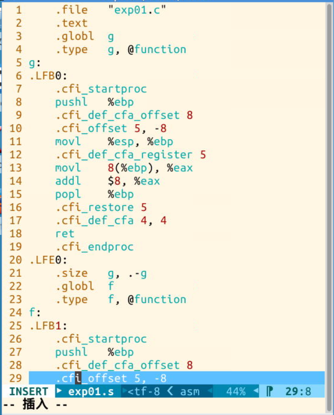
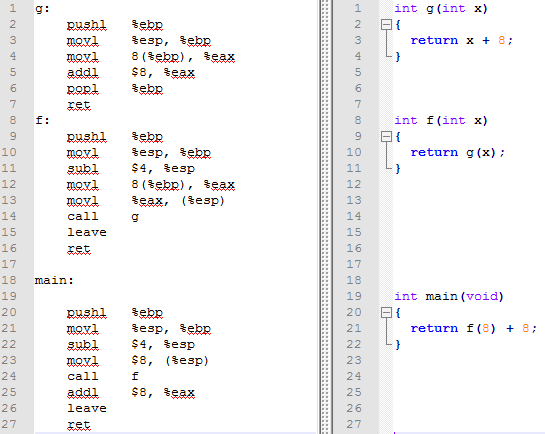
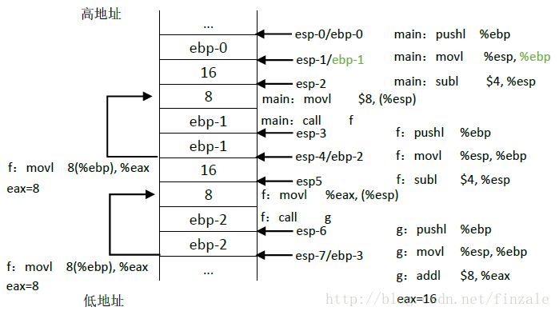

# Linux內和分析（一）計算機是如何工作的


##一、計算機是如何工作的

首先我們要明確一個概念，就是計算機本身並不知道自己要做什麼，這些要做的事情需要我們去告知計算機，這就是程序代碼。早期的時候計算機每次只能做一件事情，他需要知道的是干什麼，怎麼幹。這就是程序代碼要體現的，程序的基礎目的在於有一個輸入（數據）然後經過處理（怎麼幹）得到我們想要的輸出。從計算機的邏輯層面來說就是處理器需要有輸入然後經過裡面的一些運算器件得到輸出。
現代計算機大都採用了一種叫做`馮諾依曼`的結構，叫什麼不重要，這種結構的意思就是我們現在所說的程序和數據都儲存在一起。所以計算機在運行的時候需要從中將數據取出，然後用程序進行處理，最後得到輸出。所以給計算機編寫程序代碼的時候也是要關心一下三件事：

```
1.程序要處理的輸入數據；
2.程序如何處理數據；
3.程序處理後的輸出；
```

所以在編寫程序時候需要做的就是告訴計算機需要處理哪些事情和如何處理以及要怎樣輸出結果。我們用以下面的代碼作為例子：

```c
int g(int x)
{
    return x + 8;
}

int f(int x)
{
    return g(x);
}

int main(void)
{
    return f(8) + 8;
}
```

我們看到，上述程序需要`處理的數據`是一些整數，`處理的過程`是調用f() 和g()連個函數進行運算，其中f(x)=g(x);g(x)=x+8;`處理的結果`就是返回f(8)+8這個值。但是高級語言是計算機不能直接看懂的，計算機智能看懂0101的機器語言，所以上述C語言代碼必須經過一個叫`編譯器`的東西翻譯成一種可以和0101機器語言直接映射的語言——`彙編語言`，這樣計算機就可以執行你寫的代碼了。

##二、X86彙編簡介（AT&T格式）

和我們使用的高級代碼一樣，彙編語言的指令也是需要知道`數據，處理，輸出`三個要素，只是這裡面我們把他們叫做`原操作數，指令碼，目的操作數`，具體的格式如下：

我們看到上述指令中要處理的數據是%esp，要輸出的數據是%ebp，要做的處理是movl這樣一種處理。意思就是將%esp寄存器中數傳送到%ebp寄存器中。上面這就是彙編語言指令的基本形式。
現在在linux系統中我們可以利用vi + [文件全程] 創建一個c代碼文件。比如在命令行中輸入vi exp01.c 進入新建文件，這時按字母i，表示開始編輯。將上述c代碼黏貼到文件中如下圖所示：

- exp01.c

```c
int g(int x)
{
    return x + 8;
}

int f(int x)
{
    return g(x);
}

int main(void)
{
    return f(8) + 8;
}
```

圖中我們看到代碼粘貼之後我們按esc按鍵退出編輯模式，再輸入「：wq」 表示保存退出。然後我們在輸入ls命令查看目錄下的文件發現已經有了我們之前插入的文件。這個時候輸入

```sh
gcc -S -o exp01.s exp01.c -m32
```

將要翻譯的exp01.c文件翻譯成上述的彙編代碼（翻譯的成32位彙編指令）用於再次翻譯成機器碼執行。




上述代码中，我们看到有很多看不懂的以。我们将他们去掉之后和C做一下对比：




我们看到从上面的汇编代码和C语言对比中我们可以看到一些规律，首先C语言中的函数名称被翻译成了一其名字开头加“：”的一段代码。而每段代码的开头我们都看到了相同的两段汇编语句。

```as
pushl   %ebp  
movl    %esp, %ebp  
```


上面两行实际上是对内存堆栈的一个操作，我们知道程序执行是需要内存的，所以每次有新的函数过程被调用的时候计算机也必须分配一段内存给他来运行。那么具体是那一段内存呢。实际上就是%ebp+%esp所在的地址，为了分配方便实际上我们把%esp叫做叫做堆栈指针，而每一个函数都有自己的内存空间也就是堆栈，不同的函数堆栈是由%ebp标注的，这里面我们把它叫做堆栈的基地址，就是一个堆栈开始的地方，然后内个堆栈中存放了函数运行需要用到的一些数据，这些数据就有堆栈指针寄存器来标定%esp。所以每个代码段或者说函数段在运行的时候都会保存上一个运行的函数的基地址，用于它运行完之后返回到调用它的那个代码段的地方。然后在将自己的堆栈其实地址放入到基址寄存器中之后就可以开始自己的代码运行的了，这就是上述代码的意思。


```as
main:
    pushl   %ebp  
    movl    %esp, %ebp  
    subl    $4, %esp  
    movl    $8, (%esp)  
    call    f  
    addl    $8, %eax  
    leave  
    ret  
```


```as
f:  
    <span style="color:#ff0000;">pushl    %ebp  
    movl    %esp, %ebp</span>  
    subl    $4, %esp  
    movl    8(%ebp), %eax  
    movl    %eax, (%esp)  
    call    g  
    leave  
    ret  
```

这段代码中我们开到红色的部分就是函数进入和返回时后的固定代码，上面已经分析过他的作用。看这段代码在做完例行工作之后首先是将%esp进行subl操作，就是将esp减4。实际上我们发现main()函数和f() 函数都进行了这个操作是因为他们都需要进行函数的调用，所以我们可以知道这个语句的意思要预留一个位置给其调用的函数传递参数。然后第二句话就是讲8这个立即数传入到里面之后，运行call f 意思就是呼叫f函数，就是调用f函数这个时候我们看f函数的代码。


除了例行公事的红色部分我们开到f也为其调用g时候要传递参数预留了一个位置就是使用 subl$4, %esp，然后调用movl8(%ebp), %eax找到第一个穿进去的参数。（就是那个8——>f(8)）为什么呢。我们来分析一下他的堆栈结构：



首先我们看到main函数中首先保存了当前的堆栈基地址（ebp-0入栈了esp-0向下移动了一个单位-4到达esp-1），然后将ebp-0移动到esp-1的位置成为ebp-1然后esp-1再向下移动一个单位到达esp-2，保留这个位置用于保存其调用函数的返回值，这个值在那个函数中用eax来传递后面会讲到。然后将调用f函数时候需要传入的参数8放入堆栈中esp-2指向的位置。然后调用f函数，这个时候需要先保存一下当先的ebp，也就是epb-1。
然后来到了f函数中，首先也是将ebp-1入栈然后将ebp指向当前esp-4的位置（每次伴随入栈操作都会影响esp的值）到达ebp-2，然后esp在向下移动一个单位到达esp-5。留出一个返回值的位置然后将当前ebp+8中的值传入eax用于返回。然后将eax中的值传入esp，然后重复上述过程调用g函数。g函数返回16，然后到f中，f也返回16。然后回到main中执行addl $8,%eax。最后的结果是24。


## 三、函数堆栈使用与切换以及操作系统中的任务切换原理简析

上述过程实际上演示了函数之间调用的大体过程。下面对这个过程进行简单的总结。我们可以想象每个被调用的函数使用的内存空间都大体上先包括这么几个部分：
```
1.函数的运行所用参数（C语言中的函数参数列表）
2.函数的运行过程中产生的数据（运行的中间结果和返回值）
3.调用它的函数的入口地址
4.保存它调用的函数的返回值的空间
```

所以对应的调用别人函数就要传入入口参数，就是比如f(8)中的8就是这样的入口参数（实际还会复杂一些）。
那么我们可以类似的退出操作系统中如何切换任务。实际上每个任务也会分配各自的运行空间，那么在任务调用的时候，一个任务需要得到他的内存他的运行参数才能开始执行。就像函数一样。可是现在操作系统中的任务是异步的（就是你也不能确定什么时候会调用什么任务）所以这个时候如过一个任务执行到一半，需要执行另一个任务的时候。就好像一个函数要调用另一个函数，这个时候我们怎么保证它返回之后还能继续运行呢，参照函数的做法我们至少要保存当时即将跳转时候的运行地址，但是这是不够的。如果函数比较发杂有很多中间结果在寄存器中，这个时候另一个函数要运行，这些结果也要保存起来，因为新的函数可能会覆盖这些寄存器。类比我们就知道在任务切换的时候我们也要保存当前跳转之前的运行地址，这个任务运行中产生的数据，用于恢复这个任务时候继续刚才的状态继续运行。这些数据我们叫他`上下文`也好，`现场`也好。实际上就是他的所有状态的集合，这些数据用于当系统再次调用它的时候恢复它。
