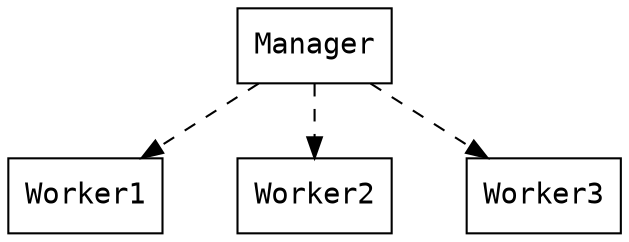
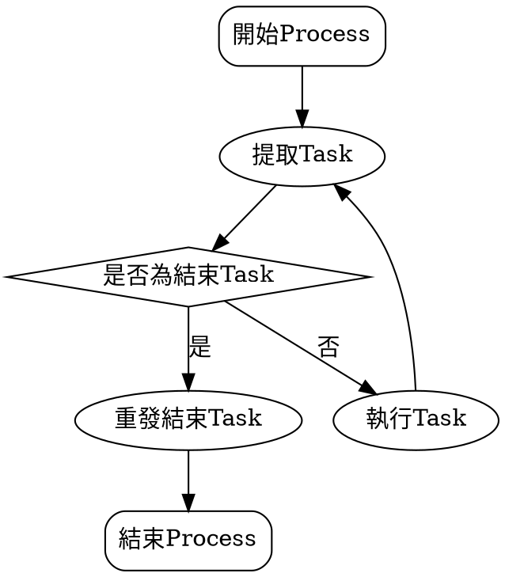

# mergesort-concurrent


# A07: mergesort-concurrent

## 預期目標
* 作為 [concurrency](/s/H10MXXoT) 的展示案例
* 學習 POSIX Thread Programming，特別是 [synchronization object](https://docs.oracle.com/cd/E19683-01/806-6867/6jfpgdcnd/index.html)
* 為日後效能分析和 scalability 研究建構基礎建設
* 學習程式品質分析和相關的開發工具

## 案例分析: [mergesort-concurrent](https://github.com/sysprog21/mergesort-concurrent) (對單向 Linked List)
兩大重點:
- 排序的對象是 singly-linked list
- 利用 POSIX Thread 處理，需要一併操作 synchronization object

取得程式碼並測試:
```shell
$ git clone https://github.com/sysprog21/mergesort-concurrent
$ cd mergesort-concurrent
$ make
$ ./sort
```
程式輸出，提示以下用法:
```
usage: ./sort [thread_count] [input_count]
```
比方說 `./sort 4 8`，執行後會看到 "input unsorted data line-by-line" 提示訊息，請輸入 8 組數字，每個都用 Enter (換行) 分隔。之後即可看到輸出。

在 GNU bash 中，可善用 `$RANDOM` 環境變數，取得介於 0~32767 之間的亂數，於是我們可透過以下指令來作自動測試:
```shell
$ (for i in {1..8}; do echo $RANDOM; done) | ./sort 4 8
```
輸出的 "sorted results" 訊息後方應該有 8 組數值，由小到大排列。
* 延伸閱讀: [第十章、認識與學習BASH](http://linux.vbird.org/linux_basic/0320bash.php)，《鳥哥的 Linux 私房菜》

## [manager-worker 架構](http://maxim.int.ru/bookshelf/PthreadsProgram/htm/r_19.html)
示意圖如下：


為了分配工作，在 worker thread 實作 Task 的機制。每個主要的操作會先被放進 task queue 裡頭，空閒的 thread 再從 task queue 裡頭提取 task 執行，如下面的步驟:



只要把我們的操作寫成 task，就能順利執行。

### Linked List

Linked list 是由各個 node，透過指標串聯而成。先定義 node_t 型別
```c
typedef intptr_t val_t; /* 不僅可放數值，也能放指標 */
typedef struct node {
    val_t data; /* 欲儲存的資料 */
    struct node *next; /* next 指標 */
} node_t;
```
node 建立後，就可繼續定義 llist_t:
```c
typedef struct llist {
    node_t *head;
    uint32_t size;
} llist_t;
```
定義完型別，接著是各種操作:
```c=
// 建立新的 list 物件
llist_t *list_new();

// 從 list 插入給定資料
int list_add(llist_t *the_list, val_t val);

// 逐一印列 list 內容
void list_print(llist_t *the_list);

// 產生新的節點
node_t *new_node(val_t val, node_t *next);

// 取得某個 index 的節點資訊
node_t *list_get(llist_t *the_list, uint32_t index); 
```

### Thread pool
定義 task_t 來封裝 task:
```c
typedef struct _task {
    void (*func)(void *); /* 對應到最終執行的函式 */
    void *arg; /* 傳入的參數 */
    struct _task *next, *last;
    /* 因為 queue 要用 doubly-linked list，
       需要儲存 next 和 last */
} task_t;
```

定義Task的free操作
```c
int task_free(task_t *the_task);
```
再來是 thread pool 所需的 queue 結構:
```c
typedef struct {
    task_t *head, *tail;
    pthread_mutex_t mutex;
    pthread_cond_t cond;
    uint32_t size;
} tqueue_t;

int tqueue_init(tqueue_t *the_queue);
task_t *tqueue_pop(tqueue_t *the_queue);
uint32_t tqueue_size(tqueue_t *the_queue);
int tqueue_push(tqueue_t *the_queue, task_t *task);
int tqueue_free(tqueue_t *the_queue);
```

接著把 queue 和 thread 包裝成 thread pool:
```c
typedef struct {
    pthread_t *threads;
    uint32_t count;
    tqueue_t *queue;
} tpool_t;

int tpool_init(tpool_t *the_pool, uint32_t count,
               void *(*func)(void *));
int tpool_free(tpool_t *the_pool);
```

之後實做`task_run` 作為稍早提到流程圖的主迴圈 (main-loop)
```C
void *task_run(void *data)
{
    task_t *cur_task = NULL;
    while (1) {
        cur_task = tqueue_pop(pool->queue);
        if (cur_task){
            if (!cur_task->func) {
                tqueue_push(pool->queue, cur_task);
                break;
            } else{
                curTask->func(cur_task->arg);
                task_free(cur_task);
            }
        }
    }
    pthread_exit(NULL);
}
```

有了這樣的基礎建設，我們的 mergesort 就很容易透過 task 這樣的包裝，加入 thread pool 中。前述程式碼已經用到物件導向的設計模式，可見 [你所不知道的C語言：物件導向程式設計篇](https://embedded2015.hackpad.com/C-yeZarD8wNb0)。

## 分析 mutex contention
mutrace 可用來偵測 [lock contention](https://en.wikipedia.org/wiki/Lock_(computer_science)#Granularity)，使用很方便，不需要重新編譯程式碼。

```shell
$ sudo apt-get install mutrace
```
搭配前述亂數輸入自動測試，執行以下命令:
```shell
$ (for i in {1..8}; do echo $RANDOM; done) | mutrace ./sort 4 8
```

mutrace 的輸出:
```
mutrace: Showing statistics for process sort (pid 8978).
mutrace: 3 mutexes used.

Mutex #0 (0x0x559cfdae59b0) first referenced by:
	/usr/lib/mutrace/libmutrace.so(pthread_mutex_init+0xec) [0x7f8d7fc3862c]
	./sort(tqueue_init+0x38) [0x559cfc426315]
	./sort(tpool_init+0x6a) [0x559cfc42656a]
	./sort(main+0x16b) [0x559cfc426d32]
	/lib/x86_64-linux-gnu/libc.so.6(__libc_start_main+0xf1) [0x7f8d7f6703f1]

Mutex #1 (0x0x7f8d7d23f380) first referenced by:

Mutex #2 (0x0x559cfc6280a0) first referenced by:
	/usr/lib/mutrace/libmutrace.so(pthread_mutex_init+0xec) [0x7f8d7fc3862c]
	./sort(main+0x125) [0x559cfc426cec]
	/lib/x86_64-linux-gnu/libc.so.6(__libc_start_main+0xf1) [0x7f8d7f6703f1]

mutrace: Showing 3 most contended mutexes:
```

其中 `tqueue_init+0x38` 就是實際執行的地址，可用 `addr2line` 來找出對原始程式碼的對應，注意，要確保編譯時加入 `-g` 參數，確保包含 debug info 的執行檔正確產生。以這個地址來說，對應的原始程式碼為:
```shell
$ addr2line -e sort 0x38
mergesort-concurrent/main.c:167
```

延伸閱讀:
* [Measuring Lock Contention](http://0pointer.de/blog/projects/mutrace.html)
* [More Mutrace](http://0pointer.net/blog/projects/mutrace2.html)

## GraphViz
[ [source](http://www.openfoundry.org/tw/foss-programs/8820-graphviz-) ] [Graphviz](http://www.graphviz.org/) 是個依據給定指令的製圖軟體，不過說是繪圖軟體，它能繪的圖並不是一般人想像中的漫畫或 logo，而是數學意義上的 "graph"，比較通俗的說法就是「關係圖」。

舉例來說，像是下面這種圖，展示 [Unix 家族](https://www.levenez.com/unix/)：


用手畫會很痛苦，而 Graphviz 可以替使用者搞定它。[Graphviz](http://www.graphviz.org/) 提供一套語言，讓您能直接陳述圖片上的節點、邊、方向等性質。之後，由它來為您產生整張圖片。

Graphviz 能畫的圖片有許多種，可在[官方網站](http://www.graphviz.org/Gallery.php)找到更多範例。

HackMD 已經支援 GraphViz，本頁 mergesort 的圖例就是用該工具繪製。按右上方 <i class="fa fa-pencil"></i> 之後再按左上方 <i class="fa fa-columns"></i>，查看 GraphViz 的使用。

## Git Hooks
[ [source](http://tech.mozilla.com.tw/posts/5306) ] Git 和其他版本控制系統一樣，可在某些重要事件發生時，自動觸發自訂腳本。Git hook 可分客戶端和伺服器端，這邊我們只解說客戶端  hooks 如何自動化工作流程。

每個 Git repository 中都有一個 `.git/hooks` 目錄，裡面的內容如下：
```
applypatch-msg.sample  pre-applypatch.sample      pre-push.sample
commit-msg.sample      pre-commit.sample          pre-rebase.sample
post-update.sample     prepare-commit-msg.sample  update.sample
```
這是 Git 提供給我們的 sample script，讓我們參考用的，script 的檔名就是對應的事件，這邊有一份完整可以使用的事件 list。

如果我們想要安裝一個 hook，在每次 commit 前讓他自動執行某個腳本，就在這個目錄中，新增一個名為 `pre-commit` 的 script file（注意沒有副檔名，檔案要設為可執行），這樣在 commit 前就會自動執行這個腳本。

`pre-commit` 大概是最多人使用的 hook，他可以讓我們在 commit 前對我們的修正做些檢查，例如用靜態分析工具 (如[jshint](http://jshint.com/)）先行掃描，以便確保程式的品質。
* 延伸閱讀: [Customizing Git - Git Hooks](https://git-scm.com/book/zh-tw/v2/Customizing-Git-Git-Hooks)

[mergesort-concurrent](https://github.com/sysprog21/mergesort-concurrent) 提供一份特製的 Git `pre-commit` hook，可在每次提交修改時，自動檢查程式排版風格是否一致，並且檢驗 C 語言程式是否存在潛在的錯誤。使用前，記得先安裝 [astyle](http://astyle.sourceforge.net/) 和 [cppcheck](http://cppcheck.sourceforge.net/) 套件:
```shell
$ sudo apt-get install astyle cppcheck
```
之後只要在 [mergesort-concurrent](https://github.com/sysprog21/mergesort-concurrent) 所在的目錄執行以下指令即可安裝特製的 Git hooks:
```shell
$ scripts/install-git-hooks
```

接著我們來測試。在 `thread.c` 中有一段程式碼:
```c
int task_free(task_t *the_task)
{
    free(the_task->arg);
    free(the_task);
    return 0;
}
```

如果我們在 `free(the_task);` 後面追加一行一樣的敘述，也就是重複呼叫 `free()`，這就會導致 [double free](https://cwe.mitre.org/data/definitions/415.html)。當我們貿然將這樣的程式碼提交給 Git 時，特製的 Git pre-commit hook 就會偵測並回報給我們：
```shell
$ git commit -a
[thread.c:7]: (error) Memory pointed to by 'the_task' is freed twice.

Fail to pass static analysis.
```

關於指標的注意須知，可參考 [你所不知道的C語言：指標篇](https://embedded2015.hackpad.com/C-s0rlzR8wVtm)。類似 cppcheck 的靜態分析工具很多，像是 [Clang Static Analyzer](http://clang-analyzer.llvm.org/)。

## UNIX 指令組合的魔法
* [phonebook-concurrent](https://github.com/sysprog21/phonebook-concurrent) 裡頭的 `dictionary/words.txt` 複製出來，然後透過 UNIX 指令打亂順序，之後重新導向到另一個檔案
```shell
$ uniq words.txt | sort -R > input.txt
```
這樣我們就有新的資料輸入。

## 作業要求
* 將 merge sort 的實做改為可接受 [phonebook-concurrent](https://github.com/sysprog21/phonebook-concurrent) 的 35 萬筆資料輸入的資料檔
    * 字典檔資料需要事先用 `sort -R` 處理過
    * 思考如何得到均勻分佈的亂數排列，並且設計自動測試的機制
* 研究 thread pool 管理 worker thread 的實做，提出實做層面的不足，並且參照 [concurrent-ll](https://github.com/jserv/concurrent-ll)，提出 lock-free 的實做
* 學習 [concurrent-ll](https://github.com/jserv/concurrent-ll) (concurrent linked-list 實作) 的 scalability 分析方式，透過 gnuplot 製圖比較 merge sort 在不同執行緒數量操作的效能
    * 注意到 linked list 每個節點配置的記憶體往往是不連續，思考這對效能分析的影響
* 一併嘗試重構 (refactor) 給定的程式碼，使得程式更容易閱讀和維護。延續 [A05: introspect](/s/BkhIF92p)，不只是在共筆上用文字提出良性詳盡的批評，也該反映在程式碼的變革
* 共筆的內容儘量用 GraphViz 製作
* 截止日期：
    * 08:00AM Oct 7, 2016 (含) 之前
    * 越早在 GitHub 上有動態、越早接受 code review，評分越高

## 挑戰題
* 引入 C11 本身的 thread.h 實作多執行並用 `_Atomic` 改寫。參考資料: 
	* [Atomics in C programming](https://www2.informatik.hu-berlin.de/~keil/docs/keil_-_c11_atomics_20140202.pdf)
	* [You Can Do Any Kind of Atomic Read-Modify-Write Operation](http://preshing.com/20150402/you-can-do-any-kind-of-atomic-read-modify-write-operation/)
	* [Boost atomic examples](http://www.boost.org/doc/libs/1_61_0/doc/html/atomic/usage_examples.html)