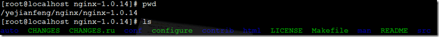
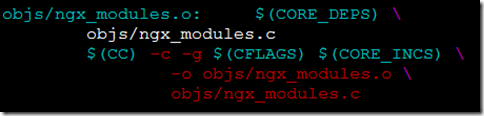
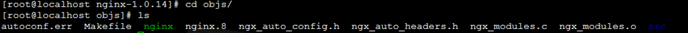
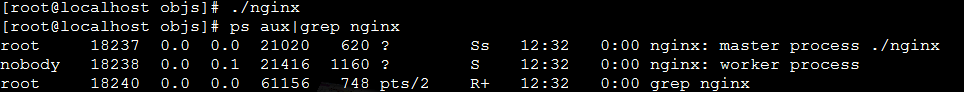
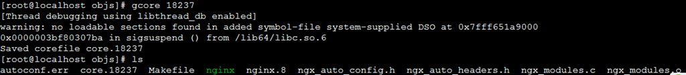
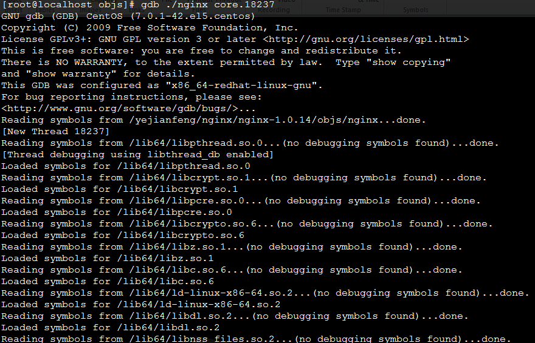
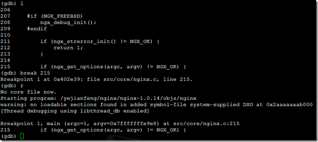
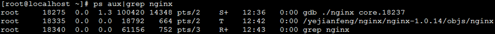
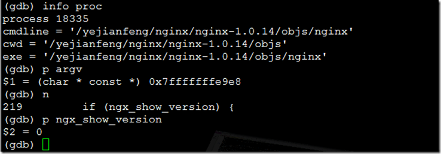

# nginx 模塊 使用gdb調試nginx源碼

工欲善其事必先利其器，如何使用調試工具gdb一步步調試nginx是瞭解nginx的重要手段。

ps：本文的目標人群是像我這樣初接觸Unix編程的同學，如果有什麼地方錯誤請指正。

##熟悉gdb的使用
這裡就不說了，谷歌一搜一堆，這裡推薦一篇文章：GDB 命令詳細解釋

請重點看一下step，run，break，list，info，continue命令


##下載nginx源碼

這裡使用nginx-1.0.14


src是源代碼，auto文件夾是configure運行時候的各種命令集合

##修改config並編譯
由於gdb需要gcc的時候加上`-g`參數，這樣生成的文件才能使用gdb調試，因此我們要對源碼做一下小改動

修改auto/cc/conf文件
```sh
ngx_compile_opt="-c"
```
變為
```sh
ngx_compile_opt="-c -g"
```
執行configure
```sh
./configure --prefix=/home/yejianfeng/nginx/
```
確認
發現多出了objs文件夾，裡面有Makefile文件

確認一下-g參數是否加上了

vim objs/Makefile




確認已經加上了-g，

make

生成可執行文件



至此，nginx可執行文件已經成功編譯了。

##生成gdb所需要的core文件

gdb的core文件是為了保證在調試過程中遇到問題可以隨時重新啟動調試進程，更便於調試。

###啟動nginx
在objs目錄下 ./nginx
```sh
ps aux|grep nginx
```



看到nginx啟動了一個master進程（18237）和一個worker進程（18238）

###在objs目錄下運行命令
gcore 18237




看到core.188237生成了。

###殺死nginx進程，包括master和worker

```sh
./nginx -s stop（或者直接使用kill）
```

##啟動調試

```sh
[root@localhost objs]# gdb ./nginx core.18237
```
此時進入gdb模式




## gdb打斷點並調試

使用l（list）命令查看main 函數，這個main函數是在src/core/nginx.c裡面，是nginx的入口函數

```sh
(gdb) l #列出源文件，只列出10行，請使用l- 和 l 或者l +行號 或者 l +函數名 進行定位

(gdb) break 215 #在哪行打斷點

(gdb) r #run，從main函數開始運行程序
```



此時進入另一個終端查看進程情況



看到已經啟動了一個nginx了

此時在gdb中就可以進行調試了



下面就使用next和step一步一步進行調試吧

##調試中可能遇到的問題

###nginx是master-worker模式，當fork出現子進程的時候如何進入子進程呢？
（gdb）set follow-fork-mode child

這個命令可以是
```sh
set follow-fork-mode parent

set follow-fork-mode child

請參考：Debugging Forks

print（p）能否打印出指針指向的內容呢？
（gdb）p *ptr
```


###當使用attach pid進入某個進程的時候出現錯誤

```sh
(gdb) attach 30721
```

Attaching to program: /data0/s/bin/s, process 30721

ptrace: Operation not permitted.

這個錯誤是由於有其他gdb也在調試這個進程

請確定是否有另外的終端或者另外的同事在gdb這個進程

##參考資料：

gdb調試nginx的helloworld

Debugging Forks

Nginx源碼閱讀筆記