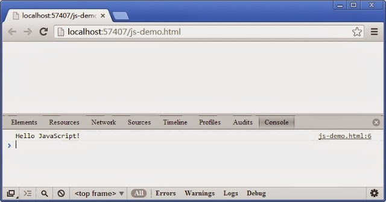

# JavaScript 快速入門（1/10）－ 訊息輸出


輸出「Hello World !」訊息通常是學習程式語言的第一步，JavaScript 亦不例外，這一篇我們從如何輸出指定的訊息文字開始討論JavaScript，考慮以下這一行程式碼：

```js
console.log('Hello JavaScript!');
```

其中的console為一控制台物件，以 . 緊接著連接log，表示調用控制台物件的方法log()，將其中小括弧裏面的訊息文字輸出於控制台。當這一行程式碼被執行時，會在控制台輸出以下的內容：

```js
Hello JavaScript!
```



文字內容必須以單引號（'）或是雙引號（"）包覆，如此JavaScript會將其視為一般的字串進行處理。瀏覽器均提供了控制台視窗以方便開發者觀察程式的輸出內容，以Chrome為例，按下Ctrl+Shift+I（或 F12）組合鍵開啟控制台畫面如下：


畫面下方為控制台區域，其中顯示前一節範例輸出的文字訊息，而右方則顯示輸出此訊息的網頁檔案與程式碼行號。於控制台輸出訊息是常見的技巧，可以讓我們很方便的理解程式的運作狀況，對於除錯亦相當有用。

除了控制台，你也可以將訊息直接輸出於網頁上，所需的程式碼如下：
```js
document.writeln('Hello JavaScript!');
```

其中 document 表示網頁文件，writeln表示將指定的訊息文字寫入網頁。當這一行程式碼執行完畢，其中的訊息文字「Hello JavaScript!」會顯示在網頁上。另外還有一個類似的方法write寫法如下：

```js
document.write('Hello JavaScript!');
```


此方法同樣將其中單引號包覆的文字訊息寫入網頁，與上述writeln方法的差異，在於其寫入之後不會斷行，接下來若有其它資料會接續寫入，而writeln則以新行重新寫入。　

##變數

上述的訊息資料輸出寫法並不常見，通常你不會直接在程式中處理資料，而是將資料儲存在變數中再作處理，將其改寫如下：

```js
var msg = 'Hello JavaScript!' ; 
document.writeln(msg);
```

第一行預先宣告一個變數 msg ，然後透過 = 將訊息文字設定給此變數 ，再以此變數代表「Hello JavaScript!」這一段文字，於第二行將其輸出網頁。

以上是最典型也最基本的變數運用，電腦程式基本上是一連串運算式的組合，而這些運算式主要用來進行特定的資料操作，包含數字、字串或是日期等等，而資料值本身在運算之前通常會預先儲存在一個變數中，所需的語法如下：
```js
var x=100 ; 
```

此行程式將 100 這個數值儲存至名稱為 x 的變數中，這個過程稱為變數的設值，等號右邊的值被儲存至左變的變數，接下來就可以在程式中透過 x 對 100 這個數值進行運算，考慮以下的運算式：

```js
var x=100 ;
var y=200 ;
var z=x+y;
```

第一行將 100 儲存至 x 變數，第二行將 200 儲存至 y 變數，第三行將 x 與 y 這兩個變數所儲存的值相加，最後再將結果值 300 儲存至 z ，經過這三行程式碼的運算得到三個變數與其所儲存的值如下：

```js
x:100
y:200
z:300
```


從這個小範例中我們可以看到，設值作業不僅允許你將一個簡單的值儲存至變數，也接受一段運算式的結果。