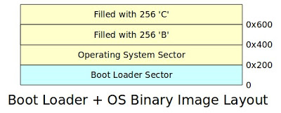
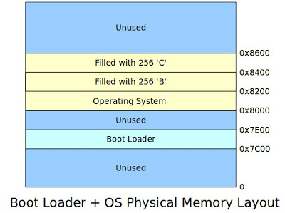
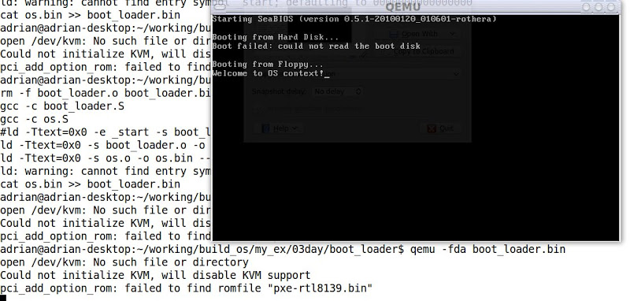
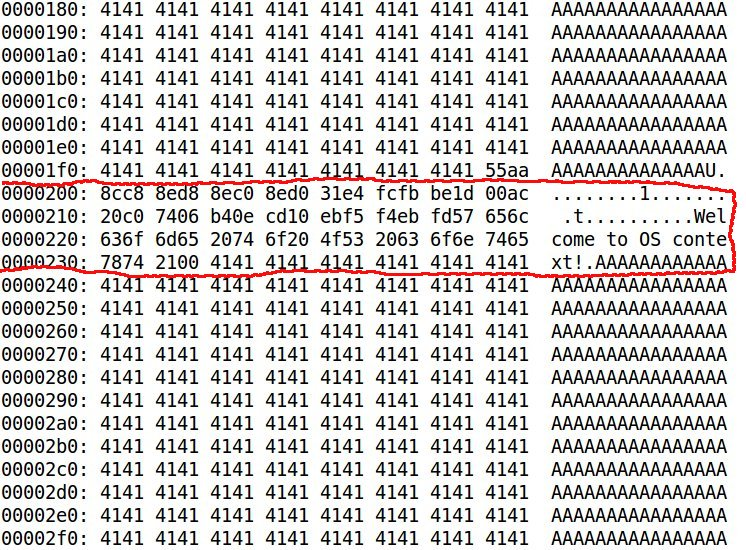
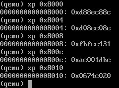

#  (二) Boot Loader + 作業系統載入實例 (QEMU)

繼上篇說明如何撰寫開機Hello World，本篇文章說明如何撰寫簡單的Boot Loader跟一個只會印出訊息的作業系統。

### 小型Boot Loader設計概念
筆者所撰寫的小型Boot Loader於BIOS開機成功後，會被載入至實體記憶體位址0x7C00並跳至此位址執行boot loader的程式碼，此boot loader程式碼會將作業系統程式碼 (僅三個磁區)，載入實體記憶體位址0x8000並跳至此位址執行作業系統的程式碼，然而此作業系統別無功能，僅會印出簡單的訊息。如此便能模擬一般boot loader載入作業系統的程序。

圖一為筆者所編譯出來的plain binary file，此程式碼僅有四個磁區 (共2048 bytes)，0x0-0x1ff為boot loader磁區，0x200-0x7ff為作業系統的三個磁區，雖然，真正的作業系統程式碼在0x200-0x3ff，其它兩個磁區僅填入字元'B'與'C'，但筆者還是把這三個磁區稱為作業系統程式碼，因為boot loader會將這三個磁區載入實體記憶體位址0x8000。



### 圖一、Boot + OS Binary Image Layout

圖二為boot loader將作業系統載入實體記憶體位址示意圖，至於為什麼會選擇0x8000開始存放作業系統程式碼，其原因是x86系統規範位址0x7E00-0x7FFFF為conventional memory，因此筆者就挑0x8000來存放程式碼。



### 圖二、Boot Loader + OS Physical Memory Layout

### Boot Loader程式碼
下圖為Boot Loader程式碼，其運作原理在此稍作描述。首先，boot_loader透過.byte、.word、.long跟.ascii等指令將此磁區描述為一個FAT12檔案系統。接著，利用中斷服務編號0x13將作業系統的三個磁區讀入0x8000實體記憶體位址。如果讀取失敗的話，則利用中斷服務編號0x010印出錯誤訊息。特別要提出的是，程式碼使用兩次遠程跳躍 (Far Dump)，其原型ljmp code_segment_address, relative_address，例如: ljmp $BOOT_SEG, $start_prog代表code segment設定為0x07C0加上start_prog標籤的位址，即0x7C00+start_prog位址，此為Intel x86 CPU memory segmentation機制。透過此設定，boot loader程式碼便能正確地在0x7C00位址執行。另一個ljmp，ljmp $OS_SEG, $OS_OFFSET，因為boot loader將作業系統程式碼放在0x8000實體記憶體位址，因此code segment必須設為0x0800，以便讓作業系統程式碼可以正確地執行。

```
/* boot_loader.S
*
* Copyright (C) 2010 Adrian Huang (adrianhuang0701@gmail.com)
*
* This code is intended to simulate a simplified boot loader. This boot
* loader loads 3 sectors into the physical memory and jumps the entry
* point of OS.
*
*/

BOOT_SEG     = 0x07C0       /* starting code segment (CS) of boot loader */
OS_SEG       = 0x0800       /* code segment address of OS entry point */
OS_OFFSET    = 0x0000       /* the offset address of OS entry point */

.code16

.section .text

.global _start
_start:
# FAT12 file system format
ljmp     $BOOT_SEG, $start_prog   # jmp instruction

.byte   0x90
.ascii  "ADRIAN  "                # OEM name (8 bytes)
.word   512                       # Bytes per sector
.byte   1                         # Sector per cluster
.word   1                         # Reserved sector count: should be 1 for FAT12
.byte   2                         # Number of file allocation tables.
.word   224                       # Maximum number of root directory entries.
.word   2880                      # Total sectors
.byte   0xf0                      # Media descriptor
.word   9                         # Sectors per File Allocation Table
.word   18                        # Sectors per track
.word   2                         # Number of heads
.long   0                         # Count of hidden sectors
.long   2880                      # Total sectors: 18 (sectors per track) * 2 (heads) * 80 (sectors) = 2880
.byte   0                         # Physical driver number
.byte   0                         # Reserved
.byte   0x29                      # Extended boot signature
.long   0x12345678                # Serial Number
.ascii  "HELLO-OS   "             # Volume Label
.ascii  "FAT12   "                # FAT file system type
.fill   18, 1, 0                  # fill 18 characters with zero

start_prog:
# initialize the register with cs register
movw    %cs, %ax
movw    %ax, %ds
movw    %ax, %es
movw    %ax, %ss
xorw    %sp, %sp

cld                     # clear direction flag
sti                     # set interrupt flag

# The following code is loaded three sectors (2-4th sectors from boot.bin)
# into the physical memory 0x8000-0x85FF.
movw    $OS_SEG,     %ax
mov     %ax,         %es  # ES:BX-> destination buffer address pointer
movb    $2,          %cl  # sector


cont:
movw     $0,    %bx
movb     $0x02, %ah     # Read sectors from drive
movb     $0x1,  %al     # Sectors to read count
movb     $0x0,  %ch     # track
movb     $0x0,  %dh     # head
movb     $0,    %dl     # drive

int      $0x13          # trigger a interrupt 0x13 service
jc       fail           # the clear flag is set if the operation is failed

mov     %es, %ax
addw    $0x20, %ax      # move to the next sector
movw    %ax, %es        # move to the next sector
incb    %cl
cmpb    $3, %cl         # has finished reading 3 sectors?
jbe     cont            # continue to read the sector

jmp  os_entry           # jump to OS entry point

fail:
movw    $err_msg, %si
fail_loop:
lodsb
andb    %al, %al
jz      end
movb    $0x0e, %ah
int     $0x10
jmp     fail_loop


os_entry:
ljmp $OS_SEG, $OS_OFFSET  # jump to os context

end:
hlt

err_msg:
.ascii "Reading sectors operation is failed!"
.byte     0

.org 0x1FE, 0x41 # fill the rest of characters with zero until the 254th character

# Boot sector signature
.byte     0x55
.byte     0xaa
```
### 作業系統程式碼
此段程式碼僅將訊息輸出至螢幕上，所以不再贅述。

```
/* os.S
 *
 * Copyright (C) 2010 Adrian Huang (adrianhuang0701@gmail.com)
 *
 * This code is OS context.
 *
 */
    .code16
    .section .text
    .global main

main:
    movw    %cs, %ax
    movw    %ax, %ds
    movw    %ax, %es
    movw    %ax, %ss
    xorw    %sp, %sp

    cld                     # clear direction flag
    sti                     # set interrupt flag

    movw  $os_msg, %si

load_msg:
    lodsb
    andb %al, %al
    jz      os_fin
    movb $0x0e, %ah
    int  $0x10
    jmp  load_msg

os_fin:
    hlt
    jmp  os_fin

os_msg:
    .ascii "Welcome to OS context!"
    .byte     0

    .org    0x200, 0x41 # fill characters with 'A'. Sector 1
    .org    0x400, 0x42 # fill characters with 'B'. Sector 2
    .org    0x600, 0x43 # fill characters with 'C'. Sector 3
```


### 編譯程式碼
下圖為編譯的Makefile。
```
LD=ld
CC=gcc

all: boot_loader.bin

boot_loader.bin: boot_loader.o os.o
    ${LD} -Ttext=0x0 -s $< -o $@ --oformat binary
    ${LD} -Ttext=0x0 -s os.o -o os.bin --oformat binary
    cat os.bin >> $@

boot_loader.o:
    ${CC} -c boot_loader.S

os.o:
    ${CC} -c os.S


clean:
    rm -f boot_loader.o boot_loader.bin os.o
```

其編譯訊息如下所示:

```
adrian@adrian-desktop:~/working/build_os/my_ex/boot_loader$ make clean all
rm -f boot_loader.o boot_loader.bin os.o
gcc -c boot_loader.S
gcc -c os.S
ld -Ttext=0x0 -s boot_loader.o -o boot_loader.bin --oformat binary
ld -Ttext=0x0 -s os.o -o os.bin --oformat binary
ld: warning: cannot find entry symbol _start; defaulting to 0000000000000000
cat os.bin >> boot_loader.bin
adrian@adrian-desktop:~/working/build_os/my_ex/boot_loader$
```

### 測試結果



為了驗證作業系統的程式碼正確地載入實體記憶體位址0x8000，筆者利用xxd工具將boot_loader.bin dump出來，下圖為其結果。紅色框框為作業系統程式碼的十六進制碼。



下圖中，筆者利用qemu提供的xp工具將0x8000-0x8010的內容dump出來，用以跟上圖0x200-0x210比對，比較上、下這兩張圖，可以證明作業系統程式碼正確地被載入至0x8000。


