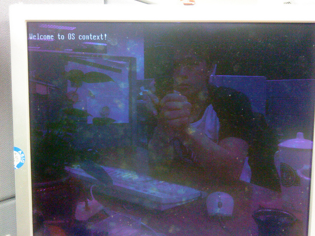

# (三) Boot Loader + 作業系統載入實例 (CF Card)

上篇說明如何撰寫小型Boot Loader將作業系統載入至記憶體並執行該作業系統程式碼，並利用qemu實現。為了更真實性，本篇將boot loader及作業系統安裝在CF card並利用CF card開機，用以證明該boot loader及作業系統可以正確地在實體機器上運行。

### 將DL暫存器更改為0x80
由於上篇是使用軟碟機開機，因此在使用BIOS中斷服務0x13時 (AH=02 Read Sectors from Driver)，需將DL暫存器設定為0(0代表軟碟機0，1代表軟碟機1)，但因為現在要從硬碟讀取，所以需將DL設定為0x80，即底下範例程式紅色部份。

### Boot Loader範例程式 (以FAT32為範例)

```
/* boot_loader.S
*
* Copyright (C) 2010 Adrian Huang (adrianhuang0701@gmail.com)
*
* This code is intended to simulate a simplified boot loader. This boot
* loader loads 3 sectors into the physical memory and jumps the entry
* point of OS.
*
*/

BOOT_SEG     = 0x07C0    /* starting code segment (CS) of boot loader */
OS_SEG       = 0x0800    /* code segment address of OS entry point */
OS_OFFSET    = 0x0000    /* the offset address of OS entry point */

 .code16

 .section .text

 .global _start
_start:
 # FAT12 file system format
 ljmp     $BOOT_SEG, $start_prog         # jmp instruction

 .byte     0x90
 .ascii    "ADRIAN  "        # OEM name (8 bytes)
 .word     512               # Bytes per sector
 .byte     1                 # Sector per cluster
 .word     32                # Reserved sector count: should be 32 for FAT32
 .byte     2                 # Number of file allocation tables.
 .word     0                 # Maximum number of root directory entries. 0 for FAT32
 .word     0                 # Total sectors
 .byte     0xf8              # Media descriptor: fix disk
 .word     9                 # Sectors per File Allocation Table
 .word     18                # Sectors per track
 .word     2                 # Number of heads
 .long     0                 # Count of hidden sectors
 .long     2030112           # Total sectors
 .byte     0                 # Physical driver number
 .byte     0                 # Reserved
 .byte     0x29              # Extended boot signature
 .long     0x12345678        # Serial Number
 .ascii    "HELLO-OS   "     # Volume Label
 .ascii    "FAT12   "        # FAT file system type
 .fill     18, 1, 0          # fill 18 characters with zero

start_prog:
 # initialize the register with cs register
 movw    %cs, %ax
 movw    %ax, %ds
 movw    %ax, %es
 movw    %ax, %ss
 xorw    %sp, %sp

 cld                     # clear direction flag
 sti                     # set interrupt flag

 # The following code is loaded three sectors (2-4th sectors from boot.bin)
 # into the physical memory 0x8000-0x85FF.
 movw    $OS_SEG,     %ax
 mov     %ax,         %es  # ES:BX-> destination buffer address pointer
 movb    $2,          %cl  # sector


cont:
 movw     $0,    %bx
 movb     $0x02, %ah  # Read sectors from drive
 movb     $0x1,  %al  # Sectors to read count
 movb     $0x0,  %ch  # track
 movb     $0x0,  %dh  # head
 movb     $0x80, %dl  # drive

 int      $0x13        # trigger a interrupt 0x13 service
 jc       fail         # the clear flag is set if the operation is failed

 mov      %es, %ax
 addw     $0x20, %ax     # move to the next sector
 movw     %ax, %es       # move to the next sector
 incb     %cl
 cmpb     $3, %cl        # has finished reading 3 sectors?
 jbe      cont           # continue to read the sector

 jmp  os_entry           # jump to OS entry point

fail:
 movw     $err_msg, %si
fail_loop:
 lodsb
 andb     %al, %al
 jz       end
 movb     $0x0e, %ah
 int      $0x10
 jmp      fail_loop


os_entry:
 ljmp $OS_SEG, $OS_OFFSET  # jump to os context

end:
 hlt

err_msg:
 .ascii "Reading sectors operation is failed!"
 .byte     0

 .org 0x1FE, 0x41 # fill the rest of characters with zero until the 254th character

 # Boot sector signature
 .byte     0x55
 .byte     0xaa
```


### 作業系統程式碼與編譯
請參照這篇的"作業系統程式碼"與"編譯程式碼"。

### 安裝boot_loader.bin安裝至CF card
adrian@adrian-mem1:~/img$ sudo dd if=./boot_loader.bin of=/dev/sda

### 測試結果
將該系統重開並選擇CF Card開機，其畫面如下:



