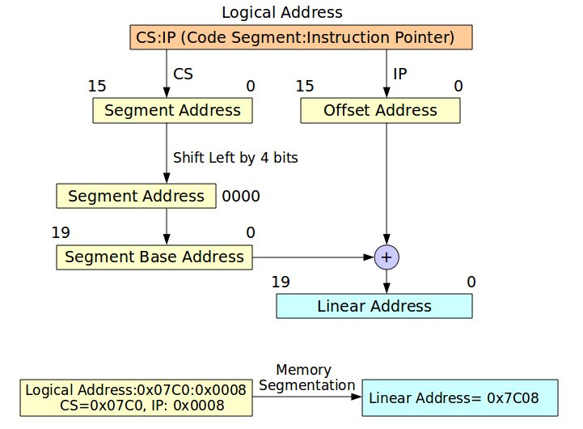
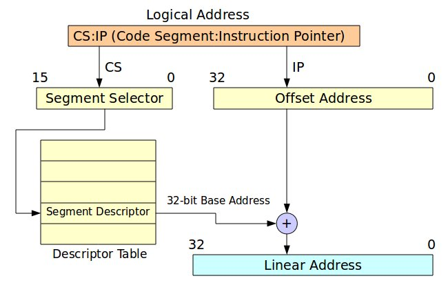
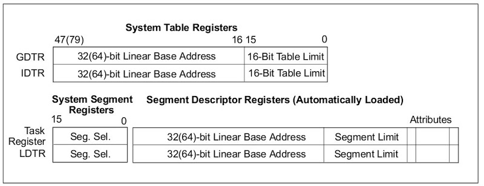
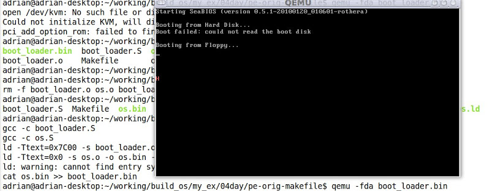

#  (四) 由16位元真實模式 (Real Mode) 進入32位元保護模式 (Protect Mode)

前三篇文章所展示的程式碼都是CPU執行於真實模式 (Real Mode)。然而，一般作業系統運行於保護模式 (Protect Mode)，其記憶體定址最高可至4GB (32位元)。故本文先介紹real mode與protect mode記憶體定址的方式。

### Real mode與Protect mode記憶體定址介紹
Figure 1展示real mode記憶體定址方式，其觀念在於將邏輯位址(Logical Address)的區段(Segment)位址向左位移4個位元，再將其所得的位址加上位移值，如此便能轉換成線性位址 (Linear Address)。至於，邏輯位址該如何表示呢? 其表示法為"Address of Segment:Offset"
，例如: CS:IP、SS:SP、DS:SI和ES:DI，詳情請參考x86 Assembly Language。Figure 1描述一個簡單邏輯位址轉換線性位址的例子，因此不再贅述。




### Figure 1. Memory Segmentation in Real Mode

Figure 2展示保護模式記憶體定址方式，其觀念在於將區段 (Segment)看成區段選擇器 (Segment Selector)，用此選擇器索引出對應的Segment Descriptor，如此便能索引32位元的基底位址 (32-bit base address)，然後再加上位移植，便能轉換成線性位址。



### Figure 2. Memory Segment in Protect Mode

### 保護模式相關課題之介紹
此段落將著重介紹保護模式相關課題之介紹，包含介紹GDT/LDT (GDTR/LDTR)、Segment Descriptor、Segment Selector、 和Memory Management Register

### Global and Local Descriptor Table (GDT and LDT)
當CPU運行於保護模式時，所有的記憶體存取都必須經由GDT或LDT，此表格 (GDT or LDT)存放最小單元便是Segment Descriptor。每一個Segment Descriptor都有對應的segment selector，用以索引出對應的Segment Descriptor。

### GDTR and LDTR (GDT Register and LDT Register)
GDTR與LDTR用以儲存GDT與LDT的起始位置，此設定必須在進入保護模式完成設定。Figure 3展示GDTR與LDTR格式，其中GDTR包含32位元的基底位址與16位元的長度限制。而LDTR多增加了16位元的segment selector。




### Segment Descriptor
Segment Descriptor為Descriptor Table組成的基本元素，其長度為8位元組。如Figure 4所示，可分為三大類: 1. 32位元的基底位址 (Base Address), 2. 20位元的區段限制 (Segment Limit), 3. 區段屬性。細節請參考Intel 64 and IA-32 Architectures. Software Developer's Manual. Volume 3A


### Segment Selector
Figure 5展示Segment Selector示意圖，其目的用來索引對應的Segment Descriptor。因Descriptor Index有13個位元，故Descriptor個數最大可至8192。


### Boot Loader程式碼

```
/* boot_loader.S
*
* Copyright (C) 2010 Adrian Huang (adrianhuang0701@gmail.com)
*
* This code is intended to simulate a simplified boot loader. This boot
* loader loads 3 sectors into the physical memory and jumps the entry
* point of OS.
*
*/

.code16
.text

.set     BOOT_SEG,     0x07C0    /* starting code segment (CS) of boot loader */
.set     OS_SEG,       0x0900    /* code segment address of OS entry point */
.set     OS_OFFSET,    0x0000    /* the offset address of OS entry point */

.global _start
_start:
  # FAT12 file system format
 jmp       start_prog         # jmp instruction

.byte     0x90
.ascii    "ADRIAN  "         # OEM name (8 bytes)
.word     512                # Bytes per sector
.byte     1                  # Sector per cluster
.word     1                  # Reserved sector count: should be 1 for FAT12
.byte     2                  # Number of file allocation tables.
.word     224                # Maximum number of root directory entries.
.word     2880               # Total sectors
.byte     0xf0               # Media descriptor:
.word     9                  # Sectors per File Allocation Table
.word     18                 # Sectors per track
.word     2                  # Number of heads
.long     0                  # Count of hidden sectors
.long     0                  # Total sectors
.byte     0                  # Physical driver number
.byte     0                  # Reserved
.byte     0x29               # Extended boot signature
.long     0x12345678         # Serial Number
.ascii    "HELLO-OS   "      # Volume Label
.ascii    "FAT12   "         # FAT file system type
.fill     18, 1, 0           # fill 18 characters with zero

start_prog:
# initialize the register with cs register
movw    %cs, %ax
movw    %ax, %ds
movw    %ax, %es
movw    %ax, %ss
xorw    %sp, %sp

cld                     # clear direction flag
sti                     # set interrupt flag

# The following code is loaded three sectors (2-4th sectors from boot.bin)
# into the physical memory 0x8000-0x85FF.
movw    $OS_SEG,     %ax
mov     %ax,         %es  # ES:BX-> destination buffer address pointer
movw    $OS_OFFSET,  %bx
movb    $2,          %cl  # sector


cont:
movb     $0x02, %ah  # Read sectors from drive
movb     $0x1,  %al  # Sectors to read count
movb     $0x0,  %ch  # track
movb     $0x0,  %dh  # head
movb     $0,    %dl  # drive

int      $0x13       # trigger a interrupt 0x13 service
jc       fail        # the clear flag is set if the operation is failed

mov      %es,   %ax
addw     $0x20, %ax  # move to the next sector
movw     %ax,   %es  # move to the next sector
incb     %cl

cmpb     $3, %cl     # has finished reading 3 sectors?
jbe      cont        # continue to read the sector

jmp      os_entry    # jump to OS entry point

fail:
movw     $err_msg, %si
fail_loop:
lodsb
andb     %al, %al
jz       end
movb     $0x0e, %ah
int      $0x10
jmp      fail_loop


os_entry:
ljmp $OS_SEG, $OS_OFFSET  # jump to os context

end:
 hlt
 jmp end

err_msg:
.ascii "Reading sectors operation is failed!"
.byte     0

.org 0x1FE, 0x41 # fill the rest of characters with zero until the 254th character

 # Boot sector signature
.byte     0x55
.byte     0xaa
```

### 作業系統程式碼

此作業系統程式碼運行於32位元保護模式，一開始定義三個Segment Descriptor (NULL, CODE32與VIDEO)，其中VIDEO的基底位址為0xB8000，詳情請參考Printing to Screen。接著定義GDT的長度、定義Code32與VIDEO的segment selector、定義GDTPtr。

16位元real mode程式碼 (os_main)中，執行若干任務如下所述:
- 設定Code32的基底位址為PE_CODE32的起始位址
- 設定GDTPtr的基底位址為GDT的起始位址(也就是GDT_DESC_NULL)
- 開啟A20線路 (A20 Line)
- 將GDT的起始位址載入至GDTR暫存器
- 設定cr0暫存器的bit 0以便進入保護模式
- 使用ljmp指令跳至PE_CODE32程式碼

32位元保護模式程式碼 (PE_CODE32)利用Video segment selector將'H'字元顯示在螢幕，用以驗證程式運作之正確性。


```
/* os.S
*
* Adrian Huang (adrianhuang0701@gmail.com)
*
* This code is OS context for protected-mode.
*
*/
#include "pm.h"

.code16
.text
jmp os_main

# Segment descritors for GDT
GDT_DESC_NULL: SEG_DESC      0, 0, 0
GDT_DESC_CODE32: SEG_DESC    0, (PECode32Len - 1), (DESC_ATTR_TYPE_CD_ER | DESC_ATTR_D)
GDT_DESC_VIDEO: SEG_DESC     0xB8000, 0xFFFF, (DESC_ATTR_TYPE_CD_RW)

# The length of GDT
.set GdtLen, (. - GDT_DESC_NULL)

# Segment selectors for code segment and video output
.set SegSelectorCode32, (GDT_DESC_CODE32 - GDT_DESC_NULL)
.set SegSelectorVideo,  (GDT_DESC_VIDEO - GDT_DESC_NULL)

# GDTR pointer
GDTPtr:
.2byte (GdtLen - 1)     # Limit field
.4byte 0                 # base field

# real-mode OS code
os_main:
mov %cs, %ax
mov %ax, %ds
mov %ax, %ss
mov %ax, %es


/* Set gdt for code segment */
InitSegDescriptor PE_CODE32, GDT_DESC_CODE32

/* Set GDTR */
xor     %ax, %ax
mov     %cs, %ax
shl     $4, %eax
addl    $GDT_DESC_NULL, %eax
movl     %eax, (GDTPtr + 2)

/* Enable A20 line */
xor     %ax,   %ax
in      $0x92, %al
or      $2,    %al
out     %al,   $0x92

cli

/* Load the GDT base address and limit from memory into the GDTR register */
lgdt     GDTPtr

/* Enable protect mode */
movl     %cr0, %eax
orl      $1,   %eax
movl     %eax, %cr0

/* Jump to protected-mode OS code */
ljmp     $SegSelectorCode32, $0


# protected-mode OS code
PE_CODE32:
.code32
/* Load Video segment selector */
mov     $(SegSelectorVideo), %ax
mov     %ax, %gs

/* Output the data */
movl    $((80 * 10 + 0) * 2), %edi
movb    $0xC, %ah
movb    $'H', %al
mov     %ax, %gs:(%edi)

jmp .

.set PECode32Len, (. - PE_CODE32)

os_msg:
.ascii "Welcome to OS context!"
.byte     0

.org    0x200, 0x41 # fill characters with 'A'. Sector 2
```

### pm.h標頭檔

```
/* pm.h
*
* Adrian Huang (adrianhuang0701@gmail.com)
*/


.macro SEG_DESC Base, Limit, Attr
.2byte (\Limit & 0xFFFF)
.2byte (\Base & 0xFFFF)
.byte  ((\Base >> 16) & 0xFF)
.2byte ((\Attr & 0xF0FF) | ((\Limit >> 8) & 0x0F00))
.byte  ((\Base >> 24) & 0xFF)
.endm

.macro InitSegDescriptor OFFSET GDT_SEG_ADDR
xor     %ax, %ax
mov     %cs, %ax
shl     $4, %eax
addl    $(\OFFSET), %eax
movw    %ax, (\GDT_SEG_ADDR + 2)
shr     $16, %eax
movb    %al, (\GDT_SEG_ADDR + 4)
movb    %ah, (\GDT_SEG_ADDR + 7)

.endm

.set DESC_ATTR_TYPE_LDT,         0x82     /* LDT Segment                    */
.set DESC_ATTR_TYPE_CD_ER,       0x9A     /* Code segment with Execute/Read */
.set DESC_ATTR_TYPE_CD_E,        0x98     /* Code segment with Execute Only */
.set DESC_ATTR_TYPE_CD_RW,       0x92     /* Data segment with R/W          */
.set DESC_ATTR_D,                0x4000   /* 32-bit segment                 */

/* Selector Attribute */
.set SA_TIL,      0x4
.set SA_RPL0,     0x0
.set SA_RPL1,     0x1
.set SA_RPL2,     0x2
.set SA_RPL3,     0x3
```

### 編譯程式碼
下圖為編譯的Makefile。

```
LD=ld
CC=gcc

all: boot_loader.bin

boot_loader.bin: boot_loader.o os.o
${LD} -Ttext=0x7C00 -s $< -o $@ --oformat binary
${LD} -Ttext=0x0 -s os.o -o os.bin --oformat binary
cat os.bin >> $@

boot_loader.o:
${CC} -c boot_loader.S

os.o:
${CC} -c os.S

clean:
rm -f boot_loader.o os.o os.bin boot_loader.bin
```
其編譯訊息如下所示:
```
adrian@adrian-desktop:~/working/build_os/my_ex/04day/pe-orig-makefile$ make all
gcc -c boot_loader.S
gcc -c os.S
ld -Ttext=0x7C00 -s boot_loader.o -o boot_loader.bin --oformat binary
ld -Ttext=0x0 -s os.o -o os.bin --oformat binary
ld: warning: cannot find entry symbol _start; defaulting to 0000000000000000
cat os.bin >> boot_loader.bin
```

### QEMU測試結果



###【Reference】
- [1] Solrex - 使用開源軟體-自己動手寫作業系統
- [2] Intel 64 and IA-32 Architectures. Software Developer's Manual. Volume 3A
- [3] 30天打造OS！作業系統自作入門
- [4] Jserv's Blog
- [5] X86 開機流程小記
- [6] Linux assemblers: A comparison of GAS and NASM
- [7] linux-source-2.6.31

