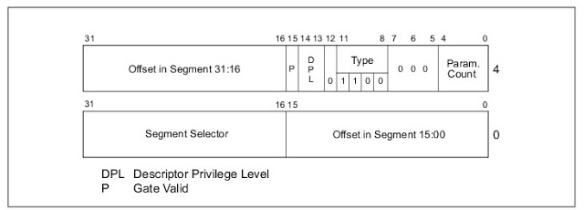
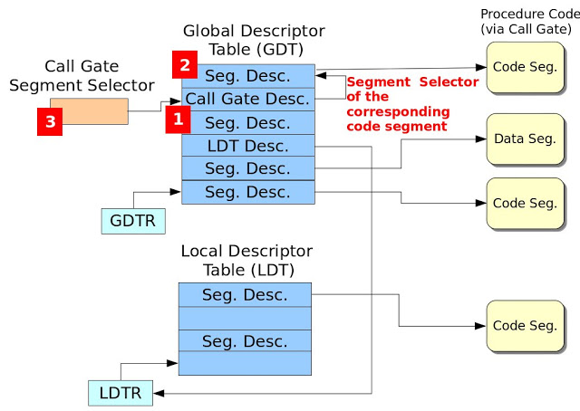
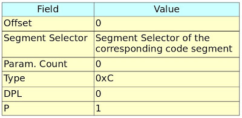
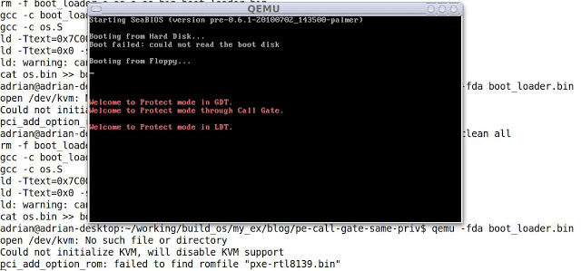

# (六) 簡介Call Gate

Call Gate主要目的用來將一程式的特權等級 (Privilege Level) 轉換至另一個特權等級。舉例來說，Linux使用者利用ioctl()系統呼叫從user space (Privilege 3)進入kernel space (Privilege 0)。

### Note
本篇範例程式僅示範如何使用call gate，並如何利用call gate呼叫所對應的程式碼片段，所有的程式碼都運行於privilege 0。對於特權等級的轉換 (Privilege 3 -> Privilege 0)，留待往後的文章再詳加探討。本篇文章僅簡單地介紹Call Gate，詳盡介紹請參考Intel 64 and IA-32 Architectures. Software Developer's Manual. Volume 3A之5.8節。

### Call-Gate Descriptor之介紹
參考Figure 1，其欄位如下所述:

- Offset: 代表所指定的程式區段 (Code Segment)進入點 (Entry Point)，通常都設為0。
- Segment Selector: 此區段選擇器指定所要存取的程式區段 (Code Segment)。如此說明或許有點模糊，請參考Figure 2，此圖紅色數字方塊展示出設定Call Gate的必要程序，因此設定Call Gate需要三道步驟：A. 設定Call Gate Descriptor相關欄位，其欄位設定值如Table 1所示。B. 設定對應之程式區段。C. 設定Call-Gate之區段選擇器。
- Param. Count: 指定呼叫程序 (Calling Procedure)欲傳遞幾個參數給被呼叫的程序 (Called Procedure)。
- DPL (Descriptor Privilege Level): 此區段描述子之特權等級，其DPL與RPL特權等級之檢查請參考Intel 64 and IA-32 Architectures. Software Developer's Manual. Volume 3A之Figure 5-11。
- P: 此Call-Gate描述子是否有有效 (有效: P=1, 無效: P=0)。


### Figure 1. Call-Gate Descriptor


### Figure 2. Steps for Configuring Call Gate



### Boot Loader程式碼
請參考此篇文章的"Boot Loader 程式碼"。

### 作業系統程式碼
Figure 3為作業系統程式碼，此作業系統程式碼運行於32位元保護模式，程式說明如下:

- 定義七個Segment Descriptor (LABEL_GDT_NULL、LABEL_GDT_CODE、LABEL_GDT_DATA、LABEL_GDT_VIDEO、LABEL_GDT_LDT、LABEL_GDT_CG_CODE與LABEL_GDT_CG)。其中VIDEO的基底位址為0xB8000，詳情請參考Printing to Screen。接著定義GDT的長度、定義Code、Data、VIDEO與LDT的segment selector、定義輸出的字串、定義GDTPtr與定義LDT表。
- LABEL_GDT_CG為Call Gate Descriptor，其儲存在GDT。此設定步驟為Figure 2的1號紅色方塊。
- LABEL_GDT_CG_CODE為Call Gate Descriptor欄位Segment Selector所指定的地方，也就是Call Gate所對應的區段程式碼。此設定步驟為Figure 2的2號紅色方塊。

```
/* os.S
*
*/

#include "pm.h"

.code16
.text
  jmp os_main

# Segment descritors for GDT
LABEL_GDT_NULL:     SEG_DESC     0, 0, 0
LABEL_GDT_CODE:     SEG_DESC     0, (PECode32Len - 1), (DESC_ATTR_TYPE_CD_ER | DESC_ATTR_D)
LABEL_GDT_DATA:     SEG_DESC     0, (DataLen - 1), (DESC_ATTR_TYPE_CD_RW)
LABEL_GDT_VIDEO:    SEG_DESC     0xB8000, 0xFFFF, (DESC_ATTR_TYPE_CD_RW)
LABEL_GDT_LDT:      SEG_DESC     0, (LDTLen - 1), (DESC_ATTR_TYPE_LDT)
LABEL_GDT_CG_CODE:  SEG_DESC     0, (CG_CODE32_LEN - 1), (DESC_ATTR_TYPE_CD_ER | DESC_ATTR_D)
LABEL_GDT_CG:       CALL_GATE    SegSelectorCGCODE, 0, 0, (GATE_CG_ATTR)

# The length of GDT
.set GdtLen, (. - LABEL_GDT_NULL)

# Segment selectors
.set SegSelectorCode32,   (LABEL_GDT_CODE - LABEL_GDT_NULL)
.set SegSelectorData,     (LABEL_GDT_DATA - LABEL_GDT_NULL)
.set SegSelectorVideo,    (LABEL_GDT_VIDEO - LABEL_GDT_NULL)
.set SegSelectorLDT,      (LABEL_GDT_LDT - LABEL_GDT_NULL)
.set SegSelectorCGCODE,   (LABEL_GDT_CG_CODE - LABEL_GDT_NULL)
.set SegSelectorCG,       (LABEL_GDT_CG - LABEL_GDT_NULL)

# data segment
LABEL_DATA:
Msg1:     .ascii "Welcome to Protect mode in GDT.\0"
Msg2:     .ascii "Welcome to Protect mode in LDT.\0"
Msg3:     .ascii "Welcome to Protect mode through Call Gate.\0"

.set     Msg1Offset, (Msg1 - LABEL_DATA)
.set     Msg2Offset, (Msg2 - LABEL_DATA)
.set     Msg3Offset, (Msg3 - LABEL_DATA)

.set DataLen, (. - LABEL_DATA)

# GDTR pointer
LABEL_GDTR:
  .2byte (GdtLen - 1)     # Limit field
  .4byte 0                 # base field

# LDT information
LABEL_LDT:
LABEL_LDT_ENTRY: SEG_DESC 0, (LDT_CODE32_LEN - 1), (DESC_ATTR_TYPE_CD_E | DESC_ATTR_D)

# length of LDT
.set LDTLen, (. - LABEL_LDT)

# LDT selector
.set SegSelectorLDTCode32,     (LABEL_LDT_ENTRY - LABEL_LDT + SA_TIL)


# real-mode OS code
os_main:
  mov %cs, %ax
  mov %ax, %ds
  mov %ax, %ss
  mov %ax, %es


  /* Set gdt for code segment */
  InitSegDescriptor LABEL_PE_CODE32, LABEL_GDT_CODE
  InitSegDescriptor LABEL_DATA, LABEL_GDT_DATA
  InitSegDescriptor LABEL_LDT, LABEL_GDT_LDT
  InitSegDescriptor LABEL_PE_LDT_CODE32, LABEL_LDT_ENTRY
  InitSegDescriptor LABEL_PE_CG_CODE32, LABEL_GDT_CG_CODE

  /* Set GDTR */
  xor     %ax, %ax
  mov     %cs, %ax
  shl     $4, %eax
  addl    $LABEL_GDT_NULL, %eax
  movl     %eax, (LABEL_GDTR + 2)

  /* Enable A20 line */
  xor     %ax, %ax
  in      $0x92, %al
  or      $2, %al
  out     %al, $0x92

  cli

  /* Load the GDT base address and limit from memory into the GDTR register */
  lgdt     LABEL_GDTR

  /* Enable protect mode */
  movl     %cr0, %eax
  orl      $1, %eax
  movl     %eax, %cr0

  /* Jump to protected-mode OS code */
  ljmp     $SegSelectorCode32, $0

LABEL_PE_CG_CODE32:
.code32
  mov     $(SegSelectorData), %ax
  mov     %ax, %ds
  mov     $(SegSelectorVideo), %ax
  mov     %ax, %gs

  xorl    %esi, %esi
  xorl    %edi, %edi
  movl    $Msg3Offset, %esi
  movl    $((80 * 11 + 0) * 2), %edi
  movb    $0xC, %ah

cg_dump_str:
  lodsb
  andb    %al, %al
  jz      cg_fin
  mov     %ax, %gs:(%edi)
  addl    $2, %edi
  jmp     cg_dump_str

cg_fin:
  lret

.set CG_CODE32_LEN, (. - LABEL_PE_CG_CODE32)

LABEL_PE_LDT_CODE32:
.code32
  # invoke a procedure call throught a call-gate.
  lcall   $(SegSelectorCG), $0

  mov     $(SegSelectorData), %ax
  mov     %ax, %ds
  mov     $(SegSelectorVideo), %ax
  mov     %ax, %gs

  xorl    %esi, %esi
  xorl    %edi, %edi
  movl    $Msg2Offset, %esi
  movl    $((80 * 13 + 0) * 2), %edi
  movb    $0xC, %ah

ldt_dump_str:
  lodsb
  andb    %al, %al
  jz      ldt_fin
  mov     %ax, %gs:(%edi)
  addl    $2, %edi
  jmp     ldt_dump_str

ldt_fin:
  jmp     .

.set LDT_CODE32_LEN, (. - LABEL_PE_LDT_CODE32)

# protected-mode OS code in GDT
LABEL_PE_CODE32:
.code32
  /* Load data segment selector */
  mov     $(SegSelectorData), %ax
  mov     %ax, %ds

  /* Load Video segment selector */
  mov     $(SegSelectorVideo), %ax
  mov     %ax, %gs

  /* Output the data */
  xorl    %esi, %esi
  xorl    %edi, %edi
  movl    $Msg1Offset, %esi
  movl    $((80 * 10 + 0) * 2), %edi
  movb    $0xC, %ah

dump_str:
  lodsb
  andb    %al, %al
  jz      fin
  mov     %ax, %gs:(%edi)
  addl    $2, %edi
  jmp     dump_str

fin:
  /* Load LDT selector */
  mov     $(SegSelectorLDT), %ax

  /* Load LDT selector in GDT to LDT register */
  lldt    %ax

  /* Jump to code segment in LDT */
  ljmp    $(SegSelectorLDTCode32), $0

.set PECode32Len, (. - LABEL_PE_CODE32)

  .ascii "Welcome to OS context!"
  .byte   0

  .org    0x400, 0x41 # fill characters with 'A'. Sector 2
```
### Figure 3. Operating System Code

### pm.h標頭檔
```
/* pm.h
*
* Adrian Huang (adrianhuang0701@gmail.com)
*/
.macro SEG_DESC Base, Limit, Attr
   .2byte (\Limit & 0xFFFF)
   .2byte (\Base & 0xFFFF)
   .byte  ((\Base >> 16) & 0xFF)
   .2byte ((\Attr & 0xF0FF) | ((\Limit >> 8) & 0x0F00))
   .byte  ((\Base >> 24) & 0xFF)
.endm

.macro InitSegDescriptor OFFSET GDT_SEG_ADDR
  xor     %ax, %ax
  mov     %cs, %ax
  shl     $4, %eax
  addl    $(\OFFSET), %eax
  movw    %ax, (\GDT_SEG_ADDR + 2)
  shr     $16, %eax
  movb    %al, (\GDT_SEG_ADDR + 4)
  movb    %ah, (\GDT_SEG_ADDR + 7)

.endm

.macro CALL_GATE SegSelector, Offset, ParamCount, Attr
  .2byte (\Offset & 0xFFFF)
  .2byte (\SegSelector)
  .byte  (\ParamCount)
  .byte  (\Attr)
  .2byte ((\Offset >> 16) & 0xFFFF)
.endm

.set DESC_ATTR_TYPE_LDT,         0x82     /* LDT Segment         */
.set DESC_ATTR_TYPE_CG,          0x8C     /* Call-Gate Segment         */
.set DESC_ATTR_TYPE_CD_ER,       0x9A     /* Code segment with Execute/Read */
.set DESC_ATTR_TYPE_CD_E,        0x98     /* Code segment with Execute Only */
.set DESC_ATTR_TYPE_CD_RW,       0x92     /* Data segment with R/W         */
.set DESC_ATTR_D,                0x4000   /* 32-bit segment                 */

/* Selector Attribute */
.set SA_TIL,      0x4
.set SA_RPL0,     0x0
.set SA_RPL1,     0x1
.set SA_RPL2,     0x2
.set SA_RPL3,     0x3

/* The attribute of call gate */
.set GATE_CG_ATTR, 0x8C
```

### 編譯程式碼
下圖為編譯的Makefile。

```
LD=ld
CC=gcc

all: boot_loader.bin

boot_loader.bin: boot_loader.o os.o
  ${LD} -Ttext=0x7C00 -s $< -o $@ --oformat binary    ${LD} -Ttext=0x0 -s os.o -o os.bin --oformat binary    cat os.bin >> $@

boot_loader.o:
  ${CC} -c boot_loader.S

os.o:
  ${CC} -c os.S

clean:
  rm -f boot_loader.o os.o os.bin boot_loader.bin
```
其編譯訊息如下所示:

```
adrian@adrian-desktop:~/working/build_os/my_ex/blog/pe-call-gate-same-priv$ make clean all
rm -f boot_loader.o os.o os.bin boot_loader.bin
gcc -c boot_loader.S
gcc -c os.S
ld -Ttext=0x7C00 -s boot_loader.o -o boot_loader.bin --oformat binary
ld -Ttext=0x0 -s os.o -o os.bin --oformat binary
ld: warning: cannot find entry symbol _start; defaulting to 0000000000000000
cat os.bin >> boot_loader.bin
adrian@adrian-desktop:~/working/build_os/my_ex/blog/pe-call-gate-same-priv$
```


### QEMU測試結果



### 【Reference】
- [1] Solrex - 使用開源軟體-自己動手寫作業系統
- [2] Intel 64 and IA-32 Architectures. Software Developer's Manual. Volume 3A
- [3] 30天打造OS！作業系統自作入門
- [4] Jserv's Blog
- [5] X86 開機流程小記
- [6] Linux assemblers: A comparison of GAS and NASM
- [7] linux-source-2.6.31
