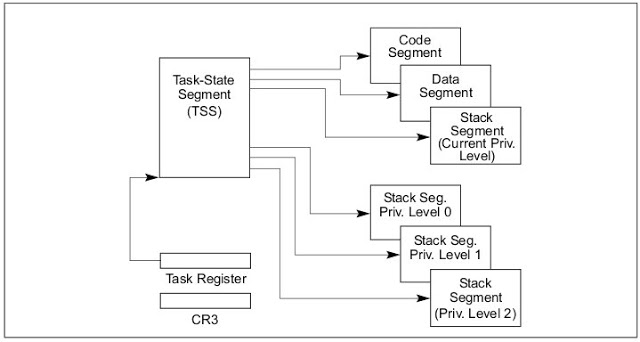
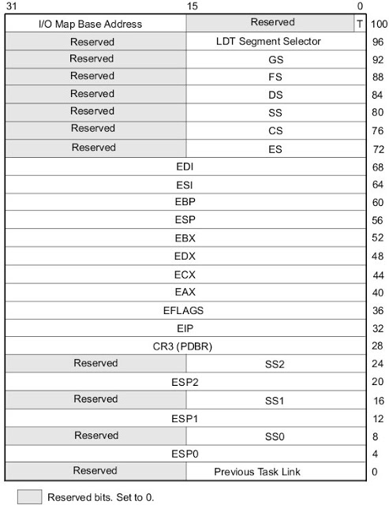
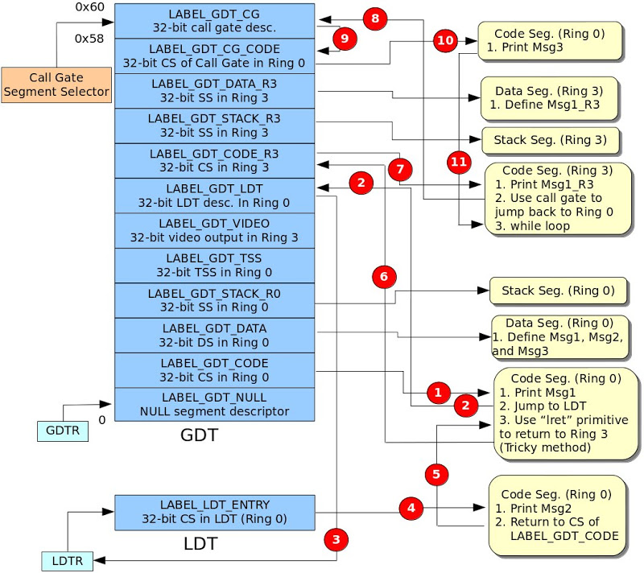
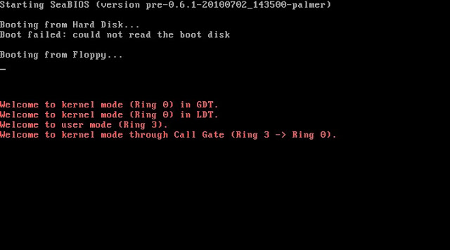

# (七) 利用Call Gate與TSS (Task-State Segment)實現特權等級的轉換

上篇文章僅介紹如何利用Call Gate，文中並未提及如何實現特權等級的轉換，也就是從低特權等級進入高特權等級，就如同Linux的user space (Privilege 3或稱Ring 3)進入kernel space (Privilege 0或稱Ring 0)。

### 簡介TSS (Task-State Segment)
本文僅簡單說明TSS在本文被使用的地方，如欲詳盡說明請參考[2]之第七章。

### Task Structure
Figure 1為一個工作任務 (Task)的結構圖，一個工作任務分為兩大部份: 1. 工作任務的執行空間 (Task Execution Space)，其中包含CS、SS以及若干個DS，也就是Figure 1右上角的三個區段。2. TSS: 由工作任務執行空間與一個儲存空間 (用來儲存工作任務的狀態)所組成。Figure 1又說明另一件事: TSS的Segment Selector必須儲存在Task Register。因此在使用TSS之前，必須使用LTR指令將TSS之Segment Selector載入至Task Register。


### Figure 1 Structure of a Task

### TSS Memory Layout
Figure 2為32位元TSS記憶體空間配置圖，如下所述:
- ESP0、SS0、ESP1、SS1、ESP2與SS2: 分別為特權等級0、1與2的堆疊區段與堆疊指標，也就是Figure 1右下角三個 "Stack Seg. Priv. Level x"。本文利用ESP0與SS0實現特權等級的轉換 (Ring 3轉換至Ring 0)，因此作者僅設定TSS的這兩個欄位，其它欄位則設為0。
- 其它欄位在此不進一步探討，有興趣的網友可以參考[2]。





### 原始碼下載
由於篇幅的關係，往後該系列文章將不張貼程式碼，將提供連結下載方式，[原始碼下載點](./src/pe-call-gate-tss.tar.gz)。


### 作業系統程式碼說明
Figure 3為作業系統程式碼解說圖，此圖說明GDT與LDT的記憶體配置圖與程式流程圖，其流程圖並非以傳統方式表示。取而代之，改以紅色圈圈的數字代表程式流程並搭配GDT與LDT記憶體配置圖，如此更能清楚地明白程式執行流程。底下將針對每一步驟 (紅色圈圈的數字)做詳盡的解釋:



### Figure 3 High Level Perspective of OS code

- 使用ljmp指令由真實模式轉換至32位元保護模式 (Ring 0)。其片段程式碼如下所示:

```
  /* Jump to protected-mode OS code        *
   * ljmpl prototype:                      *
   *   ljmpl segment_selector_of_CS offset */
  ljmpl     $SegSelectorCode32, $0

此區段程式碼將Msg1輸出至螢幕，並將LDT的segment selector載入至LDTR，接著使用lcall指令跳至LDT的CS，如下所示:
    /* Load LDT selector */
   mov     $(SegSelectorLDT), %ax

   /* Load LDT selector in GDT to LDT register */
   lldt     %ax

   /* Jump to code segment in LDT */
   lcall     $(SegSelectorLDTCode32), $0
```

- 如第1點所述。
- 如第1點所述。
- 輸出Msg2，隨即使用lret指令返回LABEL_GDT_CODE。
- 通常，call與ret指令必須配合使用。執行call指令時，處理器會將SS、ESP、CS與EIP推入(Push) 該執行空間的堆疊 (Stack)。接著，執行ret指令時，處理器會將EIP、CS、ESP與SS從堆疊取出 (Pop)。為了實現從Ring 0返回Ring 3，底下程式碼模擬處理器的工作: 將Ring 3的SS、ESP、CS與EIP推入(Push) 該執行空間的堆疊 (Stack)並使用lret指令返回Ring 3。
   pushl    $(SegSelectorStackR3)
  pushl    $(TopOfStackR3)
  pushl    $(SegSelectorCodeR3)
  pushl    $0
  lret
- 從Ring 0 (LABEL_GDT_CODE)返回 Ring 3 (LABEL_GDT_CODE_R3)。
- 此Ring 3程式區段將Msg1_R3輸出至螢幕，利用call gate並搭配TSS成功地返回Ring 0程式區段。因此，必須設定TSS之ESP0與SS0欄位，如下所示:

```
LABEL_TSS:
 .4byte  0                         /* Previous Task Link   */
 .4byte  TopOfStackR0              /* ESP0                 */
 .4byte  SegSelectorStackR0        /* SS0                  */
 .4byte  0                         /* ESP1                 */
 .4byte  0                         /* SS1                  */
 .4byte  0                         /* ESP2                 */
 .4byte  0                         /* SS2                  */
 .4byte  0                         /* CR3 (PDBR)           */
 .4byte  0                         /* EIP                  */
 .4byte  0                         /* EFLAGS               */
 .4byte  0                         /* EAX                  */
 .4byte  0                         /* ECX                  */
 .4byte  0                         /* EDX                  */
 .4byte  0                         /* EBX                  */
 .4byte  0                         /* ESP                  */
 .4byte  0                         /* EBP                  */
 .4byte  0                         /* ESI                  */
 .4byte  0                         /* EDI                  */
 .4byte  0                         /* ES                   */
 .4byte  0                         /* CS                   */
 .4byte  0                         /* SS                   */
 .4byte  0                         /* DS                   */
 .4byte  0                         /* FS                   */
 .4byte  0                         /* GS                   */
 .4byte  0                         /* LDT Segment Selector */
 .2byte  0                         /* Reserved             */
 .2byte  (. - LABEL_TSS + 2)       /* I/O Map Base Address */
.set TSSLen, (. - LABEL_TSS)
```

在此，特別對特權等級轉換做進一步解釋，以便讓讀者了解為什麼只要設定ESP0與SS0欄位即可。當存取目的程式區段 (Destination Code Segment)是被允許的，處理器便會根據Call Gate Descriptor的Segment Selector欄位找出對應的程式區段，如果又涉及特權等級轉換，處理器會將原本使用中的堆疊切換至目標特權等級的堆疊。舉例來說，假設目前程式區段運行於Ring 3，處理器便使用Ring 3的堆疊，當使用Call Gate欲轉換至Ring 0的程式區段。如果此要求是被允許的，則處理器會跳至Ring 0的程式區段並使用Ring 0的堆疊，因此程式設計員必須先設定Ring 0堆疊 (ESP0與SS0)，這就是為什麼必須設定TSS的ESP與SS0欄位的原因。

- 跳至GDT之Call Gate的描述子 (Descriptor)。
- 根據Call Gate描述子的Segment Selector欄位找出對應的CS。
- 將Msg3輸出至螢幕並返回。
- 返回Ring 3程式區段，並執行一無窮迴圈。

### QEMU測試結果



###【Reference】
- [1] Solrex - 使用開源軟體-自己動手寫作業系統
- [2] Intel 64 and IA-32 Architectures. Software Developer's Manual. Volume 3A
- [3] 30天打造OS！作業系統自作入門
- [4] Jserv's Blog
- [5] X86 開機流程小記
- [6] Linux assemblers: A comparison of GAS and NASM
- [7] linux-source-2.6.31
