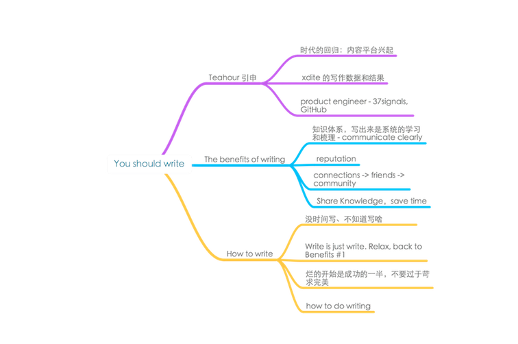

# 練寫作可以讓你成為「神級程式設計師」，但不是不二法門

上週的 Teahour.FM 迎來了兩大內容平台的創業者做客，簡書的創辦人林立和 Logdown 的創辦人 xdite。

在節目中，林立和 xdite（台灣頂尖 Ruby on Rails 程式設計師） 分享了他們做內容平台的想法。最近五六年是社交網絡的天下，各種社交應用的爆發同時也把人們帶入了碎片化時代，尤其是 140 字的限制，使得人們在快速生產內容，快速消費內容，越來越少的人願意沉下心思考，記錄一些文字。我們的生活其實少了很多精彩，所以很高興能看到這一年間內容平台重新興起並且回歸，Medium、簡書、Logdown、Ghost等，每天去看看裡面的推薦文章，我相信一定會有被感動的時候。

## 堅持寫作，對開發者的好處是無法估量的

節目中問了一下 xdite 一年的產出是多少，直接被嚇到了。在做 Logdown 之前 xdite 已經達到了年寫 400000 字，平均一天 1100 字，做 Logdown 之後是只多不少，對於一個創業者、技術開發人員而非作家來說，我必須得說是非常驚人的數字，當然在這個產出下，獲得的回報也是驚人的，比起之前寫的一篇文章就給 Logdown 帶來了 30 萬的 PV。

37signals 曾在其暢銷書『Getting Real』 中提到，招聘時，永遠選候選人中寫得更好的，無論是設計師、程序員、運營人員、銷售還是其他。寫得好的人也必然同時更善於思考和溝通，所以也能更好的與 Code 和人打交道。

`程式設計師大多都很痛恨寫文檔，尤其是寫那些認為沒用的文檔，繼而懶得記錄自己的思考和心得。`

我們在 teahour 也聊到這點，理解但非常推薦開發人員多寫文字，堅持寫作對個人成長帶來的好處是你無法估量的。我自己在團隊中，每一個功能發布，都是要求負責人直接去寫發佈 Blog ，不但要會實現，還是能給用戶講明白前因後果。

相信每個寫作的人都曾有體會，當你提筆去解釋一個東西的時候，你以為你知道的事情未必真正知道。寫作並不只是簡單的記錄，而是需要讓讀者也能跟著你的思路，理解你想表達的東西。所以，要想非常清晰的表達你的觀點，寫作必然是一次知識體系的重新學習和思緒的梳理，這樣才能幫助讀者理解。而這個過程，才是你真正的收穫。

## 寫作也是你個人品牌建立和傳播的非常有效的方式

永遠不要低估文字的影響力和傳播力，總會有人因為你的文字而受益。

當你分享越來越多的思考和知識，人們會了解到你的個性，了解到你的為人和處事方式。不管是否會有人因此討厭你，請相信一定會有更多的人喜歡你，他們會因為你的內容繼而了解你在做的事情，比如在寫的一本書，在做的一個產品等等。

而這些東西會也因為你的品牌而具有同樣獨特的個性。

`程式設計師在開源的世界里以 Code 會友，在思想的世界裡以文會友。`
無論是 teahour 還是我的 Blog 文章，在這一年多都給我帶來了很多的好朋友，一些甚至在生活中都不可能有任何交集的朋友。人的成長就在於不停的擴大自己的圈子並對等的交流，接觸到這麼一群非常有思想的人，從這些朋友身上學習到很多東西，才是我最大的收穫。

在分享知識的同時，它可能也會節省你很多時間，比如也許你 Google 到的一個解決方案就是你之前寫過的一篇文章。去年在 Teahour 時也問過 xdite 這麼高產的背後是如何尋找到寫作的主題的。xdite 解釋說有很多是很多人重複在問她的問題，她覺得累了，不想花時間一一回答，就把它寫了出來讓提問者直接去閱讀，這樣既可以讓讀者更系統的了解，也能節省大把的時間。

所以，YOU should write！

「我沒時間寫東西、我不知道寫什麼、我沒什麼有價值的好寫的……。」

不要再給自己找藉口了，放輕鬆點，我們不是作家要寫一部小說，我們只是作者要寫點東西，而如前面所言，寫作能讓我們梳理整個知識體系，這就夠了。

Medium 的 Slogan 我覺得非常好，「Everyone’s stories and ideas」，我們每天都在接收新的訊息和新的想法，為何不把它記錄成字呢？不要一開始就苛求完美，永遠記得壞的開始就等於成功的一半。我覺得我寫的每一篇初稿都很爛，但是每次修改都讓我覺得比前一次好一點點。到最後發佈時，看起來也還不錯，至少自己挺滿意。

細細分析，`寫作的整個過程其實跟做產品還蠻像的`。一篇文章的出爐，需要歷經計劃、調查研究、初稿、複審、修訂和發佈的過程。做計劃時需要了解文章讀者是誰，他們的期望是什麼，確定主題思想。調研時比較同類文章，梳理整個思路。一般在這個階段後，我已經基本有了一個藍圖。初稿就嚴格按照腦圖需求，迅速成文。之後聽取朋友反饋，多次修訂，最後發佈。整就一個精益寫作的過程。

寫作是一個非常值得培養的習慣。這個技能的練成，沒有捷徑，唯有不停的練習。時代在回歸，人也要回歸。千里之行，始於足下，YOU should get started！