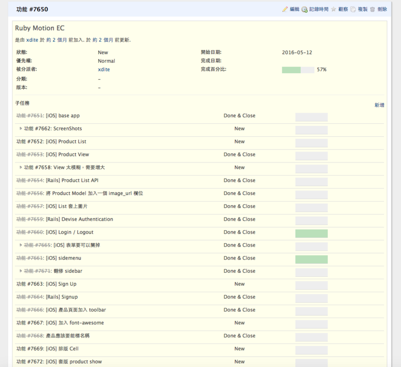

# 我是如何學一門新技術的

過去一年，莫名其妙成了全職的程式教練。大概是天注定，唉。最常遇到的新手問題就是，請問如何入門 XXX 技術。當然，對我來說，寫 Rails 都快十年了。這這個領域東西還真難不倒我，抄了傢伙就幹已經是我這幾年的風格。

不過我一向蠻有實驗精神的。為了要能夠回答這個問題，我特地去重學了新的程式語言（ Ruby Motion ），來近距離觀察重新拆解我十年以來的學習反射性動作到底是什麼，來寫一份給新手的參考指南。

##Step 1 : 建造時光機
我在學習新技術時，會用到兩個東西。第一個是 Git，第二個是 Redmine。

## Git
git 是新手的時光機。我認為如果一般人學習任何程式語言，甚至寫任何筆記，都應該上個 git 版本控制。起碼看你上一次寫了什麼東西。其實 git 一開始也不用學太多指令，練習以下幾個就夠：

- git init （初始一個 Repo）
- git add [檔案名稱] （將某某檔案加入版本控制）
- git commit -m "儲存訊息" （將這次要加入版本控制的檔案，寫入歷史紀錄）
- git checkout -b "新分支名稱" （ 如果要實作一個蠻巨大的實驗性功能，我通常會開一個 branch）
- git checkout "分支名稱" ( 切換不同分支 ）
- git push （推送變更到遠端做一次備份，通常是 Github）
- git pull 拉下遠端的變更

主要是將做過的東西，「每一個 interaction 都做一次備份」，讓自己知道當初為什麼做了這些變動。

## Redmine

Redmine 是一套專案管理系統。不過在這裡我是利用它的「樹狀 ticket 系統」去規劃我的練習。

我運用的方法如下：

我運用的方法如下：

- 大致切出第一層，我覺得我想要練習的主題
- 然後中間要是有遇到難題，大概 30 分鐘解不開，我就會「放棄」，然後開另外一張票，隔天心情比較好再回來學
- 中間我要是覺得「有個功能實在太棒了」，我應該可以來做。忍住，開出另外一張票，下週再來做。
    - 每一張 Ticket 我拿來記幾個東西：
    - 我這次找到了哪些 link（幾乎是一 google 到一個疑似可以用的資源，就 copy 一份）
    - 這次這個功能寫了哪些 code。（是的，我不止 git 記了一份，redmine 上還複製了一份）
    - 這次我做了哪些改動
    - 我之前的「錯誤做法」，為什麼錯了。bug 的原因是？
    - 為了解 bug 所找到的 stackoverflow 資源

我的 redmine ticket 記這些東西，每張非常的詳盡。（不是指筆記做得好，而是指這當中的過程，我把每一步幾乎都錄下來）

這樣做的好處是：

- 我不會分心，專注在我當初想練的主題上
- 我不會被鬼打牆的 bug 打擊到自信心全無
- 我不會被自己一時的成就產生的「傲慢感」牽走
- 把每一步包括 bug 都錄下來。bug 的產生以及解法，其實是「重要的知識」。因為 git 「往往只會保留正確的結果」，而不會保留你 debug 的結果。然後下次自己還是會掉進同樣的坑裡面。

## Step 2：挑選合適的主題，熟悉基本工具

在無數篇自我的學習部落格我都曾經提到過，在自學過程中保持一定的「成就感」是很重要的。最近，我把我多年來練習題目做了一個總結，找到了一個模式。

超級新手：
- 一個「單一功能」，CRUD 的練習。
- 先做 R 再做 C 再做 D 再做 U。

完整做完一輪，搞懂怎麼樣讓這個專案會動的基本因素與語法。

（注意，這個系統內只有「自己」這個用戶）

###新手：

以下按照順序

- 除了 CRUD 外的三個功能
- 這個系統內只能有 1 個角色，通稱「使用者」。
- 登入系統
- 套版
- 加上一個外掛功能
- 部署

（這個最實際的例子就是 TODO + 使用者註冊 + 套版 + deploy）。這一系列做出來，起碼可以讓一個人至少可以熟練這個系統的最基本工具，而不太容易絆倒。

###中手：
- 第 2 個角色
- 開發者認為的 10 個重要核心功能
- 至少加入 3 個外掛
- 權限
- 介接一個第三方 （學會讀文件）

之所以會建議這樣做的原因。是我發現每當建議新手自己找題目練習後，他們自己想的題目反而變成了災難。

說災難的原因是因為他們挑選的題目帶給了他們濃厚的挫折感。而這當中最核心的原因在於失控的 scope。

而 scope 的最主要的控制變因在於「這個系統裡面有幾個？操作角色」。很多人會忽略掉一個重要的事實，開發系統裡面多「引入一個使用者角色」，這個系統的複雜度就會成「等比級數上升」。

舉個例子來說好了：

- 一個匿名論壇，大家可以上去發表文章。
- 一個實名論壇，大家必須要登入才能發表文章。
- 一個實名論壇，大家必須要登入才能發表文章，「並且針對它人的文章留言」。
- 一個有管理員的實名論壇，管理者可以任意刪除大家的文章以及留言。發文者也可以砍掉自己文章底下的留言。

這四個例子的功能數量是「等比級數的上升」。而一旦新手挑的題目，系統內角色多於 1 人，基本上就注定「打挑戰級難度被王打死」。

而我一向的學習方式，都是會儘量讓難度可以控制在自己「開開心心學習」的程度上（每次逐步加重，而不是一開始就被滅好玩）。我知道唯有己有成就感地學習，學一門技術才不容易中途而廢。

##Step 3：將 Redmine 的筆記整理成技術文章

在學完這整套技術後，我會在適當時機，把過去的筆記寫成一篇技術文件。視情節發布給同事或給部落格讀者。

- 比如說這個專案如果是跟同事協作的，我會在拉 pull request 時，附上快速的一篇 getting started 。
- 如果是這個技術難度比較高，用一篇 getting started 的方式很難讓對方快速掌握，我會至少做一份 newbie guide ，讓想學的人，透過 guide 帶練至少一次快速衝到新手等級。

因為 redmine 上當初的筆記非常得詳細，在看這些筆記與 git 的時候，我當時的記憶就會被喚醒。甚至上面有現成的 code example 可以直接拿來改編。

而把這些筆記整理成技術文件與指南非常有幫助，因為「寫作」這件事可以幫助我從此把這門新技術「想通」，而且烙印到大腦裡面。

##總結
以上的步驟，最後可以總結成三個重點：

- 建造時光機，與錄下自己學習的過程
- 做有成就感的題目，透過控制「角色」去控制複雜度，在頭兩個循環就掌握到基本工具，而且做出有成就感的東西。
- 重新複習，寫成文章，內化成自己的架構。

分享給大家。

