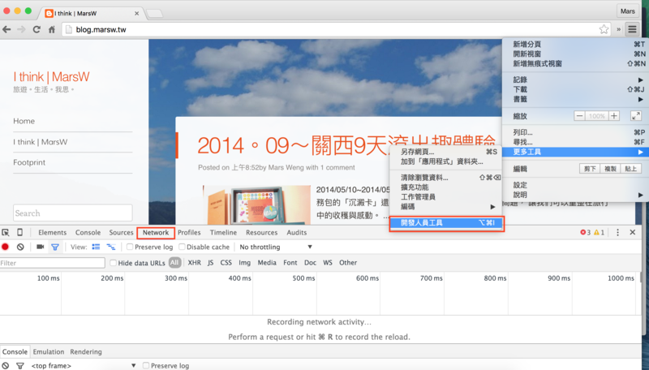
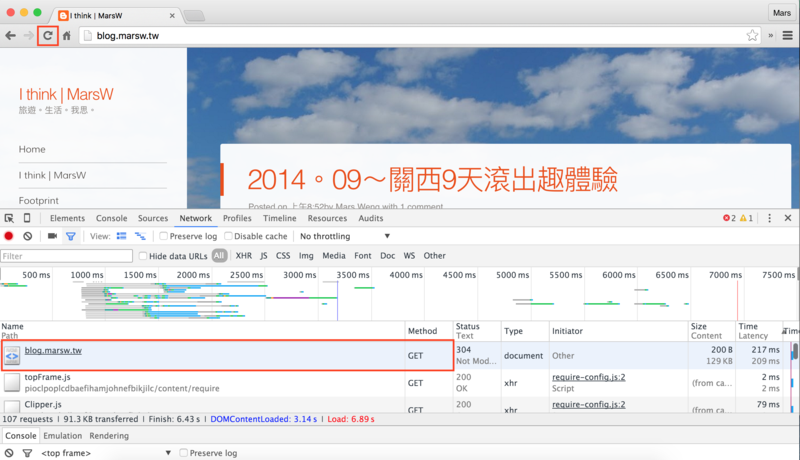
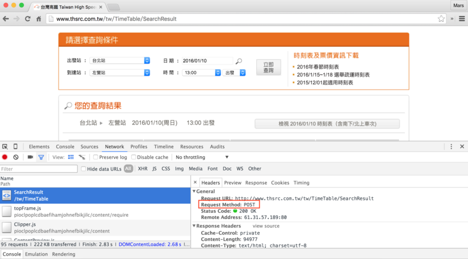
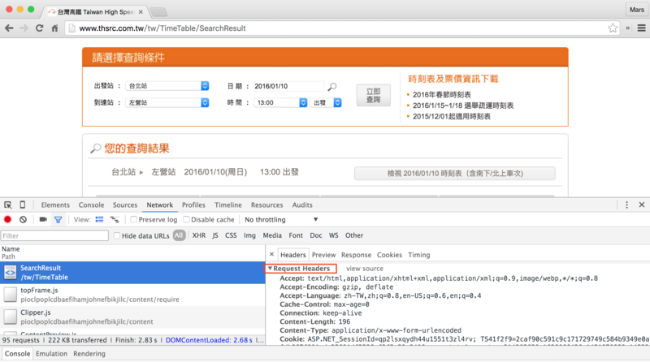
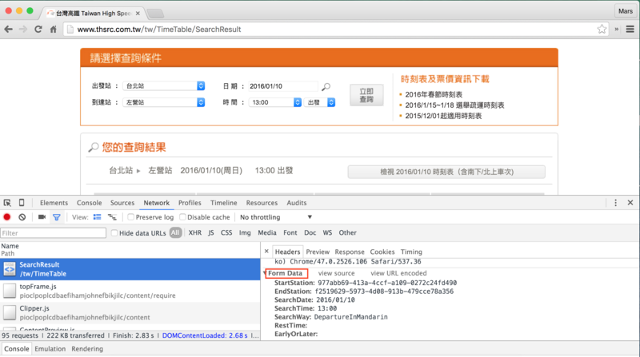
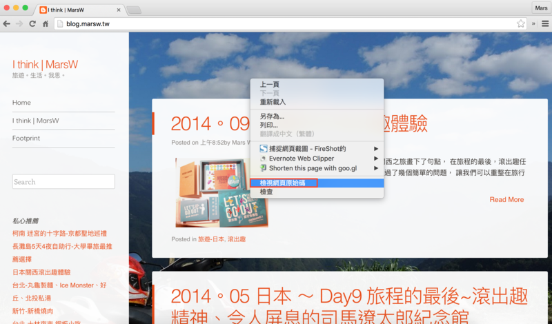
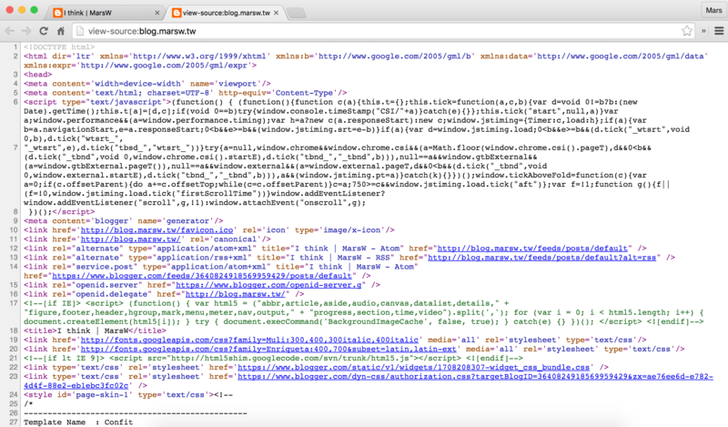
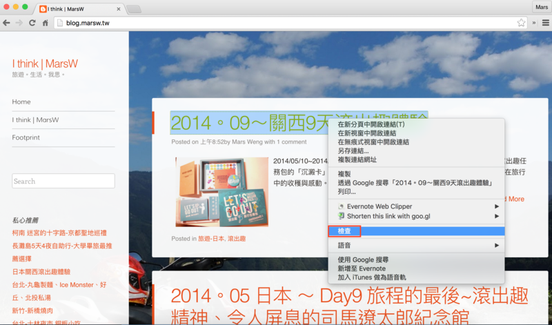
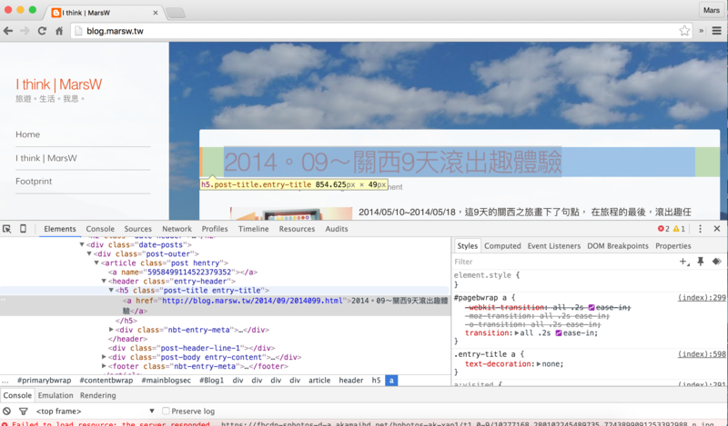
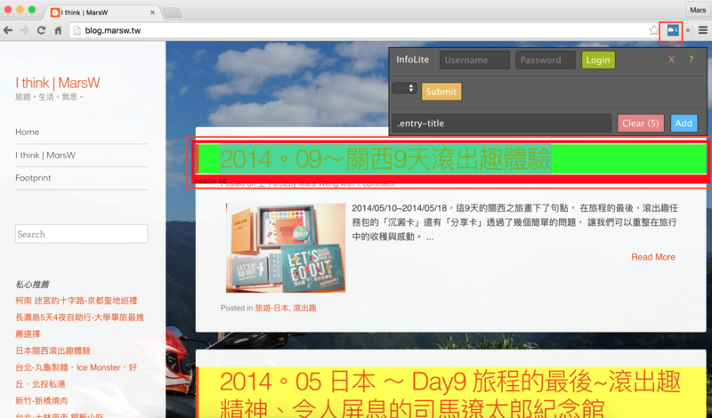

# 觀察技巧 with Chrome開發人員工具

其實爬蟲的技巧主要就是`觀察` 
觀察你想要抓的資料有沒有什麼`規則`：

- 哪個網址才是真的資料所在
- 想要抓的元素是以什麼tag分隔

瀏覽器就有功能可以幫我們觀察這些資訊
我們想要知道這個網址request的方法是GET還是POST
以chrome為例：

###1.開啟`開發人員工具`，進到`Network`標籤：

###2.重新整理網頁，通常我們要抓取的網頁會在最上方：

我們就可以知道要獲取 http://blog.marsw.tw 的資料，request方法是GET

而像高鐵時刻查詢的網頁request方法是POST：

也能知道request header該放怎麼樣的資訊：

以及POST該傳怎樣的內容及格式：

###3.而原始碼除了可以重爬蟲程式抓取後的資料觀察，Chrome的檢視網頁原始碼功能也可以幫助我們先行看到抓取的資料原貌

### 4.而想要抓取的元素tag也可以從Chrome觀察，對著想要的元素`按右鍵>檢查`
假設這裡我是想抓取每篇文章的標題，我就對著標題按下右鍵>檢查

點選任一區塊原始碼時，Chrome顯示該程式碼在網頁上顯示的區塊位置
這裡我猜測應該是h5這個tag底下的內容會是我想要的資訊，我點選過後，Chrome顯示的的確是標題區塊

ps.有個Chrome套件`InfoLite`可以簡單幫忙確認所點選的程式碼是否適用我們想抓的資料規則，
以此例來說，我開啟InfoLite後，點選標題，他在上方產生了 `.entry-title`，
畫面上顯示header h5 
代表著這些標題的DOM是 header>h5，而h5的class屬性是entry-title 
(.代表的是class `#`代表的是id) 
我們也可以看到這個規則下，的確是所有的文章標題

但有時抓取的資料不一定都以class、id等tag標明不同的內容時，
就還是得仰賴直接觀察原始碼，用程式對觀察到的規則做解析，才能確定該規則是不是我們想要的內容