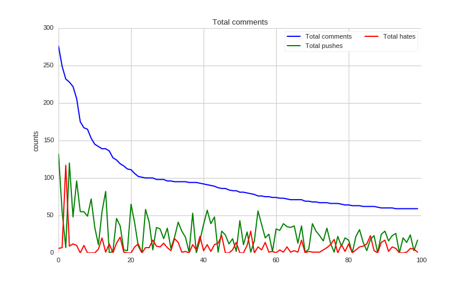
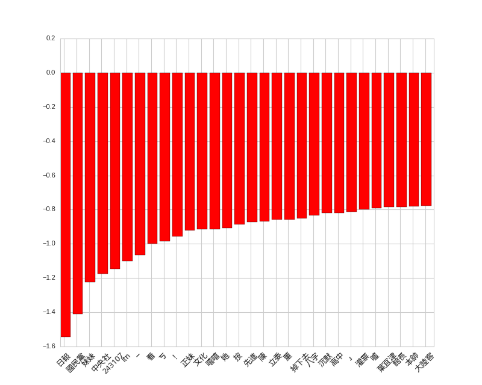
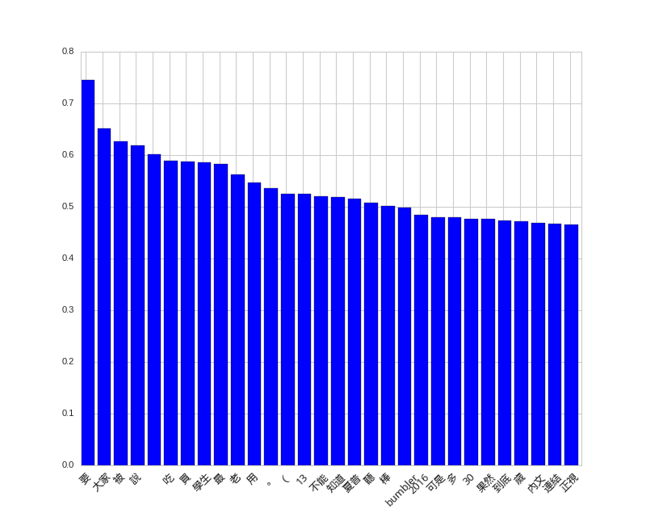
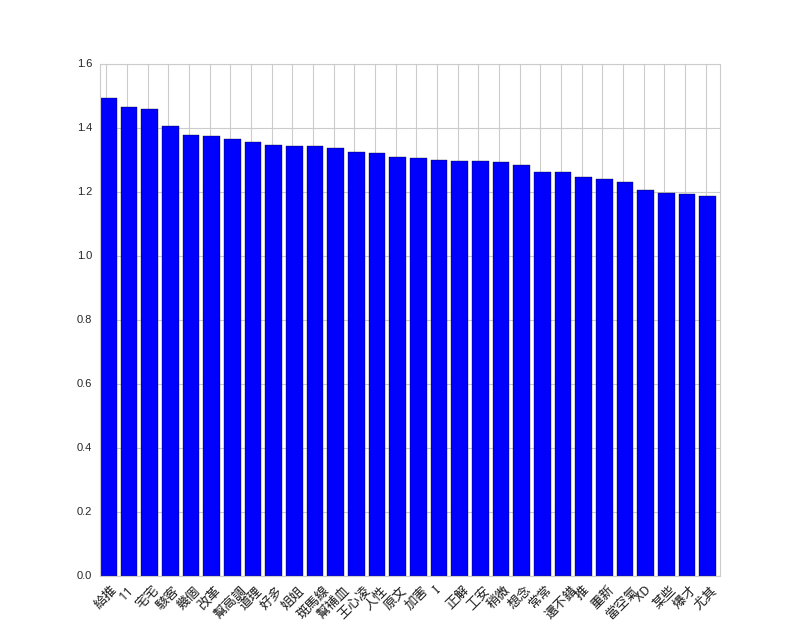

# Scrapy + Python 3: PTT 資料抓取與分析


很久很久以前，曾經想要學學網路爬蟲，爬一些 PTT 的資料來看看能幹嘛。當時找到了 Scrapy 這個程式庫，覺得很有潛力。只可惜當初他還不太支援 Python 3，於是就暫且放下學習的念頭，想說先等等看。

如今，Scrapy 1.1 釋出，除了一些功能的更新外，他也終於要支援基本的 Python 3 了！於是抱持著推廣 Python 3 的想法，重拾之前的目標，實際測試了一下網路爬蟲的撰寫。

##環境設置
由於這次是要爬 PTT 的資料，為了避免一旦被鎖 IP，就會無法上 PTT，很不方便。所以我特地使用了 NTU CS 自己的機器，同時也設定高一點的連線延遲，避免同時產生太多連線。

如果你是用自己的主機而不是用繫上工作站，可能還需要安裝額外套件：

```sh
sudo apt-get install python3-dev libxml2-dev libxslt1-dev zlib1g-dev libffi-dev libssl-dev
```

接下來就能使用 pyvenv 創立虛擬環境，好安裝自己的 Python 套件：

```sh
pyvenv-3.5 my_env
source my_env/bin/activate
pip install -U pip
```

緊接著，安裝所有這次會用到的套件：

```sh
# 不知為何在工作站上要用 `python /sbin/pip3.5` 來取代下述的 `pip` 才能跑
pip install Scrapy==1.1.0 numpy notebook scipy scikit-learn seaborn jieba
```

##撰寫爬蟲
於是就開始參考教學撰寫我人生中第一個 Scrapy 爬蟲！

首先創立專案：

```sh
scrapy startproject ptt
```

設定連線延遲：

```sh
# <root_dir>/ptt/settings.py
DOWNLOAD_DELAY = 1.25
```

然後定義一些想要抓取的項目，包含本文和推文等等：

```py
# <root_dir>/ptt/items.py
class PostItem(scrapy.Item):
    title = scrapy.Field()
    author = scrapy.Field()
    date = scrapy.Field()
    content = scrapy.Field()
    comments = scrapy.Field()
    score = scrapy.Field()
    url = scrapy.Field()
```

接著就編輯 <root_dir>/ptt/spiders/ptt.py 實際撰寫爬蟲程式了。

首先測試一下是否真的可以連上 PTT：

```py
import scrapy

class PTTSpider(scrapy.Spider):
    name = 'ptt'
    allowed_domains = ['ptt.cc']
    start_urls = ('https://www.ptt.cc/bbs/Gossiping/index.html', )

    def parse(self, response):
        filename = response.url.split('/')[-2] + '.html'
        with open(filename, 'wb') as f:
            f.write(response.body)
```

然後在 <root_dir> 根目錄（有 scrapy.cfg 的目錄）執行：

```sh
scrapy crawl ptt
```

完成後應該會發現存下了一個詢問年紀是否已經大到可以觀看八卦版的網頁。為了能夠成功抓取八卦版文章，我們必須要自動回答這個問題才行。雖然也可以直接用 cookies 參數傳入回答紀錄，不過這裡為了盡量模擬人類的行為，所以決定真正的送出表單。（Scrapy 會自動記下送出表單後產生的 cookie。）

##自動回答年齡問題

於是我們新增測試，利用 div.over18-notice 的存在來偵測是否進到年齡詢問的頁面。這裡使用到了 XPath 來指定物件的位置。記得當初在微軟寫測試程式時也有用到，現在再碰到一次感覺格外熟悉。

```py
import logging

from scrapy.http import FormRequest

class PTTSpider(scrapy.Spider):
    # ...
    _retries = 0
    MAX_RETRY = 1

    def parse(self, response):
        if len(response.xpath('//div[@class="over18-notice"]')) > 0:
            if self._retries < PTTSpider.MAX_RETRY:
                self._retries += 1
                logging.warning('retry {} times...'.format(self._retries))
                yield FormRequest.from_response(response,
                                                formdata={'yes': 'yes'},
                                                callback=self.parse)
            else:
                logging.warning('you cannot pass')

        else:
          # ...
```

我們利用 FormRequest 在遇到詢問頁時自動送出表單，然後用 callback 在表單送出成功後重新回到原本的 parse 函式，繼續處理。為了避免表單傳送失敗會不斷嘗試卡住，所以用 MAX_RETRY 稍微限制表單傳送的次數。

##自動翻頁，並打開每篇文章

接下來就是實際爬文的程式了，這裡也嘗試使用 CSS Selector，利用 css('.r-ent > div.title > a::attr(href)') 來抓出每個文章的連結。 再使用 response.urljoin 把相對路徑轉成絕對路徑。然後把他送給 parse_post 做進一步處理。


```py
class PTTSpider(scrapy.Spider):
    # ...

    _pages = 0
    MAX_PAGES = 2

    def parse(self, response):
        if len(response.xpath('//div[@class="over18-notice"]')) > 0:
            # ...
        else:
            self._pages += 1
            for href in response.css('.r-ent > div.title > a::attr(href)'):
                url = response.urljoin(href.extract())
                yield scrapy.Request(url, callback=self.parse_post)

            if self._pages < PTTSpider.MAX_PAGES:
                next_page = response.xpath(
                    '//div[@id="action-bar-container"]//a[contains(text(), "上頁")]/@href')
                if next_page:
                    url = response.urljoin(next_page[0].extract())
                    logging.warning('follow {}'.format(url))
                    yield scrapy.Request(url, self.parse)
                else:
                    logging.warning('no next page')
            else:
                logging.warning('max pages reached')
```

最後再用 XPath 找出上一頁的連結，自動翻頁。至於要翻幾頁，則用 MAX_PAGES 控制。

##實際抓文

最後就是實際的抓文程式了，除了抓下標題、作者、本文等等，我也抓下每一則推文的作者和分數，以及整篇文章的分數。

```py
import datetime

from ptt.items import PostItem

class PTTSpider(scrapy.Spider):
    # ...
    def parse_post(self, response):
        item = PostItem()
        item['title'] = response.xpath(
            '//meta[@property="og:title"]/@content')[0].extract()
        item['author'] = response.xpath(
            '//div[@class="article-metaline"]/span[text()="作者"]/following-sibling::span[1]/text()')[
                0].extract().split(' ')[0]
        datetime_str = response.xpath(
            '//div[@class="article-metaline"]/span[text()="時間"]/following-sibling::span[1]/text()')[
                0].extract()
        item['date'] = datetime.strptime(datetime_str, '%a %b %d %H:%M:%S %Y')

        item['content'] = response.xpath('//div[@id="main-content"]/text()')[
            0].extract()

        comments = []
        total_score = 0
        for comment in response.xpath('//div[@class="push"]'):
            push_tag = comment.css('span.push-tag::text')[0].extract()
            push_user = comment.css('span.push-userid::text')[0].extract()
            push_content = comment.css('span.push-content::text')[0].extract()

            if '推' in push_tag:
                score = 1
            elif '噓' in push_tag:
                score = -1
            else:
                score = 0

            total_score += score

            comments.append({'user': push_user,
                             'content': push_content,
                             'score': score})

        item['comments'] = comments
        item['score'] = total_score
        item['url'] = response.url

        yield item
        
```
    
最後執行以下指令，就可以把文章存成一個大 JSON 檔案：

```py
scrapy crawl ptt -o gossip.json
```

##在 IPython Notebook 裡做資料分析
爬完文之後就可以分析了，這次我一共爬了 1881 篇八卦版的文章。 跟之前一樣是用 IPython Notebook 來進行分析，可以直接在 PTT Analysis @ nbviewer 上閱讀。

因為之前看 CS 109 時發現 Seaborn 畫的圖好像比較漂亮，這次也決定試試。共會用到以下套件：

```sh
matplotlib
Numpy
scikit-learn
Seaborn
結巴中文分詞
```

首先載入所有會用到的套件：

```py
%matplotlib notebook

import json

from collections import defaultdict

import jieba
import matplotlib.pyplot as plt
import numpy as np
import seaborn as sns

from sklearn.feature_extraction import DictVectorizer
from sklearn.feature_extraction.text import TfidfTransformer
from sklearn.svm import LinearSVC

sns.set(style='whitegrid')
```

然後載入所有文章：

```py
# load ptt posts

path = 'gossip.json'

with open(path) as f:
    posts = json.load(f)
```

##推文分析

我決定先來看看大家都推了多少文，或許可以當作宅度量表之類的。不過為了隱私問題，這裡就不列出實際的 ID 了。先載入每個人的推噓文數目：

```py
# get pushes

total_comments = defaultdict(int)
total_pushes = defaultdict(int)
total_hates = defaultdict(int)

for post in posts:
    for comment in post['comments']:
        user = comment['user']
        total_comments[user] += 1

        if comment['score'] > 0:
            total_pushes[user] += 1

        elif comment['score'] < 0:
            total_hates[user] += 1
```

然後就可以畫出排名最高一百名的推文者到底推了多少文。

```py
def show_distributions(counts, pushes, hates):
    sorted_cnts = [t[0] for t in sorted(counts.items(), key=lambda x: -x[1])][:100]
    y = [counts[u] for u in sorted_cnts]
    y_pushes = [pushes[u] for u in sorted_cnts]
    y_hates = [hates[u] for u in sorted_cnts]
    x = range(len(y))

    f, ax = plt.subplots(figsize=(10, 6))

    sns.set_color_codes('pastel')
    sns.plt.plot(x, y, label='Total {}'.format('comments'), color='blue')
    sns.plt.plot(x, y_pushes, label='Total {}'.format('pushes'), color='green')
    sns.plt.plot(x, y_hates, label='Total {}'.format('hates'), color='red')

    ax.legend(ncol=2, loc='upper right', frameon=True)
    ax.set(ylabel='counts',
           xlabel='',
           title='Total comments')
    sns.despine(left=True, bottom=True)

    plt.show(f)
# display pushes
show_distributions(total_comments, total_pushes, total_hates)
```
可以看到，大部分都是推文比較多，不過也有人幾乎都在噓文呢！

每個推文者的推噓文次數




##用語分析

接下來我們來看看文章裡出現哪些字比較容易被推或噓，以及網友推噓文時都用什麼用詞吧。

首先利用結巴分詞，把每篇文章的詞收集起來，順便紀錄文章分數：

```py
# grap post
words = []
scores = []

for post in posts:
    d = defaultdict(int)
    content = post['content']
    if post['score'] != 0:
        for l in content.split('\n'):
            if l:
                for w in jieba.cut(l):
                    d[w] += 1
        if len(d) > 0:
            words.append(d)
            scores.append(1 if post['score'] > 0 else 0)
```

推文們也比照辦理：

```py
# grap comments
c_words = []
c_scores = []

for post in posts:
    for comment in post['comments']:
        l = comment['content'].strip()
        if l and comment['score'] != 0:
            d = defaultdict(int)
            for w in jieba.cut(l):
                d[w] += 1
            if len(d) > 0:
                c_scores.append(1 if comment['score'] > 0 else 0)
                c_words.append(d)
```

最後用 TfidfTransformer 做出特徵向量，配合 LinearSVC 進行預測訓練：


```py
# convert to vectors
dvec = DictVectorizer()
tfidf = TfidfTransformer()
X = tfidf.fit_transform(dvec.fit_transform(words))

c_dvec = DictVectorizer()
c_tfidf = TfidfTransformer()
c_X = c_tfidf.fit_transform(c_dvec.fit_transform(c_words))

svc = LinearSVC()
svc.fit(X, scores)

c_svc = LinearSVC()
c_svc.fit(c_X, c_scores)
```

然後就可以畫圖了：


```py
def display_top_features(weights, names, top_n, select=abs):
    top_features = sorted(zip(weights, names), key=lambda x: select(x[0]), reverse=True)[:top_n]
    top_weights = [x[0] for x in top_features]
    top_names = [x[1] for x in top_features]

    fig, ax = plt.subplots(figsize=(10,8))
    ind = np.arange(top_n)
    bars = ax.bar(ind, top_weights, color='blue', edgecolor='black')
    for bar, w in zip(bars, top_weights):
        if w < 0:
            bar.set_facecolor('red')

    width = 0.30
    ax.set_xticks(ind + width)
    ax.set_xticklabels(top_names, rotation=45, fontsize=12, fontdict={'fontname': 'Droid Sans Fallback', 'fontsize':12})

    plt.show(fig)
```

原本我想同時列出正向和負向詞彙，但後來發現似乎負向詞彙都比較強，所以只好分開列出了。

首先是貼文的負向詞彙，不知為何，如果文中出現「妹妹」似乎就很容易被噓呢！

```py
# top features for posts
display_top_features(svc.coef_[0], dvec.get_feature_names(), 30)
```

## 貼文負向詞彙



然後是貼文的正向詞彙，看不出什麼 QQ。

```py
# top positive features for posts
display_top_features(svc.coef_[0], dvec.get_feature_names(), 30, select=lambda x: x)
```
## 貼文正向詞彙


推文的正負向詞彙倒是滿有趣，最強的特徵是「紅明顯」和「給推」，哈哈。

```py
# top features for comments
display_top_features(c_svc.coef_[0], c_dvec.get_feature_names(), 30)
# top positive features for comments
display_top_features(c_svc.coef_[0], c_dvec.get_feature_names(), 30, select=lambda x: x)

```


##推文負向詞彙


## 推文正向詞彙



##結語
雖然已經過了那麼多年，Python 3 的使用率還是沒能上升到理想的境界，不過已經是漸入佳境了。 希望更多人一起來寫 Python 3。

做完分析感覺 PTT 實在是一個寶庫，尤其各種特殊看板似乎很適合拿來測風向。不知還能做出什麼分析應用呢？

這次實驗所用到的程式碼按照慣例放在 GitHub 上面供參考：https://github.com/shaform/experiments/tree/master/scrapy。