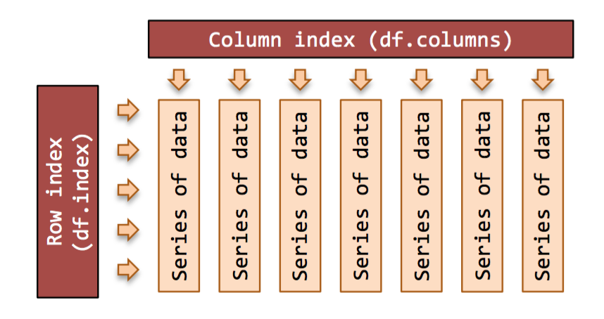

# 数据操作（Pandas） 完整


##1.1. pandas 对象

引入 pandas 等包，DataFrame、Series 属于常用的，所以直接引入

```py
%matplotlib inline
import matplotlib.pyplot as plt
import numpy as np
import pandas as pd
from pandas import Series, DataFrame
```

DataFrame 对象：Pandas DataFrame 是一个表格型的数据结构，有行索引也有列索引


```py
from IPython.display import Image
Image(filename='../../image/DataFrame.png', width=400)
```



Series 对象：类似于一维数组的对象，由一组同样 type 的数组和索引组成


```py
s1 = Series(range(0,4)) # -> 0, 1, 2, 3
s2 = Series(range(1,5)) # -> 1, 2, 3, 4
s3 = s1 + s2 # -> 1, 3, 5, 7
s4 = Series(['a','b'])*3 # -> 'aaa','bbb'
```

index 对象：即 Series 和 DataFrame 的索引


```py
# 获取索引
df = DataFrame(s1)
idx = s1.index
idx = df.columns # the column index
idx = df.index # the row index
```

```py

# 索引的一些特性
b = idx.is_monotonic_decreasing
b = idx.is_monotonic_increasing
b = idx.has_duplicates
i = idx.nlevels # multi-level indexe
```

```py
# 索引的一些方法
a = idx.values # get as numpy array
l = idx.tolist() # get as a python list
# idx = idx.astype(dtype) # change data type
# b = idx.equals(other) # check for equality 看看是否是相同的索引
```

```py
# union of two indexes 合并两个索引
# idx = idx.union(other)

idx1 = pd.Index([1, 2, 3, 4])
idx2 = pd.Index([3, 4, 5, 6])
idx1.union(idx2)
```

```py
Int64Index([1, 2, 3, 4, 5, 6], dtype='int64')
```

```py
i = idx.nunique() # number unique labels
label = idx.min() # minimum label
label = idx.max() # maximum label
```

创建 Series 和 DataFrame

http://pandas.pydata.org/pandas-docs/stable/dsintro.html

##1.2. DataFrame 入门

```py
df = DataFrame(np.random.randn(10, 4), columns=['A', 'B', 'C', 'D'])
```

DataFrame 的一些实用查看方法

```py
df.info()
```


```py

<class 'pandas.core.frame.DataFrame'>
RangeIndex: 10 entries, 0 to 9
Data columns (total 4 columns):
A    10 non-null float64
B    10 non-null float64
C    10 non-null float64
D    10 non-null float64
dtypes: float64(4)
memory usage: 392.0 bytes
```

```py
n=4
dfh = df.head(n) # 看前 n 行
```


```py
dft = df.tail(n) # 看后 n 行
```

```py
dfs = df.describe() # 各类统计信息
```

```py
top_left_corner_df = df.iloc[:5, :5]
```

```py
dfT = df.T # transpose rows and cols
```

## DataFrame index 的一些特性

```py
l = df.axes # list row and col indexes
l
```

```py
[RangeIndex(start=0, stop=10, step=1),
Index([u'A', u'B', u'C', u'D'], dtype='object')]
```

```py
(r, c) = df.axes # from above
```

```py
s = df.dtypes # Series column data types
```

```py
A    float64
B    float64
C    float64
D    float64
dtype: object
```

```py
b = df.empty # True for empty DataFrame
b
```

```py
False
```

```py
i = df.ndim # number of axes (2)
i
```
```py
2
```

```py
t = df.shape # (row-count, column-count)
t
```

```py
(10, 4)
```

```py
(r, c) = df.shape # from above
(r, c)
```

```py
(10, 4)
```

```py
i = df.size # row-count * column-count
i
```

```py
40
```

```py
a = df.values # get a numpy array for df
```


## 实用方法

```py
df = DataFrame([1, 23, 3, 5, 2])
```

```py
dfc = df.copy() # copy a DataFrame
dfr = df.rank() # rank each col (default) 把每个值的地位列出了
dfs = df.sort() # sort each col (default)
# dfc = df.astype(dtype) # type conversion
```

```py
/Users/Scott/Library/anaconda2/lib/python2.7/site-packages/ipykernel/__main__.py:3: FutureWarning: sort(....) is deprecated, use sort_index(.....)
 app.launch_new_instance()
```

```py

# 下面的两个方法没怎么搞懂
df.iteritems()# (col-index, Series) pairs
df.iterrows() # (row-index, Series) pairs
# example ... iterating over columns
for (name, series) in df.iteritems():
    print('Col name: ' + str(name))
    print('First value: ' +
        str(series.iat[0]) + '\n')
```

```py

Col name: 0
First value: 1
```

## 通用函数

<table border="1" class="docutils">
<colgroup>
<col width="43%">
<col width="57%">
</colgroup>
<thead valign="bottom">
<tr class="row-odd"><th class="head">method</th>
<th class="head">##</th>
</tr>
</thead>
<tbody valign="top">
<tr class="row-even"><td>df = df.abs()</td>
<td>absolute values</td>
</tr>
<tr class="row-odd"><td>df = df.add(o)</td>
<td>add df, Series or value</td>
</tr>
<tr class="row-even"><td>s = df.count()</td>
<td>non NA/null values</td>
</tr>
<tr class="row-odd"><td>df = df.cummax()</td>
<td>(cols default axis)</td>
</tr>
<tr class="row-even"><td>df = df.cummin()</td>
<td>(cols default axis)</td>
</tr>
<tr class="row-odd"><td>df = df.cumsum()</td>
<td>(cols default axis)</td>
</tr>
<tr class="row-even"><td>df = df.cumprod()</td>
<td>(cols default axis)</td>
</tr>
<tr class="row-odd"><td>df = df.diff()</td>
<td>1st diff (col def axis)</td>
</tr>
<tr class="row-even"><td>df = df.div(o)</td>
<td>div by df, Series, value</td>
</tr>
<tr class="row-odd"><td>df = df.dot(o)</td>
<td>matrix dot product</td>
</tr>
<tr class="row-even"><td>s = df.max()</td>
<td>max of axis (col def)</td>
</tr>
<tr class="row-odd"><td>s = df.mean()</td>
<td>mean (col default axis)</td>
</tr>
<tr class="row-even"><td>s = df.median()</td>
<td>median (col default)</td>
</tr>
<tr class="row-odd"><td>s = df.min()</td>
<td>min of axis (col def)</td>
</tr>
<tr class="row-even"><td>df = df.mul(o)</td>
<td>mul by df Series val</td>
</tr>
<tr class="row-odd"><td>s = df.sum()</td>
<td>sum axis (cols default)</td>
</tr>
</tbody>
</table>

## 1.3. DataFrame Columns 列处理

column 其实也是一个 Series


```py
df = DataFrame(np.random.randn(10, 4), columns=['A', 'B', 'C', 'D'])
idx = df.columns # get col index
label = df.columns[0] # 1st col label
lst = df.columns.tolist() # get as a list
```
```py
lst
['A', 'B', 'C', 'D']
In [32]:
label
Out[32]:
'A'
In [33]:
idx
Out[33]:
Index([u'A', u'B', u'C', u'D'], dtype='object')
```

### column 改名

```py
# df.rename(columns={'old':'new'}, inplace=True)
# df = df.rename(columns={'a':1,'b':'x'})
```

选择 columns, 也就是提取列

```

s = df['C'] # select col to Series
df = df[['C']] # select col to df
df = df[['A','B']] # select 2 or more
df = df[['C', 'B', 'A']]# change order 改变排序了
s = df[df.columns[0]] # select by number
f = df[df.columns[[0, 3, 4]] # by number
s = df.pop('C') # get col & drop from df == df['C']
```
用 python 特性提取列

```py
s = df.A # same as s = df['A'],
# 但不能用 python 特性创建新的 columns
# df['new_col'] = df.a / df.b
```

添加新的 columns，添加一个 column 是极为方便的，只要能添加一组数据就行

```py
df['new_col'] = range(len(df))
df['new_col'] = np.repeat(np.nan,len(df))
df['random'] = np.random.rand(len(df))
df['index_as_col'] = df.index
```

```py
df.head(2)
```

<div class="output_area container">
<div>
<table border="1" class="dataframe">
  <thead>
    <tr style="text-align: right;">
      <th></th>
      <th>A</th>
      <th>B</th>
      <th>C</th>
      <th>D</th>
      <th>new_col</th>
      <th>random</th>
      <th>index_as_col</th>
    </tr>
  </thead>
  <tbody>
    <tr>
      <th>0</th>
      <td>0.458326</td>
      <td>-1.402187</td>
      <td>0.446208</td>
      <td>-0.459079</td>
      <td>NaN</td>
      <td>0.920599</td>
      <td>0</td>
    </tr>
    <tr>
      <th>1</th>
      <td>0.366833</td>
      <td>0.618661</td>
      <td>-0.727332</td>
      <td>1.152775</td>
      <td>NaN</td>
      <td>0.503750</td>
      <td>1</td>
    </tr>
  </tbody>
</table>
</div></div>

详情参考 df1[[‘b’,’c’]] = df2[[‘e’,’f’]] df3 = df1.append(other=df2)


### 判定函数 pd.Series.where

```py
# 符合 >0 条件的保持原值，其他 =0
df['A'] = df['A'].where(df['A']>0, other=0)
# df['d']=df['a'].where(df.b!=0,other=df.c)
```

###数据格式 转换一列的格式时非常有用。

s = df[‘col’].astype(str) # Series dtype na = df[‘col’].values # numpy array pl = df[‘col’].tolist() # python list

###columns 的一些特性和方法

value = df[‘col’].dtype # type of data value = df[‘col’].size # col dimensions value = df[‘col’].count()# non-NA count value = df[‘col’].sum() value = df[‘col’].prod() value = df[‘col’].min() value = df[‘col’].max() value = df[‘col’].mean() value = df[‘col’].median() value = df[‘col’].cov(df[‘col2’]) s = df[‘col’].describe() s = df[‘col’].value_counts()

###找出最小值和最大值的位置

```py
df['B'].idxmax()
df['B'].idxmin()
```

```py
7
```

### 元素级方法

```py
s = df[‘col’].isnull() s = df[‘col’].notnull() # not isnull() s = df[‘col’].astype(float) s = df[‘col’].round(decimals=0) s = df[‘col’].diff(periods=1) s = df[‘col’].shift(periods=1) s = df[‘col’].to_datetime() s = df[‘col’].fillna(0) # replace NaN w 0 s = df[‘col’].cumsum() s = df[‘col’].cumprod() s = df[‘col’].pct_change(periods=4) s = df[‘col’].rolling_sum(periods=4, window=4)
```

```py
df = df.mul(s, axis=0) # on matched rows,相当于 * other Series 每行都与之相乘
```

```py
df.columns.get_loc('B')
```

```py
0
```

```py

df = df.iloc[:, 0:2] # exclusive
```

###获取 columns 的具体位置

```py
df
```
<div>
<table border="1" class="dataframe">
  <thead>
    <tr style="text-align: right;">
      <th></th>
      <th>year</th>
      <th>state</th>
      <th>pop</th>
      <th>debt</th>
    </tr>
  </thead>
  <tbody>
    <tr>
      <th>one</th>
      <td>2000</td>
      <td>Ohino</td>
      <td>1.5</td>
      <td>NaN</td>
    </tr>
    <tr>
      <th>two</th>
      <td>2001</td>
      <td>Ohino</td>
      <td>1.7</td>
      <td>NaN</td>
    </tr>
    <tr>
      <th>three</th>
      <td>2002</td>
      <td>Ohino</td>
      <td>3.6</td>
      <td>NaN</td>
    </tr>
    <tr>
      <th>four</th>
      <td>2001</td>
      <td>Nevada</td>
      <td>2.4</td>
      <td>NaN</td>
    </tr>
    <tr>
      <th>five</th>
      <td>2002</td>
      <td>Nevada</td>
      <td>2.9</td>
      <td>NaN</td>
    </tr>
  </tbody>
</table>
</div>

下面那个好像没什么软用


```py
In [167]:
for i in ['pop', 'state']:
    print df.columns.get_loc(i)
2
1
In [152]:
Series(df.columns)
Out[152]:
0     year
1    state
2      pop
3     debt
dtype: object
```

## 1.4. DataFrame rows 行处理

### 获取索引和标签

```py
idx = df.index # get row index
label = df.index[0] # 1st row label
lst = df.index.tolist() # get as a list
```

### 改变索引或行名

```py
df.index = idx # new ad hoc index
df.index = range(len(df)) # set with list
df = df.reset_index() # replace old w new
# note: old index stored as a col in df
df = df.reindex(index=range(len(df)))
df = df.set_index(keys=['r1','r2','etc'])
df.rename(index={'old':'new'},inplace=True)
```

###Drop row 删除行

````py
df = df.drop(‘row_label’) df = df.drop(row1) # multi-row df = df.drop([‘row1’,’row2’]) # multi-row
```

###查找一些行

```py
In [23]:
# fake up some data
data = {1:[1,2,3], 2:[4,1,9], 3:[1,8,27]}
df = pd.DataFrame(data)
In [4]:
# multi-column isin
lf = {1:[1, 3], 3:[8, 27]} # look for
f = df[df[list(lf)].isin(lf).all(axis=1)] # 这里看不太懂
```


### 对行做排序

```py
df_obj.sort(columns = ‘’)#按列名进行排序
df_obj.sort_index(by=[‘’,’’])#多列排序,使用时报该函数已过时,请用sort_values
df_obj.sort_values(by=['',''])同上
```

### 索引前奏

```py
df0 = DataFrame({'x': [1, 2, 3], 'y': [3, 4, 5]}, index=[3, 2, 1])
df1 = DataFrame([[1, 2, 3,], [3, 4, 5], [6, 7, 8]], index=[3, 2, 1])
```

```py
df0
```

<div class="output_area container">
<div>
<table border="1" class="dataframe">
  <thead>
    <tr style="text-align: right;">
      <th></th>
      <th>x</th>
      <th>y</th>
    </tr>
  </thead>
  <tbody>
    <tr>
      <th>3</th>
      <td>1</td>
      <td>3</td>
    </tr>
    <tr>
      <th>2</th>
      <td>2</td>
      <td>4</td>
    </tr>
    <tr>
      <th>1</th>
      <td>3</td>
      <td>5</td>
    </tr>
  </tbody>
</table>
</div></div>


```py
df0[1:2]
```

<table border="" class="dataframe">
  <thead>
    <tr style="text-align: right;">
      <th></th>
      <th>x</th>
      <th>y</th>
    </tr>
  </thead>
  <tbody>
    <tr>
      <th>2</th>
      <td>2</td>
      <td>4</td>
    </tr>
  </tbody>
</table>


```py
df1
```
<table border="1" class="dataframe">
  <thead>
    <tr style="text-align: right;">
      <th></th>
      <th>0</th>
      <th>1</th>
      <th>2</th>
    </tr>
  </thead>
  <tbody>
    <tr>
      <th>3</th>
      <td>1</td>
      <td>2</td>
      <td>3</td>
    </tr>
    <tr>
      <th>2</th>
      <td>3</td>
      <td>4</td>
      <td>5</td>
    </tr>
    <tr>
      <th>1</th>
      <td>6</td>
      <td>7</td>
      <td>8</td>
    </tr>
  </tbody>
</table>

```py
df1[0]
```

```py
3    1
2    3
1    6
Name: 0, dtype: int64
```

```py
df1[0:2]
```

<table border="1" class="dataframe">
  <thead>
    <tr style="text-align: right;">
      <th></th>
      <th>0</th>
      <th>1</th>
      <th>2</th>
    </tr>
  </thead>
  <tbody>
    <tr>
      <th>3</th>
      <td>1</td>
      <td>2</td>
      <td>3</td>
    </tr>
    <tr>
      <th>2</th>
      <td>3</td>
      <td>4</td>
      <td>5</td>
    </tr>
  </tbody>
</table>


```py
df1.ix[:, 0:2]
```

<table border="1" class="dataframe">
  <thead>
    <tr style="text-align: right;">
      <th></th>
      <th>0</th>
      <th>1</th>
      <th>2</th>
    </tr>
  </thead>
  <tbody>
    <tr>
      <th>3</th>
      <td>1</td>
      <td>2</td>
      <td>3</td>
    </tr>
    <tr>
      <th>2</th>
      <td>3</td>
      <td>4</td>
      <td>5</td>
    </tr>
    <tr>
      <th>1</th>
      <td>6</td>
      <td>7</td>
      <td>8</td>
    </tr>
  </tbody>
</table>


```py
df0[['x','y']]
```

<table border="1" class="dataframe">
  <thead>
    <tr style="text-align: right;">
      <th></th>
      <th>x</th>
      <th>y</th>
    </tr>
  </thead>
  <tbody>
    <tr>
      <th>3</th>
      <td>1</td>
      <td>3</td>
    </tr>
    <tr>
      <th>2</th>
      <td>2</td>
      <td>4</td>
    </tr>
    <tr>
      <th>1</th>
      <td>3</td>
      <td>5</td>
    </tr>
  </tbody>
</table>


## 1.5. 索引和切片

整数时一般是不包含的，非整数则会包含尾巴（基于 label）


```py
foo = DataFrame([4.5, 7.2, -5.3, 3.6], index=['a', 'b', 'c', 'd'])
bar = DataFrame([4.5, 7.2, -5.3, 3.6], index=range(4))
```

```py
print(foo)
print '------'
print(bar)
```

```py
     0
a  4.5
b  7.2
c -5.3
d  3.6
------
     0
0  4.5
1  7.2
2 -5.3
3  3.6
```

```py
print foo[:2]
print '------'
print bar[:2]
print '------'
print foo[:'c']
```

```py
     0
a  4.5
b  7.2
------
     0
0  4.5
1  7.2
------
     0
a  4.5
b  7.2
c -5.3
```

```py
ix[::, ::] 可以接受两套切片（axis=0)横向，(axis=1)列向
```

```py
data = {'state':['Ohino','Ohino','Ohino','Nevada','Nevada'],
        'year':[2000,2001,2002,2001,2002],
        'pop':[1.5,1.7,3.6,2.4,2.9]}

df = DataFrame(data,index=['one','two','three','four','five'],
               columns=['year','state','pop','debt'])
```

```py
df
```

<table border="1" class="dataframe">
  <thead>
    <tr style="text-align: right;">
      <th></th>
      <th>year</th>
      <th>state</th>
      <th>pop</th>
      <th>debt</th>
    </tr>
  </thead>
  <tbody>
    <tr>
      <th>one</th>
      <td>2000</td>
      <td>Ohino</td>
      <td>1.5</td>
      <td>NaN</td>
    </tr>
    <tr>
      <th>two</th>
      <td>2001</td>
      <td>Ohino</td>
      <td>1.7</td>
      <td>NaN</td>
    </tr>
    <tr>
      <th>three</th>
      <td>2002</td>
      <td>Ohino</td>
      <td>3.6</td>
      <td>NaN</td>
    </tr>
    <tr>
      <th>four</th>
      <td>2001</td>
      <td>Nevada</td>
      <td>2.4</td>
      <td>NaN</td>
    </tr>
    <tr>
      <th>five</th>
      <td>2002</td>
      <td>Nevada</td>
      <td>2.9</td>
      <td>NaN</td>
    </tr>
  </tbody>
</table>

```py
df.ix[:, 'state':'pop']
```

<table border="1" class="dataframe">
  <thead>
    <tr style="text-align: right;">
      <th></th>
      <th>state</th>
      <th>pop</th>
    </tr>
  </thead>
  <tbody>
    <tr>
      <th>one</th>
      <td>Ohino</td>
      <td>1.5</td>
    </tr>
    <tr>
      <th>two</th>
      <td>Ohino</td>
      <td>1.7</td>
    </tr>
    <tr>
      <th>three</th>
      <td>Ohino</td>
      <td>3.6</td>
    </tr>
    <tr>
      <th>four</th>
      <td>Nevada</td>
      <td>2.4</td>
    </tr>
    <tr>
      <th>five</th>
      <td>Nevada</td>
      <td>2.9</td>
    </tr>
  </tbody>
</table>

```py
df.ix[1] # 切的是行，所以说 ix 默认切的行， 也就是 axis=0
```

```py
year      2001
state    Ohino
pop        1.7
debt       NaN
Name: two, dtype: object
```

## 非 ix

ix 可以说是 pandas 的标准切法，而没有 ix 时，情况就略复杂些了，作者说：

- `索引时，选取的是列`
- `切片时，选取的是行`


记住一点，如果你想看单列或少数列的索引，那么直接用 df[‘column’], 其他就

```py
print(type(df['year']))
print(type(df[['year']]))
```

```py
<class 'pandas.core.series.Series'>
<class 'pandas.core.frame.DataFrame'>
```

```py
# df['one'] # 会报错，没办法这样索引,这是行
df[['year', 'state']] # 可运行
```

<table border="1" class="dataframe">
  <thead>
    <tr style="text-align: right;">
      <th></th>
      <th>year</th>
      <th>state</th>
    </tr>
  </thead>
  <tbody>
    <tr>
      <th>one</th>
      <td>2000</td>
      <td>Ohino</td>
    </tr>
    <tr>
      <th>two</th>
      <td>2001</td>
      <td>Ohino</td>
    </tr>
    <tr>
      <th>three</th>
      <td>2002</td>
      <td>Ohino</td>
    </tr>
    <tr>
      <th>four</th>
      <td>2001</td>
      <td>Nevada</td>
    </tr>
    <tr>
      <th>five</th>
      <td>2002</td>
      <td>Nevada</td>
    </tr>
  </tbody>
</table>

```py

df[0:1] # 切第一行，直接 df[0] 是会报错的。而 ix 不会。
```

<table border="1" class="dataframe">
  <thead>
    <tr style="text-align: right;">
      <th></th>
      <th>year</th>
      <th>state</th>
      <th>pop</th>
      <th>debt</th>
    </tr>
  </thead>
  <tbody>
    <tr>
      <th>one</th>
      <td>2000</td>
      <td>Ohino</td>
      <td>1.5</td>
      <td>NaN</td>
    </tr>
  </tbody>
</table>


```py
df['one':'two'] # 所以他也是可以整数切，也能标签切
```

<table border="1" class="dataframe">
  <thead>
    <tr style="text-align: right;">
      <th></th>
      <th>year</th>
      <th>state</th>
      <th>pop</th>
      <th>debt</th>
    </tr>
  </thead>
  <tbody>
    <tr>
      <th>one</th>
      <td>2000</td>
      <td>Ohino</td>
      <td>1.5</td>
      <td>NaN</td>
    </tr>
    <tr>
      <th>two</th>
      <td>2001</td>
      <td>Ohino</td>
      <td>1.7</td>
      <td>NaN</td>
    </tr>
  </tbody>
</table>


```py
print(df.columns.tolist())
print(df.index.tolist())
```

```py
['year', 'state', 'pop', 'debt']
['one', 'two', 'three', 'four', 'five']
```

```py
df.loc[:, 'year':'state']
```
