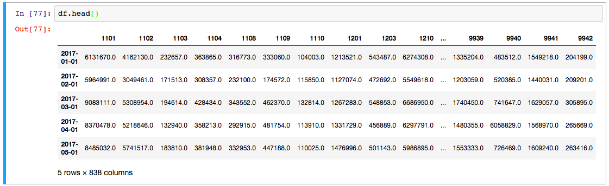
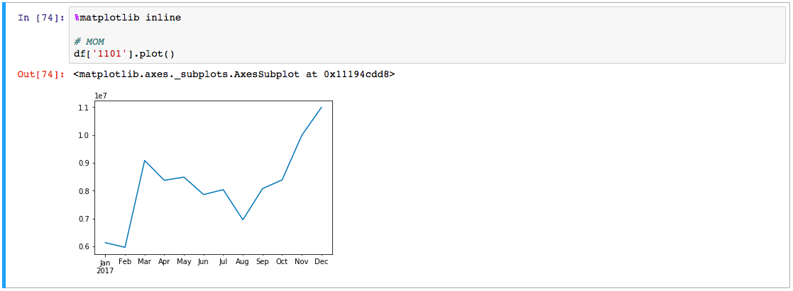
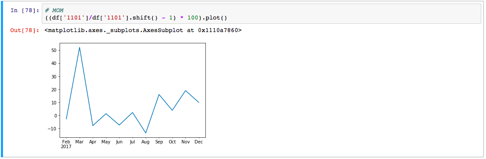

# 月營收這樣看！三種月營收選股法 – Python實作教學

月營收的資訊是跟股價成高度相關，月營收好的股票比較容易漲，反之容易跌，被列為財報狗的付費功能之一。今天教大家如何用python免費使用此功能！這篇是完整的範例，教你如何下載月營收，過濾出可能會飆漲的股票。這個條件我很常用，效果也不錯，分享給大家！


**內容目錄** [隱藏](https://www.finlab.tw/python-簡單用月營收選股！/#) 

[1 下載近12個月的月報](https://www.finlab.tw/python-簡單用月營收選股！/#xia_zai_jin12ge_yue_de_yue_bao)

[2 數據處理 – 合成時間序列](https://www.finlab.tw/python-簡單用月營收選股！/#shu_ju_chu_li_-_he_cheng_shi_jian_xu_lie)

[3 開始選股](https://www.finlab.tw/python-簡單用月營收選股！/#kai_shi_xuan_gu)

[4 平均線法](https://www.finlab.tw/python-簡單用月營收選股！/#ping_jun_xian_fa)

[5 成長法](https://www.finlab.tw/python-簡單用月營收選股！/#cheng_zhang_fa)

[6 創新高法](https://www.finlab.tw/python-簡單用月營收選股！/#chuang_xin_gao_fa)

[7 使用方法](https://www.finlab.tw/python-簡單用月營收選股！/#shi_yong_fang_fa)

### 下載近12個月的月報

之前我們也講過[如何獲取月營收的歷史資訊](https://www.finlab.tw/超簡單用python抓取每月營收/)

請先到該網站把`monthly_report`給copy下來，我們接下來會用到喔！

`monthly_report`這個函式，會下載上市公司月報，並整理成`pandas.DataFrame`，也就是一種存在python中的表格。接下來我們連續呼叫`monthly_report`來把近12個月的資料收集整齊：

```python
import datetime
import pandas as pd
import time

data = {}
n_days = 12
now = datetime.datetime.now()

year = now.year
month = now.month

while len(data) < n_days:
    
    print('parsing', year, month)
    
    # 使用 crawPrice 爬資料
    try:
        data['%d-%d-01'%(year, month)] = monthly_report(year, month)
    except Exception as e:
        print('get 404, please check if the revenues are not revealed')
    
    # 減一個月
    month -= 1
    if month == 0:
        month = 12
        year -= 1

    time.sleep(10)
```


執行的時候，有一行error，因為新的月報還沒有下來的原因，而其它天都是成功的，這樣都算是正常！

以上這段code請大家一定要看的懂喔！我們要的只有 data 這個 dictionary 物件，裡面依照不同的日期，存放著所有股票的月營收。例如，你可以顯示`data['2017-12-01']`，就會顯示以下這張表：


代表 2017 年 12 月的月營收。

### 數據處理 – 合成時間序列

根據不同的日期，有不同的dataFrame，用起來有點麻煩，所以我們再經過一個處理，將所有數據結合，變成時間序列：

數據處理─結合月營收資訊

```python
for k in data.keys():
    data[k].index = data[k]['公司代號']
    
df = pd.DataFrame({k:df['當月營收'] for k, df in data.items()}).transpose()
df.index = pd.to_datetime(df.index)
df = df.sort_index()
```

最後產出的 df 可以囉！df 的結構如下：



這個 df 超級好用，以下示範畫出 1101（台泥） 的月營收曲線圖：



還有他的MOM：



各種變化就讓大家自己去玩囉～這邊還是得著重在選股的功能上！

### 開始選股

首先，大家可以參考最近寫的，[三種月營收進階看法](https://www.finlab.tw/三種月營收進階看法/)，裡面的選股條件，接下來會一一實做：

### 平均線法

平均線法選股

```python
method1 = df.iloc[-3:].mean() > df.iloc[-12:].mean()
method1[method1 == True].index
```

噹啷！就這麼一行，選出來了，會有非常多的標的，還可以再進行過濾。
這邊有一些厲害的 function 提一下：

- iloc[i:j] 選取第i個到第j個數據
- mean() 選處取出來的series的平均

### 成長法

成長法選股

```python
method2 = df.rolling(4, min_periods=2).mean()
method2 = (method2 > method2.shift()).iloc[-5:].sum()
method2[method2 == 5]
```

第一行首先是平滑，做出平均序列，其中`min_periods=2` 代表只要有兩筆數據以上，就計算平均，不然就寫成NaN。
第二、三行是說這條平滑曲線，近五個月都是上升

### 創新高法

創新高法選股

```python
method3 = df.iloc[-1] == df.iloc[-12:].max()
method3[method3 == True].index
```

### 使用方法

可以將各種的條件再做組合，例如用[股價淨值比](https://www.finlab.tw/股價淨值比有這麼神？/)，或是 [ROE](https://www.finlab.tw/EPS跟ROE哪個比較好用？/)，實測都有不錯的效果喔！