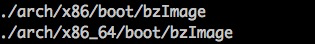
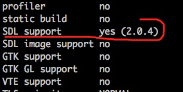
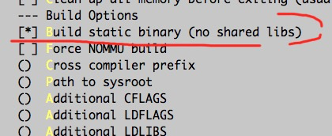
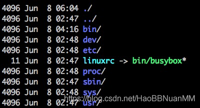
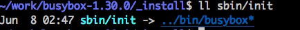
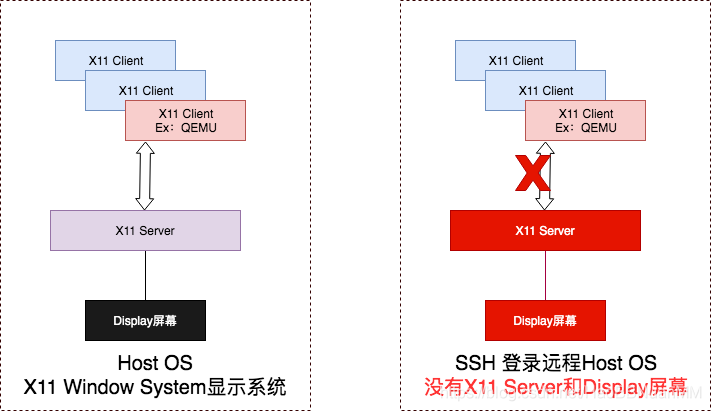
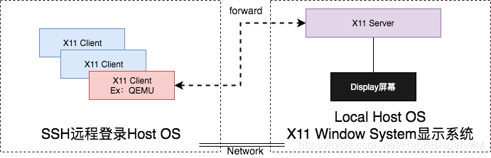
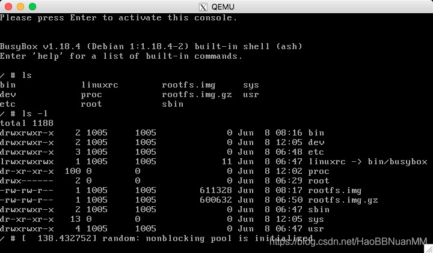

# QEMU运行Linux Kernel环境配置


## 为什么选择QEMU


QEMU（Quick Emulator）是个模拟器（官网链接：https://www.qemu.org），它能够动态模拟特定架构的CPU指令，如X86，ARM，RSIC等。

​    如上图所示，QEMU模拟系统架构称为TARGET，运行 QEMU的系统架称为HOST，QEMU的核心模块是微型代码生成器（TCG），它用来将TARGET系统上的代码动态翻译成HOST系统的代码，QEMU的工作原理就是不断提取TARGET代码并且翻译成HOST代码。整个翻译分为两个部分：第一个部分是将做TARGET代码（TB）转化成TCG中间代码，然后再将中间代码转化成HOST代码。


    Linux Kerenl 涉及到具体硬件driver适配，选择QEMU将Linux 模拟为TARGET上的GUEST OS系统，运行在HOST的开发机（通常是X86 window/MacOS/Ubuntu OS）上，可以避免做硬件driver适配的时间与人力投入，大大提升学习kernel的效率。
## 资源下载

Linux Kernel

- Source Code Archives: https://www.kernel.org/
- master branch github: https://github.com/torvalds/linux
- Documentation: https://www.kernel.org/doc/html/latest/

## QEMU

- Source Code Archives: https://www.qemu.org/download/#source
- mast branch github: https://github.com/qemu/qemu

## Busybox

- Source Code Archives: https://busybox.net/downloads/


## 环境配置
Linux Kernel

- HOST OS开发环境:  Linux version 4.10.0-28-generic (gcc version 5.4.0 20160609 (ubuntu~16.04.4) ) #32~16.04.2

- 下载Linux Kernel linux-3.16.84 https://cdn.kernel.org/pub/linux/kernel/v3.x/linux-3.16.84.tar.xz （选择老版本避免太多的编译依赖问题）

- cd linux-3.16.84

- make menuconfig （默认配置exit 生成.config）

- make -j24

- 编译成功后可以在arch目录下看到压缩后的Linux Kernel Image： bzImage

    

    




## QEMU编译

```shell
Host OS开发环境：同上
下载QEMU 最新master代码：git clone https://github.com/qemu/qemu.git
编译
cd qemu
make build
cd build
../configure
注意：一定要确认configure的结果中"SDL support“ 为yes，否则QEMU运行无法正常显示Linux终端窗口（参考”SSH远程登录Linux Server没有GUI界面的问题“章节）
make -j24
译成功后生成QEMU执行程序：qemu/build/x86_64-softmmu/qemu-system-x86_64
```





## Busybox编译与rootfs

```shell
Host OS开发环境：同上
下载Busybox 代码：https://busybox.net/downloads/busybox-1.30.0.tar.bz2  (下载哪个版本取决与开发环境的编译依赖）

编译Busybox
cd busybox-1.30.0
make menuconfig （记得打开静态编译busybox选项，否则后续busybox作为QEMU虚拟机中的linux的init进程启动会由于找不到链接库出现kernel panic）
```



```shell
make -j24
编译成功后可以在当前目录下看到生成了busybox
make install 生成_install目录以及必须的rootfs 目录结构

创建rootfs
cd busybox-1.30.0/_install
mkdir proc sys dev etc etc/init.d (创建Linux系统运行时的必须目录，/proc用于挂载proc系统，/sys用于挂载sys系统，dev用于mdev创建设备节点，etc/init.d为放置busybox启动脚本的目录)
```





- vim etc/init.d/rcS
- chmod +x etc/init.d/rcS (确保rcS有执行权限）

```shell
#将proc文件系统挂载到/proc目录，因为很多应用程序会使用到/proc中的信息，不挂载会导致各种异常
mount -t proc none /proc
#将sys文件系统挂载到/sys目录，因为很多应用程序会使用到/sys中的信息，不挂载会导致各种异常
mount -t sysfs none /sys
#mdev是busybox自带的一个udev，用于系统启动和热插拔或动态加载驱动程序时，自动产生设备节点，这句话如果不加上则需要手动mknod来挂载设备节点
/sbin/mdev -s
```


Linux第一个启动的进程是init（通过busybox生成的rootfs中sbin/init其实是指向busybox的连接，所以第一个启动的就是busybox），通过该脚本指定init使用的启动脚本为/etc/init.d/rcS，该路径被声明在 busybox-1.30.0/init/init.c当中





- 创建rootfs镜像img
    - find . | cpio -o --format=newc > rootfs.img
    - gzip -c rootfs.img > rootfs.img.gz
    - 

## QEMU运行Linux


```shell
cd qemu/build/x86_64-softmmu/

./qemu-system-x86_64 -kernel <path to linux kernel image>/bzImage -initrd <path to rootfs img>/rootfs.img.gz -append "root=/dev/ram rdinit=sbin/init noapic"

```


```shell
镜像文件
vmlinux                     编译出来的最原始的内核文件，未压缩
zImage                      由mlinux经过gzip压缩后的文件
bzImage big zImage。 zImage解压缩内核到低端内存（640K），bzImage解压缩内核到高端内存（1M以上）。如果内核比较小，采用zImage或者bzImage都行，如果比较大应该用bzImage
uImage                      U-boot专用的映像文件，它是在zImage之前加上一个长度为0x40的tag
vmlinuz                     是zImage/bzImage文件的拷贝或者是指向zImage/bzImage的链接
initrd                      initial ramdisk。linux系统引导过程当中挂载的一个临时根文件系统，被挂载于/dev/ram，它用于支持Linux第二阶段的引导过程。它是使用gzip进行压缩的cpio文件
 
QEMU
qemu-system-i386     QEMU 模拟i386指令CPU的模拟器
qemu-system-x86_64   QEMU 模拟x86_64指令CPU的模拟器
qemu -kernel   参数，使用bzimage作为linux内核
qemu -initrd   参数，指定initrd镜像
qemu -append   参数，附加内核启动参数
 
内核启动参数
root=       使用哪个设备作为根文件系统。
rdinit=     内核加载完毕之后，即运行initrd中指定路径的程序，来创建linux的第一个进程
init=       内核加载完毕之后，即运行initramfs中指定路径的程序，来创建linux的第一个进程
noapic      apic，高级可编程中断控制器。这里用于防止发生MP-BIOS BUG 8254 timer not connected

```

- 如果HOST 系统是通过ssh 远程登录的，那么大概率会遇到QEMU卡死在下面的提示信息，看不到Linux启动的终端GUI界面

**VNC server running on 127.0.0.1:5900**


## 解决SSH远程登录Linux Server没有GUI界面的问题





 如上图所示，完整的Linux Host OS中有完整的X11 Window System显示系统，作为X11 Client的应用程序（比如 QEMU）可以正常连接到X11 Server 显示它的终端GUI 窗口，但是SSH 远程登录某个Linux Host OS后是没有X11 Server支持的，所以会出现QEMU无法显示终端GUI界面的问题





如上图所示，通过将SSH远程登录的Host OS上对X11的调用Forward到支持X11 显示系统的本地OS，就可以解决该问题

以远程Host OS为ubuntu，本地OS为MacOS为例，做如下配置：

```shell
Server = ”SSH远程登录Host OS为ubuntu系统“
Client = ”本地OS为MacOS“
Client与Server端修改/etc/ssh/ssh_config
    X11Forwarding    yes
    ForwardAgent    yes
Client
    xhost +  # 允许任何机器连接
    ssh -X 用户名@ip -p 22 # 连接远程服务器
Server
    export $(cat /proc/1/environ |tr '\0' '\n' | xargs)  （如果是docker容器需要设置和主进程相同的环境变量）
    运行xclock 测试程序确认看到GUI界面证明X11的forward已经成功
```


如下图所示，再次运行

./qemu-system-x86_64 -kernel <path to linux kernel image>/bzImage -initrd <path to rootfs img>/rootfs.img.gz -append "root=/dev/ram rdinit=sbin/init noapic"

可以看到QEMU的GUI正常显示，如果Linux 启动一切顺利就可以进入到busybox的shell环境，通过在/目录执行ls -l 命令可以看到rootfs就是我们在<host os>/busybox-1.30.0/_install 目录中手工创建的rootfs目录结构




