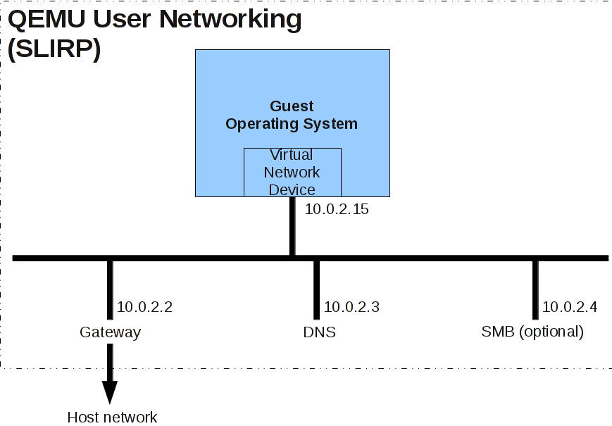

# ARM64 Linux kernel + busybox rootFS via NFS over QEMU with GDB


由於條件所限，一般選擇軟件做前期模擬，這裡做一些ARM 64 Linux kernel模擬運行環境搭建工作的總結，記錄以便後用。 

本文只涉及kernel + busybox rootFS via NFS over QEMU，以及gdb trace kernel。

## 主機環境選擇


這裡所說主機指模擬軟件運行在上面的主機，本文只針對在X64 Linux主機上搭建ARM64 Linux kernel運行環境。 

主機選擇除了考慮性能高的X64，同時也要考慮編譯調試ARM64 Linux kernel的工具鏈、模擬軟件如QEMU等等需求。 

X64 Ubuntu 16.04已經可以通過apt-get直接下載aarch64交叉工具鏈和qemu-system-aarch64: 

```sh
# aarch64-linux-gnu-gcc -v 
Using built-in specs. 
COLLECT_GCC=aarch64-linux-gnu-gcc 
COLLECT_LTO_WRAPPER=/usr/lib/gcc-cross/aarch64-linux-gnu/5/lto-wrapper 
Target: aarch64-linux-gnu 
Configured with: ../src/configure -v –with-pkgversion=』Ubuntu/Linaro 5.4.0-6ubuntu1~16.04.4』 –with-bugurl=file:///usr/share/doc/gcc-5/README.Bugs –enable-languages=c,ada,c++,java,go,d,fortran,objc,obj-c++ –prefix=/usr –program-suffix=-5 –enable-shared –enable-linker-build-id –libexecdir=/usr/lib –without-included-gettext –enable-threads=posix –libdir=/usr/lib –enable-nls –with-sysroot=/ –enable-clocale=gnu –enable-libstdcxx-debug –enable-libstdcxx-time=yes –with-default-libstdcxx-abi=new –enable-gnu-unique-object –disable-libquadmath –enable-plugin –with-system-zlib –disable-browser-plugin –enable-java-awt=gtk –enable-gtk-cairo –with-java-home=/usr/lib/jvm/java-1.5.0-gcj-5-arm64-cross/jre –enable-java-home –with-jvm-root-dir=/usr/lib/jvm/java-1.5.0-gcj-5-arm64-cross –with-jvm-jar-dir=/usr/lib/jvm-exports/java-1.5.0-gcj-5-arm64-cross –with-arch-directory=aarch64 –with-ecj-jar=/usr/share/java/eclipse-ecj.jar –disable-libgcj –enable-multiarch –enable-fix-cortex-a53-843419 –disable-werror –enable-checking=release –build=x86_64-linux-gnu –host=x86_64-linux-gnu –target=aarch64-linux-gnu –program-prefix=aarch64-linux-gnu- –includedir=/usr/aarch64-linux-gnu/include 
Thread model: posix 
gcc version 5.4.0 20160609 (Ubuntu/Linaro 5.4.0-6ubuntu1~16.04.4) 
```

```sh
#qemu-system-aarch64 -machine virt -cpu help 
Available CPUs: 
arm1026 
arm1136 
arm1136-r2 
arm1176 
arm11mpcore 
arm926 
arm946 
cortex-a15 
cortex-a53 
cortex-a57 
cortex-a8 
cortex-a9 
cortex-m3 
cortex-m4 
cortex-r5 
pxa250 
pxa255 
pxa260 
pxa261 
pxa262 
pxa270-a0 
pxa270-a1 
pxa270 
pxa270-b0 
pxa270-b1 
pxa270-c0 
pxa270-c5 
sa1100 
sa1110 
ti925t 
# 
這樣就非常方便了。
```

## Toolchains

GNU Tool Chain是Linux內核常見的（交叉）工具鏈， 

請注意Linaro提供Linux下工具鏈（https://releases.linaro.org/components/toolchain/binaries/）採用動態連接而非靜態連接，需要一些更高版本的支撐軟件，可能會影響CentOS release 6.8系統。


本文只針對CentOS release 6.8 (Final) X64環境，採用廠家提供的靜態連接方式的交叉編譯器，不需要其他版本支撐軟件，不涉及其他選擇。 

root用戶bash下設置工具鏈環境： 

```sh
# export ARCH=arm64 
# export CROSS_COMPILE=aarch64-XXXX-linux-gnu- 
# export PATH=/opt/XXXX/bin:$PATH 
```
（一般不需要設置LD_LIBRARY_PATH） 
編譯busybox、QEMU及內核時需要一些支撐軟件，可以通過yum直接下載安裝。


##Busybox

下載busybox:

```sh
# wget -c https://busybox.net/downloads/busybox-1.25.1.tar.bz2
```

編譯busybox：

進入解壓後的busybox-1.25.1目錄
```sh
# make menuconfig 
```

選擇Busybox Settings —>Build Options —>[*] Build BusyBox as a static binary (no shared libs) 
保存配置後 

```sh
# make;make install
```

## 構造rootFS

```sh
拷貝busybox-1.25.1目錄下生成的_install目錄到/opt目錄 
# cp -a _install /opt 
進入/opt/_install目錄手工創建rootFS相關文件與目錄 
# cd /opt/_install 
# mkdir ­pv etc/init.d dev 
# cat > etc/init.d/rcS 
mkdir -p /sys /proc /tmp 
/bin/mount -a 
mkdir -p /dev/pts 
mount -t devpts devpts /dev/pts 
echo /sbin/mdev > /proc/sys/kernel/hotplug 
mdev -s 
^C 
# chmod a+x etc/init.d/rcS 
rcS必須可執行 
# 
# cat > etc/fstab 
proc /proc proc defaults 0 0 
tmpfs /tmp tmpfs defaults 0 0 
sysfs /sys sysfs defaults 0 0 
tmpfs /dev tmpfs defaults 0 0 
^C 
# cat > etc/inittab 
::sysinit:/etc/init.d/rcS 
::respawn:-/bin/sh 
::askfirst:-/bin/sh 
::ctrlaltdel:/bin/umount -a -r 
^C 
# mknod console c 5 1 
# mknod null c 1 3 
# 
到這一步基於busybox簡單的rootFS就創建完成。
```

## 通過NFS導出busybox rootFS

```sh
# cat > /etc/exports 
/opt/_install *(rw,sync,no_root_squash,insecure,no_subtree_check) 
^C 
# /etc/init.d/nfs reload 
# exportfs -favr 
# showmount -e localhost 
# mount -t nfs -nolock localhost:/opt/_install/ /mnt 
# umount /mnt 
NFS驗證通過。
```

## Linux Kernel

下載內核

```sh
# wget -c https://cdn.kernel.org/pub/linux/kernel/v4.x/linux-4.9.tar.xz
```
下載4.9內核。


## 編譯內核

```sh
進入解壓縮後的linux-4.9目錄 
# make defconfig 
# make menuconfig 
選擇Kernel Features —>Page size (4KB) 
Virtual address space size (48-bit) 
保存配置，然後編譯生成內核Image 
# make -j`getconf _NPROCESSORS_ONLN` 
內核Image在： 
# ls arch/arm64/boot/Image 
arch/arm64/boot/Image 
# 
到這裡kernel Image和busybox rootFS都已經制好。
```

## QEMU

###下載QEMU

```sh
wget -c http://wiki.qemu-project.org/download/qemu-2.8.0.tar.bz2
```

## 編譯QEMU

```sh
進入解壓縮後的qemu-2.8.0目錄 
# cd qemu-2.8.0 
# mkdir -p bin/debug/native 
# cd bin/debug/native 
# ../../../configure –enable-debug 
# make 
# cd ../../.. 
# bin/debug/native/aarch64-softmmu/qemu-system-aarch64 -machine help 
Supported machines are: 
akita Sharp SL-C1000 (Akita) PDA (PXA270) 
ast2500-evb Aspeed AST2500 EVB (ARM1176) 
borzoi Sharp SL-C3100 (Borzoi) PDA (PXA270) 
canon-a1100 Canon PowerShot A1100 IS 
cheetah Palm Tungsten|E aka. Cheetah PDA (OMAP310) 
collie Sharp SL-5500 (Collie) PDA (SA-1110) 
connex Gumstix Connex (PXA255) 
cubieboard cubietech cubieboard 
highbank Calxeda Highbank (ECX-1000) 
imx25-pdk ARM i.MX25 PDK board (ARM926) 
integratorcp ARM Integrator/CP (ARM926EJ-S) 
kzm ARM KZM Emulation Baseboard (ARM1136) 
lm3s6965evb Stellaris LM3S6965EVB 
lm3s811evb Stellaris LM3S811EVB 
mainstone Mainstone II (PXA27x) 
midway Calxeda Midway (ECX-2000) 
musicpal Marvell 88w8618 / MusicPal (ARM926EJ-S) 
n800 Nokia N800 tablet aka. RX-34 (OMAP2420) 
n810 Nokia N810 tablet aka. RX-44 (OMAP2420) 
netduino2 Netduino 2 Machine 
none empty machine 
nuri Samsung NURI board (Exynos4210) 
palmetto-bmc OpenPOWER Palmetto BMC (ARM926EJ-S) 
raspi2 Raspberry Pi 2 
realview-eb ARM RealView Emulation Baseboard (ARM926EJ-S) 
realview-eb-mpcore ARM RealView Emulation Baseboard (ARM11MPCore) 
realview-pb-a8 ARM RealView Platform Baseboard for Cortex-A8 
realview-pbx-a9 ARM RealView Platform Baseboard Explore for Cortex-A9 
sabrelite Freescale i.MX6 Quad SABRE Lite Board (Cortex A9) 
smdkc210 Samsung SMDKC210 board (Exynos4210) 
spitz Sharp SL-C3000 (Spitz) PDA (PXA270) 
sx1 Siemens SX1 (OMAP310) V2 
sx1-v1 Siemens SX1 (OMAP310) V1 
terrier Sharp SL-C3200 (Terrier) PDA (PXA270) 
tosa Sharp SL-6000 (Tosa) PDA (PXA255) 
verdex Gumstix Verdex (PXA270) 
versatileab ARM Versatile/AB (ARM926EJ-S) 
versatilepb ARM Versatile/PB (ARM926EJ-S) 
vexpress-a15 ARM Versatile Express for Cortex-A15 
vexpress-a9 ARM Versatile Express for Cortex-A9 
virt-2.6 QEMU 2.6 ARM Virtual Machine 
virt-2.7 QEMU 2.7 ARM Virtual Machine 
virt QEMU 2.8 ARM Virtual Machine (alias of virt-2.8) 
virt-2.8 QEMU 2.8 ARM Virtual Machine 
xilinx-zynq-a9 Xilinx Zynq Platform Baseboard for Cortex-A9 
xlnx-ep108 Xilinx ZynqMP EP108 board 
xlnx-zcu102 Xilinx ZynqMP ZCU102 board 
z2 Zipit Z2 (PXA27x) 
# 
至此所有工具完成。
```

## 運行kernel image

QEMU默認支持user mode network backend，這個模式下不需要tune支持，比較簡單： 





默認主機網關地址10.0.2.2，對應NFS server網址 

```sh
# cd linux-4.9 
```
執行如下命令：

```sh
# ../qemu-2.8.0/bin/debug/native/aarch64-softmmu/qemu-system-aarch64 -machine virt -cpu cortex-a57 -smp 8 -nographic -m 4096 -kernel arch/arm64/boot/Image --append "earlyprintk console=ttyAMA0 root=/dev/nfs nfsroot=10.0.2.2:/opt/_install rw ip=dhcp init=/linuxrc"
```


```sh
可以看到啟動過程如下: 
[ 0.000000] Booting Linux on physical CPU 0x0 
[ 0.000000] Linux version 4.9.0 (root@centos) (gcc version 5.4.0 20160418 (prerelease)) #8 SMP PREEMPT Sat Jan 7 22:51:36 CST 2017 
[ 0.000000] Boot CPU: AArch64 Processor [411fd070] 
[ 0.000000] efi: Getting EFI parameters from FDT: 
[ 0.000000] efi: UEFI not found. 
[ 0.000000] cma: Reserved 16 MiB at 0x00000000ff000000 
[ 0.000000] psci: probing for conduit method from DT. 
[ 0.000000] psci: PSCIv0.2 detected in firmware. 
[ 0.000000] psci: Using standard PSCI v0.2 function IDs 
[ 0.000000] psci: Trusted OS migration not required 
[ 0.000000] percpu: Embedded 21 pages/cpu @ffff8000fff41000 s48000 r8192 d29824 u86016 
[ 0.000000] Detected PIPT I-cache on CPU0 
[ 0.000000] CPU features: enabling workaround for ARM erratum 832075 
[ 0.000000] CPU features: enabling workaround for ARM erratum 834220 
[ 0.000000] Built 1 zonelists in Zone order, mobility grouping on. Total pages: 1032192 
[ 0.000000] Kernel command line: earlyprintk console=ttyAMA0 root=/dev/nfs nfsroot=10.0.2.2:/opt/_install rw ip=dhcp init=/linuxrc 
[ 0.000000] log_buf_len individual max cpu contribution: 4096 bytes 
[ 0.000000] log_buf_len total cpu_extra contributions: 28672 bytes 
[ 0.000000] log_buf_len min size: 16384 bytes 
[ 0.000000] log_buf_len: 65536 bytes 
[ 0.000000] early log buf free: 14536(88%) 
[ 0.000000] PID hash table entries: 4096 (order: 3, 32768 bytes) 
[ 0.000000] Dentry cache hash table entries: 524288 (order: 10, 4194304 bytes) 
[ 0.000000] Inode-cache hash table entries: 262144 (order: 9, 2097152 bytes) 
[ 0.000000] software IO TLB [mem 0xfafff000-0xfefff000] (64MB) mapped at [ffff8000bafff000-ffff8000beffefff] 
[ 0.000000] Memory: 4025264K/4194304K available (8252K kernel code, 858K rwdata, 3640K rodata, 960K init, 281K bss, 152656K reserved, 16384K cma-reserved) 
[ 0.000000] Virtual kernel memory layout: 
[ 0.000000] modules : 0xffff000000000000 – 0xffff000008000000 ( 128 MB) 
[ 0.000000] vmalloc : 0xffff000008000000 – 0xffff7dffbfff0000 (129022 GB) 
[ 0.000000] .text : 0xffff000008080000 – 0xffff000008890000 ( 8256 KB) 
[ 0.000000] .rodata : 0xffff000008890000 – 0xffff000008c30000 ( 3712 KB) 
[ 0.000000] .init : 0xffff000008c30000 – 0xffff000008d20000 ( 960 KB) 
[ 0.000000] .data : 0xffff000008d20000 – 0xffff000008df6a00 ( 859 KB) 
[ 0.000000] .bss : 0xffff000008df6a00 – 0xffff000008e3cf40 ( 282 KB) 
[ 0.000000] fixed : 0xffff7dfffe7fd000 – 0xffff7dfffec00000 ( 4108 KB) 
[ 0.000000] PCI I/O : 0xffff7dfffee00000 – 0xffff7dffffe00000 ( 16 MB) 
[ 0.000000] vmemmap : 0xffff7e0000000000 – 0xffff800000000000 ( 2048 GB maximum) 
[ 0.000000] 0xffff7e0000000000 – 0xffff7e0004000000 ( 64 MB actual) 
[ 0.000000] memory : 0xffff800000000000 – 0xffff800100000000 ( 4096 MB) 
[ 0.000000] SLUB: HWalign=64, Order=0-3, MinObjects=0, CPUs=8, Nodes=1 
[ 0.000000] Preemptible hierarchical RCU implementation. 
[ 0.000000] Build-time adjustment of leaf fanout to 64. 
[ 0.000000] RCU restricting CPUs from NR_CPUS=64 to nr_cpu_ids=8. 
[ 0.000000] RCU: Adjusting geometry for rcu_fanout_leaf=64, nr_cpu_ids=8 
[ 0.000000] NR_IRQS:64 nr_irqs:64 0 
[ 0.000000] GICv2m: range[mem 0x08020000-0x08020fff], SPI[80:143] 
[ 0.000000] arm_arch_timer: WARNING: Invalid trigger for IRQ3, assuming level low 
[ 0.000000] arm_arch_timer: WARNING: Please fix your firmware 
[ 0.000000] arm_arch_timer: Architected cp15 timer(s) running at 62.50MHz (virt). 
[ 0.000000] clocksource: arch_sys_counter: mask: 0xffffffffffffff max_cycles: 0x1cd42e208c, max_idle_ns: 881590405314 ns 
[ 0.000678] sched_clock: 56 bits at 62MHz, resolution 16ns, wraps every 4398046511096ns 
[ 0.034018] Console: colour dummy device 80×25 
[ 0.038076] Calibrating delay loop (skipped), value calculated using timer frequency.. 125.00 BogoMIPS (lpj=250000) 
[ 0.039117] pid_max: default: 32768 minimum: 301 
[ 0.043617] Security Framework initialized 
[ 0.045667] Mount-cache hash table entries: 8192 (order: 4, 65536 bytes) 
[ 0.046040] Mountpoint-cache hash table entries: 8192 (order: 4, 65536 bytes) 
[ 0.167241] ASID allocator initialised with 65536 entries 
[ 0.238595] EFI services will not be available. 
[ 0.288719] Detected PIPT I-cache on CPU1 
[ 0.291575] CPU1: Booted secondary processor [411fd070] 
[ 0.338385] Detected PIPT I-cache on CPU2 
[ 0.338982] CPU2: Booted secondary processor [411fd070] 
[ 0.376430] Detected PIPT I-cache on CPU3 
[ 0.377742] CPU3: Booted secondary processor [411fd070] 
[ 0.414834] Detected PIPT I-cache on CPU4 
[ 0.415899] CPU4: Booted secondary processor [411fd070] 
[ 0.453823] Detected PIPT I-cache on CPU5 
[ 0.454742] CPU5: Booted secondary processor [411fd070] 
[ 0.493201] Detected PIPT I-cache on CPU6 
[ 0.493988] CPU6: Booted secondary processor [411fd070] 
[ 0.533697] Detected PIPT I-cache on CPU7 
[ 0.534533] CPU7: Booted secondary processor [411fd070] 
[ 0.535949] Brought up 8 CPUs 
[ 0.536476] SMP: Total of 8 processors activated. 
[ 0.537932] CPU features: detected feature: 32-bit EL0 Support 
[ 0.556548] CPU: All CPU(s) started at EL1 
[ 0.561556] alternatives: patching kernel code 
[ 0.681340] devtmpfs: initialized 
[ 0.756379] DMI not present or invalid. 
[ 0.770193] clocksource: jiffies: mask: 0xffffffff max_cycles: 0xffffffff, max_idle_ns: 7645041785100000 ns 
[ 0.824601] pinctrl core: initialized pinctrl subsystem 
[ 0.998141] NET: Registered protocol family 16 
[ 1.123314] cpuidle: using governor menu 
[ 1.132119] vdso: 2 pages (1 code @ ffff000008897000, 1 data @ ffff000008d24000) 
[ 1.135393] hw-breakpoint: found 6 breakpoint and 4 watchpoint registers. 
[ 1.182815] DMA: preallocated 256 KiB pool for atomic allocations 
[ 1.207057] Serial: AMBA PL011 UART driver 
[ 1.517044] 9000000.pl011: ttyAMA0 at MMIO 0x9000000 (irq = 39, base_baud = 0) is a PL011 rev1 
[ 1.559393] console [ttyAMA0] enabled 
[ 1.599502] irq: type mismatch, failed to map hwirq-27 for /intc! 
[ 2.287929] HugeTLB registered 2 MB page size, pre-allocated 0 pages 
[ 2.474978] ACPI: Interpreter disabled. 
[ 2.656955] vgaarb: loaded 
[ 2.704310] SCSI subsystem initialized 
[ 2.834458] usbcore: registered new interface driver usbfs 
[ 2.855331] usbcore: registered new interface driver hub 
[ 2.874540] usbcore: registered new device driver usb 
[ 2.941016] pps_core: LinuxPPS API ver. 1 registered 
[ 2.941396] pps_core: Software ver. 5.3.6 – Copyright 2005-2007 Rodolfo Giometti giometti@linux.it 
[ 2.950648] PTP clock support registered 
[ 2.969244] dmi: Firmware registration failed. 
[ 2.995711] Advanced Linux Sound Architecture Driver Initialized. 
[ 3.125048] clocksource: Switched to clocksource arch_sys_counter 
[ 3.163271] VFS: Disk quotas dquot_6.6.0 
[ 3.165011] VFS: Dquot-cache hash table entries: 512 (order 0, 4096 bytes) 
[ 3.184183] pnp: PnP ACPI: disabled 
[ 3.696267] NET: Registered protocol family 2 
[ 3.766098] TCP established hash table entries: 32768 (order: 6, 262144 bytes) 
[ 3.768684] TCP bind hash table entries: 32768 (order: 7, 524288 bytes) 
[ 3.770238] TCP: Hash tables configured (established 32768 bind 32768) 
[ 3.775311] UDP hash table entries: 2048 (order: 4, 65536 bytes) 
[ 3.776241] UDP-Lite hash table entries: 2048 (order: 4, 65536 bytes) 
[ 3.784891] NET: Registered protocol family 1 
[ 3.810070] RPC: Registered named UNIX socket transport module. 
[ 3.810558] RPC: Registered udp transport module. 
[ 3.811236] RPC: Registered tcp transport module. 
[ 3.811502] RPC: Registered tcp NFSv4.1 backchannel transport module. 
[ 3.824884] kvm [1]: HYP mode not available 
[ 3.936655] futex hash table entries: 2048 (order: 6, 262144 bytes) 
[ 3.957870] audit: initializing netlink subsys (disabled) 
[ 3.966456] audit: type=2000 audit(3.340:1): initialized 
[ 4.001863] workingset: timestamp_bits=46 max_order=20 bucket_order=0 
[ 4.411531] squashfs: version 4.0 (2009/01/31) Phillip Lougher 
[ 4.460713] NFS: Registering the id_resolver key type 
[ 4.468871] Key type id_resolver registered 
[ 4.469223] Key type id_legacy registered 
[ 4.470068] nfs4filelayout_init: NFSv4 File Layout Driver Registering… 
[ 4.482138] 9p: Installing v9fs 9p2000 file system support 
[ 4.578485] Block layer SCSI generic (bsg) driver version 0.4 loaded (major 247) 
[ 4.581544] io scheduler noop registered 
[ 4.585401] io scheduler cfq registered (default) 
[ 4.649728] libphy: mdio_driver_register: phy-bcm-ns2-pci 
[ 4.764814] pl061_gpio 9030000.pl061: PL061 GPIO chip @0x0000000009030000 registered 
[ 4.804563] OF: PCI: host bridge /pcie@10000000 ranges: 
[ 4.808770] OF: PCI: IO 0x3eff0000..0x3effffff -> 0x00000000 
[ 4.810472] OF: PCI: MEM 0x10000000..0x3efeffff -> 0x10000000 
[ 4.813256] OF: PCI: MEM 0x8000000000..0xffffffffff -> 0x8000000000 
[ 4.833115] pci-host-generic 3f000000.pcie: ECAM at [mem 0x3f000000-0x3fffffff] for [bus 00-0f] 
[ 4.844906] pci-host-generic 3f000000.pcie: PCI host bridge to bus 0000:00 
[ 4.847955] pci_bus 0000:00: root bus resource [bus 00-0f] 
[ 4.848534] pci_bus 0000:00: root bus resource [io 0x0000-0xffff] 
[ 4.848844] pci_bus 0000:00: root bus resource [mem 0x10000000-0x3efeffff] 
[ 4.849196] pci_bus 0000:00: root bus resource [mem 0x8000000000-0xffffffffff] 
[ 4.917408] pci 0000:00:01.0: BAR 6: assigned [mem 0x10000000-0x1003ffff pref] 
[ 4.921860] pci 0000:00:01.0: BAR 4: assigned [mem 0x8000000000-0x8000003fff 64bit pref] 
[ 4.925151] pci 0000:00:01.0: BAR 1: assigned [mem 0x10040000-0x10040fff] [10/1925] 
[ 4.925585] pci 0000:00:01.0: BAR 0: assigned [io 0x1000-0x101f] 
[ 5.170141] virtio-pci 0000:00:01.0: enabling device (0000 -> 0003) 
[ 5.196391] xenfs: not registering filesystem on non-xen platform 
[ 5.456259] Serial: 8250/16550 driver, 4 ports, IRQ sharing disabled 
[ 5.524970] SuperH (H)SCI(F) driver initialized 
[ 5.549521] msm_serial: driver initialized 
[ 5.582247] Unable to detect cache hierarchy from DT for CPU 0 
[ 5.822390] loop: module loaded 
[ 5.849628] hisi_sas: driver version v1.6 
[ 5.994220] libphy: Fixed MDIO Bus: probed 
[ 6.005446] tun: Universal TUN/TAP device driver, 1.6 
[ 6.005732] tun: (C) 1999-2004 Max Krasnyansky maxk@qualcomm.com 
[ 6.165313] e1000e: Intel(R) PRO/1000 Network Driver – 3.2.6-k 
[ 6.165668] e1000e: Copyright(c) 1999 – 2015 Intel Corporation. 
[ 6.169296] igb: Intel(R) Gigabit Ethernet Network Driver – version 5.4.0-k 
[ 6.169655] igb: Copyright (c) 2007-2014 Intel Corporation. 
[ 6.174044] igbvf: Intel(R) Gigabit Virtual Function Network Driver – version 2.4.0-k 
[ 6.174410] igbvf: Copyright (c) 2009 – 2012 Intel Corporation. 
[ 6.181361] sky2: driver version 1.30 
[ 6.210320] VFIO – User Level meta-driver version: 0.3 
[ 6.272590] hrtimer: interrupt took 11715344 ns 
[ 6.281417] ehci_hcd: USB 2.0 『Enhanced' Host Controller (EHCI) Driver 
[ 6.281932] ehci-pci: EHCI PCI platform driver 
[ 6.286553] ehci-platform: EHCI generic platform driver 
[ 6.293810] ehci-exynos: EHCI EXYNOS driver 
[ 6.298322] ehci-msm: Qualcomm On-Chip EHCI Host Controller 
[ 6.302265] ohci_hcd: USB 1.1 『Open' Host Controller (OHCI) Driver 
[ 6.305831] ohci-pci: OHCI PCI platform driver 
[ 6.313902] ohci-platform: OHCI generic platform driver 
[ 6.317824] ohci-exynos: OHCI EXYNOS driver 
[ 6.345951] usbcore: registered new interface driver usb-storage 
[ 6.393625] mousedev: PS/2 mouse device common for all mice 
[ 6.463938] rtc-pl031 9010000.pl031: rtc core: registered pl031 as rtc0 
[ 6.492454] i2c /dev entries driver 
[ 6.620866] sdhci: Secure Digital Host Controller Interface driver 
[ 6.621177] sdhci: Copyright(c) Pierre Ossman 
[ 6.638203] Synopsys Designware Multimedia Card Interface Driver 
[ 6.661831] sdhci-pltfm: SDHCI platform and OF driver helper 
[ 6.717911] ledtrig-cpu: registered to indicate activity on CPUs 
[ 6.762485] usbcore: registered new interface driver usbhid 
[ 6.765729] usbhid: USB HID core driver 
[ 6.854093] NET: Registered protocol family 17 
[ 6.876647] 9pnet: Installing 9P2000 support 
[ 6.880306] Key type dns_resolver registered 
[ 6.903533] registered taskstats version 1 
[ 6.964102] input: gpio-keys as /devices/platform/gpio-keys/input/input0 
[ 6.985502] rtc-pl031 9010000.pl031: setting system clock to 2017-01-08 07:57:06 UTC (1483862226) 
[ 7.071675] Sending DHCP requests ., OK 
[ 7.128243] IP-Config: Got DHCP answer from 10.0.2.2, my address is 10.0.2.15 
[ 7.128868] IP-Config: Complete: 
[ 7.129695] device=eth0, hwaddr=52:54:00:12:34:56, ipaddr=10.0.2.15, mask=255.255.255.0, gw=10.0.2.2 
[ 7.130136] host=10.0.2.15, domain=, nis-domain=(none) 
[ 7.130420] bootserver=10.0.2.2, rootserver=10.0.2.2, rootpath= nameserver0=10.0.2.3 
[ 7.152438] ALSA device list: 
[ 7.152774] No soundcards found. 
[ 7.174360] uart-pl011 9000000.pl011: no DMA platform data 
[ 7.349670] VFS: Mounted root (nfs filesystem) on device 0:14. 
[ 7.360599] devtmpfs: mounted 
[ 7.580714] Freeing unused kernel memory: 960K (ffff800000c30000 – ffff800000d20000) 
[ 8.279928] random: fast init done

Please press Enter to activate this console. 
```


```sh
/ # uname -a 
Linux 10.0.2.15 4.9.0 #8 SMP PREEMPT Sat Jan 7 22:51:36 CST 2017 aarch64 GNU/Linux 
/ # hostname 
10.0.2.15 
/ # cd root 
/root # ls 
a boot.log config hello 
/root # ./hello 
Hello, ARM! 
/root # mount 
10.0.2.2:/opt/_install on / type nfs (rw,relatime,vers=2,rsize=4096,wsize=4096,namlen=255,hard,nolock,proto=udp,timeo=11,retrans=3,sec=sys,mountaddr=10.0.2.2,mountvers=1,mountproto=udp,local_lock=all,addr=10.0.2.2) 
devtmpfs on /dev type devtmpfs (rw,relatime,size=2012632k,nr_inodes=503158,mode=755) 
proc on /proc type proc (rw,relatime) 
tmpfs on /tmp type tmpfs (rw,relatime) 
sysfs on /sys type sysfs (rw,relatime) 
devpts on /dev/pts type devpts (rw,relatime,mode=600,ptmxmode=000) 
/root # poweroff 
The system is going down NOW! 
Sent SIGTERM to all processes 
Sent SIGKILL to all processes 
Requesting system poweroff 
[ 1273.271757] reboot: Power down 
回到x64 Linux主機 
#
```

##GDB調試

執行如下命令就可以通過GDB調試kernel

```sh
# ../qemu-2.8.0/bin/debug/native/aarch64-softmmu/qemu-system-aarch64 -machine virt -cpu cortex-a57 -smp 8 -nographic -m 4096 -kernel arch/arm64/boot/Image --append "earlyprintk console=ttyAMA0 root=/dev/nfs nfsroot=10.0.2.2:/opt/_install rw ip=dhcp init=/linuxrc" -gdb tcp::1235 -S
```

停下來等待gdb連接 
在另外終端執行如下命令： 

```sh
# cd linux-4.9 
# aarch64-linux-gnu-gdb vmlinux 
GNU gdb 7.8.50.20150108-cvs 
Copyright (C) 2015 Free Software Foundation, Inc. 
License GPLv3+: GNU GPL version 3 or later http://gnu.org/licenses/gpl.html 
This is free software: you are free to change and redistribute it. 
There is NO WARRANTY, to the extent permitted by law. Type 「show copying」 
and 「show warranty」 for details. 
This GDB was configured as 「–host=x86_64-unknown-linux-gnu –target=aarch64-linux-gnu」. 
Type 「show configuration」 for configuration details.Find the GDB manual and other documentation resources online at: 
http://www.gnu.org/software/gdb/documentation/. 
For help, type 「help」. 
Type 「apropos word」 to search for commands related to 「word」… 
Reading symbols from vmlinux…done. 
(gdb) target remote localhost:1235 
Remote debugging using localhost:1235 
0x0000000040000000 in ?? () 
(gdb) info registers 
x0 0x0 0 
x1 0x0 0 
x2 0x0 0 
x3 0x0 0 
x4 0x0 0 
x5 0x0 0 
x6 0x0 0 
x7 0x0 0 
x8 0x0 0 
x9 0x0 0 
x10 0x0 0 
x11 0x0 0 
x12 0x0 0 
x13 0x0 0 
x14 0x0 0 
x15 0x0 0 
x16 0x0 0 
x17 0x0 0 
x18 0x0 0 
x19 0x0 0 
x20 0x0 0 
x21 0x0 0 
x22 0x0 0 
x23 0x0 0 
x24 0x0 0 
x25 0x0 0 
x26 0x0 0 
x27 0x0 0 
x28 0x0 0 
x29 0x0 0 
x30 0x0 0 
sp 0x0 0x0 
pc 0x40000000 0x40000000 
cpsr 0x400003c5 1073742789 
fpsr 0x0 0 
fpcr 0x0 0
目前代碼都是在引導代碼和head.S中執行，這些都是彙編代碼，最好打開彙編顯示 
(gdb) set disassemble-next-line on 
(gdb) l 
1 /* 
2 * Low-level CPU initialisation 
3 * Based on arch/arm/kernel/head.S 
4 * 
5 * Copyright (C) 1994-2002 Russell King 
6 * Copyright (C) 2003-2012 ARM Ltd. 
7 * Authors: Catalin Marinas catalin.marinas@arm.com 
8 * Will Deacon will.deacon@arm.com 
9 * 
10 * This program is free software; you can redistribute it and/or modify 
(gdb) si 
0x0000000040000004 in ?? () 
=> 0x0000000040000004: e1 03 1f aa mov x1, xzr 
(gdb) ni 
0x0000000040000008 in ?? () 
=> 0x0000000040000008: e2 03 1f aa mov x2, xzr 
彙編斷點設置，可以直接通過地址設置 
(gdb) b *0x000000004000000c 
Breakpoint 1 at 0x4000000c 
(gdb) info b 
Num Type Disp Enb Address What 
1 breakpoint keep y 0x000000004000000c 
(gdb) c 
Continuing.

Breakpoint 1, 0x000000004000000c in ?? () 
=> 0x000000004000000c: e3 03 1f aa mov x3, xzr 
(gdb) c 
Continuing. 
Remote connection closed 
(gdb) 
在Linux上執行poweroff後gdb連接關閉。
```

##總結

這種kernel ＋ busybox over QEMU方式對kernel學習比較方便。 
(在kernel把busybox rootFS打包在Image中可以使用下述命令啟動：

```sh
../qemu-2.8.0/bin/debug/native/aarch64-softmmu/qemu-system-aarch64 -machine virt -cpu cortex-a57 -smp 8 -nographic -m 4096 -kernel arch/arm64/boot/Image --append "rdinit=/linuxrc earlyprintk console=ttyAMA0 ip=dhcp"
```

## 參考資料
http://blog.chinaunix.net/xmlrpc.php?r=blog/article&uid=20718037&id=5748871 
http://wiki.qemu.org/Documentation/Networking 
http://en.wikibooks.org/wiki/QEMU/Networking 
http://qemu.weilnetz.de/qemu-doc.html 
https://sourceware.org/gdb/download/onlinedocs/gdb/index.html 
(wget -c https://sourceware.org/gdb/download/onlinedocs/gdb.pdf.gz)