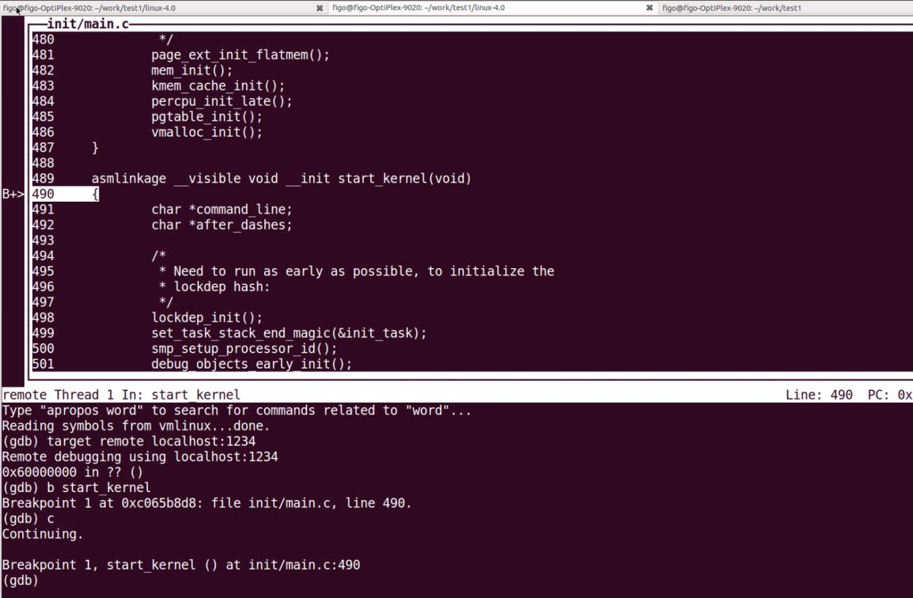
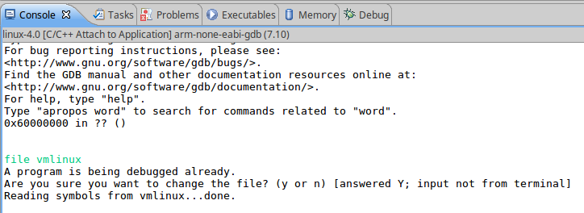
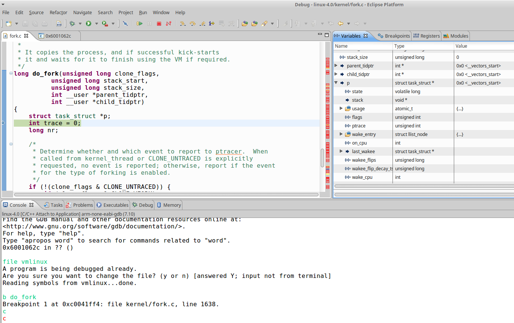

# 奔跑吧-linux内核-qemu调试内核


本章主要是介绍一些内核调试的工具和技巧。对于初学者来说,单步调试 Linux 内核应该
是比较酷的一件事情,特别是有类似 Virtual C++的图形化调试环境。另外还要介绍内核开发者
常用的调试工具,比如 ftrace 和 systemtap 等,它们都是内核开发者的最爱。对于编写内核代
码和驱动的读者来说,内存检测和死锁检测也是不可避免的,特别是做产品开发,这就像飞机
起飞前都要做例行安全检测一样,产品最终发布时可不能有越界访问等内存问题。最后介绍一
些内核调试的小技巧。本章介绍的调试工具和方法大部分都在 Ubuntu 16.04 + QEMU + ARM
Vexpress 平台上实验过。

##6.1 QEMU 调试 Linux 内核


ARM 公司为了加速开发过程提供了 Versatile Express 开发平台,客户可以基于 Versatile
Express 平台进行产品原型开发。做为个人学习者,没有必要浪费金钱去购买 Versatile Express
开发平台或者其他 ARM 开发板,完全可以通过 QEMU 来模拟这个开发平台,同样可以达到学
习的效果。

##6.1.1 QEMU 运行 ARM Linux 内核

### 1 准备工具

首先在 Untuntu 16.04 中安装如下工具。

```sh
$ sudo apt-get install qemu libncurses5-dev gcc-arm-linux-gnueabi build-essential
```

下载如下代码包

-  linux-4.0 内核。https://www.kernel.org/pub/linux/kernel/v4.x/linux-4.0.tar.gz
- usybox 工具包。https://busybox.net/downloads/busybox-1.24.0.tar.bz2

###2 编译最小文件系统
首先利用 busybox 手工编译一个最小文件系统。

```sh
cd busybox
export ARCH=arm
export CROSS_COMPILE= arm-linux-gnueabi-
make menuconfig
```

进入 menuconfig 之后,配置成静态编译。

```sh
Busybox Settings --->
    Build Options --->
        [*] Build BusyBox as a static binary (no shared libs)
```

然后 make install 就可以编译完成了。编译完成之后,在 busybox 根目录下面会有一
个”_install”的目录,这个目录就是编译好的文件系统需要的一些命令集合。
把_install 目录拷贝到 linux-4.0 目录下。进入_install 目录,先创建 etc、dev 等目录。

```sh
#mkdir etc
```

```sh
#mkdir dev
#mkdir mnt
#mkdir –p etc/init.d/
```

在_install /etc/init.d/目录下新创建一个叫 rcS 的文件,并且写入如下内容:

```sh
mkdir –p /proc
mkdir –p /tmp
mkdir -p /sys
mkdir –p /mnt
/bin/mount -a
mkdir -p /dev/pts
mount -t devpts devpts /dev/pts
echo /sbin/mdev > /proc/sys/kernel/hotplug
mdev –s
```
在_install /etc 目录新创建一个叫 fstab 的文件,并写入如下内容。

```sh
proc /proc proc defaults 0 0
tmpfs /tmp tmpfs defaults 0 0
sysfs /sys sysfs defaults 0 0
tmpfs /dev tmpfs defaults 0 0
debugfs /sys/kernel/debug debugfs defaults 0 0
```

在_install /etc 目录新创建一个叫 inittab 的文件,并写入如下内容。

```sh
::sysinit:/etc/init.d/rcS
::respawn:-/bin/sh
::askfirst:-/bin/sh
::ctrlaltdel:/bin/umount -a –r
```

在_install/dev 目录下创建如下设备节点,需要 root 权限。

```sh
$ cd _install/dev/
$ sudo mknod console c 5 1
$ sudo mknod null c 1 3
```

###3 编译内核

```sh
cd linux-4.0
export ARCH=arm
export CROSS_COMPILE=arm-linux-gnueabi-
make vexpress_defconfig
make menuconfig
```

配置 initramfs,在 initramfs source file 中填入_install。另外需要把 Default kernel command
string 清空。

```sh
General setup --->
    [*] Initial RAM filesystem and RAM disk (initramfs/initrd) support
        (_install) Initramfs source file(s)
Boot options -->
    ()Default kernel command string
```

配置 memory split 为“3G/1G user/kernel split”以及打开高端内存。

```sh
Kernel Features --->
Memory split (3G/1G user/kernel split) --->
[ *] High Memory Support
```

开始编译 kernel。

```sh
$ make bzImage –j4 ARCH=arm CROSS_COMPILE=arm-linux-gnueabi-
$ make dtbs
```

运行 QEMU 来模拟 4 核 Cortex-A9 的 Versatile Express 开发平台。

```sh
$ qemu-system-arm -M vexpress-a9 -smp 4 -m 1024M -kernel arch/arm/boot/zImage
-append "rdinit=/linuxrc console=ttyAMA0 loglevel=8" -dtb
arch/arm/boot/dts/vexpress-v2p-ca9.dtb -nographic
```

运行结果如下:

```sh
figo@figo-OptiPlex-9020:~/work/linux-4.0$ qemu-system-arm -M vexpress-a9 -smp 4 -
m 1024M -kernel arch/arm/boot/zImage -append "rdinit=/linuxrc console=ttyAMA0
loglevel=8" -dtb arch/arm/boot/dts/vexpress-v2p-ca9.dtb -nographic
Booting Linux on physical CPU 0x0
Initializing cgroup subsys cpuset
Linux version 4.0.0 (figo@figo-OptiPlex-9020) (gcc version 4.6.3 (Ubuntu/Linaro 4.6.3-
1ubuntu5) ) #9 SMP Wed Jun 22 04:23:19 CST 2016
CPU: ARMv7 Processor [410fc090] revision 0 (ARMv7), cr=10c5387d
CPU: PIPT / VIPT nonaliasing data cache, VIPT nonaliasing instruction cache
Machine model: V2P-CA9
Memory policy: Data cache writealloc
On node 0 totalpages: 262144
free_area_init_node: node 0, pgdat c074c600, node_mem_map eeffa000
Normal zone: 1520 pages used for memmap
Normal zone: 0 pages reserved
Normal zone: 194560 pages, LIFO batch:31
HighMem zone: 67584 pages, LIFO batch:15
PERCPU: Embedded 10 pages/cpu @eefc1000 s11712 r8192 d21056 u40960
pcpu-alloc: s11712 r8192 d21056 u40960 alloc=10*4096
pcpu-alloc: [0] 0 [0] 1 [0] 2 [0] 3
Built 1 zonelists in Zone order, mobility grouping on. Total pages: 260624
Kernel command line: rdinit=/linuxrc console=ttyAMA0 loglevel=8
log_buf_len individual max cpu contribution: 4096 bytes
log_buf_len total cpu_extra contributions: 12288 bytes
log_buf_len min size: 16384 bytes
log_buf_len: 32768 bytes
early log buf free: 14908(90%)
PID hash table entries: 4096 (order: 2, 16384 bytes)
Dentry cache hash table entries: 131072 (order: 7, 524288 bytes)
Inode-cache hash table entries: 65536 (order: 6, 262144 bytes)
Memory: 1031644K/1048576K available (4745K kernel code, 157K rwdata, 1364K
rodata, 1176K init, 166K bss, 16932K reserved, 0K cma-reserved, 270336K highmem)
Virtual kernel memory layout:
vector : 0xffff0000 - 0xffff1000 ( 4 kB)
fixmap : 0xffc00000 - 0xfff00000 (3072 kB)
vmalloc : 0xf0000000 - 0xff000000 ( 240 MB)
lowmem : 0xc0000000 - 0xef800000 ( 760 MB)
pkmap : 0xbfe00000 - 0xc0000000 (
2 MB)
modules : 0xbf000000 - 0xbfe00000 ( 14 MB)
.text : 0xc0008000 - 0xc05ff80c (6111 kB)
.init : 0xc0600000 - 0xc0726000 (1176 kB)
.data : 0xc0726000 - 0xc074d540 ( 158 kB)
.bss : 0xc074d540 - 0xc0776f38 ( 167 kB)
SLUB: HWalign=64, Order=0-3, MinObjects=0, CPUs=4, Nodes=1
Hierarchical RCU implementation.
Additional per-CPU info printed with stalls.
RCU restricting CPUs from NR_CPUS=8 to nr_cpu_ids=4.
RCU: Adjusting geometry for rcu_fanout_leaf=16, nr_cpu_ids=4
NR_IRQS:16 nr_irqs:16 16
smp_twd: clock not found -2
sched_clock: 32 bits at 24MHz, resolution 41ns, wraps every 178956969942ns
CPU: Testing write buffer coherency: ok
CPU0: thread -1, cpu 0, socket 0, mpidr 80000000
Setting up static identity map for 0x604804f8 - 0x60480550
CPU1: thread -1, cpu 1, socket 0, mpidr 80000001
CPU2: thread -1, cpu 2, socket 0, mpidr 80000002
CPU3: thread -1, cpu 3, socket 0, mpidr 80000003
Brought up 4 CPUs
SMP: Total of 4 processors activated (1648.43 BogoMIPS).
Advanced Linux Sound Architecture Driver Initialized.
Switched to clocksource arm,sp804
Freeing unused kernel memory: 1176K (c0600000 - c0726000)
Please press Enter to activate this console.
/ # ls
sbin sys tmp usr bin dev etc linuxrc proc
/ #
```
在 Ubuntu 另外一个超级终端中输入 killall qemu-system-arm 就可以关闭 QEMU 平台。


##6.1.2 QEMU 调试 ARM-Linux 内核
安装 ARM GDB 工具。

```sh
$ sudo apt-get install gdb-arm-none-eabi
```

首先要确保编译的内核包含调试信息。

```sh
Kernel hacking --->
    Compile-time checks and compiler options --->
        [*] Compile the kernel with debug info
```

重新编译内核。在超级终端中输入:

```sh
$ qemu-system-arm -nographic -M vexpress-a9 -m 1024M -kernel
arch/arm/boot/zImage -append "rdinit=/linuxrc console=ttyAMA0 loglevel=8" -dtb
arch/arm/boot/dts/vexpress-v2p-ca9.dtb -S -s
```

- -S:表示 QEMU 虚拟机会冻结 CPU 直到远程的 GDB 输入相应控制命令
- -s:表示在 1234 端口接受 GDB 的调试连接


图 6.1 gdb 调试内核
然后在另外一个超级终端中启动 ARM GDB




```sh
$ cd linux-4.0
$ arm-none-eabi-gdb --tui vmlinux
(gdb) target remote localhost:1234  <= 通过 1234 端口远程连接到 QEMU 平台
(gdb) b start_kernel                <= 在内核的 start_kernel 处设置断点
(gdb) c
```


如上图所示,GDB 开始接管 ARM-Linux 内核运行,并且到断点中暂停,这时候就可以使用
GDB 命令来调试内核了。


##6.1.3 QEMU 运行 ARMv8 开发平台
Ubuntu16.04 版本的 qemu 包含了 qemu-system-aarch64 工具,但是 Ubunut14.04 版本则需
要自己编译了。下载 qemu2.6 软件包 1 ,按照如下步骤编译 qemu。

```sh
sudo apt-get build-dep qemu
tar –jxf qemu-2.6.0.tar.bz2
cd qemu-2.6.0
./configure –target-list=aarch64-softmmu
make
sudo make install
```

安装如下工具包。

````h
$sudo apt-get install gcc-aarch64-linux-gnu
```

同样需要编译和制作一个基于 aarch64 架构的最小文件系统。可以参照之前的做法,只是
编译环境变量不一样了。

```sh
$ export ARCH=arm64
$ export CROSS_COMPILE=aarch64-linux-gnu-
```

下面开始编译内核,我们依然采用 linux-4.0 内核。
```sh
cd linux-4.0
export ARCH=arm64
export CROSS_COMPILE= aarch64-linux-gnu-
make menuconfig
```

依然采用 initramfs 方式来加载最小文件系统,假设编译的最小文件系统放在 linux-4.0 根目
录下面,文件目录叫_install_arm64,以区别之前编译的 arm32 的最小文件系统。另外设置页的
大小为 4KB,系统的总线位宽为 48 位。


```sh
General setup --->
    [*] Initial RAM filesystem and RAM disk (initramfs/initrd) support
        (_install_arm64) Initramfs source file(s)
Boot options -->
    ()Default kernel command string
Kernel Features --->
    Page size (4KB) --->
        Virtual address space size (48-bit) --->
```

输入 make –j4 开始编译内核。
运行 QEMU 来模拟 2 核 Cortex-A57 开发平台。

```sh
$ qemu-system-aarch64 -machine virt -cpu cortex-a57 -machine type=virt -nographic -
m 2048 –smp 2 -kernel arch/arm64/boot/Image --append "rdinit=/linuxrc
console=ttyAMA0"
```

运行结果如下(删掉部分信息)

```sh
Booting Linux on physical CPU 0x0
Initializing cgroup subsys cpu
Linux version 4.0.0 (figo@figo-OptiPlex-9020) (gcc version 4.9.1 20140529 (prerelease)
(crosstool-NG linaro-1.13.1-4.9-2014.08 - Linaro GCC 4.9-2014.08) ) #3 SMP PREEMPT
Mon Jun 27 02:44:27 CST 2016
CPU: AArch64 Processor [411fd070] revision 0
Detected PIPT I-cache on CPU0
efi: Getting EFI parameters from FDT:
efi: UEFI not found.
cma: Reserved 16 MiB at 0x00000000bf000000
On node 0 totalpages: 524288
DMA zone: 8192 pages used for memmap
DMA zone: 0 pages reserved
DMA zone: 524288 pages, LIFO batch:31
psci: probing for conduit method from DT.
psci: PSCIv0.2 detected in firmware.
psci: Using standard PSCI v0.2 function IDs
PERCPU: Embedded 14 pages/cpu @ffff80007efcb000 s19456 r8192 d29696 u57344
pcpu-alloc: s19456 r8192 d29696 u57344 alloc=14*4096
pcpu-alloc: [0] 0 [0] 1
Built 1 zonelists in Zone order, mobility grouping on. Total pages: 516096
Kernel command line: rdinit=/linuxrc console=ttyAMA0 debug
PID hash table entries: 4096 (order: 3, 32768 bytes)
Dentry cache hash table entries: 262144 (order: 9, 2097152 bytes)
Inode-cache hash table entries: 131072 (order: 8, 1048576 bytes)
software IO TLB [mem 0xb8a00000-0xbca00000] (64MB) mapped at
[ffff800078a00000-ffff80007c9fffff]
Memory: 1969604K/2097152K available (5125K kernel code, 381K rwdata, 1984K
rodata, 1312K init, 205K bss, 111164K reserved, 16384K cma-reserved)
Virtual kernel memory layout:
vmalloc : 0xffff000000000000 - 0xffff7bffbfff0000 (126974 GB)
vmemmap : 0xffff7bffc0000000 - 0xffff7fffc0000000 ( 4096 GB maximum)
0xffff7bffc1000000 - 0xffff7bffc3000000 (
32 MB actual)
fixed : 0xffff7ffffabfe000 - 0xffff7ffffac00000 (
8 KB)
PCI I/O : 0xffff7ffffae00000 - 0xffff7ffffbe00000 (
16 MB)
modules : 0xffff7ffffc000000 - 0xffff800000000000 (
64 MB)
memory : 0xffff800000000000 - 0xffff800080000000 ( 2048 MB)
.init : 0xffff800000774000 - 0xffff8000008bc000 ( 1312 KB)
.text : 0xffff800000080000 - 0xffff8000007734e4 ( 7118 KB)
.data : 0xffff8000008c0000 - 0xffff80000091f400 ( 381 KB)
SLUB: HWalign=64, Order=0-3, MinObjects=0, CPUs=2, Nodes=1
Preemptible hierarchical RCU implementation.
Additional per-CPU info printed with stalls.
RCU restricting CPUs from NR_CPUS=64 to nr_cpu_ids=2.
RCU: Adjusting geometry for rcu_fanout_leaf=16, nr_cpu_ids=2
NR_IRQS:64 nr_irqs:64 0
GICv2m: Node v2m: range[0x8020000:0x8020fff], SPI[80:144]
Architected cp15 timer(s) running at 62.50MHz (virt).
sched_clock: 56 bits at 62MHz, resolution 16ns, wraps every 2199023255552ns
Console: colour dummy device 80x25
Calibrating delay loop (skipped), value calculated using timer frequency.. 125.00
BogoMIPS (lpj=625000)
pid_max: default: 32768 minimum: 301
Security Framework initialized
Mount-cache hash table entries: 4096 (order: 3, 32768 bytes)
Mountpoint-cache hash table entries: 4096 (order: 3, 32768 bytes)
Initializing cgroup subsys memory
Initializing cgroup subsys hugetlb
hw perfevents: no hardware support available
EFI services will not be available.
CPU1: Booted secondary processor
Detected PIPT I-cache on CPU1
Brought up 2 CPUs
SMP: Total of 2 processors activated.
devtmpfs: initialized
DMI not present or invalid.
NET: Registered protocol family 16
cpuidle: using governor ladder
cpuidle: using governor menu
vdso: 2 pages (1 code @ ffff8000008c5000, 1 data @ ffff8000008c4000)
hw-breakpoint: found 6 breakpoint and 4 watchpoint registers.
DMA: preallocated 256 KiB pool for atomic allocations
Freeing unused kernel memory: 1312K (ffff800000774000 - ffff8000008bc000)
Freeing alternatives memory: 8K (ffff8000008bc000 - ffff8000008be000)
Please press Enter to activate this console.
/ #
```

##6.1.4 文件系统支持
本书内存管理中会讲述页面回收相关内容,页面回收代码相当复杂,在 QEMU 上建立一个
可以调试的环境显得相当必要了。这里介绍如何添加了一个 swap 分区。

在 Ubuntu 中创建一个 64MB 的 image。

```sh
$ dd if=/dev/zero of=swap.img bs=512 count=131072 <=这里使用 DD 命令
```

然后通过 SD 卡的方式加载 swap.img 到 QEMU 中。

```sh
$ qemu-system-arm -nographic -M vexpress-a9 -m 64M -kernel
arch/arm/boot/zImage -append "rdinit=/linuxrc console=ttyAMA0 loglevel=8" -dtb
arch/arm/boot/dts/vexpress-v2p-ca9.dtb -sd swap.img
[...]
# mkswap /dev/mmcblk0 <=第一次需要格式化 swap 分区
# swapon /dev/mmcblk0 <= 使能 swap 分区
# free


total used free shared buffers 
Mem: 1026368 9844 1016524 1360 4
-/+ buffers: 9840 1016528
Swap: 65532 0 65532 <= 可以看到 swap 分区已经工作了
```

如果需要调试页面回收方面的代码,那可以在 kswapd()函数里设置断点,但是需要在编写
一个应用程序模拟吃掉内存来触发 kswapd 内核线程工作。QEMU 里的“-m 64M”设置了 64MB
内存是为了方便触发 kswapd 内核线程工作。

```sh
$ dd if=/dev/zero of=ext4.img bs=512 count=131072 <=创建一个 img 镜像
$ mkfs.ext4 ext4.img <=格式化 ext4.img 成 ext4 格式
```

另外挂载 ext4 文件系统需要打开如下配置选项。

```sh
[arch/arm/configs/vexpress_defconfig]
CONFIG_LBDAF=y
CONFIG_EXT4_FS=y
```

重新编译内核,make vexpress_defconfig && make。

```sh
$ qemu-system-arm -nographic -M vexpress-a9 -m 1024M -kernel
arch/arm/boot/zImage -append "rdinit=/linuxrc console=ttyAMA0 loglevel=8" -dtb
arch/arm/boot/dts/vexpress-v2p-ca9.dtb -sd ext4.img
[...]
# mount -t ext4 /dev/mmcblk0 /mnt/ <=挂载 SD 卡到/mnt 目录
```

##6.1.5 图形化调试

之前介绍了如何使用 gdb 和 QEMU 来调试 Linux 内核源代码。由于 gdb 是命令行的方式,
可能有不少读者希望在 Linux 中能有类似 Virtual C++这样的图形化的开发工具。这里介绍使用
Eclipse 这个工具来调试内核。Eclipse 是著名的跨平台的开源集成开发环境(IDE),最初主要用
于 JAVA 语言开发,目前可以支持 C/C++、Python 等多种开发语言。Eclipse 最初由 IBM 公司开
发,2001 年贡献给开源社区,有很多开发环境都基于 Eclipse 来完成。
首先安装 Eclipse-CDT 这个软件。Eclipse-CDT 是 Eclipse 的一个插件,提供强大的 C/C++编译
和编辑功能。

```sh
$ sudo apt-get install eclipse-cdt
```

打开 Eclipse 菜单选择“Window->Open Perspective->C/C++”。新创建一个 C/C++的 Makefile
工程,在“File->New->Project”中选择“Makefile Project with Exiting Code”来创建一个新的工
程。

接下来配置 Debug 选项。打开 Eclipse 菜单的“Run->Debug Configurations...”选项,创建一
个“C/C++ Attach to Application”调试选项。


-  Project:选择刚才创建的工程。
-  C/C++ Appliction:选择编译 Linux 内核带符号表信息的 vmlinux。
-  Debugger:选择 gdbserver
-  GDB debugger:填入 arm-none-eabi-gdb
-  Host name or IP addrss: 填入 localhost
-  Port number: 填入 1234


调试选项设置完成之后,点击“Debug”按钮。


图 6.2 eclipse 调试选项设置


在 Ubuntu 的一个终端中先打开 QEMU。为了调试方便,这里没有指定多个 CPU 只是单个
CPU。

```sh
$ qemu-system-arm -nographic -M vexpress-a9 -m 1024M -kernel
arch/arm/boot/zImage -append "rdinit=/linuxrc console=ttyAMA0 loglevel=8" -dtb
arch/arm/boot/dts/vexpress-v2p-ca9.dtb -S -s
```

在 Eclipse 菜单中选择“Run->Debug History”中选择刚才创建的调试选项,或者在快捷菜
单中点击“小昆虫”图标。


在 Eclipse 的 Console 控制台里,输入“file vmlinux”命令来导入调试文件的符号表。



图 6.3 console 控制台


输入“b do_fork”在 do_fork 函数里设置一个断点了。输入“c”命令就可以开始运行
QEMU 里的 Linux 内核了,它会停在 do_fork 函数里。



图 6.4 Eclipse 调试内核

Eclipse 调试内核比使用 gdb 命令要直观很多,比如参数、局部变量以及数据结构的值都会
自动显示在“Variables”标签卡上,不需要每次都使用 gdb 的打印命令才能看到变量的值。读
者可以单步调试并且直观的调试内核了。


最后说明一点,读者可能发现 gdb 在单步调试内核时会出现光标乱跳以及无法打印有些变
量的值等问题,其实这个不能怪罪 gdb 或者 QEMU。那是因为内核编译的默认优化选项是 O2,
因此如果希望光标不会乱跳,那可以尝试把 Linux-4.0 根目录的 Makefile 中 O2 改成 O0,但是这
样会编译有问题,所以希望读者自行修改。


##6.1.6 实验进阶
上述的实验是利用 QEMU 和 Initramfs 来搭建一个简单实用的内核调试环境,但是依然存在
一些缺点,比如所有的步骤都需要手工输入和制作,对于有些刚接触 Linux 的同学来说可能会
产生各种各样的问题,另外有很多热门的开源组件也没包括进来比如 u-boot、Buildroot 等。为
此,社区大牛吴章金同学非常热心中国高校的嵌入式系统的教学工作,利用业余时间搭建了一
个非常好用的实验平台 – Cloud Lab 1 。Cloud Lab 利用 Docker 容器化技术可以快速创建好多好用
的实验环境:

- CS630 Qemu Lab:x86 Linux 汇编语言实验
- Linux 0.11 Lab:Linux 0.11 内核实验
- Linux lab:Linux 内核和嵌入式 Linux 实验

Cloud Lab 具有以下几个新特性:
- 通过 Docker 加速环境的安装和重复构建。
- 提供 Docker 镜像库,方便直接下载实验环境。
- 便利化的脚本管理,方便环境使用和部署。
 
因此有精力同学可以尝试利用 Cloud Lab 来进一步学习和研究。


http://tinylab.org/how-to-deploy-cloud-labs/
http://tinylab.org/docker-qemu-linux-lab/
http://tinylab.org/using-linux-lab-to-do-embedded-linux-development/
