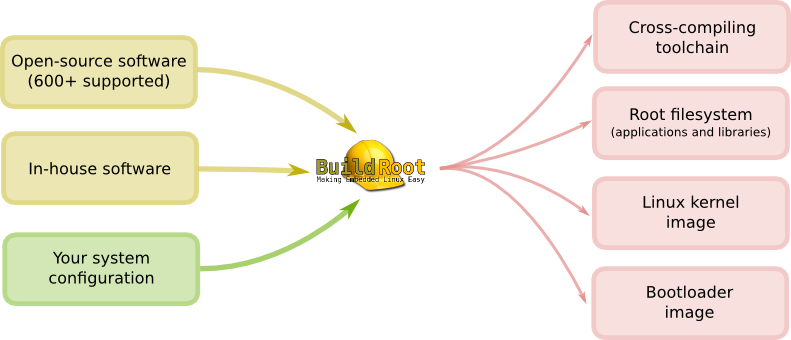

# How Other People Use QEMU


## Viller

```sh
qemu-system-arm \
-M vexpress-a15 \
-kernel buildroot/output/images/zImage \
-dtb buildroot/output/images/vexpress-v2p-ca15_a7.dtb \
-drive file=buildroot/output/images/rootfs.ext2,if=sd \
-smp 2 \
-s \
-serial stdio \
-append "root=/dev/mmcblk0 console=ttyAMA0,115200n8" \
-net nic,vlan=1 -net user,vlan=1,hostfwd=udp:127.0.0.1:6669-:69
```


利用 buildroot 與 Qemu 建構簡易 Embedded Linux 環境
===
# Embedded Linux development

[Building Embedded Linux Full Tutorial for ARM](http://www.slideshare.net/sherif_mosa/building-embedded-linux-full-tutorial-for-arm)

## Components
* cross toolchain
	* libc: glibc / uclibc / musl
* bootloader
	* uboot / barebox 
* kernel
* rootfs
	* busybox
	* applications
	* development toolkits

## Some limitations
* Different sources download path
	* url
	* local
	* ... and so on, one for each package
* Different download tools
	* tar ball / zip
	* git/svn/mercurial
	* copy (for local)
* Some patches might required for embedded environment
	* non-glibc
	* busybox
	* rootfs path
	* and so on
* Package dependency

# builtroot
* (wiki) A set of Makefiles and patches that simplifies and automates the process of building a complete and bootable Linux environment for an embedded system
* menuconfig to select alternatives and versions of
	* board
	* bootloaders
	* compiler, binutils and libc
	* kernel version
	* supported packages
* How to support one package, e.g. foo
	* foo.mk (Makefile DSL). Commands for
		* download
		* configure
		* build
		* install
	* Config.in (menuconfig selection)
	
 * Example mk for customized package, e.g. bpftest.mk
   ~~~
    BPFTEST_VERSION = 1.0
    BPFTEST_SITE = $(TOPDIR)/../bpftest
    BPFTEST_SOURCE = "apps modules"
    BPFTEST_SITE_METHOD = local
    BPFTEST_LICENSE = GPLv3+
    BPFTEST_LICENSE_FILES = COPYING

    BPFTEST_MODULE_SUBDIRS = modules
    BPF_MODULE_MAKE_OPTS = KVERSION=$(LINUX_VERSION_PROBED) KERNEL_DIR=$(LINUX_DIR)

    define BPFTEST_EXTRACT_CMDS
    	cp -a $(TOPDIR)/$(BPFTEST_SOURCE) $(@D)
    endef

    define BPFTEST_BUILD_CMDS
	   $(MAKE) CC="$(TARGET_CC)" LD="$(TARGET_LD)" -C $(@D)/apps all
    endef

    define BPFTEST_INSTALL_TARGET_CMDS
    	$(INSTALL) -D -m 0755 $(@D)/apps/hello $(TARGET_DIR)/usr/bin
    endef

    $(eval $(kernel-module))
    $(eval $(generic-package))
    ~~~
 
# Qemu
* My target: arm vexpress
	* Supported by vanilla kernel
	* Supported by Qemu

## Steps
* Build
~~~ sh
$ configure --prefix=/path/to/install --target-list=arm-softmmu
$ make
$ make install
~~~

* Run
	* https://wiki.linaro.org/PeterMaydell/QemuVersatileExpress
		* target: `-M vexpress-a15`
		(Feedback) Can try virtio (?)
		* images:
			* kernel: `-kernel /path/to/zImage`
			* dtb: `-dtb /path/to/dtb`
			* disk: `-drive ...`
		* serial output to tty: `-serial stdio`
		* virtual NAT and port forwarding:`-net nic,vlan=1 -net user,vlan=1,hostfwd=udp:127.0.0.1:6669-:69`
		(Feedback) Can try tap
		* boot args: `-append "root=/dev/mmcblk0 console=ttyAMA0,115200n8"`
		* debug:`-s` or `-gdb tcp::1234` / `-S`
		* CPU logging: `-d op -D /path/to/qemu.log`

    * example command
	  ~~~ sh
	  $ /path/to/install/bin/qemu-system-arm \
      -M vexpress-a15 \
      -kernel buildroot/output/images/zImage \
      -dtb buildroot/output/images/vexpress-v2p-ca15_a7.dtb \
      -drive file=buildroot/output/images/rootfs.ext2,if=sd \
      -smp 2 \
      -s \
      -serial stdio \
      -append "root=/dev/mmcblk0 console=ttyAMA0,115200n8" \
      -net nic,vlan=1 -net user,vlan=1,hostfwd=udp:127.0.0.1:6669-:69
      ~~~


---

## Wen

```sh
qemu-system-arm \
-M versatilepb \
-kernel /tmp/kernel/linux-stable/arch/arm/boot/zImage \
-drive file=output/images/rootfs.ext2,if=scsi,format=raw \
-append "root=/dev/sda console=ttyAMA0,115200" \
-serial stdio \
-net nic,model=rtl8139 \
-net user
```

# Linux Kernel Pratice 0: Buildroot (1/2)


理論上不應該要邊移動邊開火，延長戰線。不過計劃趕不上變化，既來之則安之。

最近因為特別因素開始學習Linux kernel，看能不能Linux kernel和STM32兩邊都不要漏掉。不管怎樣，學習和實習絕對分不開，所以還是從環境架設開始吧。這次的實習環境架設的目標是：

1. 可以使用ARM 平臺。一方面追求流行，一方面我不想再開x86這個副本
2. 可以方便地建立ARM平臺的Linux Rootfs和kernel版本
3. 可以方便地更改指定要編譯的Kernel版本
4. 透過Qemu ，使用2的Rootfs和kernel開機
5. 透過Qemu和搭配的工具可以分析Linux kernel的run time 行為

今天只有辦到1, 2和4而已，剩下的還要繼續努力。

## 目錄

* [測試環境](#lk0_env)
* [安裝Buildroot](#lk0_ins)
    * [下載Buildroot](#lk0_ins_dl)
    * [設定ARM 環境](#lk0_ins_set)
    * [編譯及輸出](#lk0_ins_build)
* [測試](#lk0_test)
* [參考資料](#lk0_ref)
    * [下次準備看的資料](#lk0_ref_data)

<a name="lk0_env"></a>
## 測試環境
因為我已經裝過開發相關的套件，因此如果您是新手可能要自行摸索也許有需要另外安裝的套件如`git`。嘛，練習解讀錯誤訊息也是一種學習。

```sh
$ lsb_release -a
No LSB modules are available.
Distributor ID:	Ubuntu
Description:	Ubuntu 14.04.5 LTS
Release:	14.04
Codename:	trusty
```

<a name="lk0_ins"></a>
## 安裝Buildroot
主要分成下面三個步驟

* [下載Buildroot](#lk0_ins_dl)
* [設定ARM 環境](#lk0_ins_set)
* [編譯及輸出](#lk0_ins_build)

<a name="lk0_ins_dl"></a>
### 下載Buildroot
直接看例子，剪下貼上就好

```sh
mkdir buildroot
cd buildroot
git clone git://git.buildroot.net/buildroot
```

<a name="lk0_ins_set"></a>
### 設定ARM 環境
網路上查到大部分都是從`make menuconfig`開始。不過我是很**明確地**要用`Qemu`跑ARM的系統。所以就找了一下發現有下面的指令

```text
make qemu_x86_defconfig
```

想說既然有`x86_defconfig`，那應該有`arm_defconfig`吧? 錯！那我就去`buildroot/board/qemu`目錄下找，有看到`arm-versatile`。印象中[以前](blog/2015/02/07/by-qemu-arm-installation-of-debian-systems/)有用過Qemu跑的Debian系統也是`versatile`。所以就很高興地下了

```sh
make qemu_arm-versatile_defconfig
```

結果一樣GG，估狗查才知道正確的用法是：

```sh
make qemu_arm_versatile_defconfig
```

**更新:** 後來看手冊才知道有`make list-defconfigs`可以查詢有哪些default config，果然前輩說要RTFM是對的，唉。

接下來就用`make menuconfig`做細項調整，我主要是改成

1. 使用glibc
2. 使用gcc 4.8
    * 預設5.x，因為我想要編Linux kernel 4.4.2。以前PC經驗使用gcc 5.x極端痛苦，後來還是換回gcc 4.8
3. 一些除錯設定

另外本來想要嘗試設定更動Kernel版本，但是發現需要更進一步的瞭解buildroot才能夠達成。當作下次目標吧。

<a name="lk0_ins_build"></a>
### 編譯及輸出
編譯只要下`make`就會幫你下載和編譯開機需要的

1. 套件和一些常用工具，並封裝到`output/image/roofs.ext2`
2. Kernel(預設4.7)，編譯成`zImage`，放在`output/image/zImage`

<a name="lk0_test"></a>
## 測試
接下來也不難，可以參考`board/qemu/arm-versatile/readme.txt`
簡單來說就是執行下面指令，開機完使用`root`登入不用密碼，使用`poweroff`後再手動離開qemu。

```sh
qemu-system-arm -M versatilepb -kernel output/images/zImage -dtb output/images/versatile-pb.dtb -drive file=output/images/rootfs.ext2,if=scsi,format=raw -append "root=/dev/sda console=ttyAMA0,115200" -serial stdio -net nic,model=rtl8139 -net user
```

執行畫面如下

```sh
$ qemu-system-arm -M versatilepb -kernel output/images/zImage -dtb output/images/versatile-pb.dtb -drive file=output/images/rootfs.ext2,if=scsi,format=raw -append "root=/dev/sda console=ttyAMA0,115200" -serial stdio -net nic,model=rtl8139 -net user
...
Booting Linux on physical CPU 0x0
Linux version 4.7.0 (user@host) (gcc version 4.8.5 (Buildroot 2016.11-git-00439-g14b2472) ) #1 Mon Sep 26 22:36:42 CST 2016
CPU: ARM926EJ-S [41069265] revision 5 (ARMv5TEJ), cr=00093177
CPU: VIVT data cache, VIVT instruction cache
Machine model: ARM Versatile PB
....
EXT4-fs (sda): re-mounted. Opts: block_validity,barrier,user_xattr,errors=remount-ro
Starting logging: OK
Initializing random number generator... random: dd urandom read with 46 bits of entropy available
done.
Starting network: 8139cp 0000:00:0c.0 eth0: link up, 100Mbps, full-duplex, lpa 0x05E1
...
adding dns 10.0.2.3
OK

Welcome to Buildroot
buildroot login: root
#
```

<a name="lk0_ref"></a>
## 參考資料
* [The Buildroot user manual](https://buildroot.org/downloads/manual/manual.html)
    * 只有看部份，不過官方文件本來就是應該放在第一位
* [Buildroot and QEMU – the quickest receipe for your own Linux](http://pressreset.net/2013/09/buildroot-and-qemu-the-quickest-receipe-for-your-own-linux/)
    * 東西弄完才看到的文章，入門好文

<a name="lk0_ref_data"></a>
### 下次準備看的資料
* [Qemu and the Kernel](http://www.linux-magazine.com/Online/Features/Qemu-and-the-Kernel)
    * 使用Qemu debug kernel的資料
* [Stackoverflow: Can virtfs/9p be used as root file system?](http://unix.stackexchange.com/questions/90423/can-virtfs-9p-be-used-as-root-file-system)
    * Qemu和Host主機共享資料，甚至直接把rootfs放host讓qemu去讀取的方式


# Linux Kernel Pratice 0: Buildroot (2/2) - 自行編譯kernel


## 前情提要
[上一篇](blog/2016/09/27/linux-kernel-pratice-0-buildroot-setup-with-qemu/)提到，設定實習環境的目標有：

1. 可以使用ARM 平臺。一方面追求流行，一方面我不想再開x86這個副本
2. 可以方便地建立ARM平臺的Linux Rootfs和kernel版本
3. 可以方便地更改指定要編譯的Kernel版本
4. 透過Qemu ，使用2的Rootfs和kernel開機
5. 透過Qemu和搭配的工具可以分析Linux kernel的run time 行為

今天就是來解決3 的項目。更細分的話，這次目標是

1. 使用官方Linux kernel 編譯Versatile
2. 編譯出來的kernel binary可以在Qemu上順利載入
3. 編譯出來的kernel binary可以順利的載入buildroot產生的rootfs，以及網路介面和相關設備

## 目錄
* [測試環境](#lk0_1_env)
* [下載Linux Kernel Source](#lk0_1_dl)
* [設定和編譯](#lk0_1_conf)
    * [切換版本](#lk0_1_conf_sw)
    * [設定ARM Versatile預設config](#lk0_1_conf_arm_def)
    * [設定Qemu VM支援的硬體](#lk0_1_conf_qemu)
    * [編譯](#lk0_1_conf_build)
        * [Buildroot](#lk0_1_conf_build_broot)
        * [Linux kernel](#lk0_1_conf_build_lk)
* [測試](#lk0_1_test)
* [參考資料](#lk0_1_ref)
* [附錄](#lk0_1_app)
    * [使用Buildroot 內建套件指定編譯Linux kernel 4.2.2](#lk0_1_app_brot)

<a name="lk0_1_env"></a>
## 測試環境
做組裝的最重要的原則之一就是要能夠reproduce，所以交代測試環境是一定要的

```sh
$ lsb_release -a
No LSB modules are available.
Distributor ID:	Ubuntu
Description:	Ubuntu 14.04.5 LTS
Release:	14.04
Codename:	trusty

$ git --version
git version 2.10.0
```

* buildroot 版本
    * commit hash: `14b24726a81b719b35fee70c8ba8be2d682a7313`

<a name="lk0_1_dl"></a>
## 下載Linux Kernel Source
沒啥好講的，就剪貼指令吧

```sh
git clone git://git.kernel.org/pub/scm/linux/kernel/git/stable/linux-stable.git
```

<a name="lk0_1_conf"></a>
## 設定和編譯
東西下載完不是就閉著眼睛開幹，因為我們在開始編譯前需要

1. 切換到你想要研究的版本
2. 如果不是x86，你需要指定平臺
3. 細項Kernel config設定

那麼就來見招拆招吧

<a name="lk0_1_conf_sw"></a>
### 切換版本
非常簡單，先`git tag`，切過去就好。我要切到4.4.2就是

```sh
git tag                 # 找你要的版本
git checkout v4.4.2     # 切到tag
git checkout -b v4.4.2  # 理論上會這邊改東改西，就先開branch吧
```

<a name="lk0_1_conf_arm_def"></a>
### 設定ARM Versatile預設config
先講結論
```sh
make ARCH=arm versatile_defconfig
```

開始~~沒人要看~~的解釋吧。基本上也亂看找出來的，簡單講一下當初的「脈絡」

1. 我知道我們平臺是versatile，所以就`find | grep versatile`。從一堆檔案中我看到有趣的檔案`./arch/arm/configs/versatile_defconfig`。
2. 接下來就是要找make 的時候怎麼和這個檔案勾起來。網路上找一下會發現一個變數`ARCH`，剩下就試看看`make ARCH=arm versatile_defconfig`，能不能動，可以動所以打完收工。

然後你就知道

1. Linux kernel source中有些平臺會提供default config
2. 透過`ARCH`可以讓make時自動參考這些檔案產生config

<a name="lk0_1_conf_qemu"></a>
### 設定Qemu VM支援的硬體
<font color="red">**建議不要把buildroot compile cache打開。我花了很多時間在kernel 編譯後Qemu還是沒有使用編譯後的kernel的問題，最後發現關閉buildroot compile cache問題就消失了。**</font>

如果閉著眼睛開始[編譯](#lk0_1_conf_build)，你會很高興地發現可以開機了，但是接下來就會很失望的發現kernel panic，原因是認不出開機的disk。

之所以會發生這樣的原因是因為Linux kernel 提供的default config選項和buildroot 給Qemu的kernel 選項不同([參考](#lk0_1_app_brot))，比對buildroot 開機畫面，會發現他們有偵測到兩個硬體，分別是

1. SCSI 控制器，用來辨認rootfs
2. Realtek 8139 網路卡，不用我解釋吧

那麼我們這邊直接把這兩個加上去就收工沒錯吧？答案是對也不對，因為這兩個東西會和其他的部份有關。

以下是我用笨方式一個一個試出來需要開啟的東西，不一定最簡潔甚至正確，但是他可以開機就是了。要注意不要編成module，編譯的細節我假設讀者都知道，如果完全不懂可能要找一下新手入門資訊了。另外我列出的選項是Kernel `4.4.2`下的選項，請自行斟酌。

記得**請用`make ARCH=arm menuconfig`更改設定**

1. PCI bus，原因是SCSI控制器和網路卡是PCI bus介面，不開就沒有不會看到這些選項。
2. SCSI 包括
    * SSCI device
    * Disk
    * 我有開Generic，懶得關掉看會不會出問題了
    * SCSI low-level drivers -> SYM53C8XX Version 2 SCSI support
3. Network device support
    * Ethernet driver suppor -> Realtek devices
        * RealTek RTL-8139 C+ PCI Fast Ethernet Adapter support
4. 要支援buildroot預設的device node管理方式。有興趣的可以看[這邊](https://buildroot.org/downloads/manual/manual.html#_dev_management)
    * Device Drivers -> Generic Driver Options -> 
        * Maintain a devtmpfs filesystem to mount at /dev
        * Automount devtmpfs at /dev, after the kernel mounted the rootfs
5. File system 要支援ext2，原因是buildroot產生的是ext2檔案格式
6. tmpfs要開啟
    * File systems -> Pseudo filesystems
        * Tmpfs virtual memory file system support (former shm fs)

建議順便巡一下其他kernel選項，用不到的可以關一下。比如說`MTD`，一堆有的沒的網卡，音效支援之類的。

<a name="lk0_1_conf_build"></a>
### 編譯

<a name="lk0_1_conf_build_broot"></a>
#### Buildroot

1. `make menuconfig`
    * Toolchain -> Custom kernel headers series
        * 改成你現在Linux 版本
2. `make`

<a name="lk0_1_conf_build_lk"></a>
#### Linux kernel
指令如下

```sh
make CROSS_COMPILE=/tmp/buildroot/output/host/usr/bin/arm-buildroot-linux-gnueabi- ARCH=arm V=1 bzImage
```

這其實就是`make bzImage`的囉唆版，多了

* `ARCH=arm`
    * 指定ARM平臺
* `CROSS_COMPILE=..`
    * Cross compile prefix，既然我們使用buildroot內建toolchain，就用他們來編譯kernel
* `V=1`
    * 身為組裝工，沒看到編譯指令訊息跳出來就會沒安全感

<a name="lk0_1_test"></a>
## 測試
這邊卡關的原因是預設的buildroot (Linux kernel 4.7)使用qemu載入的時候需要指定device tree檔案。但是在Linux 4.4.2下面指定device tree檔案反而無法順利開機。我怎麼知道到的？撈git commit log去看的。

剩下就剪貼了

**我在buildroot top目錄執行的**，你要嘛就切到buildroot目錄下，要嘛就指定`-drive file`到你自己rootfs的路徑

```sh
qemu-system-arm -M versatilepb -kernel /tmp/kernel/linux-stable/arch/arm/boot/zImage -drive file=output/images/rootfs.ext2,if=scsi,format=raw -append "root=/dev/sda console=ttyAMA0,115200" -serial stdio -net nic,model=rtl8139 -net use
```

單純提出來一個參數表示這是我編譯出來的kernel而不是buildroot的

* `-kernel /tmp/kernel/linux-stable/arch/arm/boot/zImage`

開機節錄畫面如下

```sh
Uncompressing Linux... done, booting the kernel.
Booting Linux on physical CPU 0x0
Linux version 4.4.2 (user@host) (gcc version 4.8.5 (Buildroot 2016.11-git-00439-g14b2472) ) #2 Fri Sep 30 22:46:53 CST 2016
CPU: ARM926EJ-S [41069265] revision 5 (ARMv5TEJ), cr=00093177
CPU: VIVT data cache, VIVT instruction cache
Machine: ARM-Versatile PB
Memory policy: Data cache writeback
sched_clock: 32 bits at 24MHz, resolution 41ns, wraps every 89478484971ns
Built 1 zonelists in Zone order, mobility grouping on.  Total pages: 32512
Kernel command line: root=/dev/sda console=ttyAMA0,115200
PID hash table entries: 512 (order: -1, 2048 bytes)
Dentry cache hash table entries: 16384 (order: 4, 65536 bytes)
Inode-cache hash table entries: 8192 (order: 3, 32768 bytes)
Memory: 125956K/131072K available (2780K kernel code, 148K rwdata, 776K rodata, 128K init, 79K bss, 5116K reserved, 0K cma-reserved)
Virtual kernel memory layout:
    vector  : 0xffff0000 - 0xffff1000   (   4 kB)
    fixmap  : 0xffc00000 - 0xfff00000   (3072 kB)
    vmalloc : 0xc8800000 - 0xff800000   ( 880 MB)
    lowmem  : 0xc0000000 - 0xc8000000   ( 128 MB)
    modules : 0xbf000000 - 0xc0000000   (  16 MB)
      .text : 0xc0008000 - 0xc038158c   (3558 kB)
      .init : 0xc0382000 - 0xc03a2000   ( 128 kB)
      .data : 0xc03a2000 - 0xc03c7300   ( 149 kB)
       .bss : 0xc03c7300 - 0xc03daf2c   (  80 kB)
NR_IRQS:224
VIC @f1140000: id 0x00041190, vendor 0x41
FPGA IRQ chip 0 "SIC" @ f1003000, 13 irqs, parent IRQ: 63
clocksource: timer3: mask: 0xffffffff max_cycles: 0xffffffff, max_idle_ns: 1911260446275 ns
Console: colour dummy device 80x30
Calibrating delay loop... 641.43 BogoMIPS (lpj=3207168)
pid_max: default: 32768 minimum: 301
Mount-cache hash table entries: 1024 (order: 0, 4096 bytes)
Mountpoint-cache hash table entries: 1024 (order: 0, 4096 bytes)
CPU: Testing write buffer coherency: ok
Setting up static identity map for 0x8400 - 0x8458
devtmpfs: initialized
VFP support v0.3: implementor 41 architecture 1 part 10 variant 9 rev 0
clocksource: jiffies: mask: 0xffffffff max_cycles: 0xffffffff, max_idle_ns: 19112604462750000 ns
NET: Registered protocol family 16
DMA: preallocated 256 KiB pool for atomic coherent allocations
Serial: AMBA PL011 UART driver
dev:f1: ttyAMA0 at MMIO 0x101f1000 (irq = 44, base_baud = 0) is a PL011 rev1
console [ttyAMA0] enabled
dev:f2: ttyAMA1 at MMIO 0x101f2000 (irq = 45, base_baud = 0) is a PL011 rev1
dev:f3: ttyAMA2 at MMIO 0x101f3000 (irq = 46, base_baud = 0) is a PL011 rev1
fpga:09: ttyAMA3 at MMIO 0x10009000 (irq = 70, base_baud = 0) is a PL011 rev1
PCI core found (slot 11)
PCI host bridge to bus 0000:00
pci_bus 0000:00: root bus resource [mem 0x50000000-0x5fffffff]
pci_bus 0000:00: root bus resource [mem 0x60000000-0x6fffffff pref]
pci_bus 0000:00: root bus resource [io  0x1000-0xffff]
pci_bus 0000:00: No busn resource found for root bus, will use [bus 00-ff]
PCI: bus0: Fast back to back transfers disabled
pci 0000:00:0c.0: BAR 6: assigned [mem 0x60000000-0x6003ffff pref]
pci 0000:00:0d.0: BAR 2: assigned [mem 0x50000000-0x50001fff]
pci 0000:00:0d.0: BAR 1: assigned [mem 0x50002000-0x500023ff]
pci 0000:00:0c.0: BAR 0: assigned [io  0x1000-0x10ff]
pci 0000:00:0c.0: BAR 1: assigned [mem 0x50002400-0x500024ff]
pci 0000:00:0d.0: BAR 0: assigned [io  0x1400-0x14ff]
vgaarb: loaded
SCSI subsystem initialized
clocksource: Switched to clocksource timer3
NET: Registered protocol family 2
TCP established hash table entries: 1024 (order: 0, 4096 bytes)
TCP bind hash table entries: 1024 (order: 0, 4096 bytes)
TCP: Hash tables configured (established 1024 bind 1024)
UDP hash table entries: 256 (order: 0, 4096 bytes)
UDP-Lite hash table entries: 256 (order: 0, 4096 bytes)
NET: Registered protocol family 1
NetWinder Floating Point Emulator V0.97 (double precision)
futex hash table entries: 256 (order: -1, 3072 bytes)
Block layer SCSI generic (bsg) driver version 0.4 loaded (major 254)
io scheduler noop registered
io scheduler deadline registered
io scheduler cfq registered (default)
pl061_gpio dev:e4: PL061 GPIO chip @0x101e4000 registered
pl061_gpio dev:e5: PL061 GPIO chip @0x101e5000 registered
pl061_gpio dev:e6: PL061 GPIO chip @0x101e6000 registered
pl061_gpio dev:e7: PL061 GPIO chip @0x101e7000 registered
clcd-pl11x dev:20: PL110 rev0 at 0x10120000
clcd-pl11x dev:20: Versatile hardware, VGA display
Console: switching to colour frame buffer device 80x60
sym53c8xx 0000:00:0d.0: enabling device (0100 -> 0103)
sym0: <895a> rev 0x0 at pci 0000:00:0d.0 irq 94
sym0: No NVRAM, ID 7, Fast-40, LVD, parity checking
sym0: SCSI BUS has been reset.
scsi host0: sym-2.2.3
sym0: unknown interrupt(s) ignored, ISTAT=0x5 DSTAT=0x80 SIST=0x0
scsi 0:0:0:0: Direct-Access     QEMU     QEMU HARDDISK    2.0. PQ: 0 ANSI: 5
scsi target0:0:0: tagged command queuing enabled, command queue depth 16.
scsi target0:0:0: Beginning Domain Validation
scsi target0:0:0: Domain Validation skipping write tests
scsi target0:0:0: Ending Domain Validation
scsi 0:0:2:0: CD-ROM            QEMU     QEMU CD-ROM      2.0. PQ: 0 ANSI: 5
scsi target0:0:2: tagged command queuing enabled, command queue depth 16.
scsi target0:0:2: Beginning Domain Validation
scsi target0:0:2: Domain Validation skipping write tests
scsi target0:0:2: Ending Domain Validation
sd 0:0:0:0: Attached scsi generic sg0 type 0
scsi 0:0:2:0: Attached scsi generic sg1 type 5
8139cp: 8139cp: 10/100 PCI Ethernet driver v1.3 (Mar 22, 2004)
8139cp 0000:00:0c.0: enabling device (0100 -> 0103)
8139cp 0000:00:0c.0 eth0: RTL-8139C+ at 0xc8974400, 52:54:00:12:34:56, IRQ 93
sd 0:0:0:0: [sda] 12666 512-byte logical blocks: (6.48 MB/6.18 MiB)
sd 0:0:0:0: [sda] Write Protect is off
sd 0:0:0:0: [sda] Write cache: enabled, read cache: enabled, doesn't support DPO or FUA
sd 0:0:0:0: [sda] Attached SCSI disk
mousedev: PS/2 mouse device common for all mice
NET: Registered protocol family 17
input: AT Raw Set 2 keyboard as /devices/fpga:06/serio0/input/input0
input: ImExPS/2 Generic Explorer Mouse as /devices/fpga:07/serio1/input/input2
VFS: Mounted root (ext2 filesystem) readonly on device 8:0.
devtmpfs: mounted
Freeing unused kernel memory: 128K (c0382000 - c03a2000)
EXT2-fs (sda): warning: mounting unchecked fs, running e2fsck is recommended
Starting logging: OK
Initializing random number generator... random: dd urandom read with 48 bits of entropy available
done.
Starting network: 8139cp 0000:00:0c.0 eth0: link up, 100Mbps, full-duplex, lpa 0x05E1
udhcpc: started, v1.25.0
udhcpc: sending discover
udhcpc: sending select for 10.0.2.15
udhcpc: lease of 10.0.2.15 obtained, lease time 86400
deleting routers
adding dns 10.0.2.3
OK

Welcome to Buildroot
buildroot login: root
# 
random: nonblocking pool is initialized
```

<a name="lk0_1_ref"></a>
## 參考資料
* [Buildroot 官方手冊](https://buildroot.org/downloads/manual/manual.html)

<a name="lk0_1_app"></a>
## 附錄

<a name="lk0_1_app_brot"></a>
### 使用Buildroot 內建套件指定編譯Linux kernel 4.2.2
當初會去做這個主要是因為開始編譯獨立的Linux kernel前要先驗證buildroot自己編的Linux 4.4.2是否可以用qemu開機。另外的好處的就是buildroot編譯出來的kernel config (在output/build/linux-4.4.2/.config) 可以和你自己的kernel config比對。

步驟如下

1. [找出buildroot 4.4.x的kernel config](#lk0_1_app_brot_step1)
2. [更改buildroot config指定使用Linux 4.4.2](#lk0_1_app_brot_step2)
3. [測試驗證](#lk0_1_app_brot_step3)

<a name="lk0_1_app_brot_step1"></a>
### 找出buildroot 4.4.x的kernel config

前篇有[提到](blog/2016/09/27/linux-kernel-pratice-0-buildroot-setup-with-qemu/#lk0_ins_set)`make qemu_arm_versatile_defconfig`這個指令和`buildroot/board/qemu/arm-versatile`這個目錄。我們進一步去看一下這個目錄

```sh
$ ls -gG board/qemu/arm-versatile
total 8
-rw-rw-r-- 1 890 Sep 30 21:32 linux-4.7.config
-rw-rw-r-- 1 404 Sep 30 21:32 readme.txt
```

直接破梗

* readme.txt 告訴你怎麼用qemu 開機
* linux-4.7.config 是Linux kernel config

所以我會去`git log .`，撈看看有沒有Linux kernel 4.4.x的資料。果然給我看到一個commit 

```text
commit 93c640f00537d40fd25280c4c2c60f3b30808256
Author: Gustavo Zacarias <gustavo@zacarias.com.ar>
Date:   Sun Feb 7 18:19:13 2016 -0300

    configs/qemu: bump to the latest linux versions
...
    arm_versatile           4.4.1           2.3.0   YES     OK
```

剩下就是使用git切到該commit，撈出資料，另存新檔。我把他存在
`/tmp/linux-4.4.config`


<a name="lk0_1_app_brot_step2"></a>
### 更改buildroot config指定使用Linux 4.4.2

* make menuconfig
    * Kernel -> Kernel version -> Custom version
    * Kernel -> Kernel version: 填 4.4.2
    * Kernel -> Kernel configuration -> Using a custom (def)config file
    * Kernel -> Configuration file path: 填`/tmp/linux-4.4.config`
* make

<a name="lk0_1_app_brot_step3"></a>
### 測試驗證
根據buildroot/board/qemu/arm-versatile中4.4.2版時的readme.txt，qemu指令執行如下，基本上就是不去載入device tree檔案。

```sh
qemu-system-arm -M versatilepb -kernel output/images/zImage -drive file=output/images/rootfs.ext2,if=scsi,format=raw -append "root=/dev/sda console=ttyAMA0,115200" -serial stdio -net nic,model=rtl8139 -net user
```


以下是開機畫面
```sh
Uncompressing Linux... done, booting the kernel.
Booting Linux on physical CPU 0x0
Linux version 4.4.2 (user@host) (gcc version 4.8.5 (Buildroot 2016.11-git-00439-g14b2472) ) #1 Fri Sep 30 22:36:58 CST 2016
CPU: ARM926EJ-S [41069265] revision 5 (ARMv5TEJ), cr=00093177
CPU: VIVT data cache, VIVT instruction cache
Machine: ARM-Versatile PB
Memory policy: Data cache writeback
sched_clock: 32 bits at 24MHz, resolution 41ns, wraps every 89478484971ns
Built 1 zonelists in Zone order, mobility grouping on.  Total pages: 32512
Kernel command line: root=/dev/sda console=ttyAMA0,115200
PID hash table entries: 512 (order: -1, 2048 bytes)
Dentry cache hash table entries: 16384 (order: 4, 65536 bytes)
Inode-cache hash table entries: 8192 (order: 3, 32768 bytes)
Memory: 125264K/131072K available (3246K kernel code, 158K rwdata, 880K rodata, 120K init, 198K bss, 5808K reserved, 0K cma-reserved)
Virtual kernel memory layout:
    vector  : 0xffff0000 - 0xffff1000   (   4 kB)
    fixmap  : 0xffc00000 - 0xfff00000   (3072 kB)
    vmalloc : 0xc8800000 - 0xff800000   ( 880 MB)
    lowmem  : 0xc0000000 - 0xc8000000   ( 128 MB)
    modules : 0xbf000000 - 0xc0000000   (  16 MB)
      .text : 0xc0008000 - 0xc040fdcc   (4128 kB)
      .init : 0xc0410000 - 0xc042e000   ( 120 kB)
      .data : 0xc042e000 - 0xc04559e0   ( 159 kB)
       .bss : 0xc04559e0 - 0xc04873a8   ( 199 kB)
SLUB: HWalign=32, Order=0-3, MinObjects=0, CPUs=1, Nodes=1
NR_IRQS:224
VIC @f1140000: id 0x00041190, vendor 0x41
FPGA IRQ chip 0 "SIC" @ f1003000, 13 irqs, parent IRQ: 63
clocksource: timer3: mask: 0xffffffff max_cycles: 0xffffffff, max_idle_ns: 1911260446275 ns
Console: colour dummy device 80x30
Calibrating delay loop... 637.74 BogoMIPS (lpj=3188736)
pid_max: default: 32768 minimum: 301
Mount-cache hash table entries: 1024 (order: 0, 4096 bytes)
Mountpoint-cache hash table entries: 1024 (order: 0, 4096 bytes)
CPU: Testing write buffer coherency: ok
Setting up static identity map for 0x8400 - 0x8458
devtmpfs: initialized
clocksource: jiffies: mask: 0xffffffff max_cycles: 0xffffffff, max_idle_ns: 19112604462750000 ns
NET: Registered protocol family 16
DMA: preallocated 256 KiB pool for atomic coherent allocations
Serial: AMBA PL011 UART driver
dev:f1: ttyAMA0 at MMIO 0x101f1000 (irq = 44, base_baud = 0) is a PL011 rev1
console [ttyAMA0] enabled
dev:f2: ttyAMA1 at MMIO 0x101f2000 (irq = 45, base_baud = 0) is a PL011 rev1
dev:f3: ttyAMA2 at MMIO 0x101f3000 (irq = 46, base_baud = 0) is a PL011 rev1
fpga:09: ttyAMA3 at MMIO 0x10009000 (irq = 70, base_baud = 0) is a PL011 rev1
PCI core found (slot 11)
PCI host bridge to bus 0000:00
pci_bus 0000:00: root bus resource [mem 0x50000000-0x5fffffff]
pci_bus 0000:00: root bus resource [mem 0x60000000-0x6fffffff pref]
pci_bus 0000:00: root bus resource [io  0x1000-0xffff]
pci_bus 0000:00: No busn resource found for root bus, will use [bus 00-ff]
PCI: bus0: Fast back to back transfers disabled
pci 0000:00:0c.0: BAR 6: assigned [mem 0x60000000-0x6003ffff pref]
pci 0000:00:0d.0: BAR 2: assigned [mem 0x50000000-0x50001fff]
pci 0000:00:0d.0: BAR 1: assigned [mem 0x50002000-0x500023ff]
pci 0000:00:0c.0: BAR 0: assigned [io  0x1000-0x10ff]
pci 0000:00:0c.0: BAR 1: assigned [mem 0x50002400-0x500024ff]
pci 0000:00:0d.0: BAR 0: assigned [io  0x1400-0x14ff]
vgaarb: loaded
SCSI subsystem initialized
clocksource: Switched to clocksource timer3
NET: Registered protocol family 2
TCP established hash table entries: 1024 (order: 0, 4096 bytes)
TCP bind hash table entries: 1024 (order: 0, 4096 bytes)
TCP: Hash tables configured (established 1024 bind 1024)
UDP hash table entries: 256 (order: 0, 4096 bytes)
UDP-Lite hash table entries: 256 (order: 0, 4096 bytes)
NET: Registered protocol family 1
futex hash table entries: 256 (order: -1, 3072 bytes)
Block layer SCSI generic (bsg) driver version 0.4 loaded (major 254)
io scheduler noop registered
io scheduler deadline registered
io scheduler cfq registered (default)
clcd-pl11x dev:20: PL110 rev0 at 0x10120000
clcd-pl11x dev:20: Versatile hardware, VGA display
Console: switching to colour frame buffer device 80x30
sym53c8xx 0000:00:0d.0: enabling device (0100 -> 0103)
sym0: <895a> rev 0x0 at pci 0000:00:0d.0 irq 94
sym0: No NVRAM, ID 7, Fast-40, LVD, parity checking
sym0: SCSI BUS has been reset.
scsi host0: sym-2.2.3
sym0: unknown interrupt(s) ignored, ISTAT=0x5 DSTAT=0x80 SIST=0x0
scsi 0:0:0:0: Direct-Access     QEMU     QEMU HARDDISK    2.0. PQ: 0 ANSI: 5
scsi target0:0:0: tagged command queuing enabled, command queue depth 16.
scsi target0:0:0: Beginning Domain Validation
scsi target0:0:0: Domain Validation skipping write tests
scsi target0:0:0: Ending Domain Validation
scsi 0:0:2:0: CD-ROM            QEMU     QEMU CD-ROM      2.0. PQ: 0 ANSI: 5
scsi target0:0:2: tagged command queuing enabled, command queue depth 16.
scsi target0:0:2: Beginning Domain Validation
scsi target0:0:2: Domain Validation skipping write tests
scsi target0:0:2: Ending Domain Validation
8139cp: 8139cp: 10/100 PCI Ethernet driver v1.3 (Mar 22, 2004)
8139cp 0000:00:0c.0: enabling device (0100 -> 0103)
8139cp 0000:00:0c.0 eth0: RTL-8139C+ at 0xc8978400, 52:54:00:12:34:56, IRQ 93
sd 0:0:0:0: [sda] 12666 512-byte logical blocks: (6.48 MB/6.18 MiB)
sd 0:0:0:0: [sda] Write Protect is off
sd 0:0:0:0: [sda] Write cache: enabled, read cache: enabled, doesn't support DPO or FUA
mousedev: PS/2 mouse device common for all mice
sd 0:0:0:0: [sda] Attached SCSI disk
NET: Registered protocol family 10
sit: IPv6 over IPv4 tunneling driver
NET: Registered protocol family 17
input: AT Raw Set 2 keyboard as /devices/fpga:06/serio0/input/input0
input: ImExPS/2 Generic Explorer Mouse as /devices/fpga:07/serio1/input/input2
EXT4-fs (sda): couldn't mount as ext3 due to feature incompatibilities
EXT4-fs (sda): mounting ext2 file system using the ext4 subsystem
EXT4-fs (sda): mounted filesystem without journal. Opts: (null)
VFS: Mounted root (ext2 filesystem) readonly on device 8:0.
devtmpfs: mounted
Freeing unused kernel memory: 120K (c0410000 - c042e000)
EXT4-fs (sda): warning: mounting unchecked fs, running e2fsck is recommended
EXT4-fs warning (device sda): ext4_update_dynamic_rev:717: updating to rev 1 because of new feature flag, running e2fsck is recommended
EXT4-fs (sda): re-mounted. Opts: block_validity,barrier,user_xattr,errors=remount-ro
Starting logging: OK
Initializing random number generator... random: dd urandom read with 43 bits of entropy available
done.
Starting network: 8139cp 0000:00:0c.0 eth0: link up, 100Mbps, full-duplex, lpa 0x05E1
udhcpc: started, v1.25.0
udhcpc: sending discover
udhcpc: sending select for 10.0.2.15
udhcpc: lease of 10.0.2.15 obtained, lease time 86400
deleting routers
adding dns 10.0.2.3
OK

Welcome to Buildroot
buildroot login: root
#
```


---


##Virt-2.7

```sh
qemu-system-arm \
-M virt-2.7 \
-S \
-m 1024 \
-cpu cortex-a15 \
-nographic \
-device virtio-9p-device,fsdev=host_fs,mount_tag=/dev/root \
-fsdev local,id=host_fs,security_model=none,path=$(pwd)/../sysroot \
-kernel ./arch/arm/boot/zImage \
-append 'root=/dev/root rootfstype=9p rootflags=trans=virtio rw \
-netdev user,id=unet -device virtio-net-device,netdev=unet
```
