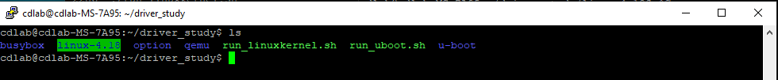
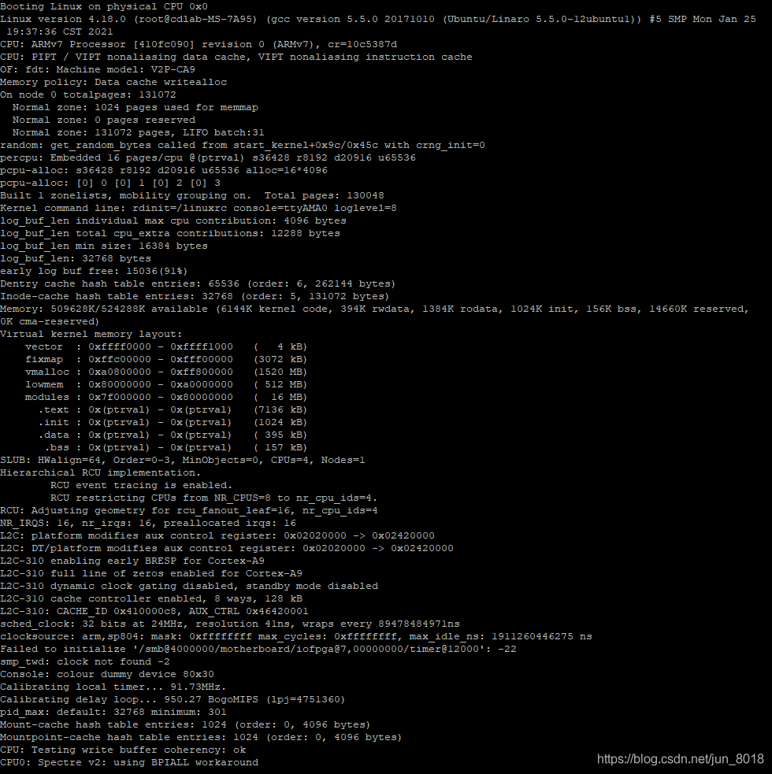
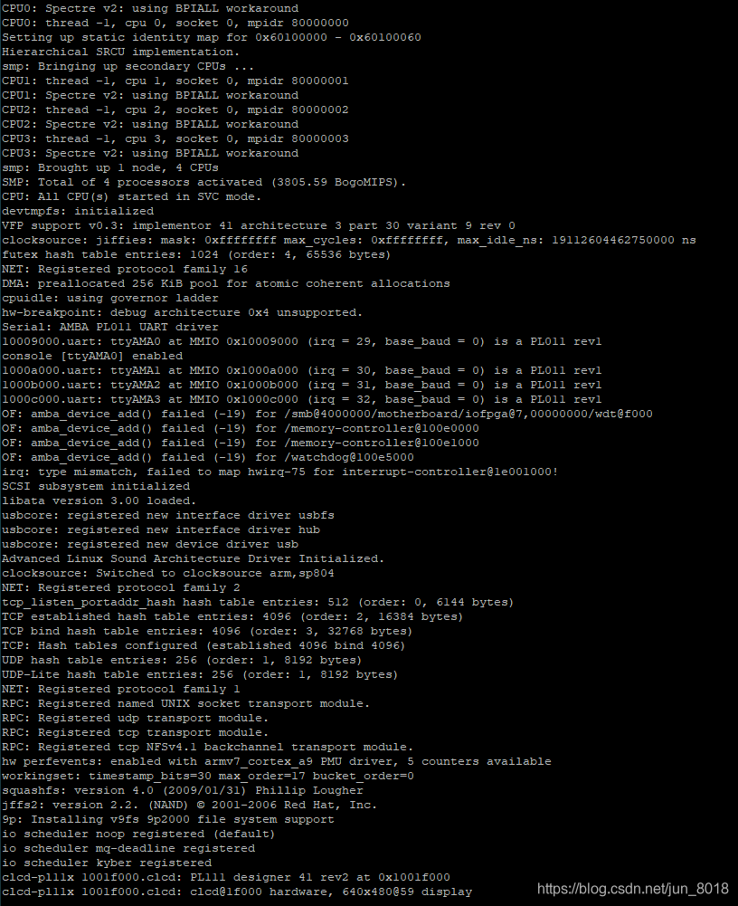
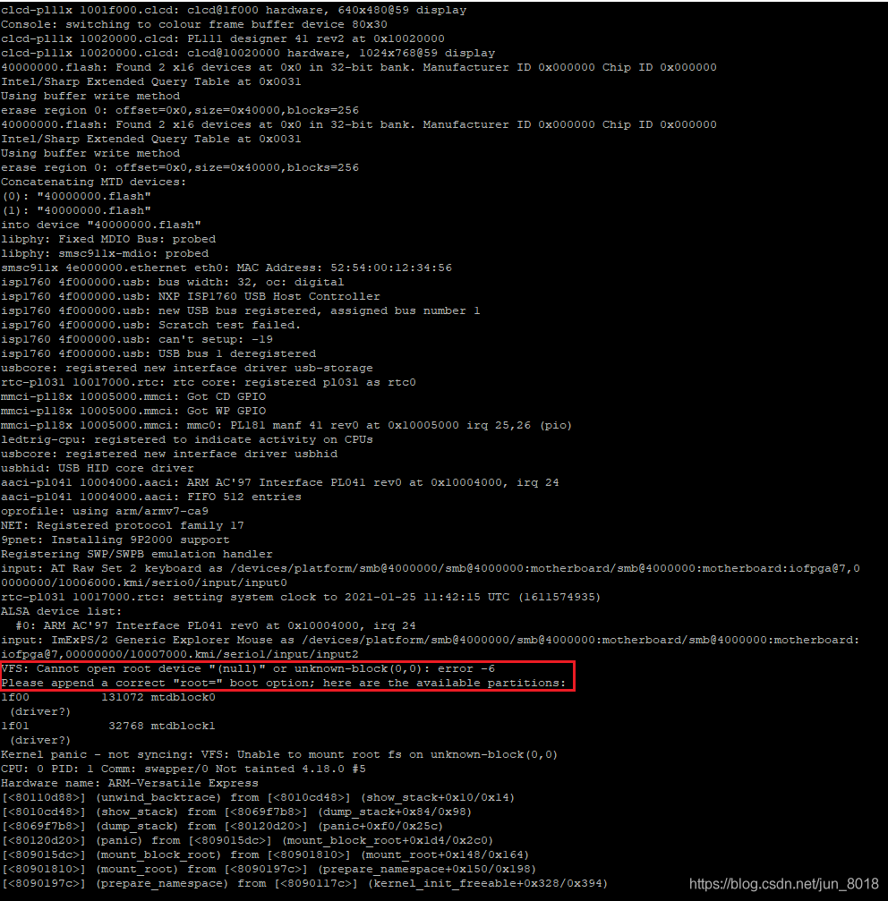
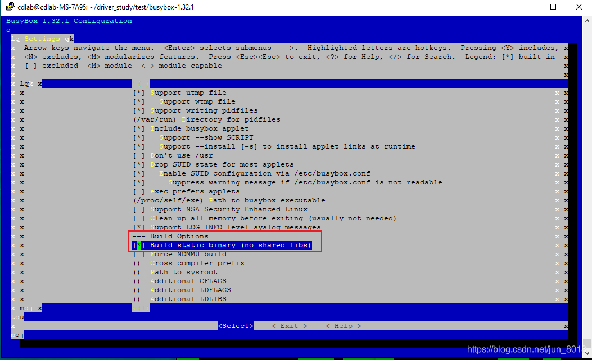
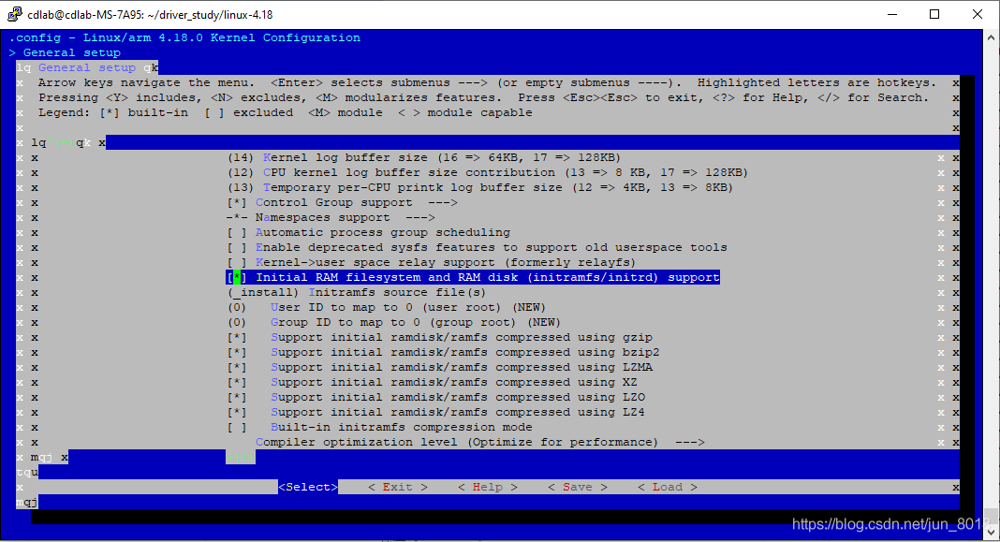
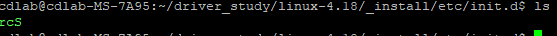
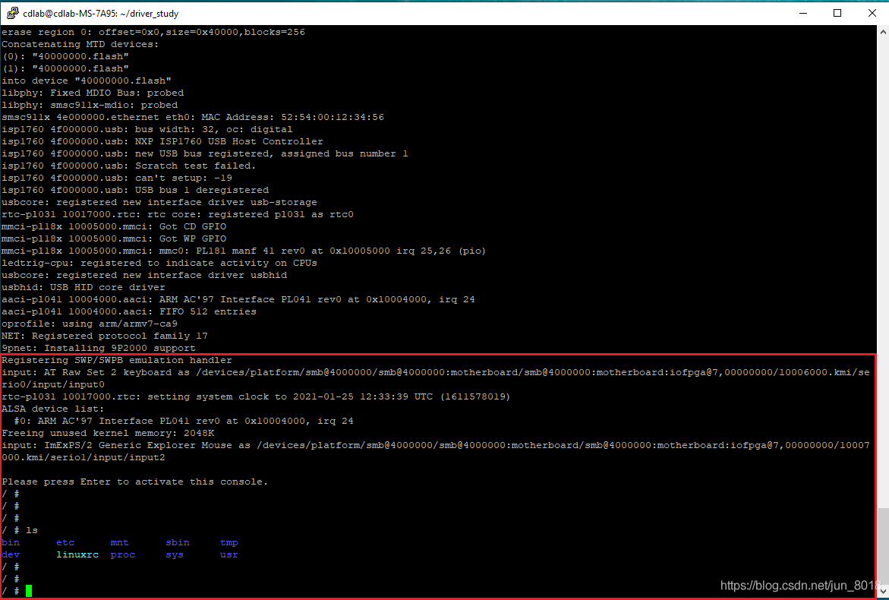
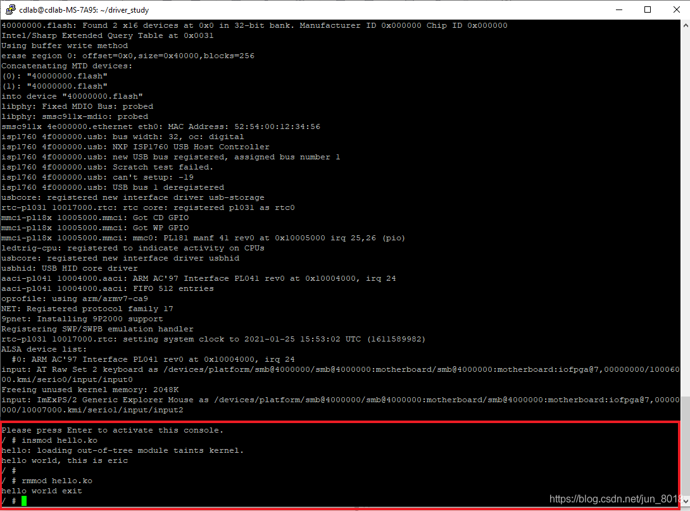

# 基于QEMU的Linux Driver开发环境的配置


# 1 工具集合

- QEMU 5.2.0
- Linux Kernel 4.18
- Busybox 1.32.1

# 2 配置Linux Kernel

笔者用`Linux 4.18`, 配置文件选用`vexpress_defconfig`， 如果关心Linux Kernel编译流程，请移步[Linux Kernel 编译流程(1)](https://blog.csdn.net/jun_8018/article/details/112792967)

```shell
#Linux kernel
wget https://cdn.kernel.org/pub/linux/kernel/v4.x/linux-4.18.tar.xz
tar xvf linux-4.18.tar.xz
cd linux-4.18
sudo make ARCH=arm CROSS_COMPILE=arm-linux-gnueabi- vexpress_defconfig
sudo make ARCH=arm CROSS_COMPILE=arm-linux-gnueabi-
sudo make ARCH=arm CROSS_COMPILE=arm-linux-gnueabi- dtbs 
```

编译完成后会在arch/arm/boot/目录下生成`zImage`

# 3 配置QEMU

编译`QEMU`过程中，可能会出现错误，请移步[Install QEMU 5.1.50](https://blog.csdn.net/jun_8018/article/details/109123670)

```shell
wget https://download.qemu.org/qemu-5.2.0.tar.xz
tar xvJf qemu-5.2.0.tar.xz
cd qemu-5.2.0
mkdir build && cd build
../configure
make
```

# 4 启动Linux Kernel

用`QEMU`启动`LinuxKernel`，笔者将命令放在`run_linuxkernel.sh`文件中，笔者目录如图所示


```shell
sudo qemu/build/qemu-system-arm -M vexpress-a9 -nographic -smp 4 -m 512 -kernel linux-4.18/arch/arm/boot/zImage -a      ppend "rdinit=/linuxrc console=ttyAMA0 loglevel=8" -dtb linux-4.18/arch/arm/boot/dts/vexpress-v2p-ca9.dtb
```




启动后会出现错误









错误发生的原因是没有文件系统，这里配置文件系统为Initial Ram filesystem


# 5 配置Busybox

笔者采用[Busybox 1.32.1](https://busybox.net/)来配置文件系统

```bash
tar xvf busybox-1.32.1.tar.bz2
cd busybox-1.32.1
sudo make ARCH=arm CROSS_COMPILE=arm-linux-gnueabi- menuconfig
```


选择`BusyboxSettings->Build Options`,将`busybox`设置为静态编译过程




采用下面的命令编译和安装`busybox`， 执行完命令后，会在`busybox`目录中生成`_install`目录， 里面包含 `bin linuxrc sbin usr`

```bash
sudo make ARCH=arm CROSS_COMPILE=arm-linux-gnueabi-
sudo make ARCH=arm CROSS_COMPILE=arm-linux-gnueabi- install
```


# 6 再次配置Linux Kernel

首先我们将busybox生成的_install目录拷贝到`Linuxkernel`目录下,然后打开配置文件，将红框中的内容填成`_install`





我们再次进入linux-4.18的 _install 目录中, 做如下操作。

- 添加如下目录 `dev/ etc/`


- 进入`dev`目录下添加 `console null` 文件


```shell
sudo mknod console c 5 1
sudo mknod null c 1 3
```

进入etc/目录中，添加`fstab，inittab`文件和`init.d`目录


其中`fstab`的内容如下：

```shell
proc /proc proc defaults 0 0
tmpfs /tmp tmpfs defaults 0 0
sysfs /sys sysfs defaults 0 0
tmpfs /dev tmpfs defaults 0 0
debugfs /sys/kernel/debug debugfs defaults 0 0
```

`inittab`的内容如下：

```shell
::sysinit:/etc/init.d/rcS
::respawn:-/bin/sh
::askfirst:-/bin/sh
::ctrlaltdel:/bin/umount -a -r




rcS的内容如下：

```shell
 #! /bin/sh
 mkdir -p /proc /tmp /sys /mnt
 /bin/mount -a
 mkdir -p /dev/pts
 mount -t devpts devpts /dev/pts
 echo /sbin/mdev > /proc/sys/kernel/hotplug
 mdev -s
```

添加完文件后还得修改`rcS`文件权限，不然会有权限问题，在启动过程中会发现

# 7 启动Linux Kernel

再次用QEMU启动Linux Kernel，大功告成.





# 8 举个小栗子-编写驱动

## 笔者以`hello world`开始  `hello.c`

```c
#include <linux/init.h>
#include <linux/module.h>

static int __init hello_init(void)
{
    printk(KERN_INFO "hello world, this is eric\n");
    return 0;
}

module_init(hello_init);

static void __exit hello_exit(void)
{
	printk(KERN_INFO "hello world exit\n");
}

module_exit(hello_exit);

MODULE_AUTHOR("eric dong");
MODULE_LICENSE("GPL v2");
```

## `Makefile`

```makefile
KVERS = $(shell uname -r)
KBUILD_CFLAGS += -fno-pic
#kernel modules
obj-m := hello.o
mod-dir := ~/driver_study/linux-4.18/lib/modules/4.18.0/build
build: kernel_modules

kernel_modules:
        make -C $(mod-dir) M=$(CURDIR) ARCH=arm CROSS_COMPILE=arm-linux-gnueabi- modules
clean:
        make -C $(mod-dir) M=$(CURDIR) ARCH=arm CROSS_COMPILE=arm-linux-gnueabi- clean
```


在编译之前，笔者发现`~/driver_stud/linux-4.18/lib`目录下没有`modules`, 在顶层`Makefile`发现需要执行`modules_install`，于是查看，得知需要在当前目录下创建

```shell
KERNELRELEASE = $(shell cat include/config/kernel.release 2> /dev/null)
#MODLIB	= $(INSTALL_MOD_PATH)/lib/modules/4.18.0
MODLIB	= $(INSTALL_MOD_PATH)/lib/modules/$(KERNELRELEASE)
#Target to install modules
PHONY += modules_install
modules_install: _modinst_
_modinst_:
	$(Q)$(MAKE) -f $(srctree)/scripts/Makefile.modinst
```


所以执行命令 sudo make ARCH=arm CROSS_COMPILE=arm-linux-gnueabi- INSTALL_MOD_PATH=. 当前目录.=linux-4.18/,执行完命令后，就能在/lib/下发现modules目录.

接着执行命令行make编译得到hello.ko
最后在QEMU中执行hello.ko, 如图所示




Done. Hope helpful for you guys.