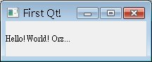
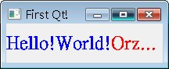

# 第一個 Qt 程式

## 環境安裝

1.在QT官網下載最新的版本http://qt-project.org/downloads<br>
我下的是qt-opensource-linux-x86-5.3.1.run,在終端執行<br>

```sh
sudo chmod a+x qt-opensource-linux-x86-5.3.1.run
./qt-opensource-linux-x86-5.3.1.run
```

然後選擇安裝目錄，默認是/home/username/QT5.3.1,我選擇在/opt/QT5

2.安裝成功後執行qmake -v 會發現找不到qmake命令，這是因為qmake沒有加入到環境變量中<br>
在～/.bashrc中的最後添加<br>
```sh
export PATH="/opt/QT5/5.3/gcc/bin":$PATH
```

然後要將剛加入的環境變量生效，可以註銷之後再登錄，也可以執行

```sh
source ～/.bashrc
```

在執行qmake -v的話，會有

```sh
root@zwq:~# qmake -v
QMake version 3.0
Using Qt version 5.3.1 in /opt/QT5/5.3/gcc/lib
```


## Hello for Qt

不 可免俗的，從最簡單的基本視窗產生開始介紹，視窗標題就叫作First Qt!!好了，請新增一個目錄hello，並在當中使用任一編輯器來編輯一個hello.cpp的檔案，內容如下： 
- hello.cpp

```cpp
#include <QApplication>
#include <QLabel>

int main(int argc, char *argv[]) {
     QApplication app(argc, argv);

     QLabel *label = new QLabel("Hello!World! Orz...");
     label->setWindowTitle("First Qt!");
     label->resize(200, 50);
     label->show();

     return app.exec();
}
```
要使用Qt的元件，必須含入（include）相對應的定義檔案，程式的第一行含入了QApplication與QLabel標頭檔案（header file），稍後才可以使用QApplication與QLabel兩個元件的定義類別。

每個Qt視窗程式，都必須有且只能有一個QApplication物件，它管理了整個應用程式所需的資源，QLabel是Qt的圖型元件之一，繼承自 QWidget，Widget這個名稱來自Window Gadget，表示可視的使用者介面元件，可接受使用者的動作操作，文字畫面、按鈕、捲軸、工具列甚至容器（Container）等都是一種 Widget。

C++程式從main開始，再來進行Qt元件的初始化動作，在第一行中：
`QApplication app(argc, argv);`

QApplication負責程式的初始、結束及處理事件（event）的迴圈等，並提供基本的視窗外觀，這個外觀與系統的桌面環境有關，例如標題列的樣式、視窗外觀、系統功能鍵等，在不同的作業系統桌面環境下，會有各自不同的外觀，QApplication 物件接受命令列引數作為它的引數，像是如果您沒有設定視窗標題，且會使用執行檔的名稱作為視窗標題名稱，可以使用的引數與其作用，可以查詢Qt線上文件關於QApplication類別的說明。 

接著建立QLabel元件，它用以顯示所指定的文字（在這邊指定了"Hello!World! Orz..."），setWindowTitle()用以設定視窗標題，如果不設定標題，則會自動以程式的檔案名稱作為標題，resize()方法用以設 定元件的長、寬，單位是像素（Pixel），Qt的元件預設是不可視的，所以要使用show()方法將之顯示出來。

如果您曾經寫過 Qt3，可以發現在Qt4中，不用指定MainWidget了，您可以設定Widget的parent/child關係，沒有指定parent的Widget，就是一個獨立的獨立視窗（window），要顯示獨立的window，就直接呼叫其show()方法，parent/child的設定實例，可以參考 使用 Signal 與 Slot（使用拉桿改變LCD數字）。

在最後一行，呼叫了QApplication的exec()方法，這將程式的控制權交給了QApplication，exec()方法會提供一個事件處理迴圈，視窗顯示之後會不斷傾聽（listen）事件，像是鍵盤、滑鼠等動作所引發的事件，

撰寫好程式存檔之後，就可以開始進行make的動作，必須先產生Makefile，Qt提供了qmake程式來協助建立Makefile，它可以自動根據目 前目錄下檔案產生*.pro的專案檔（project file）：

```sh
qmake -project
```
然後根據專案檔產生Makefile：
```sh
qmake 
```

接下來就可以進行make： 
```sh
make 
```

make完成之後，可以在debug目錄下找到產生的hello.exe檔案，直接執行：
```sh
hello
```

如果您要可以在Windows下直接double click就執行程式，記得系統環境變數中要設定PATH包括Qt安裝目錄下的bin目錄，執行時的參考畫面如下所示：



如果要建構release版本，則使用make時指定-f與Makefile名稱，例如：

```sh
make -f Makefile.Release
```

則您可以在release資料夾下看到建構好的檔案。

QLabel支援HTML標籤，如果您把程式改為以下的內容：

```cpp
#include <QApplication>
#include <QLabel>

int main(int argc, char *argv[]) {
     QApplication app(argc, argv);

     QLabel *label = new QLabel(
      "<h1><font color=blue>Hello!World!</font><font color=red>Orz...</font></h1>");
     label->setWindowTitle("First Qt!");
     label->resize(200, 50);
     label->show();

     return app.exec();
}
```




重新建置之後，執行結果將顯示如下：
