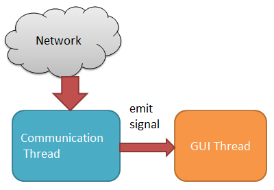
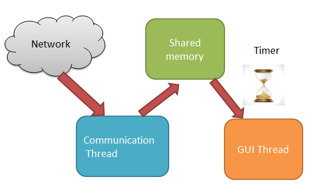

# 花了 6 年才找到的 bug?


Qt 筆記: 花了 6 年才找到的 bug?
最近有位高手 Heresy 寫了一篇 Boost 與 Qt 的 Signal / Slot 效能測試，讓筆者赫然發現可能跟這幾年產品的效能瓶頸脫不了干係。於是小弟也手癢寫了幾隻程式測試一下，因為 Heresy 兄已經做過了，這邊不再比對 virtual function, boost 與 Qt Signal/Slot 的效能差異。這邊要比對的是 Qt::DirectConnection 與 Qt::QueuedConnection 的效能差異。也就是thread 內與跨 thread signal/slot 效能會差多少？

測試環境

- VirtualBox + Ubuntu 12.04
- CPU: Intel i5 3.2GHz 4 cores
- Hard Drive: 256G SSD
- Main Memory: 4G
- Qt: 4.8.5

##測試 1. Qt::DirectConnection

```cpp
//sender.h
#ifndef SENDER_H
#define SENDER_H
 
#include <QObject>
 
class Sender : public QObject
{
    Q_OBJECT
public:
    explicit Sender(QObject *parent = 0);
    void run(uint val);
signals:
    void mysignal(uint val);
public slots:
 
};
 
#endif // SENDER_H
```


```cpp
//sender.cpp
#include "sender.h"
 
Sender::Sender(QObject *parent) :
    QObject(parent)
{
}
 
void Sender::run(uint val)
{
    emit mysignal(val);
}
```

```cpp
//receiver.h
#ifndef RECEIVER_H
#define RECEIVER_H
 
#include <QObject>
 
class Receiver : public QObject
{
    Q_OBJECT
public:
    explicit Receiver(QObject *parent = 0);
 
signals:
 
public slots:
    void myslot(uint val);
 
private:
    uint total_;
 
};
 
#endif // RECEIVER_H
```

```cpp
//receiver.cpp
#include "receiver.h"
 
Receiver::Receiver(QObject *parent) :
    QObject(parent),
    total_(0)
{
}
 
void Receiver::myslot(uint val)
{
    total_ += val;
}
```

```cpp
//main.cpp
#include <QtCore/QCoreApplication>
#include <QDateTime>
#include <QTimer>
#include "sender.h"
#include "receiver.h"
 
int main(int argc, char *argv[])
{
    QCoreApplication app(argc, argv);
    Sender s;
    Receiver r;
    QObject::connect(&s, SIGNAL(mysignal(uint)), &r, SLOT(myslot(uint)));
 
    quint64 before = QDateTime::currentMSecsSinceEpoch();
    for(uint i = 0; i < 100000000; ++i)
        s.run(i);
    qDebug("%u ms", uint(QDateTime::currentMSecsSinceEpoch()-before));
    QTimer::singleShot(0, &app, SLOT(quit()));
    return app.exec();
}
```

emit signal 一億次的結果是需要 7.x 秒左右。 

##測試 2. Qt::QueuedConnection

因為 sender.h/cpp, receiver.h/cpp 與測試 1 相同，此處不再重複。另外下面的程式有點問題，不知道您看出來了嗎？
?

```cpp
//testthread.h
#ifndef TESTTHREAD_H
#define TESTTHREAD_H
 
#include <QThread>
#include "sender.h"
 
class Receiver;
class TestThread : public QThread
{
    Q_OBJECT
public:
    explicit TestThread(Receiver *r, QObject *parent = 0);
 
protected:
    void run();
 
signals:
 
public slots:
 
private:
    Sender snd_;
 
};
 
#endif // TESTTHREAD_H
```
```cpp
//testthread.cpp
#include <QDateTime>
#include "testthread.h"
#include "receiver.h"
 
TestThread::TestThread(Receiver *r, QObject *parent) :
    QThread(parent)
{
    snd_.moveToThread(this);
    connect(&snd_, SIGNAL(mysignal(uint)), r, SLOT(myslot(uint)));
}
 
 
void TestThread::run()
{
    quint64 before = QDateTime::currentMSecsSinceEpoch();
    for(uint i = 0; i < 100000000; ++i)
        snd_.run(i);
    qDebug("%u ms", uint(QDateTime::currentMSecsSinceEpoch() - before));
}
```


```cpp
//main.cpp
#include <QtCore/QCoreApplication>
#include <QDateTime>
#include <QTimer>
#include "sender.h"
#include "receiver.h"
#include "testthread.h"
 
int main(int argc, char *argv[])
{
    QCoreApplication app(argc, argv);
    Receiver r;
    TestThread tt(&r);
    tt.start();
    return app.exec();
}
```

結果要花上 11x-14x 秒，也就是比測試 1 慢上 15-20 倍！如果您去追蹤 Qt source code，您會發現他的 message loop 使用 select()/epoll() 傳遞訊息，也就是必須在 user space <-> kernel space 間來回穿梭，外加 thread context switch overhead。

如果以 Heresy 兄的比較為基準，在他的測試結果中 ，Qt signal/slot 比一般 function member 慢了 75 倍，inter-thread signal/slot 就是慢了 1125-1500 倍(15 * 75 = 1125, 20 * 75 = 1500)！

在 x86 CPU 上可能還無所謂，但在 Embedded Linux 上就是很可怕的開銷，老闆會開始抱怨為何 CPU 要從 ARM9 400MHz 換成 Cortex A8！？

我們再往下看，Qt 在什麼使用場景下會產生大量的 signal。

##當 Qt 遇上通訊




有人的做法是用一個 thread polling 網路上的訊息，然後用 emit signal 傳給 GUI thread 更新畫面。這樣做會有幾個問題，除了上面的範例程式已經告訴你，光是把一個 32bit 整數由一個 thread 的 signal 傳給另外一個 thread 的 slot，代價是 local signal/slot 的 10-15 倍。另外兩個問題是：

- thread context switch 時機點無法預測
- 網路通訊延遲

這樣做，很難保畫面更新不會「怪怪的」

而且由於 Linux Qt 底層走的是 select()/epoll()，他也不是最快的 IPC，要知道既然是 multi-threading，那代表兩個 thread 共享位址空間。另外，為了保證能準時更新畫面，用 timer 才是最保險的，所以改成下面的架構是否合理多了？(下圖的 shared memory 與常見的 UNIX IPC shmem 不是同一個東西，因為同一個 process 內的兩個 thread 本來就能共享位址空間)。



(其實，上圖的架構在畫面更新的正確作法一文已經提過了...)

當然，有人會說幹麼不用 Qt 本身提供的網路功能就好了？這有一些理由，比方說 Qt 5 之前不支援 serial port，或者是很多人已經很習慣 per thread + blocking IO 的作法了(以筆者碰到的例子是因為前人留下的包袱)，也有可能你是整合非 qt 架構的 source 進入專案。

不過這也是很值得討論的方向。究竟 Qt 有沒有用到該平台上效能最佳的 IO 模型，例如 Windows IO Completion Port，Linux epoll？