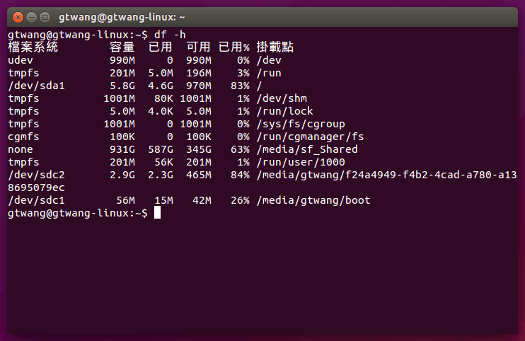

# 燒錄新版系統

# Raspberry_Pi


```sh
https://www.raspberrypi.org/downloads/
```

### Linux
插入 MicroSD 卡之後，先使用 df 查看硬碟狀況，判斷 MicroSD 卡的磁碟編號：

```sh
df -h
```



這個例子而言，我的 MicroSD 卡是 /dev/sdc，接著把 MicroSD 卡上的所有分割區卸載：

```sh
sudo umount /dev/sdc1
sudo umount /dev/sdc2
```

### 用 dd 指令寫入 img 檔：
```sh
sudo dd bs=1M if=2015-02-16-raspbian-wheezy.img of=/dev/sdc
```
或用 dcfldd 寫入，這樣在寫入的過程中會即時顯示進度：

```sh
sudo dcfldd bs=1M if=2015-02-16-raspbian-wheezy.img of=/dev/sdc
```
或是用 dd 配合 pv 亦可：
```sh
dd bs=1M if=2015-02-16-raspbian-wheezy.img | pv | sudo dd of=/dev/sdc
```


### GTKTerm
```sh
sudo gtkterm
```


###Console serial parameters
```
The following parameters are needed to connect to the Pi console, and apply on both Linux and Windows.
Speed (baud rate): 115200
Bits: 8
Parity: None
Stop Bits: 1
Flow Control: None
```
###Linux terminal set up
```
If your PC is running Linux, you will need to know the port name of its serial port:
Built-in (standard) Serial Port: the Linux standard is /dev/ttyS0, /dev/ttyS1, and so on
USB Serial Port Adapter: /dev/ttyUSB0, /dev/ttyUSB1, and so on.
Some types of USB serial adapter may appear as /dev/ttyACM0 ...
```
