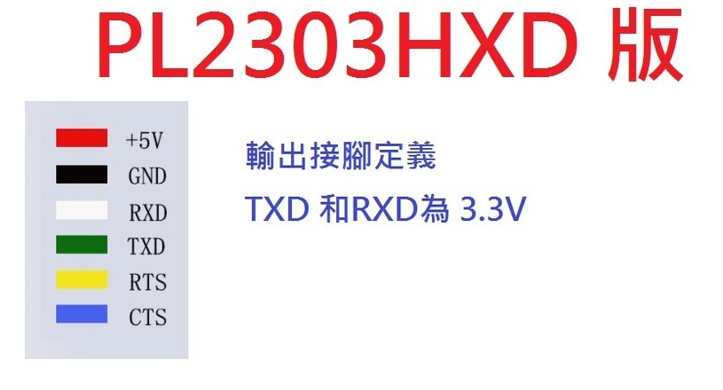
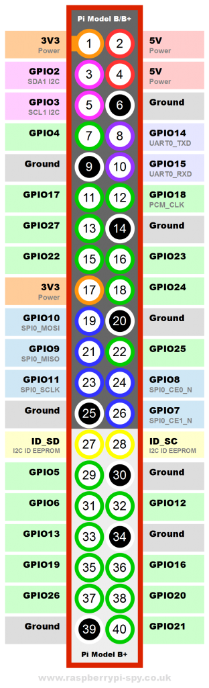

# Hello world on qemu Raspberry Pi


##1.Install Raspberry Pi qemu
```
git clone -b rpi https://github.com/Torlus/qemu/
configure --prefix=/usr/local/qemu_rpi --target-list=arm-softmmu,arm-linux-user,armeb-linux-user --enable-sdl
make & sudo make install
```

## 2.Sample Helloworld

### boot.asm
```c
#
#
#   reference:
#   david leels <davidontech@gmail.com>
#   http://stackoverflow.com/questions/6870712/beagleboard-bare-metal-programming
#

#UART3 THR_REG register address
.equ UART3_THR_REG, 0x20201000

.arm

_start:
    ldr r0,=UART3_THR_REG
    adr	r1,.L0
	bl helloworld
.L1:
	b	.L1

.align 2
.L0:
	.ascii	"helloworld\n\0"
```

### helloworld.c -r0, r0 for argv0 , r1 for argv1

```c
/*
helloworld.c:
Copyright (C) 2009  david leels <davidontech@gmail.com>

This program is free software: you can redistribute it and/or modify
it under the terms of the GNU General Public License as published by
the Free Software Foundation, either version 3 of the License, or
(at your option) any later version.

This program is distributed in the hope that it will be useful,
but WITHOUT ANY WARRANTY; without even the implied warranty of
MERCHANTABILITY or FITNESS FOR A PARTICULAR PURPOSE.  See the
GNU General Public License for more details.

You should have received a copy of the GNU General Public License
along with this program.  If not, see http://www.gnu.org/licenses/.
*/


// this will call by bl helloworld, *addr is r0 , *p is r1
int helloworld(unsigned int *addr,const char *p){
	while(*p){
		*addr=*p++;
	};
	return 0;
}
```

### linker.ld linkscript, linker text section to 0x80000000.
```c
/*
* reference:
* http://stackoverflow.com/questions/6870712/beagleboard-bare-metal-programming
*/

/* rammap */
MEMORY
{
    ram : ORIGIN = 0x80000000, LENGTH = 0x10000
}

SECTIONS
{
    .text : { *(.text*) } > ram
}
```

### Makefile
```c
ARMGNU = arm-none-eabi

AOPS = --warn --fatal-warnings
COPS = -Wall -Werror -O2 -nostdlib -nostartfiles -ffreestanding

boot.bin: boot.asm
	$(ARMGNU)-gcc -O2 -c helloworld.c
	$(ARMGNU)-as boot.asm -o boot.o
	$(ARMGNU)-ld -T linker.ld boot.o helloworld.o -o boot.elf
	$(ARMGNU)-objcopy boot.elf -O binary boot.bin

clean:
	rm *.elf *.o *.bin -f
```

## run on Qemu

```c
/usr/local/qemu_rpi/bin/qemu-system-arm -kernel boot.bin -cpu arm1176 -m 256 -M raspi -serial stdio
```

## run on Raspberry Pi B+ board

1.download offical boot firmware，https://github.com/raspberrypi/firmware/tree/master/boot

 copy start.elf, bootcode.bin to SD card。

2.copy boot.bin to SD card replace kernel.img，using UART port check result，console shows Helloworld.

appendix





##Refence

http://wiki.osdev.org/Raspberry_Pi_Bare_Bones
https://lbd.hackpad.com/ep/pad/static/dUGFyJw9Hva
