# Building and Deploying Raspberry PI Kernel


This tutorial shows how to build a Raspberry PI kernel and install it on the device. As building the kernel on Raspberry PI itself could take several days due to a relatively slow CPU, we will be using an additional Linux machine to build it.

- Raspberry PI kernel is stored in a Git repository and requires installing a Git client to fetch the files. Install the client on your build machine. E.g. on Debian-based systems it can be done by running the following command:

```c
sudo apt-get install git
```

- Create a directory to store Raspberry-related files (e.g. /home/<username>/raspberry) and run the following command in that directory:

```c
git clone https://github.com/raspberrypi/linux.git
```

The Raspberry PI kernel source will be downloaded to the 'linux' subdirectory (1.5-2 GB):

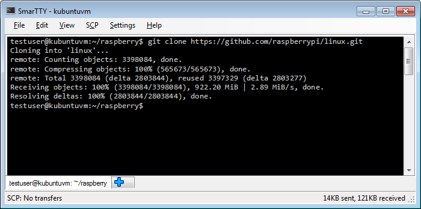

- Download Raspberry PI cross-compilers by running the following command on your build machine:

```c
git clone https://github.com/raspberrypi/tools

```

The tools will be unpacked into the 'tools' subdirectory and will occupy ~1GB of space:

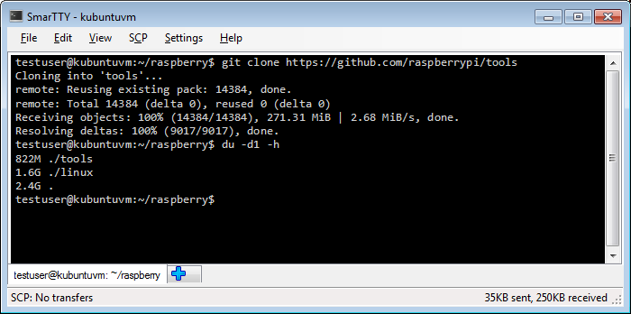

- The Raspberry PI tools directory contains several toolchain versions:
    - tools/arm-bcm2708/arm-bcm2708hardfp-linux-gnueabi
    - tools/arm-bcm2708/arm-bcm2708-linux-gnueabi
    - tools/arm-bcm2708/gcc-linaro-arm-linux-gnueabihf-raspbian

The last one is the toolchain containing the linaro patches, so we will use it for cross-compilation. Set the CCPREFIX environment variable to the prefix of the third toolchain and test it by invoking GCC using the prefix, e.g.:

```c
export CCPREFIX=/home/testuser/raspberry/tools/arm-bcm2708/gcc-linaro-arm-linux-gnueabihf-raspbian/bin/arm-linux-gnueabihf-
${CCPREFIX}gcc -v
```

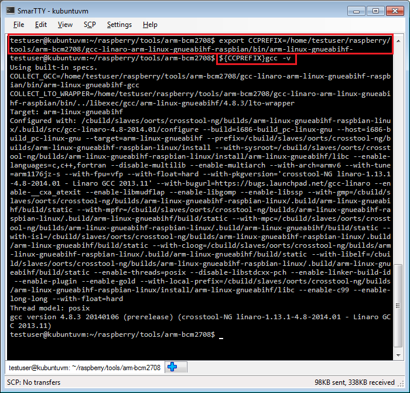


- Before we can build the kernel we need to configure it. A very good starting point would be the configuration file from your existing Raspberry PI that can be obtained by reading and unpacking the /proc/config.gz file on Raspberry PI. Go to the 'linux' subdirectory with the downloaded kernel sources and run the following commands there (assuming 'raspberrypi' is the host name of your Raspberry PI):

```c
scp pi@raspberrypi:/proc/config.gz .
gunzip -c config.gz > .config
```

If the config.gz file is missing, run the following command to load the module that provides it:

```c
sudo modprobe configs
```

- Run the following command in the Linux kernel source directory to bootstrap the new kernel configuration from the .config file obtained from Raspberry PI. Note that if you used an old SD card image, you will get a lot of questions on recently added features not mentioned in the old config file:

```c
ARCH=arm CROSS_COMPILE=${CCPREFIX} make oldconfig
```


`Do not forget to specify ARCH. Otherwise the kernel will be configured using x86 configuration options and will be missing ARM ones leading to a build failure.`


- Now reset all previous options related to debug symbols and enable them explicitly:

```c
grep -v DEBUG_INFO < .config > newconfig
mv newconfig .config
ARCH=arm CROSS_COMPILE=${CCPREFIX} make oldconfig
```

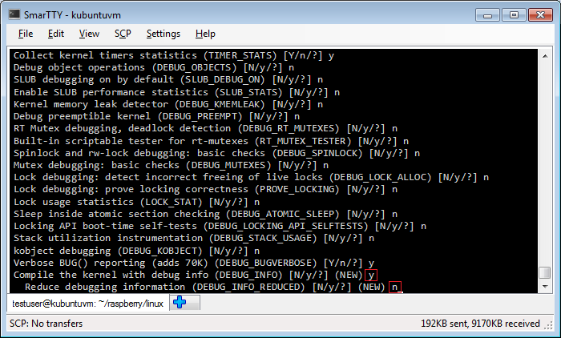


Enable the 'DEBUG_INFO' option and don't enable the DEBUG_INFO_REDUCED option.

- Now it's time to build the kernel. Run the following command:

```c
ARCH=arm CROSS_COMPILE=${CCPREFIX} make
```


Building the kernel can take several hours and can be sped up by adding a '-j<amount of cores>' on a multi-core machine to parallelize the build.

- Once the kernel build is complete we need to verify that it contains the symbols. Open the kernel image using the gdb from the cross-toolchain and look at the value of init_uts_ns.name.release:


```c
${CCPREFIX}gdb vmlinux
print init_uts_ns.name.release
```

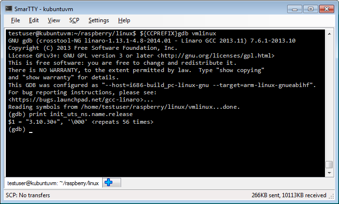


If GDB can display the kernel release string, the kernel has been built with sufficient symbols for kernel debugging.

- Now that we have verified that the kernel contains the symbols, we will need to generate a directory containing kernel modules that Raspberry PI can load when needed. Run the following command to copy the modules to the '../modules' directory:

```c
ARCH=arm CROSS_COMPILE=${CCPREFIX} 
INSTALL_MOD_PATH=../modules make modules_install
```

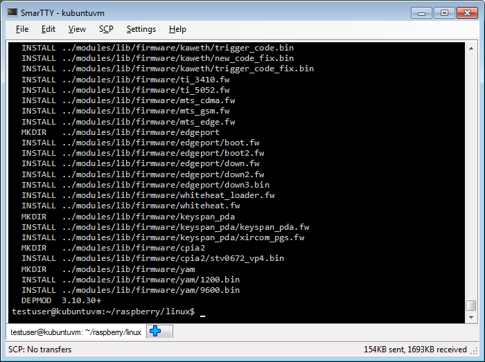

- Now we need to upload the new kernel and the new modules to Raspberry PI. First we will create an uncompressed kernel image and upload it to the temporary directory on Raspberry PI. Run the following commands on your build machine:

```c
cd <raspberry pi downloads>/tools/mkimage
./imagetool-uncompressed.py ../../linux/arch/arm/boot/zImage
scp kernel.img pi@raspberrypi:/tmp

```


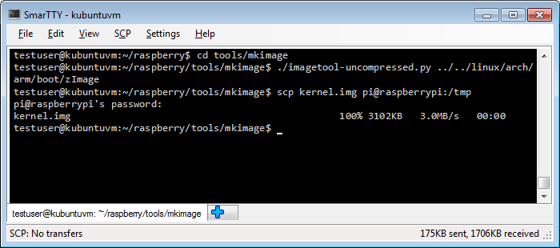


- Then go to the 'modules' subdirectory we created before, make a tar archive containing the modules and upload it to Raspberry PI:

```c
cd <raspberry pi downloads>/tools/modules
tar czf modules.tgz *
scp modules.tgz pi@raspberrypi:/tmp
```

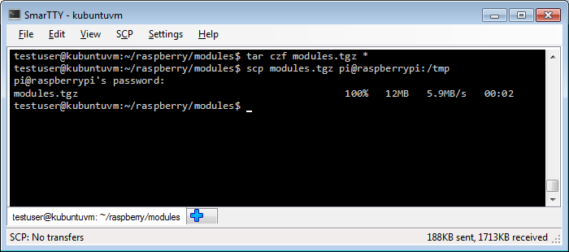

- Finally we need to install the kernel and the modules. Connect to your Raspberry PI over SSH and run the following commands:

```c
cd /
sudo mv /tmp/kernel.img /boot/
sudo tar xzf /tmp/modules.tgz
rm /tmp/modules.tgz

```

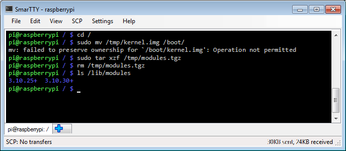


If you now list the contents of /lib/modules you will see that it now also contains the modules for the new kernel.
- Restart your Raspberry PI to boot the new kernel:

```c
sudo shutdown -r now
```


- Once Raspberry PI boots, connect to it over SSH and run the 'uname -r' command to see the new kernel release:


The release string should match the one we queried before when testing the kernel symbols.
- Now you should be able to debug your kernel. Follow our Raspberry PI JTAG setup tutorial if you have not done that already. Once the JTAG connection is established, begin debugging by running the following command on your build machine:

```c
${CCPREFIX}gdb vmlinux
```

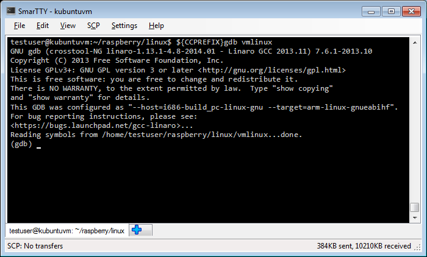


- Connect to OpenOCD by running the "target remote <OpenOCD host>:3333" command and display the stack trace using the bt command:

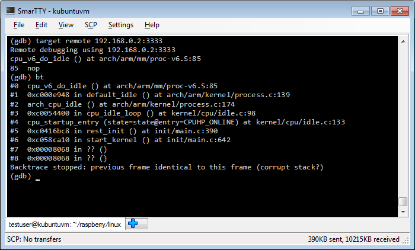


- Now we'll test breakpoint support by setting a breakpoint at the `sys_open()` function:


```c
break sys_open
continue
```

- Now go to the Raspberry PI SSH window and run 'ls /tmp' command. The sys_open breakpoint will be triggered. Run "print (char *)filename" to see the name of the file being opened:


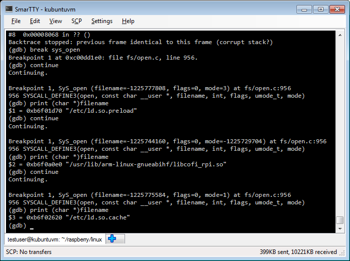


You will see that the Linux kernel is opening handles to libraries used by the 'ls' command.
Now that the basic debugging works you can setup a VisualKernel project to create and debug a basic kernel module.