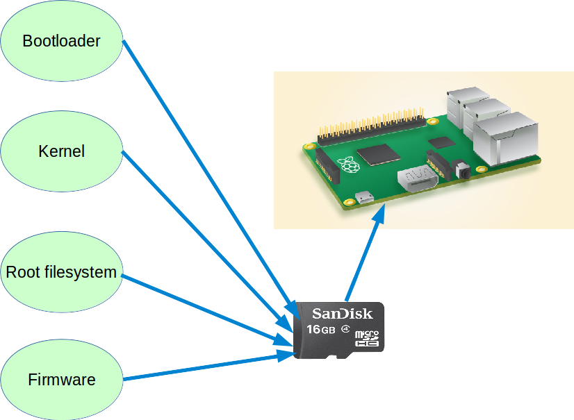
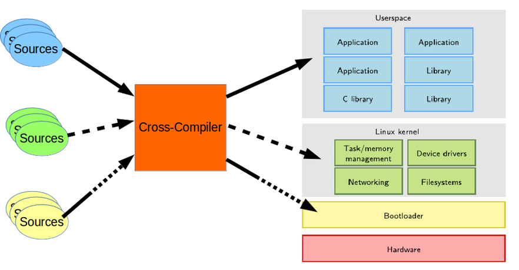
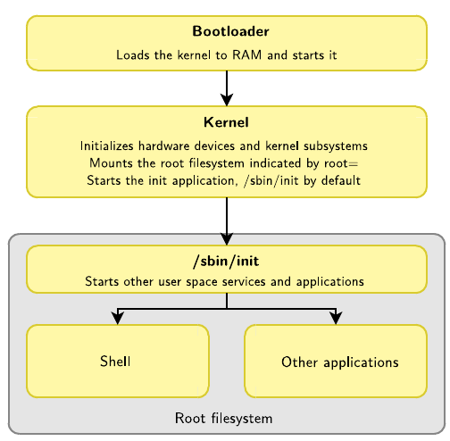
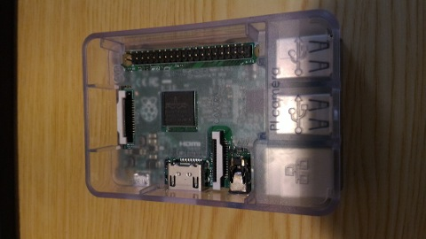
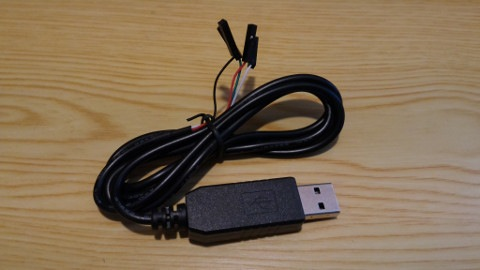
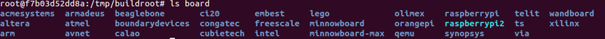

# buildRoot study - 建立自己的作業系統

[轉] http://fichugh.blogspot.tw/2016/02/buildroot-study.html  

##Introduction
因為想要了解整個Linux作業系統，從開機到系統穩定的中間流程，到底經歷過哪幾個步驟，
所以想要自己兜「boot-loader」,「kernel」和「root file system」，
研究過程中發現了，原來早已經有組織在從事類似的專案，像是「Buildroot」，「Yocto/OpenEmbedded」
所以我就想來研究一下Buildroot的架構。


這篇文章的成果會從Buildroot專案中build出「bootloader」, 「kernel」和「root fileSystem」，
然後我們會在將這幾個元件和官方的firmware放到raspberry pi 2裏面開機後來研究整個開機流程。




## Buildroot


以一個專案標語：Making Embedded Linux Easy啟動的這個專案，
基本的概念就是先建立一個自用的cross-compilation toolchain，
然後經由這個這個cross-compiler去編譯kernel和建立root file system。

主要的設計理念是：
- Simple to use
- Simple to customize
- Reproducible builds
- Small root filesystem
- Relatively fast boot
- Easy to understand

那有誰在用呢？
- System makers
    - Google
    - Barco
    - Rockwell Collins

- Processor vendors
    - Imagination Technologies
    - Marvell
    - Atmel
    - Analog Devices


當然除了以上大公司，還有很多其他公司和業餘愛好者都會用它來開發版子。

##Simplified Linux system architecture
一個簡單的Linux系統架構，如下圖，主要分為4個部份：

```sh
1.  Hardware
2. Boot loader
3. Linux Kernel
4. User space (Applications)
```

除了Hardware以外，Buildroot專案建制過程中其他的3個部份都會自己建置。
所以建制完後，我們主要會有「ToolChain」, 「bootloader image」, 「kernel image」和「root fileSystem image」。





假設我們的專案現在已經建制好了，也已經放到儲存裝置（Flash or EMMC ....），電源插上去後，
第 1 個跑的程式就是BootLoader，他會啟動一些基本的驅動程式，以供開機中使用，最終就是將kerner載入到記憶體裡，接下來就是將控制權轉交給Kernel。<br>
第2個就是Kernel會初始化硬體裝置和我們的檔案系統，然後執行第一個程式/sbin/init。<br>
第3步init就會啟動剩下來user space的service和application。<br>
第4步我們通常就會看到login shell展示再我們面前了，在後面章節會有更詳細的介紹。<br>




## Preparation
Ubuntu
這邊使用的Host OS是Ubuntu。

數莓派[廢話]



TTL Cable [天瓏書局有在賣]




##Docker

使用一個完全乾淨的Container來做這件事，
事情會比較單純化，也會加深很多印象。<br>
詳細Docker內容請參考網站。

##開啟Docker

```sh
sudo docker run -t -i -v ~/mnt/mnt_docker:/tmp/package ubuntu bash
```

~/mnt/mnt_docker : /tmp/package語法是host 和container的資料共享 => host folder ： Container folder
接下來所有內容都是在Docker裏面執行的。

## 下載套件

```sh
sudo apt-get update
sudo apt-get install g++ make gawk -y
sudo apt-get install git-core libncurses5-dev vim -y
sudo apt-get install wget python unzip bc -y
```

## Build buildRoot

### 最簡單的建置法

```sh
git clone git://git.busybox.net/buildroot
cd buildroot/
make raspberrypi2_defconfig
make 2>&1 | tee build.log
```
結束~~<br>
但是我要故意把他複雜化，這樣才可以理解他裏面的運作原理！<br>
請接下面的Build Step by Step開始。<br>


## Build Step by Step
### get sources by git

```sh
cd /tmp/
git clone git://git.busybox.net/buildroot
cd buildroot/
```

`get build information`
buildroot裏面有很多內建的組態，



裏面有raspberrypi2！
在來看一下怎麼弄，很簡單

```sh
vim /board/raspberrypi2/readme.txt
```


官方github上的文件--> [請點我](https://git.busybox.net/buildroot/tree/board/raspberrypi/readme.txt)

##Download all Sources 
buildroot的所有package, sources都是build之前才會從網路上下載下來，所以第一次build會很久，
因為包含下載，所以這邊我們先來研究一下，他下載了多少東西，請下指令：


```sh
make help
```

發現裏面有個指令是

```sh
source - download all sources needed for offline-build
```
下載所有資源之前要先建立組態

```sh
make list-defconfigs
```
上面這個指令會顯示目前有支援多少預設的組態，
我們發現有數莓派2的，所以下以下指令：
 
 ```sh
 make raspberrypi2_defconfig
 ```
 
然後只要下這個指令就會下載所有個資源：

```sh
make source
```

套件說明：
總共下載了21個套件，下載完的套件都放在資料夾「dl」裏面，
底下就來介紹一下每個套件大概的用途：
- xz-5.2.2:
 包含對檔案的壓縮和解壓縮，裏面提供了「lzma」和新的「xz」壓縮的格式。
- gcc-4.9 - 略
- binutils-2.24 - 略
- gmp-6.1.0 - 略
- mpc-1.0.3 - 略
- mpfr-3.1.3 - 略
- linux-header - 略
以上6個套件都是用來建立Corss-Compiler的，請參考我之前發過的主題「How to Build a GCC Cross-Compiler」裏面的套件說明有解釋。
- m4-1.4.17:
裏面包含了巨集處理器(macro processor)。
- uClibc-ng-1.0.12
是一種C的library，一般來說都是用Glibc，但是這邊選用uClibc，因為他比較小，也支援沒有MMU的架構，非常適合比較小的系統（< 10 MB）。
- kmod-22:
包含了讀取kernel module的函式庫和程式。
- pkgconf-0.9.12:
在設定組態或者在make 專案時，這個套件會傳遞一些include和library的路徑給建置的軟體。
- busybox-1.24.1
Busybox在單一的可執行文件中提供了精簡的Unix工作集，可運行於多款POSIX環境得的操作系統。
- dosfstools-3.0.28
可以讓使用者在GNU/Linux OS上很快速的建立，設立標籤和檢查MS-DOS FAT 的檔案格式（mkfs.fat, fsck.fat and fatlabel）。
- e2fsprogs-1.42.13:
裏面有處理ext2 檔案系統的程式。當然他也支援ext3和ext4。
- genext2fs-1.4.1
這個程式可以讓你建立ext2的檔案系統。
- genimage-8
可從一個root filesystem裏面建立多種檔案系統和flash image。
- confuse-2.8:
libcoufuse提供了一些組態分析函式庫。
- flex-2.5.37:
裏面的套件可以產生可辨識文字pattern的程式(反正就是正規表示法那些東西)。
- mtools-4.0.18:
是一套允許讓Unix系統去操控MS-DOS格式上的檔案操作，像是讀寫檔，和搬運檔案等等。
- rpi-firmware:
數莓派官方release出來的軔體，這部份待回會在說明。
- fakeroot_1.20.2.orig
可用來模擬root的權限去做一些操作。

修改組態
如果想要自己修改設定，就跟修改kernel 組態一樣，
這邊我們來修改一下兩個設定，請輸入