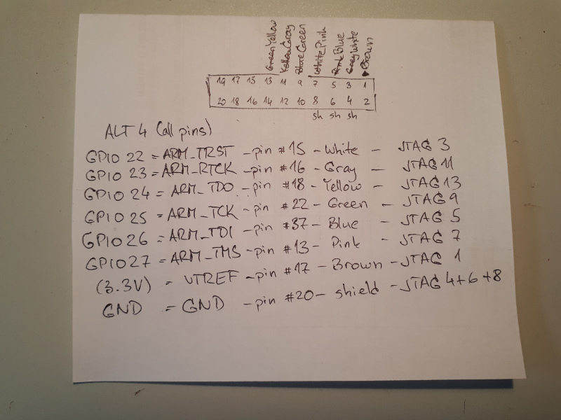
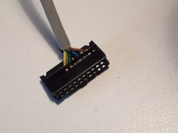
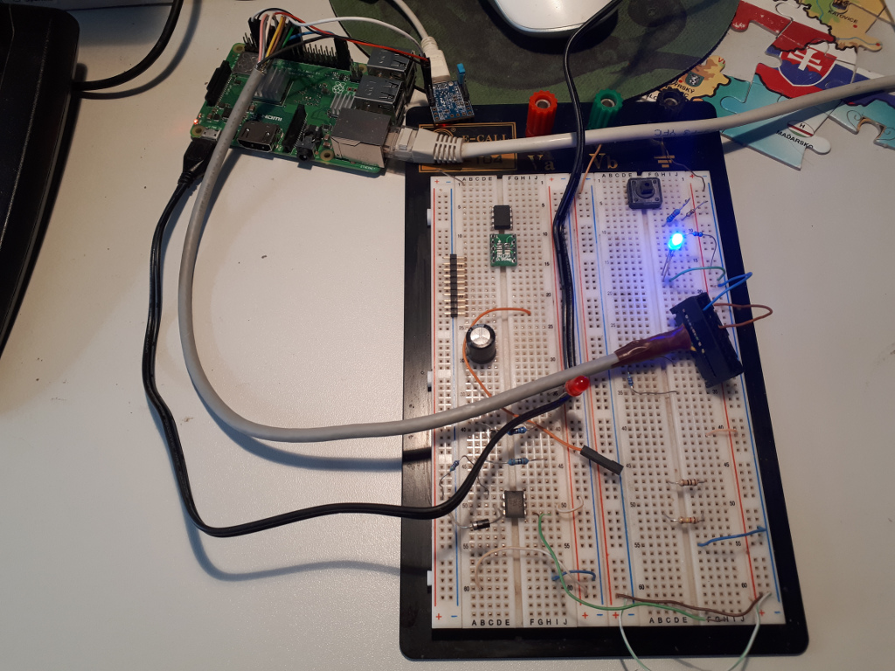
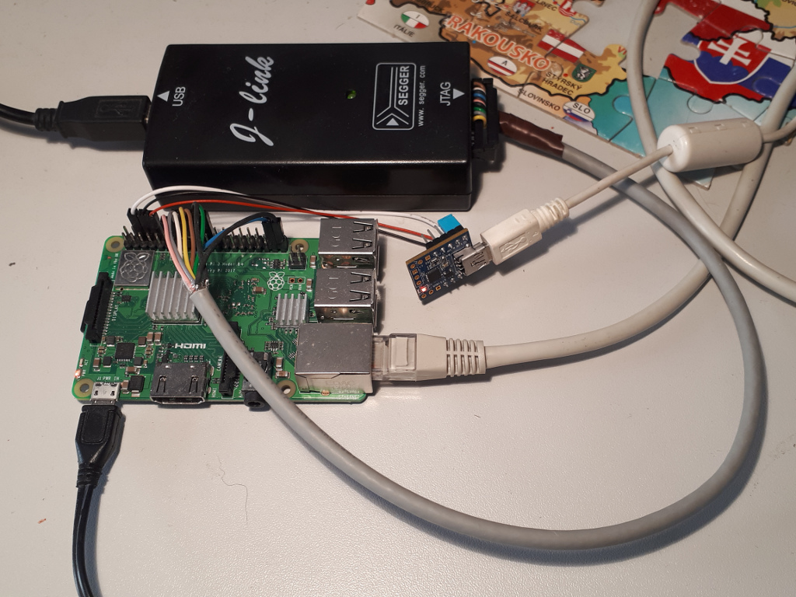

# Debugging Raspberry Pi 3 with JTAG


Supporting an enterprise distribution on a given piece of hardware often requires getting additional information from the misbehaving system. In case of kernel crashes this means a crash dump. Some time ago I announced my intention to enable it on AArch64. The task was then taken over by my colleague Matthias Brugger, and dumping works out of the box in SUSE Linux Enterprise Server 15 on Cavium ThunderX2 systems. Let’s see how it works on the recently released Raspberry Pi 3 Model B+.

##Test it!
First, I was using SLES15 RC4. I know it’s lame, because these images are not publicly available, but you can install an openSUSE Tumbleweed image with similar results. I copied the JeOS image to a suitable microSD card (instructions for Tumbleweed) and inserted it into my Raspberry Pi. The system booted just fine, ready to set up kdump using YaST. Click, click, done. So far so good.

Second, I rebooted the board for the new settings to take effect. Looks good, kdump.service is active. Let’s crash the system with the following command:


```sh
rpi3bp:~ # echo c > /proc/sysrq-trigger
```

The system crashes immediately, producing a stack trace on the console. Last line reads: SMP: stopping secondary CPUs. Nothing more happens. Reboot the board by grounding the RUN contact.

Third, let’s try the standard process: double-check that the crash kernel is really loaded by inspecting the corresponding sysfs file (/sys/kernel/kexec_crash_loaded), build kexec-tools from git, disable checksums, wire up a serial port, set up early console, max out log levels… No change.


## JTAG Hardware
Sure, a crash dump would be helpful, but that’s exactly the thing that fails here. Thankfully, all ARM cores provide JTAG debugging. Time for some low-level debugging! Some basic googling finds a tutorial on setting up JTAG with Raspberry Pi, but it is for version 2 in 32-bit mode. In other words, there is some fun left for us.

Let’s start with physical wiring. My JTAG adapter (kindly provided by my boss) has a standard ARM 2×10 header. Since the JTAG pins on the Raspberry do not follow any standard, we’ll have to make a custom JTAG cable. First some planning (yes, pen and paper is great for sorting out ideas):



My cable has only 7 wires, so I connected GND to the shield. Use an 8-wire cable instead. Or use a ribbon cable if you don’t mind messing with the unused wires.

Next, let’s test the pin connections. Use the deprecated sysfs interface until libgpiod gets packaged for openSUSE and SUSE Package Hub. For now, let’s stick to sysfs. A common gotcha is that Raspberry tutorials assume that the on-chip GPIO chip starts from zero. Not true on my system:



```sh
rpi3bp:/sys/class/gpio # cd /sys/class/gpio/
rpi3bp:/sys/class/gpio # ls
export  gpiochip458  unexport
rpi3bp:/sys/class/gpio # cat gpiochip458/base 
458
```

In short, you have to add 458 to the GPIO values. Export them first:

```sh
for gpio in 22 23 24 25 26 27 ; do echo $(( gpio + 458 )) > export ; done
```

You can then test individual pins (480 = 22 + 458):

```sh
cd gpio480
echo out > direction
echo 1 > value
```

Here is how it looked on my table:



Note that my breadboard contains some extra components from an unrelated project. Besides, the tiny board on top is a SiLabs CP2104 serial-to-USB adapter. Don’t care about them. All you need is a LED and a protective resistor. After making sure that everything works as expected, connect a JTAG adapter and be done with the hardware part:



##JTAG Software
Next step is the software. On-chip debugging can be done without proprietary software using openOCD. However, support for ARM64 was added just after the last release. In other words, you’ll have to build it from git. Since it requires a quite recent version of automake, you’d better use Tumbleweed or Leap 15 on your debugging host:


```sh
git clone https://git.code.sf.net/p/openocd/code openocd-code
cd openocd-code
./bootstrap
./configure
make
sudo make install
```

Then there is no openOCD configuration file for the Raspberry Pi 3 yet. I wrote my own, based on other similar boards:

```sh
transport select jtag

# we need to enable srst even though we don't connect it
reset_config trst_and_srst

adapter_khz 1000
jtag_ntrst_delay 500

if { [info exists CHIPNAME] } {
  set _CHIPNAME $CHIPNAME
} else {
  set _CHIPNAME rpi3
}

#
# Main DAP
#
if { [info exists DAP_TAPID] } {
   set _DAP_TAPID $DAP_TAPID
} else {
   set _DAP_TAPID 0x4ba00477
}

jtag newtap $_CHIPNAME tap -irlen 4 -ircapture 0x1 -irmask 0xf -expected-id $_DAP_TAPID -enable
dap create $_CHIPNAME.dap -chain-position $_CHIPNAME.tap

set _TARGETNAME $_CHIPNAME.a53
set _CTINAME $_CHIPNAME.cti

set DBGBASE {0x80010000 0x80012000 0x80014000 0x80016000}
set CTIBASE {0x80018000 0x80019000 0x8001a000 0x8001b000}
set _cores 4

for { set _core 0 } { $_core < $_cores } { incr _core } {

    cti create $_CTINAME.$_core -dap $_CHIPNAME.dap -ap-num 0 \
        -ctibase [lindex $CTIBASE $_core]

    target create $_TARGETNAME.$_core aarch64 \
        -dap $_CHIPNAME.dap -coreid $_core \
        -dbgbase [lindex $DBGBASE $_core] -cti $_CTINAME.$_core

    $_TARGETNAME.$_core configure -event reset-assert-post "aarch64 dbginit"
    $_TARGETNAME.$_core configure -event gdb-attach { halt }
}
```

We will have to set up the Raspberry Pi, too. JTAG is one of the “alternative functions” of the respective pins, in my case Alt 4. The original article suggests to switch them using a program that opens /dev/mem. This does not work for openSUSE (and SLE), because the kernel is compiled with CONFIG_STRICT_DEVMEM. I used the following device tree overlay to enable it from the kernel (yes, it is an ugly trick):


```sh
/dts-v1/;
/plugin/;

/ {
	compatible = "raspberrypi,3-model-b-plus";

	// There is no JTAG driver module, but we need a platform device
	// node (that doesn't already use pinctrl) to hang the pinctrl
	// reference on - the RNG will do
	fragment@0 {
		target = <&random>;
		__overlay__ {
			pinctrl-names = "default";
			pinctrl-0 = <&jtag_gpio22>;
		};
	};
};
```

Compile this file with dtc:

```sh
dtc -@ -I dts -O dtb jtag.dts -o jtag.dtbo
```

Copy the resulting jtag.dtbo to the Raspberry Pi’s /boot/efi/overlays/ directory. Then add the following line to /boot/efi/config.txt:

```sh
dtoverlay=jtag
```

Reboot the Raspberry and wait until the kernel is up. Then start up openOCD:


```sh
tesarik@ezekiel:~/features/rpi-kdump> openocd -f interface/jlink.cfg -f rpi3.cfg 
Open On-Chip Debugger 0.10.0+dev-00414-gcdf1e826 (2018-06-01-18:12)
Licensed under GNU GPL v2
For bug reports, read
        http://openocd.org/doc/doxygen/bugs.html
trst_and_srst separate srst_gates_jtag trst_push_pull srst_open_drain connect_deassert_srst
adapter speed: 1000 kHz
jtag_ntrst_delay: 500
Info : Listening on port 6666 for tcl connections
Info : Listening on port 4444 for telnet connections
Info : J-Link ARM V8 compiled Nov 28 2014 13:44:46
Info : Hardware version: 8.00
Info : VTarget = 3.280 V
Info : clock speed 1000 kHz
Info : JTAG tap: rpi3.tap tap/device found: 0x4ba00477 (mfg: 0x23b (ARM Ltd.), part: 0xba00, ver: 0x4)
Info : rpi3.a53.0: hardware has 6 breakpoints, 4 watchpoints
Info : rpi3.a53.1: hardware has 6 breakpoints, 4 watchpoints
Info : rpi3.a53.2: hardware has 6 breakpoints, 4 watchpoints
Info : rpi3.a53.3: hardware has 6 breakpoints, 4 watchpoints
Info : Listening on port 3333 for gdb connections
Info : Listening on port 3334 for gdb connections
Info : Listening on port 3335 for gdb connections
Info : Listening on port 3336 for gdb connections
```

Now you can attach to the board with GDB:

```sh
tesarik@ezekiel:~/features/rpi-kdump> gdb vmlinux-4.12.14-18-default
GNU gdb (GDB; home:jeff_mahoney:crash-python) 8.0.1
Copyright (C) 2017 Free Software Foundation, Inc.
License GPLv3+: GNU GPL version 3 or later <http://gnu.org/licenses/gpl.html>
This is free software: you are free to change and redistribute it.
There is NO WARRANTY, to the extent permitted by law.  Type "show copying"
and "show warranty" for details.
This GDB was configured as "x86_64-suse-linux".
Type "show configuration" for configuration details.
For bug reporting instructions, please see:
<http://bugs.opensuse.org/>.
Find the GDB manual and other documentation resources online at:
<http://www.gnu.org/software/gdb/documentation/>.
For help, type "help".
Type "apropos word" to search for commands related to "word"...
Reading symbols from vmlinux-4.12.14-18-default...Reading symbols from /home/tesarik/features/rpi-kdump/vmlinux-4.12.14-18-default.debug...done.
done.
(gdb) target remote :3333
Remote debugging using :3333
cpu_do_idle () at ../arch/arm64/mm/proc.S:54
54              ret
(gdb) 
```

Wow! This is source-level debugging of the Linux kernel running on the Raspberry Pi, and I can start debugging kexec on panic using this interface. More on that in the next article.


