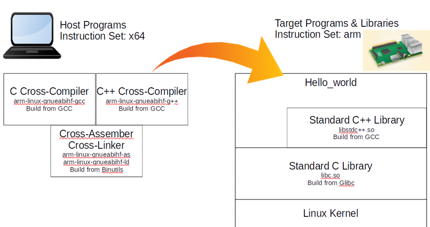
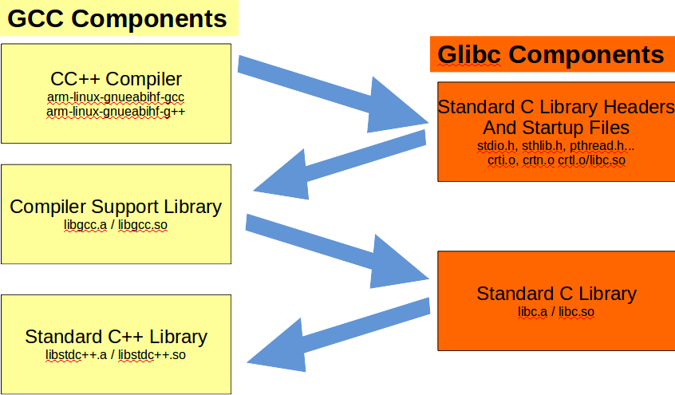
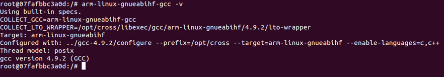
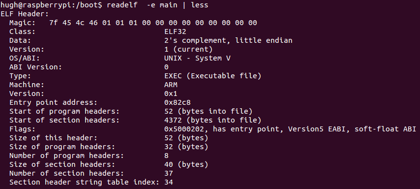

# How to Build a GCC Cross-Compiler


##Introduction
因為最近常用一些cross-compiling的東西，參考到很多文件，為了加深印象，所以自己實作一次。

GCC (GNU Compiler Collection)，是一套程式語言編譯器，以GPL和LGPL許可證所發行的自由軟體，也是GNU tool-chain的主要組成元件之一[2]。它並不只是一個編譯器。也是一個可以讓你建立很多種編譯器的Open Source的專案。在編譯之前你可以設定好多東西，像是可以支持Multithreading, shared libraries, 或是multilib等等。

這個文章就來嘗試建立一個RA_PI2的Cross-Compiler。並且使用自己build出來的Cross-Compiler去編譯一個hello_world放到PI2上去跑。


下圖是一個簡單的示意圖：



##Preparation
###Ubuntu
這邊使用的Host OS是Ubuntu。

###Docker
使用一個完全乾淨的Container來做這件事[3]，
事情會比較單純化，也會加深很多印象。<br>
詳細Docker內容請參考網站。<br>

###安裝

```sh
$ sudo apt-get update
$ sudo apt-get install docker.io
```

###測試一下是否成功

```sh
$ sudo docker info
```

###註冊及登入Docker Hub
[Docker的註冊網站](https://hub.docker.com/account/signup/)

```sh
$ sudo docker login
```


###開啟Docker

```sh
sudo docker run -t -i ubuntu bash
```

接下來所有內容都是在Docker裡面執行的。
理論上就算你一直複製貼上，應該不會錯的XD

##建立建置資料夾


```sh
mkdir /tmp/pi_cross
cd /tmp/pi_cross
```
##下載套件

```sh
sudo apt-get update
sudo apt-get install g++ make gawk -y
sudo apt-get install vim wget xz-utils -y
```

將以下幾個網址存在檔案wget-list裡，有需要的話可以到網站去找最新版的。
ex. http://mirror.pregi.net/gnu/binutils/ 底下會有很多檔案。

可從distrowatch.com找到最新的「gcc」, 「glibc」, 「header」相依性。雖說目前Raspbian的官方版本比我們實作的還要舊。

```sh
http://ftpmirror.gnu.org/binutils/binutils-2.24.tar.gz
http://ftpmirror.gnu.org/gcc/gcc-4.9.2/gcc-4.9.2.tar.gz
https://www.kernel.org/pub/linux/kernel/v3.x/linux-3.17.2.tar.xz
http://ftpmirror.gnu.org/glibc/glibc-2.20.tar.xz
http://ftpmirror.gnu.org/mpfr/mpfr-3.1.2.tar.xz
http://ftpmirror.gnu.org/gmp/gmp-6.0.0a.tar.xz
http://ftpmirror.gnu.org/mpc/mpc-1.0.2.tar.gz
ftp://gcc.gnu.org/pub/gcc/infrastructure/isl-0.12.2.tar.bz2
ftp://gcc.gnu.org/pub/gcc/infrastructure/cloog-0.18.1.tar.gz
```

然後用wget一次下載所有套件

```sh
wget --input-file=wget-list --continue --directory-prefix=/tmp/pi_cross
```

##套件說明：

```sh
binutils   : 包含了連結器(Linker)，組譯器(assembler)，和其他處理物件檔案的工具。
gcc         : 內容是GNU compiler collection, 其中包含了C 和 C++編譯器。
linux-4.3 : 由linux kernel API所匯出的表頭檔，是要給Glibc用的。
Glibc       : 內容是C的函式庫。 這個函式庫包含了一些記憶體配置, 檔案搜尋，開關讀寫
檔案，字串處理，數值運數等等基本函數。
mpfr        : 內容是多精度數值運算的函數。
gmp        : 這個套件包含了一些多精度數值運算的函式庫，建立GCC需要用到。
mpc        : 也是包含一些多精度運算的函式庫，建立GCC需要用到。
ISL (opt)      : 
cloog  (opt) :  使用ISL和cloog這兩個套件可以允許一些編譯的最佳化，但是也可以不用。
```

##套件相依性：

理論上以我的理解是這樣，只是這東西博大精深，可能在挖下去會更複雜，所以先暫時這麼理解，就誰用誰大概知道就好。


##套件解壓縮

```sh
for f in *.tar*; do tar xf $f; done
```

##取得target平臺資訊
因為待回build tool chain需要有target的名字，所以先在數莓派裡下以下指令：

```sh
gcc -dumpmachine
```

得到 arm-linux-gnueabihf

如果想要知道到底一個套件底下支援多少個平臺，有多少的target名稱，
可以爬一下任何一個套件底下的config.sub檔。

##設定環境變數
```sh
export TARGET=arm-linux-gnueabihf
```

##建立symbolic link
這步驟將build gcc會用到的5個套件，都建立link進去。


```sh
cd gcc-4.9.2
ln -s ../mpfr-3.1.2 mpfr
ln -s ../gmp-6.0.0 gmp
ln -s ../mpc-1.0.2 mpc
ln -s ../isl-0.12.2 isl
ln -s ../cloog-0.18.1 cloog
cd ..
```

##建立tool-chain路徑
這邊建立我們要放tool-chain的資料夾

```sh
sudo mkdir -p /opt/cross
```

因為在build的過程中會一直參考到/opt/cross/bin這個路徑，所以記得export到環境中，有需要的話可以寫到~/.bashrc裡面。

```sh
export PATH=/opt/cross/bin:$PATH
```

##Build Cross-Compiler
### 1. Binutils

```sh
mkdir build-binutils
cd build-binutils
../binutils-2.24/configure --prefix=/opt/cross --target=$TARGET
make -j32
make install
cd ..
```

我們將target系統類別設定為arm-linux-gnueabihf，Binutils的組態腳本會去辨識如果target和Host是不一樣的話，會編譯成cross-assembler和cross-linker。這部份會將工具安裝到/opt/cross/bin/底下。

###2. Linux Kernel Headers

這步驟會安裝linux kernel header，用這個tool-chian build出來的程式就可以在目標裝置上，進行系統呼叫。

```sh
cd linux-3.17.2
make ARCH=arm INSTALL_HDR_PATH=/opt/cross/$TARGET headers_install
cd ..
```

接下來的幾個步驟就是GCC和Glibc的安裝，但是這兩個套件都互相有一些相依性，所以不能一次就build完，會一部份一部份的跳著處理，如下圖所示。




###3. C/C++ Compilers
這步驟會建置並且安裝GCC的 C 和 C++  Cross-compiler，並且安裝到 /opt/cross/bin 底下。


```sh
mkdir -p build-gcc
cd build-gcc
../gcc-4.9.2/configure --prefix=/opt/cross --target=$TARGET --enable-languages=c,c++ 
make -j32 all-gcc
make install-gcc
cd ..
```
- 這步驟因為我們有--target=arm-linux-gnueabihf，所以腳本就會去尋找我們step 1 所建立的Binutils cross-tools，以arm-linux-gnueabihf為前置字串（prefix）的部份(ex. arm-linux-gnueabihf-as)。而這個部份所建立出來的C/C++也會以arm-linux-gnueabihf為prefix（還是講prefix比較不會怪怪的XD）。

- 這邊使用--enable-languages=c,c++ ，主要是限定，因為這樣就不會去compile其他的語言的套件，像是Fortran, Java...


### 4. Standard C Library Headers and Startup Files
這步驟有以下重點：
- a. 安裝Glibc的標準C函式庫標頭檔到/opt/cross/arm-linux-gnueabihf/include。
- b. 使用C編譯器（from step 3）去編譯startup file並且安裝到/opt/cross/arm-linux-gnueabihf/lib。
- c. 產生libc.so和stubs.h，這己的檔案都會在step 5用到，並且再step 6被取代掉。

```sh
mkdir -p build-glibc
cd build-glibc
../glibc-2.20/configure --prefix=/opt/cross/$TARGET --build=$MACHTYPE --host=$TARGET --target=$TARGET --with-headers=/opt/cross/$TARGET/include libc_cv_forced_unwind=yes
make install-bootstrap-headers=yes install-headers
make -j32 csu/subdir_lib
install csu/crt1.o csu/crti.o csu/crtn.o /opt/cross/$TARGET/lib
$TARGET-gcc -nostdlib -nostartfiles -shared -x c /dev/null -o /opt/cross/$TARGET/lib/libc.so
touch /opt/cross/$TARGET/include/gnu/stubs.h
cd ..
```

- --prefix=/opt/cross/arm-linux-gnueabihf 選項告訴組態檔應該到哪裡安裝標頭檔和函式庫。
- 這邊我們定義了--build， --host和--target，其實有點怪，但是資料說是官方定義的，所以照用...
- $MACHTYPE是一個預先定義的環境變數，主要描述目前跑這個腳本的機器。
-  --build=$MACHTYPE，這個選項宣告主要是step 6會用到。
- 這邊的--host也是個怪定義。 再Glibc的組態，--host和--targer都是描述Glibc函式庫將會再哪個系統上跑。
- 我們手動安裝了crtl.o, crti.o和crtn.o。


###5. Compiler Support Library
- a. 這邊使用step 3的cross-compilers去編譯一些函式庫。 裡麵包含了一些C++的例外處理。
- b. 這些函式庫依賴於step 4 所建立的startup 檔案。
- c. 這步驟所建立出來的函式庫會在step 6用到。
- d. 這個步驟不需要重新run GCC的組態，只要直接以相同組態加上一些其他的target就好了。

 
 ```sh
cd build-gcc
make -j32 all-target-libgcc
make install-target-libgcc
cd ..
```

- 兩個靜態函式庫 libgcc.a和 libgcc_eh.a會被安裝到/opt/cross/lib/arm-linux-gnueabihf/4.9.2/底下
- 一個動態函式庫libgcc_s.so會被安裝到/opt/cross/arm-linux-gnueabihf/lib底下。

###6. Standard C Library
在這步驟，就會完成Glibc的建置，安裝標準C函式庫到/opt/cross/lib





輸出靜態函式庫為libc.a，動態函式庫為libc.so。

```sh
cd build-glibc
make -j32
make install
cd ..
```

###7. Standard C++ Library
終於到最後一步了，完成GCC的建置。安裝標準C++函式庫到/opt/cross/arm-linux-gnueabihf/lib/底下。這步驟也是依賴於step 6的C函式庫。
輸出靜態函式庫為libstdc++.a，動態函式庫為libstdc++.so

```sh
cd build-gcc
make -j32
make install
cd ..
```


##Dealing with Build Errors
如果中間有一些errors的話，有可能是底下幾個原因：

```sh
1. 有缺少某個套件。
2. build的順序錯誤，別忘記這個的相依性很重要！
3. 有時候套件之間的版本組合也很重要，並不是全部拿最新的就可以用（尤其是kernel的版本！！）。
```

在build的時候要用log，像是

```sh
make 2>&1 | tee build.log
```

這樣有error才可以參考。

GCC支援很多的組態，但是有些比較冷門的可能也還沒有人去弄過，所以就有可能有問題。

Testing the Cross-Compiler
如果一切都成功了，接下來我們就可以來測試一下。


簡單來個hello world，編譯完以後丟到raspberry pi 2上跑，並且反組看看。




## ref

 1. http://preshing.com/20141119/how-to-build-a-gcc-cross-compiler/
 2. Wiki-GCC
 3. Docker實作入門
 4. LFS Manual
 5. http://wiki.osdev.org/GCC_Cross-Compiler#Deciding_on_the_target_platform
