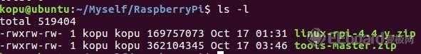
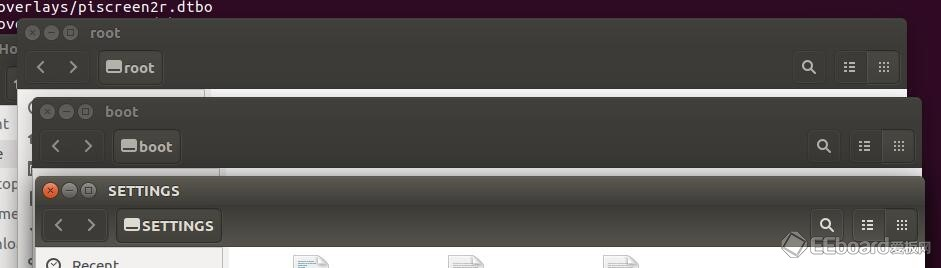
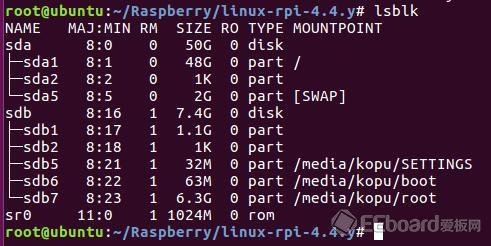
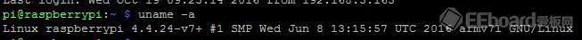

# 兩種方式教你編譯更新RaspberryPi3的內核


編譯更新RaspberryPi3的內核有兩種方式，第一種是在樹莓派上編譯新的內核，完成後重啟，優點是簡單方便，缺點是速度慢。

另一種是在另一台電腦上使用交叉編譯的方法編譯內核，完成後拷貝到SD卡上。優點是速度很快，但是操作起來相對麻煩些。這裡記錄下兩種方式。

##在樹莓派本地編譯內核

這個方式主要就是copy官網上說的了。翻譯下

```sh
https://www.raspberrypi.org/documentation/linux/kernel/building.md
```

####1、在全球最大男性同性交友網站GitHub上下載linux內核源碼。

```sh
mkdir PiLinuxCore
cd PiLinuxCore/
git clone https://github.com/raspberrypi/linux
```

####2、安裝缺少的依賴項。

```sh
sudo apt-get install bc
```

####3、內核配置。

```sh
cd PiLinuxCore/KERNEL=kernel7
make bcm2709_defconfig
```
####4、編譯安裝內核模塊，

```sh
make -j4 zImage modules dtbs
sudo make modules_install
sudo cp arch/arm/boot/dts/*.dtb /boot/
sudo cp arch/arm/boot/dts/overlays/*.dtb* /boot/overlays/
sudo cp arch/arm/boot/dts/overlays/README /boot/overlays/
sudo scripts/mkknlimg arch/arm/boot/zImage /boot/$KERNEL.img
```

耗時40分鐘到80分鐘之間。

####5、重啟完成內核更新

```sh
sudo reboot
```

####6、使用uname 查看下內核版本是否更新了

##在Ubuntu上交叉編譯內核

交叉編譯建議使用Ubuntu因為Raspbian是Debian的一種發行版本，有很多指令是相同的。因為樹莓派的內核代碼總是在更新，所以編譯方法儘量按照官網的方法，以下就是最新的方法。

下載源碼和交叉編譯工具

####1、內核源碼：https://github.com/raspberrypi/linuxc

直接打包下載zip文件

####2、編譯工具：https://github.com/raspberrypi/tools

直接打包下載

下載完成後在ubuntu home目錄下的用戶文件夾中建個文件夾RaspberryPi

也可以隨意定個位置。把下載完的兩個文件拷貝到這個文件夾內。如下：




分別解壓縮

```sh
unzip linux-rpi-4.4.y.zip
unzip tools-master.zip
```
進入tools目錄，32位機器拷貝下面這個目錄 到指定位置。


```sh
/tools/arm-bcm2708/gcc-linaro-arm-linux-gnueabihf-raspbian
```

並把下面的路徑添加到home路徑下的.bashrc文件裡，就是所說的環境變量$PATH，添加環境變量有多種方法可自行上網查詢。

```sh
/tools/arm-bcm2708/gcc-linaro-arm-linux-gnueabihf-raspbian/bin
```

```sh
echo PATH=\$PATH:~/tools/arm-bcm2708/gcc-linaro-arm-linux-gnueabihf-raspbian/bin >> ~/.bashrc
source ~/.bashrc
```


64位系統的主機拷貝下面的路徑，其它步驟和32位的一樣

```sh
tools/arm-bcm2708/gcc-linaro-arm-linux-gnueabihf-raspbian-x64/bin
```


```sh
echo PATH=\$PATH:~/tools/arm-bcm2708/gcc-linaro-arm-linux-gnueabihf-raspbian-x64/bin >> ~/.bashrc
source ~/.bashrc
```

###開始編譯

下面的操作都是root權限，進入下載的linux內核解壓後的目錄，Pi1的配置方法：

```sh
cd linux
KERNEL=kernel
make ARCH=arm CROSS_COMPILE=arm-linux-gnueabihf- bcmrpi_defconfig
```

###Pi2\3的配置方法：

```sh
cd linux
KERNEL=kernel7
make ARCH=arm CROSS_COMPILE=arm-linux-gnueabihf- bcm2709_defconfig
```

然後進行編譯

```sh
make ARCH=arm CROSS_COMPILE=arm-linux-gnueabihf- zImage modules dtbs
```

這個時候不出意外的話就開始編譯了 等待十幾分鐘左右吧 就差不多編譯完了。

安裝到SD卡

插入SD卡之後 你會看到咔咔彈出三個對話框，然並卵。



然後輸入 lsblk 會得到如下分區目錄（我是用NOOBS裝的）：





這個sdb是SD卡，顯示7.4G的總容量；sda是虛擬機給ubuntu分的區50G

sdb6 是 FAT（boot）引導分區 類似啟動文件。

sdb7 是 ext4文件系統分區

如果你不是用的NOOBS裝的系統 那就是下面這種情況：

sdb1 是 FAT（boot）引導分區 類似啟動文件。

sdb2 是 ext4文件系統分區

對於用NOOBS的SD卡：首先掛載SD卡。隨便一個位置建個mnt文件夾用來掛載磁盤。我建在linux目錄下，接下來按照下面的方法建文件夾。

```sh
mkdir /mnt/fat32mkdir /mnt/ext4
sudo mount /dev/sdb6 mnt/fat32
sudo mount /dev/sdb7 mnt/ext4
```

因為是NOOBS裝的系統所以這裡掛載sdb6、sdb7。

接下來安裝模組到mnt/ext4：

sudo make ARCH=arm CROSS_COMPILE=arm-linux-gnueabihf- INSTALL_MOD_PATH=mnt/ext4 modules_install

最後複製內核文件到SD卡。這裡最好備份下之前的內核文件。

```sh
sudo cp mnt/fat32/$KERNEL.img mnt/fat32/$KERNEL-backup.img
sudo scripts/mkknlimg arch/arm/boot/zImage mnt/fat32/$KERNEL.img
sudo cp arch/arm/boot/dts/*.dtb mnt/fat32/
sudo cp arch/arm/boot/dts/overlays/*.dtb* mnt/fat32/overlays/
sudo cp arch/arm/boot/dts/overlays/README mnt/fat32/overlays/
sudo umount mnt/fat32
sudo umount mnt/ext4
kernel=kernel-myconfig.img
```

把SD卡插到樹莓派然後重啟，uname -a查看下版本


