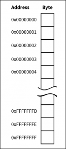
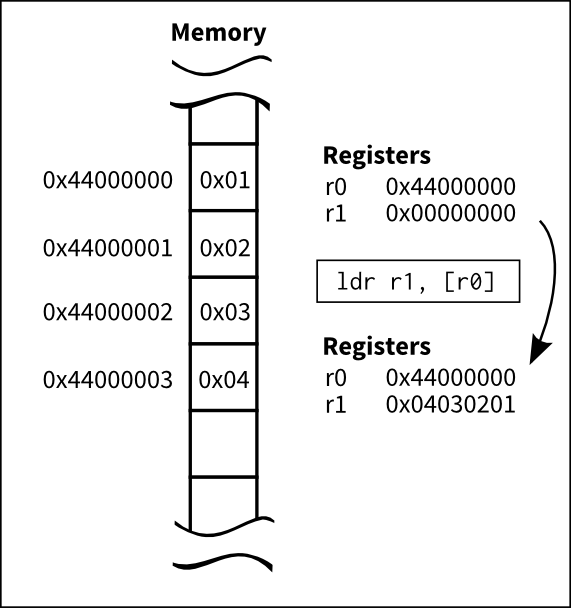

# Memory, addresses. Load and store.

			<h1>ARM assembler in Raspberry Pi – Chapter 3 </h1>
		
January 11, 2013 Roger Ferrer Ibáñez, <a href="http://thinkingeek.com/2013/01/11/arm-assembler-raspberry-pi-chapter-3/#comments">31</a> 

		

We saw in <a href="/2013/01/09/arm-assembler-raspberry-pi-chapter-1/">chapter 1</a> and <a href="/2013/01/10/arm-assembler-raspberry-pi-chapter-2/">chapter 2</a> that we can move values to registers (using <code>mov</code> instruction) and add two registers (using <code>add</code> instruction). If our processor were only able to work on registers it would be rather limited.

<h2>Memory</h2>

A computer has a memory where code (<code>.text</code> in the assembler) and data are stored so there must be some way to access it from the processor. A bit of digression here, in 386 and x86-64 architectures, instructions can access registers or memory, so we could add two numbers, one of which is in memory. You cannot do this in ARM where all operands must be registers. We can work around this problem (not really a problem but a deliberate decision design that goes beyond the scope of this text) by loading data to a register from memory and storing data from a register to a memory.

These two special operations, loading and store, are instructions on their own called usually <i>load</i> and <i>store</i>. There are several ways to load and store data from/to memory but today we will focus on the simplest ones: load to register <code>ldr</code> and store from register <code>str</code>.

Loading data from memory is a bit complicated because we need to talk about <i>addresses</i>.

<h2>Addresses</h2>

To access data we need to give it a name. Otherwise we could not refer what piece of data we want. But of course a computer does not have a different name for every piece of data it can keep in memory. Well, in fact it does have a name for every piece of data. It is the <i>address</i>. The address is a number, in ARM a 32-bit number that identifies every byte (this is 8 bits) of the memory.

When loading or storing data from/to memory we need to compute an address. This address can be computed in many ways. Each of this modes is called an <i>addressing mode</i>. ARM has several of these addressing modes and it would took a while to explain them all here, so we will consider just one: addressing through a register.

It is not by chance that ARM has integer registers of 32 bits and the addresses of the memory are 32 bit numbers. This means that we can keep an address inside a register. Once we have an address inside a register, we can use that register to load or store some piece of data.

<h2>Data</h2>

We saw in the chapter 1 that the assembler contains both code (called <i>text</i>) and data. I was deliberately loose when describing labels of the assembler. Now we can unveil their deep meaning: labels in the assembler are just symbolic names to addresses in your program. These addresses may refer both to data or code. So far we have used only one label <code>main</code> to designate the address of our <code>main</code> function. A label only denotes an address, never its contents. Bear this in mind.

I said that assembler is a thin layer on top of the binary code. Well, that thin layer may now look to you a bit thicker since the assembler tool (<code>as</code>) is left responsible of assigning values to the addresses of the labels. This way we can use these labels and the assembler will do some magic to make it work.

So, we can define data and attach some label to its address. It is up to us, as assembler programmers, to ensure the storage referenced by the label has the appropiate size and value.

Let’s define a 4 byte variable and initialize it to 3. We will give it a label <code>myvar1</code>.

<table><tbody><tr><td class="code"><pre class="asm" style="font-family:monospace;">.balign 4
myvar1:
    .word 3</pre></td></tr></tbody></table>
.balign 4
myvar1:
    .word 3

There are two new assembler directives in the example above: <code>.balign</code> and <code>.word</code>. When <code>as</code> encounters a <code>.balign</code> directive, it ensures the next address will start a 4-byte boundary. This is, the address of the next datum emitted (i.e. an instruction but it could be data as well) will be a multiple of 4 bytes. This is important because ARM imposes some restrictions about the addresses of the data you may work. This directive does nothing if the address was already aligned to 4. Otherwise the assembler tool will emit some <i>padding</i> bytes, which are not used at all by the program, so the alignment requested is fulfilled. It is possible that we could omit this directive if all the entities emitted by the assembler are 4 byte wide (4 bytes is 32 bits), but as soon as we want to use differently sized data this directive will become mandatory.

Now we define the address of <code>myvar1</code>. Thanks to the previous <code>.balign</code> directive, we know its address will be 4 byte aligned.

<code>.word</code> directive states that the assembler tool should emit the value of the argument of the directive as a 4 byte integer. In this case it will emit 4 bytes containing the value 3. Note that we rely on the fact that <code>.word</code> emits 4 bytes to define the size of our data.

<h3>Sections</h3>

Data lives in memory like code but due to some practical technicalities, that we do not care very much now, it is usually kept together in what is called a <i>data section</i>. <code>.data</code> directive tells the assembler to emit the entities in the <i>data section</i>. That <code>.text</code> directive we saw in the first chapter, makes a similar thing for code. So we will put data after a <code>.data</code> directive and code after a <code>.text</code>.

<h2>Load</h2>

Ok, we will retrieve our example from the Chapter 2 and enhance it with some accesses to memory. We will define two 4 byte variables <code>myvar1</code> and <code>myvar2</code>, initialized to 3 and 4 respectively. We will load their values using <code>ldr</code>, and perform an addition. The resulting error code should be 7, like that of chapter 2.

<table><tbody><tr><td class="line_numbers"><pre>1
2
3
4
5
6
7
8
9
10
11
12
13
14
15
16
17
18
19
20
21
22
23
24
25
26
27
28
29
30
31
32
33
34
35
36
</pre></td><td class="code"><pre class="asm" style="font-family:monospace;">/* -- load01.s */
&nbsp;
/* -- Data section */
.data
&nbsp;
/* Ensure variable is 4-byte aligned */
.balign 4
/* Define storage for myvar1 */
myvar1:
    /* Contents of myvar1 is just 4 bytes containing value '3' */
    .word 3
&nbsp;
/* Ensure variable is 4-byte aligned */
.balign 4
/* Define storage for myvar2 */
myvar2:
    /* Contents of myvar2 is just 4 bytes containing value '4' */
    .word 4
&nbsp;
/* -- Code section */
.text
&nbsp;
/* Ensure code is 4 byte aligned */
.balign 4
.global main
main:
    ldr r1, addr_of_myvar1 /* r1 ← &amp;myvar1 */
    ldr r1, [r1]           /* r1 ← *r1 */
    ldr r2, addr_of_myvar2 /* r2 ← &amp;myvar2 */
    ldr r2, [r2]           /* r2 ← *r2 */
    add r0, r1, r2         /* r0 ← r1 + r2 */
    bx lr
&nbsp;
/* Labels needed to access data */
addr_of_myvar1 : .word myvar1
addr_of_myvar2 : .word myvar2</pre></td></tr></tbody></table>
/* -- load01.s */

/* -- Data section */
.data

/* Ensure variable is 4-byte aligned */
.balign 4
/* Define storage for myvar1 */
myvar1:
    /* Contents of myvar1 is just 4 bytes containing value '3' */
    .word 3

/* Ensure variable is 4-byte aligned */
.balign 4
/* Define storage for myvar2 */
myvar2:
    /* Contents of myvar2 is just 4 bytes containing value '4' */
    .word 4

/* -- Code section */
.text

/* Ensure code is 4 byte aligned */
.balign 4
.global main
main:
    ldr r1, addr_of_myvar1 /* r1 ← &amp;myvar1 */
    ldr r1, [r1]           /* r1 ← *r1 */
    ldr r2, addr_of_myvar2 /* r2 ← &amp;myvar2 */
    ldr r2, [r2]           /* r2 ← *r2 */
    add r0, r1, r2         /* r0 ← r1 + r2 */
    bx lr

/* Labels needed to access data */
addr_of_myvar1 : .word myvar1
addr_of_myvar2 : .word myvar2

I have cheated a bit in the example above because of limitations in the assembler. As you can see there are four <code>ldr</code> instructions. I will try to explain their meaning. First, though, we have to discuss the following two labels.

<table><tbody><tr><td class="line_numbers"><pre>34
35
36
</pre></td><td class="code"><pre class="asm" style="font-family:monospace;">/* Labels needed to access data */
addr_of_myvar1 : .word myvar1
addr_of_myvar2 : .word myvar2</pre></td></tr></tbody></table>
/* Labels needed to access data */
addr_of_myvar1 : .word myvar1
addr_of_myvar2 : .word myvar2

Well, these two labels, contain the address of <code>myvar1</code> and <code>myvar2</code>. You may be wondering why we need them if we already have the address of our data in labels <code>myvar1</code> and <code>myvar2</code>. Well a detailed explanation is a bit long, but what happens here is that <code>myvar1</code> and <code>myvar2</code> are in a different section: in the <code>.data</code> section. That section exists so the program can modify it, this is why variables are kept there. On the other hand, code is not usually modified by the program (for efficiency and for security reasons). So this is a reason to have two different sections with different properties attached to them. But, we cannot directly access a symbol from one section to another one. Thus, we need a special label in <code>.code</code> which refers to the address of an entity in <code>.data</code> section.

Well, when the assembler emits the binary code, <code>.word myvar1</code> will not be address of <code>myvar1</code> but instead it will be a <i>relocation</i>. A relocation is the way the assembler uses to emit an address, the exact value of which is unknown but it will known be when the program is <i>linked</i> (i.e. when generating the final executable). It is like saying <q>well, I have no idea where this variable will actually be, let’s the linker patch this value for me later</q>. So this <code>addr_of_myvar1</code> will be used instead. The address of <code>addr_of_myvar1</code> is in the same section <code>.text</code>. That value will be <i>patched</i> by the linker during the linking phase (when the final executable is created and it knows where all the entities of our program will definitely be laid out in memory). This is why the linker (invoked internally by <code>gcc</code>) is called <code>ld</code>. It stands for <code>Link eDitor</code>.

<table><tbody><tr><td class="line_numbers"><pre>27
28
</pre></td><td class="code"><pre class="asm" style="font-family:monospace;">    ldr r1, addr_of_myvar1 /* r1 ← &amp;myvar1 */
    ldr r1, [r1]           /* r1 ← *r1 */</pre></td></tr></tbody></table>
    ldr r1, addr_of_myvar1 /* r1 ← &amp;myvar1 */
    ldr r1, [r1]           /* r1 ← *r1 */

Ok, so two loads. The first one in line 27 actually loads the relocation value of the address of <code>myvar1</code>. This is, there is some data in memory, the address of which is <code>addr_of_myvar1</code>, with a size of 4 bytes containing the real address of <code>myvar1</code>. So after the first <code>ldr</code>, in <code>r1</code> we have the real address of <code>myvar1</code>. But we do not want the address at all, but the contents of the memory at that address, thus we do a second <code>ldr</code>.

Probably you are wondering why the two loads have different syntax. The first <code>ldr</code> uses the symbolic address of <code>addr_of_myvar1</code> label. The second <code>ldr</code> uses the value of the register as the <i>addressing mode</i>. So, in the second case we are using the value inside <code>r1</code> as the address. In the first case, we do not actually know what the assembler uses as the addressing mode, so we will ignore it for now.

The program loads two 32 bit values from <code>myvar1</code> and <code>myvar2</code>, that had initial values 3 and 4, adds them and sets the result of the addition as the error code of the program in the <code>r0</code> register just before leaving <code>main</code>.

<pre>$ ./load01 ; echo $?
7
</pre>
<h2>Store</h2>

Now take the previous example but instead of setting the initial values of <code>myvar1</code> and <code>myvar2</code> to 3 and 4 respectively, set both to 0. We will reuse the existing code but we will prepend some assembler to store a 3 and a 4 in the variables.

<table><tbody><tr><td class="line_numbers"><pre>1
2
3
4
5
6
7
8
9
10
11
12
13
14
15
16
17
18
19
20
21
22
23
24
25
26
27
28
29
30
31
32
33
34
35
36
37
38
39
40
41
42
43
44
</pre></td><td class="code"><pre class="asm" style="font-family:monospace;">/* -- store01.s */
&nbsp;
/* -- Data section */
.data
&nbsp;
/* Ensure variable is 4-byte aligned */
.balign 4
/* Define storage for myvar1 */
myvar1:
    /* Contents of myvar1 is just '3' */
    .word 0
&nbsp;
/* Ensure variable is 4-byte aligned */
.balign 4
/* Define storage for myvar2 */
myvar2:
    /* Contents of myvar2 is just '3' */
    .word 0
&nbsp;
/* -- Code section */
.text
&nbsp;
/* Ensure function section starts 4 byte aligned */
.balign 4
.global main
main:
    ldr r1, addr_of_myvar1 /* r1 ← &amp;myvar1 */
    mov r3, #3             /* r3 ← 3 */
    str r3, [r1]           /* *r1 ← r3 */
    ldr r2, addr_of_myvar2 /* r2 ← &amp;myvar2 */
    mov r3, #4             /* r3 ← 4 */
    str r3, [r2]           /* *r2 ← r3 */
&nbsp;
    /* Same instructions as above */
    ldr r1, addr_of_myvar1 /* r1 ← &amp;myvar1 */
    ldr r1, [r1]           /* r1 ← *r1 */
    ldr r2, addr_of_myvar2 /* r2 ← &amp;myvar2 */
    ldr r2, [r2]           /* r2 ← *r2 */
    add r0, r1, r2
    bx lr
&nbsp;
/* Labels needed to access data */
addr_of_myvar1 : .word myvar1
addr_of_myvar2 : .word myvar2</pre></td></tr></tbody></table>
/* -- store01.s */

/* -- Data section */
.data

/* Ensure variable is 4-byte aligned */
.balign 4
/* Define storage for myvar1 */
myvar1:
    /* Contents of myvar1 is just '3' */
    .word 0

/* Ensure variable is 4-byte aligned */
.balign 4
/* Define storage for myvar2 */
myvar2:
    /* Contents of myvar2 is just '3' */
    .word 0

/* -- Code section */
.text

/* Ensure function section starts 4 byte aligned */
.balign 4
.global main
main:
    ldr r1, addr_of_myvar1 /* r1 ← &amp;myvar1 */
    mov r3, #3             /* r3 ← 3 */
    str r3, [r1]           /* *r1 ← r3 */
    ldr r2, addr_of_myvar2 /* r2 ← &amp;myvar2 */
    mov r3, #4             /* r3 ← 4 */
    str r3, [r2]           /* *r2 ← r3 */

    /* Same instructions as above */
    ldr r1, addr_of_myvar1 /* r1 ← &amp;myvar1 */
    ldr r1, [r1]           /* r1 ← *r1 */
    ldr r2, addr_of_myvar2 /* r2 ← &amp;myvar2 */
    ldr r2, [r2]           /* r2 ← *r2 */
    add r0, r1, r2
    bx lr

/* Labels needed to access data */
addr_of_myvar1 : .word myvar1
addr_of_myvar2 : .word myvar2

Note an oddity in the <code>str</code> instruction, the destination operand of the instruction is <b>not the first operand</b>. Instead the first operand is the source register and the second operand is the addressing mode.

<pre>$ ./store01; echo $?
7
</pre>

That’s all for today.

<!-- Simple Share Buttons Adder (6.3.4) simplesharebuttons.com -->

 This work by <a target="_blank" xmlns:cc="http://creativecommons.org/ns#" href="http://thinkingeek.com/author/rferrer/" property="cc:attributionName" rel="cc:attributionURL nofollow">Roger Ferrer Ibáñez</a> is licensed under a <a target="_blank" rel="license nofollow" href="http://creativecommons.org/licenses/by-nc-sa/4.0/">Creative Commons Attribution-NonCommercial-ShareAlike 4.0 International</a> 
				
<a href="http://thinkingeek.com/tag/arm/" rel="tag">arm</a>, <a href="http://thinkingeek.com/tag/assembler/" rel="tag">assembler</a>, <a href="http://thinkingeek.com/tag/load/" rel="tag">load</a>, <a href="http://thinkingeek.com/tag/pi/" rel="tag">pi</a>, <a href="http://thinkingeek.com/tag/raspberry/" rel="tag">raspberry</a>, <a href="http://thinkingeek.com/tag/store/" rel="tag">store</a>
		

		

			<a href="http://thinkingeek.com/2013/01/10/arm-assembler-raspberry-pi-chapter-2/" rel="prev">ARM assembler in Raspberry Pi – Chapter 2</a>
			<a href="http://thinkingeek.com/2013/01/12/arm-assembler-raspberry-pi-chapter-4/" rel="next">ARM assembler in Raspberry Pi – Chapter 4</a>
		

		

<!-- You can start editing here. -->

	
			<h3>31 thoughts on “ARM assembler in Raspberry Pi – Chapter 3”</h3>
		<ul class="commentlist">
				<li class="comment even thread-even depth-1" id="comment-1420">
				

				

						<cite class="fn">andreas</cite> says:		

		
		
<a href="http://thinkingeek.com/2013/01/11/arm-assembler-raspberry-pi-chapter-3/#comment-1420">
			June 11, 2013 at 10:08 pm</a>		

		
Thank you for this great tutorial. Very pragmatic and to the point. I cannot put it down 

		
<a rel="nofollow" class="comment-reply-link" href="http://thinkingeek.com/2013/01/11/arm-assembler-raspberry-pi-chapter-3/?replytocom=1420#respond" onclick="return addComment.moveForm( &quot;div-comment-1420&quot;, &quot;1420&quot;, &quot;respond&quot;, &quot;371&quot; )" aria-label="Reply to andreas">Reply</a>

				

		</li><!-- #comment-## -->
		<li class="comment odd alt thread-odd thread-alt depth-1" id="comment-1427">
				

				

						<cite class="fn"><a href="http://digilander.libero.it/zantaz/" rel="external nofollow" class="url">Mariani Antonio Mario</a></cite> says:		

		
		
<a href="http://thinkingeek.com/2013/01/11/arm-assembler-raspberry-pi-chapter-3/#comment-1427">
			June 24, 2013 at 6:37 am</a>		

		
Nice assembler information …

		
<a rel="nofollow" class="comment-reply-link" href="http://thinkingeek.com/2013/01/11/arm-assembler-raspberry-pi-chapter-3/?replytocom=1427#respond" onclick="return addComment.moveForm( &quot;div-comment-1427&quot;, &quot;1427&quot;, &quot;respond&quot;, &quot;371&quot; )" aria-label="Reply to Mariani Antonio Mario">Reply</a>

				

		</li><!-- #comment-## -->
		<li class="comment even thread-even depth-1" id="comment-1428">
				

				

						<cite class="fn"><a href="http://digilander.libero.it/zantaz/" rel="external nofollow" class="url">Mariani Antonio Mario</a></cite> says:		

		
		
<a href="http://thinkingeek.com/2013/01/11/arm-assembler-raspberry-pi-chapter-3/#comment-1428">
			June 24, 2013 at 6:47 am</a>		

		
nice assembler document …

		
<a rel="nofollow" class="comment-reply-link" href="http://thinkingeek.com/2013/01/11/arm-assembler-raspberry-pi-chapter-3/?replytocom=1428#respond" onclick="return addComment.moveForm( &quot;div-comment-1428&quot;, &quot;1428&quot;, &quot;respond&quot;, &quot;371&quot; )" aria-label="Reply to Mariani Antonio Mario">Reply</a>

				

		</li><!-- #comment-## -->
		<li class="comment odd alt thread-odd thread-alt depth-1" id="comment-1753">
				

				

						<cite class="fn">will</cite> says:		

		
		
<a href="http://thinkingeek.com/2013/01/11/arm-assembler-raspberry-pi-chapter-3/#comment-1753">
			October 12, 2013 at 5:28 am</a>		

		
Thank you so much. I am studying computer architecture at Purdue, and this totally saved me : )

		
<a rel="nofollow" class="comment-reply-link" href="http://thinkingeek.com/2013/01/11/arm-assembler-raspberry-pi-chapter-3/?replytocom=1753#respond" onclick="return addComment.moveForm( &quot;div-comment-1753&quot;, &quot;1753&quot;, &quot;respond&quot;, &quot;371&quot; )" aria-label="Reply to will">Reply</a>

				

		</li><!-- #comment-## -->
		<li class="comment even thread-even depth-1 parent" id="comment-95091">
				

				

						<cite class="fn">saywoot</cite> says:		

		
		
<a href="http://thinkingeek.com/2013/01/11/arm-assembler-raspberry-pi-chapter-3/#comment-95091">
			March 8, 2014 at 8:13 pm</a>		

		
I think there are a mistake in your second example.. For me r1 and r2 contain already myvar1’s adress and myvar2’s adress. So I think you can remove the line 35 and 37. And thanks for your tutorial, it’s a great job 

/* forgive my poor english */

		
<a rel="nofollow" class="comment-reply-link" href="http://thinkingeek.com/2013/01/11/arm-assembler-raspberry-pi-chapter-3/?replytocom=95091#respond" onclick="return addComment.moveForm( &quot;div-comment-95091&quot;, &quot;95091&quot;, &quot;respond&quot;, &quot;371&quot; )" aria-label="Reply to saywoot">Reply</a>

				

		<ul class="children">
		<li class="comment byuser comment-author-rferrer bypostauthor odd alt depth-2" id="comment-98132">
				

				

						<cite class="fn">rferrer</cite> says:		

		
		
<a href="http://thinkingeek.com/2013/01/11/arm-assembler-raspberry-pi-chapter-3/#comment-98132">
			March 9, 2014 at 7:30 pm</a>		

		
Well, I would not call it a mistake. While true that these two lines can be removed, it is not the purpose of this chapter to optimize it by removing redundant instructions.

Kind regards,

		
<a rel="nofollow" class="comment-reply-link" href="http://thinkingeek.com/2013/01/11/arm-assembler-raspberry-pi-chapter-3/?replytocom=98132#respond" onclick="return addComment.moveForm( &quot;div-comment-98132&quot;, &quot;98132&quot;, &quot;respond&quot;, &quot;371&quot; )" aria-label="Reply to rferrer">Reply</a>

				

		</li><!-- #comment-## -->
</ul><!-- .children -->
</li><!-- #comment-## -->
		<li class="comment even thread-odd thread-alt depth-1 parent" id="comment-151084">
				

				

						<cite class="fn">duality</cite> says:		

		
		
<a href="http://thinkingeek.com/2013/01/11/arm-assembler-raspberry-pi-chapter-3/#comment-151084">
			June 9, 2014 at 1:10 am</a>		

		
this: 
Note an oddity in the str instruction, the destination operand of the instruction is not the first operand. Instead the first operand is the source register and the second operand is the addressing mode.

		
<a rel="nofollow" class="comment-reply-link" href="http://thinkingeek.com/2013/01/11/arm-assembler-raspberry-pi-chapter-3/?replytocom=151084#respond" onclick="return addComment.moveForm( &quot;div-comment-151084&quot;, &quot;151084&quot;, &quot;respond&quot;, &quot;371&quot; )" aria-label="Reply to duality">Reply</a>

				

		<ul class="children">
		<li class="comment byuser comment-author-rferrer bypostauthor odd alt depth-2" id="comment-151438">
				

				

						<cite class="fn">rferrer</cite> says:		

		
		
<a href="http://thinkingeek.com/2013/01/11/arm-assembler-raspberry-pi-chapter-3/#comment-151438">
			June 9, 2014 at 12:06 pm</a>		

		
I don’t really know.

Probably the designers of the assembler syntax where faced with a dilemma: either a) make “str register, memory” which has the advantage that looks syntactically similar to “ldr register, memory” but at the expense of the opposite usual meaning (i.e. the first operand is almost always the destination except for the ‘str’ instruction); or b) make “str memory, register” which would keep the semantics more consistent (i.e. the first operand is the destination of the instruction) but at expense of a syntactic oddity (‘str’ first operand is not a register as it happens in almost every other instruction).

Probably they chose a) above because this has been customary in many other RISC-like architectures (e.g MIPS and POWERPC have similar syntaxes for the load and store).

Kind regards

		
<a rel="nofollow" class="comment-reply-link" href="http://thinkingeek.com/2013/01/11/arm-assembler-raspberry-pi-chapter-3/?replytocom=151438#respond" onclick="return addComment.moveForm( &quot;div-comment-151438&quot;, &quot;151438&quot;, &quot;respond&quot;, &quot;371&quot; )" aria-label="Reply to rferrer">Reply</a>

				

		</li><!-- #comment-## -->
</ul><!-- .children -->
</li><!-- #comment-## -->
		<li class="comment even thread-even depth-1 parent" id="comment-386541">
				

				

						<cite class="fn">Manuel</cite> says:		

		
		
<a href="http://thinkingeek.com/2013/01/11/arm-assembler-raspberry-pi-chapter-3/#comment-386541">
			October 8, 2014 at 6:19 pm</a>		

		
Hi,

Thanks you so much for this excellent series on ARM assembler!

I’m wondering, about the use of <code>ldr r1, addr_of_myvar1</code>. As you’re probably aware, GNU as has a feature to avoid the need to explicitly define and use <code>addr_of_myvar1</code> by writing <code>ldr r1, =myvar1</code>, see <a href="https://sourceware.org/binutils/docs-2.24/as/ARM-Opcodes.html#ARM-Opcodes" rel="nofollow">the documentation</a>.

Is there any particular reason not to use it?

		
<a rel="nofollow" class="comment-reply-link" href="http://thinkingeek.com/2013/01/11/arm-assembler-raspberry-pi-chapter-3/?replytocom=386541#respond" onclick="return addComment.moveForm( &quot;div-comment-386541&quot;, &quot;386541&quot;, &quot;respond&quot;, &quot;371&quot; )" aria-label="Reply to Manuel">Reply</a>

				

		<ul class="children">
		<li class="comment byuser comment-author-rferrer bypostauthor odd alt depth-2" id="comment-386852">
				

				

						<cite class="fn">rferrer</cite> says:		

		
		
<a href="http://thinkingeek.com/2013/01/11/arm-assembler-raspberry-pi-chapter-3/#comment-386852">
			October 8, 2014 at 9:36 pm</a>		

		
Hi Manuel,

thanks for your comment.

I try to avoid using this sort of «mnemonics» in these tutorials because I think it is «less magic» this way. Since this is a basic course on the topic, this syntax actually hides what is going on: the literal address sill has to be obtained from somewhere. The reason is the RISC nature of the ARM ISA: it is not possible to encode the absolute address of an object in the instruction itself so we need to get it from elsewhere.

Of course, you can argue that there is also magic in doing a <code>ldr r1, addr_of_myvar1</code> as it actually involves a pc-relative relocation computed by the assembler itself. And you would be right. I understand it may look ugly and unnecessarily convoluted, but for me and for the purpose of these tutorials it is more important being honest (as much as possible, of course) about what goes on than trying to save some characters.

Of course, if my day job involved writing assembler (which does not :), I would be the first to use these syntactic features.

Kind regards,

		
<a rel="nofollow" class="comment-reply-link" href="http://thinkingeek.com/2013/01/11/arm-assembler-raspberry-pi-chapter-3/?replytocom=386852#respond" onclick="return addComment.moveForm( &quot;div-comment-386852&quot;, &quot;386852&quot;, &quot;respond&quot;, &quot;371&quot; )" aria-label="Reply to rferrer">Reply</a>

				

		</li><!-- #comment-## -->
</ul><!-- .children -->
</li><!-- #comment-## -->
		<li class="comment even thread-odd thread-alt depth-1 parent" id="comment-729223">
				

				

						<cite class="fn">Leo</cite> says:		

		
		
<a href="http://thinkingeek.com/2013/01/11/arm-assembler-raspberry-pi-chapter-3/#comment-729223">
			December 27, 2014 at 5:37 pm</a>		

		
The text states that ld means “Link Editor”, which is completely wrong. A few years back, linkers weren’t called linkers but loaders. As UNIX likes to abbreviate commands, they chose ld for it. If you don’t believe it, look it up on Wikipedia.

		
<a rel="nofollow" class="comment-reply-link" href="http://thinkingeek.com/2013/01/11/arm-assembler-raspberry-pi-chapter-3/?replytocom=729223#respond" onclick="return addComment.moveForm( &quot;div-comment-729223&quot;, &quot;729223&quot;, &quot;respond&quot;, &quot;371&quot; )" aria-label="Reply to Leo">Reply</a>

				

		<ul class="children">
		<li class="comment byuser comment-author-rferrer bypostauthor odd alt depth-2" id="comment-734808">
				

				

						<cite class="fn">rferrer</cite> says:		

		
		
<a href="http://thinkingeek.com/2013/01/11/arm-assembler-raspberry-pi-chapter-3/#comment-734808">
			December 30, 2014 at 3:50 pm</a>		

		
Hi Leo,

thanks for your comment. You are right that <code>ld</code> in early UNIX story standed for loader: the <a href="http://plan9.bell-labs.com/7thEdMan/" title="Unix Seventh Edition Manual" rel="nofollow">Unix Seventh Edition Manual</a> describes it as <em>loader</em>. That said, later the description has shifted to mean <code>link editor</code>. You can see in the <a href="https://www.freebsd.org/cgi/man.cgi/faq.html" rel="nofollow">manuals of several BSD releases</a>: in BSD 2.9.1 (November 1983) it was still described in the manual as the loader but some years later, in BSD 2.10 (April 1987) it was already documented as <em>link editor</em>.

In my opinion the latter name is more realistic of what <code>ld</code> does today.

		
<a rel="nofollow" class="comment-reply-link" href="http://thinkingeek.com/2013/01/11/arm-assembler-raspberry-pi-chapter-3/?replytocom=734808#respond" onclick="return addComment.moveForm( &quot;div-comment-734808&quot;, &quot;734808&quot;, &quot;respond&quot;, &quot;371&quot; )" aria-label="Reply to rferrer">Reply</a>

				

		</li><!-- #comment-## -->
</ul><!-- .children -->
</li><!-- #comment-## -->
		<li class="comment even thread-even depth-1 parent" id="comment-959301">
				

				

						<cite class="fn">Matt</cite> says:		

		
		
<a href="http://thinkingeek.com/2013/01/11/arm-assembler-raspberry-pi-chapter-3/#comment-959301">
			January 25, 2016 at 8:59 pm</a>		

		
I’m loving these tutorials! Thank you so much for taking the time to make these. I will definitely be going though all of them over the next few weeks (assuming I have the time!).

		
<a rel="nofollow" class="comment-reply-link" href="http://thinkingeek.com/2013/01/11/arm-assembler-raspberry-pi-chapter-3/?replytocom=959301#respond" onclick="return addComment.moveForm( &quot;div-comment-959301&quot;, &quot;959301&quot;, &quot;respond&quot;, &quot;371&quot; )" aria-label="Reply to Matt">Reply</a>

				

		<ul class="children">
		<li class="comment byuser comment-author-rferrer bypostauthor odd alt depth-2" id="comment-959302">
				

				

						<cite class="fn">Roger Ferrer Ibáñez</cite> says:		

		
		
<a href="http://thinkingeek.com/2013/01/11/arm-assembler-raspberry-pi-chapter-3/#comment-959302">
			January 25, 2016 at 9:01 pm</a>		

		
Hi Matt,

thank your for your kind words!

Kind regards

		
<a rel="nofollow" class="comment-reply-link" href="http://thinkingeek.com/2013/01/11/arm-assembler-raspberry-pi-chapter-3/?replytocom=959302#respond" onclick="return addComment.moveForm( &quot;div-comment-959302&quot;, &quot;959302&quot;, &quot;respond&quot;, &quot;371&quot; )" aria-label="Reply to Roger Ferrer Ibáñez">Reply</a>

				

		</li><!-- #comment-## -->
</ul><!-- .children -->
</li><!-- #comment-## -->
		<li class="comment even thread-odd thread-alt depth-1 parent" id="comment-962280">
				

				

						<cite class="fn">Spiros</cite> says:		

		
		
<a href="http://thinkingeek.com/2013/01/11/arm-assembler-raspberry-pi-chapter-3/#comment-962280">
			March 12, 2016 at 3:16 pm</a>		

		
If I may ask. Why haven’t we used the “.function main” in this piece of code? And why use balign of the main function? Does it have something to do with the fact that we used 4 bytes for our vars? Thank you!

		
<a rel="nofollow" class="comment-reply-link" href="http://thinkingeek.com/2013/01/11/arm-assembler-raspberry-pi-chapter-3/?replytocom=962280#respond" onclick="return addComment.moveForm( &quot;div-comment-962280&quot;, &quot;962280&quot;, &quot;respond&quot;, &quot;371&quot; )" aria-label="Reply to Spiros">Reply</a>

				

		<ul class="children">
		<li class="comment byuser comment-author-rferrer bypostauthor odd alt depth-2" id="comment-962312">
				

				

						<cite class="fn">Roger Ferrer Ibáñez</cite> says:		

		
		
<a href="http://thinkingeek.com/2013/01/11/arm-assembler-raspberry-pi-chapter-3/#comment-962312">
			March 13, 2016 at 7:11 am</a>		

		
Hi,

I’m not sure what you mean. 

Which example? And what you mean by <code>.function</code>: as far as I know this is not a GNU assembler directive.

Regarding the alignment, yes, instructions must be aligned to a 4-byte boundary.

Kind regards,

		
<a rel="nofollow" class="comment-reply-link" href="http://thinkingeek.com/2013/01/11/arm-assembler-raspberry-pi-chapter-3/?replytocom=962312#respond" onclick="return addComment.moveForm( &quot;div-comment-962312&quot;, &quot;962312&quot;, &quot;respond&quot;, &quot;371&quot; )" aria-label="Reply to Roger Ferrer Ibáñez">Reply</a>

				

		</li><!-- #comment-## -->
</ul><!-- .children -->
</li><!-- #comment-## -->
		<li class="comment even thread-even depth-1 parent" id="comment-963938">
				

				

						<cite class="fn">John Ganci</cite> says:		

		
		
<a href="http://thinkingeek.com/2013/01/11/arm-assembler-raspberry-pi-chapter-3/#comment-963938">
			April 5, 2016 at 3:10 am</a>		

		
The sum01.s and sum02.s examples have “.func main” just before the “main:” label. I think that’s what the person is asking about.

		
<a rel="nofollow" class="comment-reply-link" href="http://thinkingeek.com/2013/01/11/arm-assembler-raspberry-pi-chapter-3/?replytocom=963938#respond" onclick="return addComment.moveForm( &quot;div-comment-963938&quot;, &quot;963938&quot;, &quot;respond&quot;, &quot;371&quot; )" aria-label="Reply to John Ganci">Reply</a>

				

		<ul class="children">
		<li class="comment byuser comment-author-rferrer bypostauthor odd alt depth-2" id="comment-963949">
				

				

						<cite class="fn">Roger Ferrer Ibáñez</cite> says:		

		
		
<a href="http://thinkingeek.com/2013/01/11/arm-assembler-raspberry-pi-chapter-3/#comment-963949">
			April 5, 2016 at 5:28 am</a>		

		
Hi John,

oh yes. I see. Its purpose is just for debugging which we are not using. I’ll remove those confusing directives.

Thank you very much.

Kind regards,

		
<a rel="nofollow" class="comment-reply-link" href="http://thinkingeek.com/2013/01/11/arm-assembler-raspberry-pi-chapter-3/?replytocom=963949#respond" onclick="return addComment.moveForm( &quot;div-comment-963949&quot;, &quot;963949&quot;, &quot;respond&quot;, &quot;371&quot; )" aria-label="Reply to Roger Ferrer Ibáñez">Reply</a>

				

		</li><!-- #comment-## -->
</ul><!-- .children -->
</li><!-- #comment-## -->
		<li class="comment even thread-odd thread-alt depth-1 parent" id="comment-964862">
				

				

						<cite class="fn">Xi Han</cite> says:		

		
		
<a href="http://thinkingeek.com/2013/01/11/arm-assembler-raspberry-pi-chapter-3/#comment-964862">
			April 18, 2016 at 8:45 am</a>		

		
Hi Roger,

I am still confused by how relocation works. You said the code in .text cannot directly access symbols in .data section. However, aren’t those addr_of_my_var’s also defined in .text sections? Why can they access symbols in .data section? If this makes sense, what are the rationale behind the decision to make cross-section reference illegal in code because we can achieve the same effect using the technique in the article anyway?

		
<a rel="nofollow" class="comment-reply-link" href="http://thinkingeek.com/2013/01/11/arm-assembler-raspberry-pi-chapter-3/?replytocom=964862#respond" onclick="return addComment.moveForm( &quot;div-comment-964862&quot;, &quot;964862&quot;, &quot;respond&quot;, &quot;371&quot; )" aria-label="Reply to Xi Han">Reply</a>

				

		<ul class="children">
		<li class="comment byuser comment-author-rferrer bypostauthor odd alt depth-2 parent" id="comment-964865">
				

				

						<cite class="fn">Roger Ferrer Ibáñez</cite> says:		

		
		
<a href="http://thinkingeek.com/2013/01/11/arm-assembler-raspberry-pi-chapter-3/#comment-964865">
			April 18, 2016 at 9:04 am</a>		

		
Hi Xi Han,

well the rational behind that is that the <code>.data</code> section can be arbitrarily located in memory. Referencing something inside the same section is a matter of keeping an offset. When the code references something inside the <code>.text</code> section a <em>pc-relative</em> addressing is used (which depends on the exact instructions that appear between the reference and the label, of course, but this can be computed by the assembler tool). Such pc-relative addressing can easily be encoded in an instruction (with limits, of course). Then we let the linker (at link time) to patch the exact value found inside the <code>addr_of_my_var</code> with an arbitrary address (the one the linker determines when building the final program image).

On the other hand, if we allowed cross-section references, we could write a reference to <code>my_var</code> inside the instruction. This means that we should be able to encode an arbitrary address. We could allow the linker to do that for us but then, given that instructions are 32-bit and the address space is 32-bit as well, it would not be possible to encode that in a single instruction. We could devise a mechanism for that (a special load/store instruction that must be followed by a 32-bit address). But probably you have already figured out now that this is just a restricted form of doing the pc-relative technique above where the offset is “where there would be the next instruction”.

Hope my answer is clear.

Kind regards,

		
<a rel="nofollow" class="comment-reply-link" href="http://thinkingeek.com/2013/01/11/arm-assembler-raspberry-pi-chapter-3/?replytocom=964865#respond" onclick="return addComment.moveForm( &quot;div-comment-964865&quot;, &quot;964865&quot;, &quot;respond&quot;, &quot;371&quot; )" aria-label="Reply to Roger Ferrer Ibáñez">Reply</a>

				

		<ul class="children">
		<li class="comment even depth-3" id="comment-964896">
				

				

						<cite class="fn">Xi Han</cite> says:		

		
		
<a href="http://thinkingeek.com/2013/01/11/arm-assembler-raspberry-pi-chapter-3/#comment-964896">
			April 18, 2016 at 6:37 pm</a>		

		
Hi Roger,

Thank you for your detailed explanation. I didn’t really think of the limit of a 32-bit instruction at all! It makes sense to me now.

Best wishes, 
Xi

		
<a rel="nofollow" class="comment-reply-link" href="http://thinkingeek.com/2013/01/11/arm-assembler-raspberry-pi-chapter-3/?replytocom=964896#respond" onclick="return addComment.moveForm( &quot;div-comment-964896&quot;, &quot;964896&quot;, &quot;respond&quot;, &quot;371&quot; )" aria-label="Reply to Xi Han">Reply</a>

				

		</li><!-- #comment-## -->
</ul><!-- .children -->
</li><!-- #comment-## -->
</ul><!-- .children -->
</li><!-- #comment-## -->
		<li class="comment odd alt thread-even depth-1 parent" id="comment-971316">
				

				

						<cite class="fn">gary.host</cite> says:		

		
		
<a href="http://thinkingeek.com/2013/01/11/arm-assembler-raspberry-pi-chapter-3/#comment-971316">
			July 13, 2016 at 11:36 pm</a>		

		
line 38, the comment is possible incorrect? should it be /* r2 &lt;- *r2 */ ? Thank you for the great tutorial!

		
<a rel="nofollow" class="comment-reply-link" href="http://thinkingeek.com/2013/01/11/arm-assembler-raspberry-pi-chapter-3/?replytocom=971316#respond" onclick="return addComment.moveForm( &quot;div-comment-971316&quot;, &quot;971316&quot;, &quot;respond&quot;, &quot;371&quot; )" aria-label="Reply to gary.host">Reply</a>

				

		<ul class="children">
		<li class="comment byuser comment-author-rferrer bypostauthor even depth-2" id="comment-971381">
				

				

						<cite class="fn">Roger Ferrer Ibáñez</cite> says:		

		
		
<a href="http://thinkingeek.com/2013/01/11/arm-assembler-raspberry-pi-chapter-3/#comment-971381">
			July 14, 2016 at 6:47 pm</a>		

		
Hi,

yes you’re right, it should be <code>r2 ← r2</code>. I’ve updated the post.

Thank you very much!

		
<a rel="nofollow" class="comment-reply-link" href="http://thinkingeek.com/2013/01/11/arm-assembler-raspberry-pi-chapter-3/?replytocom=971381#respond" onclick="return addComment.moveForm( &quot;div-comment-971381&quot;, &quot;971381&quot;, &quot;respond&quot;, &quot;371&quot; )" aria-label="Reply to Roger Ferrer Ibáñez">Reply</a>

				

		</li><!-- #comment-## -->
</ul><!-- .children -->
</li><!-- #comment-## -->
		<li class="comment odd alt thread-odd thread-alt depth-1 parent" id="comment-971504">
				

				

						<cite class="fn">Ronald Modesitt</cite> says:		

		
		
<a href="http://thinkingeek.com/2013/01/11/arm-assembler-raspberry-pi-chapter-3/#comment-971504">
			July 17, 2016 at 3:10 am</a>		

		
Many thanks for these tremendous tutorials. Do you have a favorite textbook for ARM assembly language, or one that you would recommend.

Thanks again

		
<a rel="nofollow" class="comment-reply-link" href="http://thinkingeek.com/2013/01/11/arm-assembler-raspberry-pi-chapter-3/?replytocom=971504#respond" onclick="return addComment.moveForm( &quot;div-comment-971504&quot;, &quot;971504&quot;, &quot;respond&quot;, &quot;371&quot; )" aria-label="Reply to Ronald Modesitt">Reply</a>

				

		<ul class="children">
		<li class="comment byuser comment-author-rferrer bypostauthor even depth-2" id="comment-972058">
				

				

						<cite class="fn">Roger Ferrer Ibáñez</cite> says:		

		
		
<a href="http://thinkingeek.com/2013/01/11/arm-assembler-raspberry-pi-chapter-3/#comment-972058">
			July 29, 2016 at 7:03 pm</a>		

		
Hi Ronald,

no I do not have any favorite one.

Kind regards.

		
<a rel="nofollow" class="comment-reply-link" href="http://thinkingeek.com/2013/01/11/arm-assembler-raspberry-pi-chapter-3/?replytocom=972058#respond" onclick="return addComment.moveForm( &quot;div-comment-972058&quot;, &quot;972058&quot;, &quot;respond&quot;, &quot;371&quot; )" aria-label="Reply to Roger Ferrer Ibáñez">Reply</a>

				

		</li><!-- #comment-## -->
</ul><!-- .children -->
</li><!-- #comment-## -->
		<li class="comment odd alt thread-even depth-1 parent" id="comment-980829">
				

				

						<cite class="fn">Rohan</cite> says:		

		
		
<a href="http://thinkingeek.com/2013/01/11/arm-assembler-raspberry-pi-chapter-3/#comment-980829">
			November 30, 2016 at 11:42 pm</a>		

		
Hello Mr. Ibáñez,

If I were to declare two variables, each four bytes long, would I need to use the <code>.balign 4</code> directive for both variables, or only the first?

Thank you.

		
<a rel="nofollow" class="comment-reply-link" href="http://thinkingeek.com/2013/01/11/arm-assembler-raspberry-pi-chapter-3/?replytocom=980829#respond" onclick="return addComment.moveForm( &quot;div-comment-980829&quot;, &quot;980829&quot;, &quot;respond&quot;, &quot;371&quot; )" aria-label="Reply to Rohan">Reply</a>

				

		<ul class="children">
		<li class="comment byuser comment-author-rferrer bypostauthor even depth-2" id="comment-980899">
				

				

						<cite class="fn">Roger Ferrer Ibáñez</cite> says:		

		
		
<a href="http://thinkingeek.com/2013/01/11/arm-assembler-raspberry-pi-chapter-3/#comment-980899">
			December 1, 2016 at 9:22 pm</a>		

		
Hi Rohan,

in principle only the first. But a redundant <code>.balign 4</code> will never hurt, it will simply do nothing if not needed.

Kind regards, 
Roger

		
<a rel="nofollow" class="comment-reply-link" href="http://thinkingeek.com/2013/01/11/arm-assembler-raspberry-pi-chapter-3/?replytocom=980899#respond" onclick="return addComment.moveForm( &quot;div-comment-980899&quot;, &quot;980899&quot;, &quot;respond&quot;, &quot;371&quot; )" aria-label="Reply to Roger Ferrer Ibáñez">Reply</a>

				

		</li><!-- #comment-## -->
</ul><!-- .children -->
</li><!-- #comment-## -->
		<li class="comment odd alt thread-odd thread-alt depth-1 parent" id="comment-981666">
				

				

						<cite class="fn">Jon</cite> says:		

		
		
<a href="http://thinkingeek.com/2013/01/11/arm-assembler-raspberry-pi-chapter-3/#comment-981666">
			December 11, 2016 at 8:47 pm</a>		

		
Hi Roger,

and instead of writting into a register such as you do, if we like to writte into memory address (i.e. writte into a variable that is in .data section) what can we do?

		
<a rel="nofollow" class="comment-reply-link" href="http://thinkingeek.com/2013/01/11/arm-assembler-raspberry-pi-chapter-3/?replytocom=981666#respond" onclick="return addComment.moveForm( &quot;div-comment-981666&quot;, &quot;981666&quot;, &quot;respond&quot;, &quot;371&quot; )" aria-label="Reply to Jon">Reply</a>

				

		<ul class="children">
		<li class="comment byuser comment-author-rferrer bypostauthor even depth-2" id="comment-981864">
				

				

						<cite class="fn">Roger Ferrer Ibáñez</cite> says:		

		
		
<a href="http://thinkingeek.com/2013/01/11/arm-assembler-raspberry-pi-chapter-3/#comment-981864">
			December 15, 2016 at 9:20 pm</a>		

		
Hi Jon,

in later chapters we explore this. Keep reading! 

Regards

		
<a rel="nofollow" class="comment-reply-link" href="http://thinkingeek.com/2013/01/11/arm-assembler-raspberry-pi-chapter-3/?replytocom=981864#respond" onclick="return addComment.moveForm( &quot;div-comment-981864&quot;, &quot;981864&quot;, &quot;respond&quot;, &quot;371&quot; )" aria-label="Reply to Roger Ferrer Ibáñez">Reply</a>

				

		</li><!-- #comment-## -->
</ul><!-- .children -->
</li><!-- #comment-## -->
		<li class="comment odd alt thread-even depth-1 parent" id="comment-983234">
				

				

						<cite class="fn">Alex</cite> says:		

		
		
<a href="http://thinkingeek.com/2013/01/11/arm-assembler-raspberry-pi-chapter-3/#comment-983234">
			January 3, 2017 at 1:29 am</a>		

		
Hi Roger, thanks for the tutorial.

At the end of the Load section you write “loads two 32 byte values”, which should be 4 byte or 32 bit.

		
<a rel="nofollow" class="comment-reply-link" href="http://thinkingeek.com/2013/01/11/arm-assembler-raspberry-pi-chapter-3/?replytocom=983234#respond" onclick="return addComment.moveForm( &quot;div-comment-983234&quot;, &quot;983234&quot;, &quot;respond&quot;, &quot;371&quot; )" aria-label="Reply to Alex">Reply</a>

				

		<ul class="children">
		<li class="comment byuser comment-author-rferrer bypostauthor even depth-2" id="comment-983614">
				

				

						<cite class="fn">Roger Ferrer Ibáñez</cite> says:		

		
		
<a href="http://thinkingeek.com/2013/01/11/arm-assembler-raspberry-pi-chapter-3/#comment-983614">
			January 8, 2017 at 4:22 pm</a>		

		
Thanks a lot Alex, I have updated the post.

Regards.

		
<a rel="nofollow" class="comment-reply-link" href="http://thinkingeek.com/2013/01/11/arm-assembler-raspberry-pi-chapter-3/?replytocom=983614#respond" onclick="return addComment.moveForm( &quot;div-comment-983614&quot;, &quot;983614&quot;, &quot;respond&quot;, &quot;371&quot; )" aria-label="Reply to Roger Ferrer Ibáñez">Reply</a>

				

		</li><!-- #comment-## -->
</ul><!-- .children -->
</li><!-- #comment-## -->
		</ul>
	
	

		

		<h3 id="reply-title" class="comment-reply-title">Leave a Reply <small><a rel="nofollow" id="cancel-comment-reply-link" href="/2013/01/11/arm-assembler-raspberry-pi-chapter-3/#respond" style="display:none;">Cancel reply</a></small></h3>			<form action="http://thinkingeek.com/wp-comments-post.php" method="post" id="commentform" class="comment-form">
				
Your email address will not be published. Required fields are marked *

<label for="comment">Comment</label> <textarea id="comment" name="comment" cols="45" rows="8" maxlength="65525" aria-required="true" required="required"></textarea>

<label for="author">Name *</label> <input id="author" name="author" type="text" value="" size="30" maxlength="245" aria-required="true" required="required">

<label for="email">Email *</label> <input id="email" name="email" type="text" value="" size="30" maxlength="100" aria-describedby="email-notes" aria-required="true" required="required">

<label for="url">Website</label> <input id="url" name="url" type="text" value="" size="30" maxlength="200">

<input name="submit" type="submit" id="submit" class="submit" value="Post Comment"> <input type="hidden" name="comment_post_ID" value="371" id="comment_post_ID">
<input type="hidden" name="comment_parent" id="comment_parent" value="0">

<input type="hidden" id="akismet_comment_nonce" name="akismet_comment_nonce" value="8953ee9311">

<input type="checkbox" name="subscribe_comments" id="subscribe_comments" value="subscribe" style="width: auto; -moz-appearance: checkbox; -webkit-appearance: checkbox;"> <label class="subscribe-label" id="subscribe-label" for="subscribe_comments">Notify me of follow-up comments by email.</label>

<input type="checkbox" name="subscribe_blog" id="subscribe_blog" value="subscribe" style="width: auto; -moz-appearance: checkbox; -webkit-appearance: checkbox;"> <label class="subscribe-label" id="subscribe-blog-label" for="subscribe_blog">Notify me of new posts by email.</label>

			<input type="hidden" id="ak_js" name="ak_js" value="1496592491522"></form>
			
<!-- #respond -->
	
	
