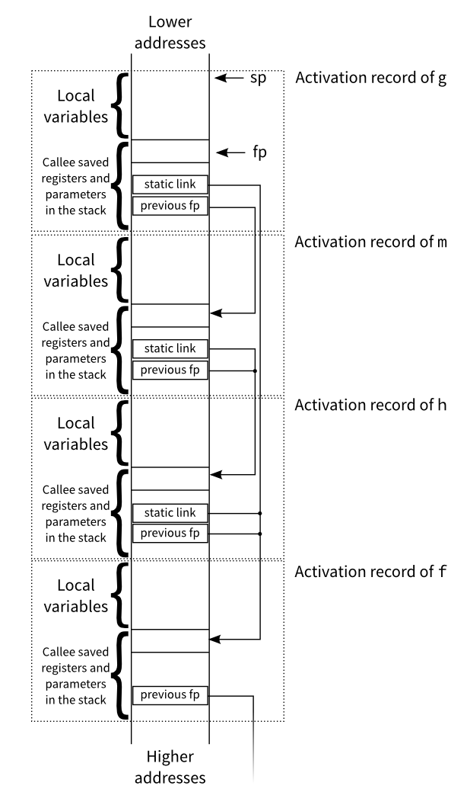
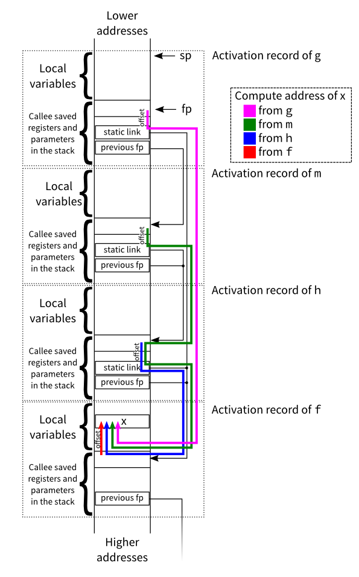

# Nested functions

			<h1>ARM assembler in Raspberry Pi – Chapter 23 </h1>
		
January 2, 2015 Roger Ferrer Ibáñez, <a href="http://thinkingeek.com/2015/01/02/arm-assembler-raspberry-pi-chapter-23/#comments">4</a> 

		

Today we will see what happens when we nest a function inside another. It seems a harmless thing to do but it happens to come with its own dose of interesting details.

<h2>Nested functions</h2>

At the assembler level, functions cannot be nested.

In fact functions do not even exist at the assembler level. They <em>logically</em> exist because we follow some conventions (in ARM Linux it is the AAPCS) and we call them <em>functions</em>. At the assembler level everything is either data, instructions or addresses. Anything else is built on top of those. This fact, though, has not prevented us from enjoying functions: we have called functions like <code>printf</code> and <code>scanf</code> to print and read strings and in chapter 20 we even called functions indirectly. So functions are a very useful logical convention.

So it may make sense to nest a function inside another. What does mean to nest a function inside another? Well, it means that this function will only have meaning as long as its enclosing function is dynamically active (i.e. has been called).

At the assembler level a nested function will look like much any other function but they have enough differences to be interesting.

<h2>Dynamic link</h2>

In chapter 18 we talked about the <em>dynamic link</em>. The dynamic link is set at the beginning of the function and we use the <code>fp</code> register (an alias for <code>r11</code>) to keep an address in the stack usually called the frame pointer (hence the <code>fp</code> name). It is dynamic because it related to the dynamic activation of the function. The frame pointer gives us a consistent way of accessing local data of the function (that will always be stored in the stack) and those parameters that have to be passed using the stack.

Recall that local data, due to the stack growing downwards, is found in negative offsets from the address in the <code>fp</code>. Conversely, parameters passed using the stack will be in positive offsets. Note that <code>fp</code> (aka <code>r11</code>) is a callee-saved register as specified by the AAPCS. This means that we will have to <code>push</code> it onto the stack upon the entry to the function. A non obvious fact from this last step is that the previous frame pointer is always accessible from the current one. In fact it is found among the other callee-saved registers in a positive offset from <code>fp</code> (but a lower offset than the parameters passed using the stack because callee-saved registers are pushed last). This last property may seem non interesting but allows us to chain up through the frame pointer of our callers. In general, this is only of interest for debuggers because they need to keep track of functions being called so far.

The following image shows how the stack layout, after the dynamic link has been set and the stack has been enlarged for local variables, looks like for a function <code>g</code> that has been called by <code>f</code>. The set of data that is addressed using the frame pointer is commonly called the <em>activation record</em>, since it is a bunch of information that is specific of the dynamic activation of the function (i.e. of the current call).

<h2>Static link</h2>

When a function calls a <em>nested function</em> (also called a <em>local function</em>), the nested function can use local variables of the enclosing function. This means that there must be a way for the nested function to access local variables from the enclosing function. One might think that the dynamic link should be enough. In fact, if the programming language only allowed nested functions call other (immediately) nested functions, this would be true. But if this were so, that programming language would be rather limited. That said, for the moment, let’s assume that this is the case: check again the image above. If <code>g</code> is a local function of <code>f</code>, then it should be possible for <code>g</code> to access local variables of <code>f</code> by getting to the previous <code>fp</code>.

Consider the following C code (note that Standard C does not allow nesting functions though <a href="https://gcc.gnu.org/onlinedocs/gcc/Nested-Functions.html" title="GCC nested functions">GCC implements them as an extension</a> that we will discuss in a later chapter).

<table><tbody><tr><td class="line_numbers"><pre>1
2
3
4
5
6
7
8
9
10
11
12
13
</pre></td><td class="code"><pre class="c" style="font-family:monospace;">void f() // non-nested (normal) function
{
  int x;
  void g() // nested function
  {
    x = x + 1; // x ← x + 1
  }
&nbsp;
  x = 1;     // x ← 1
  g();       // call g
  x = x + 1; // x ← x + 1
  // here x will be 3
}</pre></td></tr></tbody></table>
void f() // non-nested (normal) function
{
  int x;
  void g() // nested function
  {
    x = x + 1; // x ← x + 1
  }

  x = 1;     // x ← 1
  g();       // call g
  x = x + 1; // x ← x + 1
  // here x will be 3
}

The code above features this simple case where a function can call a nested one. At the end of the function <code>f</code>, <code>x</code> will have the value <code>2</code> because the nested function <code>g</code> modifies the variable <code>x</code>, also modified by <code>f</code> itself.

To access to <code>x</code> from <code>g</code> we need to get the previous <code>fp</code>. Since only <code>f</code> can call us, once we get this previous <code>fp</code>, it will be like the <code>fp</code> we had inside <code>f</code>. So it is now a matter of using the same offset as <code>f</code> uses.

<table><tbody><tr><td class="line_numbers"><pre>1
2
3
4
5
6
7
8
9
10
11
12
13
14
15
16
17
18
19
20
21
22
23
24
25
26
27
28
29
30
31
32
33
34
35
36
37
38
39
40
41
42
43
44
45
46
47
48
49
50
51
52
53
54
55
56
57
58
59
60
61
62
63
64
65
66
</pre></td><td class="code"><pre class="asm" style="font-family:monospace;">/* nested01.s */
&nbsp;
.text
&nbsp;
f:
    push {r4, r5, fp, lr} /* keep registers */
    mov fp, sp /* keep dynamic link */
&nbsp;
    sub sp, sp, #8      /* make room for x (4 bytes)
                           plus 4 bytes to keep stack
                           aligned */
    /* x is in address "fp - 4" */
&nbsp;
    mov r4, #1          /* r4 ← 0 */
    str r4, [fp, #-4]   /* x ← r4 */
&nbsp;
    bl g                /* call (nested function) g
                           (the code of 'g' is given below, after 'f') */
&nbsp;
    ldr r4, [fp, #-4]   /* r4 ← x */
    add r4, r4, #1      /* r4 ← r4 + 1 */
    str r4, [fp, #-4]   /* x ← r4 */
&nbsp;
    mov sp, fp /* restore dynamic link */
    pop {r4, r5, fp, lr} /* restore registers */
    bx lr /* return */
&nbsp;
    /* nested function g */
    g:
        push {r4, r5, fp, lr} /* keep registers */
        mov fp, sp /* keep dynamic link */
&nbsp;
        /* At this point our stack looks like this
&nbsp;
          Data | Address | Notes
         ------+---------+--------------------------
           r4  | fp      |  
           r5  | fp + 4  |
           fp  | fp + 8  | This is the previous fp
           lr  | fp + 16 |
        */
&nbsp;
        ldr r4, [fp, #+8] /* get the frame pointer
                             of my caller
                             (since only f can call me)
                           */
&nbsp;
        /* now r4 acts like the fp we had inside 'f' */
        ldr r5, [r4, #-4] /* r5 ← x */
        add r5, r5, #1    /* r5 ← r5 + 1 */
        str r5, [r4, #-4] /* x ← r5 */
&nbsp;
        mov sp, fp /* restore dynamic link */
        pop {r4, r5, fp, lr} /* restore registers */
        bx lr /* return */
&nbsp;
.globl main
&nbsp;
main :
    push {r4, lr} /* keep registers */
&nbsp;
    bl f          /* call f */
&nbsp;
    mov r0, #0
    pop {r4, lr}
    bx lr</pre></td></tr></tbody></table>
/* nested01.s */

.text

f:
    push {r4, r5, fp, lr} /* keep registers */
    mov fp, sp /* keep dynamic link */

    sub sp, sp, #8      /* make room for x (4 bytes)
                           plus 4 bytes to keep stack
                           aligned */
    /* x is in address "fp - 4" */

    mov r4, #1          /* r4 ← 0 */
    str r4, [fp, #-4]   /* x ← r4 */

    bl g                /* call (nested function) g
                           (the code of 'g' is given below, after 'f') */

    ldr r4, [fp, #-4]   /* r4 ← x */
    add r4, r4, #1      /* r4 ← r4 + 1 */
    str r4, [fp, #-4]   /* x ← r4 */

    mov sp, fp /* restore dynamic link */
    pop {r4, r5, fp, lr} /* restore registers */
    bx lr /* return */

    /* nested function g */
    g:
        push {r4, r5, fp, lr} /* keep registers */
        mov fp, sp /* keep dynamic link */

        /* At this point our stack looks like this

          Data | Address | Notes
         ------+---------+--------------------------
           r4  | fp      |  
           r5  | fp + 4  |
           fp  | fp + 8  | This is the previous fp
           lr  | fp + 16 |
        */

        ldr r4, [fp, #+8] /* get the frame pointer
                             of my caller
                             (since only f can call me)
                           */

        /* now r4 acts like the fp we had inside 'f' */
        ldr r5, [r4, #-4] /* r5 ← x */
        add r5, r5, #1    /* r5 ← r5 + 1 */
        str r5, [r4, #-4] /* x ← r5 */

        mov sp, fp /* restore dynamic link */
        pop {r4, r5, fp, lr} /* restore registers */
        bx lr /* return */

.globl main

main :
    push {r4, lr} /* keep registers */

    bl f          /* call f */

    mov r0, #0
    pop {r4, lr}
    bx lr

Ok, the essential idea is set. When accessing a local variable, we always need to get the frame pointer of the function where the local variable belongs. In line 43 we get the frame pointer of our caller and then we use it to access the variable <code>x</code>, lines 49 to 51. Of course, if the local variable belongs to the current function, nothing special has to be done since fp suffices, see lines 20 to 22.

That said, though the idea is fundamentally correct, using the dynamic link limits us a lot: only a single call from an enclosing function is possible. What if we allow nested functions to call other nested functions (sibling functions) or worse, what would have happened if <code>g</code> above called itself recursively? The dynamic link we will find in the stack will always refer to the previous dynamically activated function, and in the example above it was <code>f</code>, but if <code>g</code> recursively calls itself, <code>g</code> will be the previous dynamically activated function!

It is clear that something is amiss. Using the dynamic link is not right because, when accessing a local variable of an enclosing function, we need to get the last activation of that enclosing function at the point where the nested function was called. The way to keep the last activation of the enclosing function is called <em>static link</em> in contrast to the dynamic link.

The static link is conceptually simple, it is also a chain of frame pointers like the dynamic link. In contrast to the dynamic link, which is always set the same way by the callee), the static link may be set differently depending on which function is being called and it will be set by the caller. Below we will see the exact rules.

Consider the following more contrived example;

<table><tbody><tr><td class="code"><pre class="c" style="font-family:monospace;">void f(void) // non nested (nesting depth = 0)
{
   int x;
&nbsp;
   void g() // nested (nesting depth = 1)
   {
      x = x + 1; // x ← x + 1
   }
   void h() // nested (nesting depth = 1)
   {
      void m() // nested (nesting depth = 2)
      {
         x = x + 2; // x ← x + 2
         g(); // call g
      }
&nbsp;
      g(); // call g
      m(); // call m
      x = x + 3; // x ← x + 3
   }
&nbsp;
   x = 1; // x ← 1
   h();  // call h
   // here x will be 8
}</pre></td></tr></tbody></table>
void f(void) // non nested (nesting depth = 0)
{
   int x;

   void g() // nested (nesting depth = 1)
   {
      x = x + 1; // x ← x + 1
   }
   void h() // nested (nesting depth = 1)
   {
      void m() // nested (nesting depth = 2)
      {
         x = x + 2; // x ← x + 2
         g(); // call g
      }

      g(); // call g
      m(); // call m
      x = x + 3; // x ← x + 3
   }

   x = 1; // x ← 1
   h();  // call h
   // here x will be 8
}

A function can, obviously, call an immediately nested function. So from the body of function <code>f</code> we can call <code>g</code> or <code>h</code>. Similarly from the body of function <code>h</code> we can call <code>m</code>. A function can be called by other (non-immediately nested) functions as long as the nesting depth of the caller is greater or equal than the callee. So from <code>m</code> we can call <code>m</code> (recursively), <code>h</code>, <code>g</code> and <code>f</code>. It would not be allowed that <code>f</code> or <code>g</code> called <code>m</code>.

Note that <code>h</code> and <code>g</code> are both enclosed by <code>f</code>. So when they are called, their dynamic link will be of course the caller but their static link must always point to the frame of <code>f</code>. On the other hand, <code>m</code> is enclosed by <code>h</code>, so its static link will point to the frame of <code>h</code> (and in the example, its dynamic link too because it is the only nested function inside <code>h</code> and it does not call itself recursively either). When <code>m</code> calls <code>g</code>, the static link must be again the frame of its enclosing function <code>f</code>.

<h3>Setting up a static link</h3>

Like it happens with the dynamic link, the AAPCS does not mandate any register to be used as the static link. In fact, any callee-saved register that does not have any specific purpose will do. We will use <code>r10</code>.

Setting up the static link is a bit more involved because it requires paying attention which function we are calling. There are two cases:

<ul style="list-style-type: upper-roman;">
<li>The function is immediately nested (like when from <code>f</code> we call <code>g</code> or <code>h</code>, or when from <code>h</code> we call <code>m</code>). The static link is simply the frame pointer of the caller.<bl> 
For theses cases, thus, the following is all we have to do prior the call.

<table><tbody><tr><td class="code"><pre class="asm" style="font-family:monospace;">mov r10, fp
bl immediately-nested-function</pre></td></tr></tbody></table>
mov r10, fp
bl immediately-nested-function

</bl></li><li>The function is not immediately nested (like when from <code>m</code> we call <code>g</code>) then the static frame must be that of the enclosing function of the callee. Since the static link forms a chain it is just a matter of advancing in the chain as many times as the difference of nesting depths.<bl> 
For instance, when <code>m</code> calls <code>g</code>, the static link of <code>m</code> is the frame of <code>h</code>. At the same time the static link of <code>h</code> is the frame of <code>f</code>. Since <code>g</code> and <code>h</code> are siblings, their static link must be the same. So when <code>m</code> calls <code>g</code>, the static link should be the same of <code>h</code>.<bl> 
For theses cases, we will have to do the following

<table><tbody><tr><td class="code"><pre class="asm" style="font-family:monospace;">ldr r10, [fp, #X0] /* Xi will be the appropiate offset 
                     where the previous value of r10 is found
                     Note that Xi depends on the layout of
                     our stack after we have push-ed the
                     caller-saved registers
                   */
ldr r10, [r10, #X1]  \
ldr r10, [r10, #X2]   |
...                   | advance the static link as many times
...                   | the difference of the nesting depth
...                   | (it may be zero times when calling a sibling)
ldr r10, [r10, #Xn]  /
bl non-immediately-nested-function</pre></td></tr></tbody></table>
ldr r10, [fp, #X0] /* Xi will be the appropiate offset 
                     where the previous value of r10 is found
                     Note that Xi depends on the layout of
                     our stack after we have push-ed the
                     caller-saved registers
                   */
ldr r10, [r10, #X1]  \
ldr r10, [r10, #X2]   |
...                   | advance the static link as many times
...                   | the difference of the nesting depth
...                   | (it may be zero times when calling a sibling)
ldr r10, [r10, #Xn]  /
bl non-immediately-nested-function

</bl></bl></li></ul>

This may seem very complicated but it is not. Since in the example above there are a few functions, we will do one function at a time. Let’s start with <code>f</code>.

<table><tbody><tr><td class="line_numbers"><pre>31
32
33
34
35
36
37
38
39
40
41
42
43
44
45
46
47
48
49
50
51
52
53
54
55
56
57
58
59
60
61
</pre></td><td class="code"><pre class="asm" style="font-family:monospace;">f:
    push {r4, r10, fp, lr} /* keep registers */
    mov fp, sp             /* setup dynamic link */
&nbsp;
    sub sp, sp, #8      /* make room for x (4 + 4 bytes) */
    /* x will be in address "fp - 4" */
&nbsp;
    /* At this point our stack looks like this
&nbsp;
     Data | Address | Notes
    ------+---------+---------------------------
          | fp - 8  | alignment (per AAPCS)
      x   | fp - 4  | 
      r4  | fp      |  
      r10 | fp + 8  | previous value of r10
      fp  | fp + 12 | previous value of fp
      lr  | fp + 16 |
   */
&nbsp;
    mov r4, #1          /* r4 ← 1 */
    str r4, [fp, #-4]   /* x ← r4 */
&nbsp;
    /* prepare the call to h */
    mov r10, fp /* setup the static link,
                   since we are calling an immediately nested function
                   it is just the current frame */
    bl h        /* call h */
&nbsp;
    mov sp, fp             /* restore stack */
    pop {r4, r10, fp, lr}  /* restore registers */
    bx lr /* return */</pre></td></tr></tbody></table>
f:
    push {r4, r10, fp, lr} /* keep registers */
    mov fp, sp             /* setup dynamic link */

    sub sp, sp, #8      /* make room for x (4 + 4 bytes) */
    /* x will be in address "fp - 4" */

    /* At this point our stack looks like this

     Data | Address | Notes
    ------+---------+---------------------------
          | fp - 8  | alignment (per AAPCS)
      x   | fp - 4  | 
      r4  | fp      |  
      r10 | fp + 8  | previous value of r10
      fp  | fp + 12 | previous value of fp
      lr  | fp + 16 |
   */

    mov r4, #1          /* r4 ← 1 */
    str r4, [fp, #-4]   /* x ← r4 */

    /* prepare the call to h */
    mov r10, fp /* setup the static link,
                   since we are calling an immediately nested function
                   it is just the current frame */
    bl h        /* call h */

    mov sp, fp             /* restore stack */
    pop {r4, r10, fp, lr}  /* restore registers */
    bx lr /* return */

Since <code>f</code> is not nested in any other function, the previous value of <code>r10</code> does not have any special meaning for us. We just keep it because <code>r10</code>, despite the special meaning we will give it, is still a callee-saved register as mandated by the AAPCS. At the beginning, we allocate space for the variable <code>x</code> by enlarging the stack (line 35). Variable <code>x</code> will be always in <code>fp - 4</code>. Then we set <code>x</code> to 1 (line 51). Nothing fancy here since this is a non-nested function.

Now f calls h (line 57). Since it is an immediately nested function, the static link is as in the case I: the current frame pointer. So we just set <code>r10</code> to be <code>fp</code> (line 56).

Let’s see the code of <code>h</code> now.

<table><tbody><tr><td class="line_numbers"><pre>63
64
65
66
67
68
69
70
71
72
73
74
75
76
77
78
79
80
81
82
83
84
85
86
87
88
89
90
91
92
93
94
95
96
97
98
99
100
101
</pre></td><td class="code"><pre class="asm" style="font-family:monospace;">/* ------ nested function ------------------ */
h :
    push {r4, r5, r10, fp, lr} /* keep registers */
    mov fp, sp /* setup dynamic link */
&nbsp;
    sub sp, sp, #4 /* align stack */
&nbsp;
    /* At this point our stack looks like this
&nbsp;
      Data | Address | Notes
     ------+---------+---------------------------
           | fp - 4  | alignment (per AAPCS)
       r4  | fp      |  
       r5  | fp + 4  | 
       r10 | fp + 8  | frame pointer of 'f'
       fp  | fp + 12 | frame pointer of caller
       lr  | fp + 16 |
    */
&nbsp;
    /* prepare call to g */
    /* g is a sibling so the static link will be the same
       as the current one */
    ldr r10, [fp, #8]
    bl g
&nbsp;
    /* prepare call to m */
    /* m is an immediately nested function so the static
       link is the current frame */
    mov r10, fp
    bl m
&nbsp;
    ldr r4, [fp, #8]  /* load frame pointer of 'f' */
    ldr r5, [r4, #-4]  /* r5 ← x */
    add r5, r5, #3     /* r5 ← r5 + 3 */
    str r5, [r4, #-4]  /* x ← r5 */
&nbsp;
    mov sp, fp            /* restore stack */
    pop {r4, r5, r10, fp, lr} /* restore registers */
    bx lr</pre></td></tr></tbody></table>
/* ------ nested function ------------------ */
h :
    push {r4, r5, r10, fp, lr} /* keep registers */
    mov fp, sp /* setup dynamic link */

    sub sp, sp, #4 /* align stack */

    /* At this point our stack looks like this

      Data | Address | Notes
     ------+---------+---------------------------
           | fp - 4  | alignment (per AAPCS)
       r4  | fp      |  
       r5  | fp + 4  | 
       r10 | fp + 8  | frame pointer of 'f'
       fp  | fp + 12 | frame pointer of caller
       lr  | fp + 16 |
    */

    /* prepare call to g */
    /* g is a sibling so the static link will be the same
       as the current one */
    ldr r10, [fp, #8]
    bl g

    /* prepare call to m */
    /* m is an immediately nested function so the static
       link is the current frame */
    mov r10, fp
    bl m

    ldr r4, [fp, #8]  /* load frame pointer of 'f' */
    ldr r5, [r4, #-4]  /* r5 ← x */
    add r5, r5, #3     /* r5 ← r5 + 3 */
    str r5, [r4, #-4]  /* x ← r5 */

    mov sp, fp            /* restore stack */
    pop {r4, r5, r10, fp, lr} /* restore registers */
    bx lr

We start the function as usual, pushing registers onto the stack and setting up the dynamic link (lines 64 to 65). We adjust the stack so the stack pointer is 8-byte aligned because we have pushed an even number of registers (line 68). If you check the layout of the stack after this last adjustment (depicted in lines 72 to 79), you will see that in <code>fp + 8</code> we have the value of <code>r10</code> which the caller of <code>h</code> (in this example only <code>f</code>, but it could be another function) must ensure that is the frame pointer of <code>f</code>. This extra pointer in the stack is the static link.

Now the function calls <code>g</code> (line 86) but it must properly set the static link prior to the call. In this case the static link is the same as <code>h</code> because we call <code>g</code> which is a sibling of <code>h</code>, so they share the same static link. We get it from <code>fp + 8</code> (line 85). This is in fact the case II described above: <code>g</code> is not an immediately nested function of <code>h</code>. So we have to get the static link of the caller (the static link of <code>h</code>, found in <code>fp + 8</code>) and then advance it as many times as the difference of their nesting depths. Being siblings means that their nesting depths are the same, so no advancement is actually required.

After the call to <code>g</code>, the function calls <code>m</code> (line 92) which happens to be an immediately nested function, so its static link is the current frame pointer (line 91) because this is again the case I.

Let’s see now the code of <code>m</code>.

<table><tbody><tr><td class="line_numbers"><pre>104
105
106
107
108
109
110
111
112
113
114
115
116
117
118
119
120
121
122
123
124
125
126
127
128
129
130
131
132
133
134
135
</pre></td><td class="code"><pre class="asm" style="font-family:monospace;">/* ------ nested function ------------------ */
m:
    push {r4, r5, r10, fp, lr} /* keep registers */
    mov fp, sp /* setup dynamic link */
&nbsp;
    sub sp, sp, #4 /* align stack */
    /* At this point our stack looks like this
&nbsp;
      Data | Address | Notes
     ------+---------+---------------------------
           | fp - 4  | alignment (per AAPCS)
       r4  | fp      |  
       r5  | fp + 4  |
       r10 | fp + 8  | frame pointer of 'h'
       fp  | fp + 12 | frame pointer of caller
       lr  | fp + 16 |
    */
&nbsp;
    ldr r4, [fp, #8]  /* r4 ← frame pointer of 'h' */
    ldr r4, [r4, #8]  /* r4 ← frame pointer of 'f' */
    ldr r5, [r4, #-4] /* r5 ← x */
    add r5, r5, #2    /* r5 ← r5 + 2 */
    str r5, [r4, #-4] /* x ← r5 */
&nbsp;
    /* setup call to g */
    ldr r10, [fp, #8]   /* r10 ← frame pointer of 'h' */
    ldr r10, [r10, #8]  /* r10 ← frame pointer of 'f' */
    bl g
&nbsp;
    mov sp, fp                /* restore stack */
    pop {r4, r5, r10, fp, lr} /* restore registers */
    bx lr</pre></td></tr></tbody></table>
/* ------ nested function ------------------ */
m:
    push {r4, r5, r10, fp, lr} /* keep registers */
    mov fp, sp /* setup dynamic link */

    sub sp, sp, #4 /* align stack */
    /* At this point our stack looks like this

      Data | Address | Notes
     ------+---------+---------------------------
           | fp - 4  | alignment (per AAPCS)
       r4  | fp      |  
       r5  | fp + 4  |
       r10 | fp + 8  | frame pointer of 'h'
       fp  | fp + 12 | frame pointer of caller
       lr  | fp + 16 |
    */

    ldr r4, [fp, #8]  /* r4 ← frame pointer of 'h' */
    ldr r4, [r4, #8]  /* r4 ← frame pointer of 'f' */
    ldr r5, [r4, #-4] /* r5 ← x */
    add r5, r5, #2    /* r5 ← r5 + 2 */
    str r5, [r4, #-4] /* x ← r5 */

    /* setup call to g */
    ldr r10, [fp, #8]   /* r10 ← frame pointer of 'h' */
    ldr r10, [r10, #8]  /* r10 ← frame pointer of 'f' */
    bl g

    mov sp, fp                /* restore stack */
    pop {r4, r5, r10, fp, lr} /* restore registers */
    bx lr

Function <code>m</code> starts pretty similar to h: we push the registers, setup the dynamic link and adjust the stack so it is 8-byte aligned (lines 106 to 109). After this, we again have the static link at <code>fp + 8</code>. If you are wondering if the static link will always be in <code>fp + 8</code>, the answer is no, it depends on how many registers are pushed before <code>r10</code>, it just happens that we always push <code>r4</code> and <code>r5</code>, but if we, for instance, also pushed <code>r6</code> it would be at a larger offset. Each function may have the static link at different offsets (this is why we are drawing the stack layout for every function, bear this in mind!).

The first thing m does is <code>x ← x + 2</code>. So we have to get the address of <code>x</code>. The address of <code>x</code> is relative to the frame pointer of <code>f</code> because <code>x</code> is a local variable of <code>f</code>. We do not have the frame pointer of <code>f</code> but the one of <code>h</code> (this is the static link of <code>m</code>). Since the frame pointers form a chain, we can load the frame pointer of <code>h</code> and then use it to get the static link of <code>h</code> which will be the frame pointer of <code>f</code>. You may have to reread this last statement twice  So we first get the frame pointer of <code>h</code> (line 122), recall that this is the static link of <code>m</code> that was set up when <code>h</code> called <code>m</code> (line 91). Now we have the frame pointer of h, so we can get its static link (line 123) which again is at offset <code>+8</code> but this is by chance, it could be in a different offset! The static link of <code>h</code> is the frame pointer of <code>f</code>, so we now have the frame pointer <code>f</code> as we wanted and then we can proceed to get the address of <code>x</code>, which is at offset <code>-4</code> of the frame pointer of <code>f</code>. With this address now we can perform <code>x ← x + 2</code> (lines 124 to 126).

Then <code>m</code> calls <code>g</code> (line 131). This is again a case II. But this time <code>g</code> is not a sibling of <code>m</code>: their nesting depths differ by 1. So we first load the current static link (line 129), the frame pointer of h. And then we advance 1 link through the chain of static links (line 130). Let me insist again: it is by chance that the static link of <code>h</code> and <code>f</code> is found at <code>fp+8</code>, each function could have it at different offsets.

Let’s see now the code of g, which is pretty similar to that of h except that it does not call anyone.

<table><tbody><tr><td class="line_numbers"><pre>127
128
129
130
131
132
133
134
135
136
137
138
139
140
141
142
143
144
145
146
147
148
149
150
151
152
153
</pre></td><td class="code"><pre class="asm" style="font-family:monospace;">/* ------ nested function ------------------ */
g:
    push {r4, r5, r10, fp, lr} /* keep registers */
    mov fp, sp /* setup dynamic link */
&nbsp;
    sub sp, sp, #4 /* align stack */
&nbsp;
    /* At this point our stack looks like this
&nbsp;
      Data | Address | Notes
     ------+---------+---------------------------
           | fp - 4  | alignment (per AAPCS)
       r4  | fp      |  
       r5  | fp + 4  |  
       r10 | fp + 8  | frame pointer of 'f'
       fp  | fp + 12 | frame pointer of caller
       lr  | fp + 16 |
    */
&nbsp;
    ldr r4, [fp, #8]  /* r4 ← frame pointer of 'f' */
    ldr r5, [r4, #-4] /* r5 ← x */
    add r5, r5, #1    /* r5 ← r5 + 1 */
    str r5, [r4, #-4] /* x ← r5 */
&nbsp;
    mov sp, fp /* restore dynamic link */
    pop {r4, r5, r10, fp, lr} /* restore registers */
    bx lr</pre></td></tr></tbody></table>
/* ------ nested function ------------------ */
g:
    push {r4, r5, r10, fp, lr} /* keep registers */
    mov fp, sp /* setup dynamic link */

    sub sp, sp, #4 /* align stack */

    /* At this point our stack looks like this

      Data | Address | Notes
     ------+---------+---------------------------
           | fp - 4  | alignment (per AAPCS)
       r4  | fp      |  
       r5  | fp + 4  |  
       r10 | fp + 8  | frame pointer of 'f'
       fp  | fp + 12 | frame pointer of caller
       lr  | fp + 16 |
    */

    ldr r4, [fp, #8]  /* r4 ← frame pointer of 'f' */
    ldr r5, [r4, #-4] /* r5 ← x */
    add r5, r5, #1    /* r5 ← r5 + 1 */
    str r5, [r4, #-4] /* x ← r5 */

    mov sp, fp /* restore dynamic link */
    pop {r4, r5, r10, fp, lr} /* restore registers */
    bx lr

Note that <code>h</code> and <code>g</code> compute the address of <code>x</code> exactly the same way since they are at the same nesting depth.

Below is a picture of how the layout looks once <code>m</code> has called <code>g</code>. Note that the static link of <code>g</code> and <code>h</code> is the same, the frame pointer of <code>f</code>, because they are siblings.

Below is the same image but this time using coloured lines to show how each function can compute the address of <code>x</code>.

Finally here is the <code>main</code>. Note that when a non-nested function calls another non-nested function, there is no need to do anything to <code>r10</code>. This is the reason why <code>r10</code> does not have any meaningful value upon the entry to <code>f</code>.

<table><tbody><tr><td class="line_numbers"><pre>152
153
154
155
156
157
158
159
160
161
</pre></td><td class="code"><pre class="asm" style="font-family:monospace;">.globl main
&nbsp;
main :
    push {r4, lr} /* keep registers */
&nbsp;
    bl f          /* call f */
&nbsp;
    mov r0, #0
    pop {r4, lr}
    bx lr</pre></td></tr></tbody></table>
.globl main

main :
    push {r4, lr} /* keep registers */

    bl f          /* call f */

    mov r0, #0
    pop {r4, lr}
    bx lr

<h2>Discussion</h2>

If you stop and think about all this stuff of the static link you may soon realize that there is something murky with all this nested functions business: we are passing some sort of hidden parameter (through <code>r10</code>) to the nested functions. In fact, we are somehow cheating, because we set <code>r10</code> right before the call and then we push it at the entry of the nested functions even if they do not modify it in the called function. Why are we doing this seemingly useless step?

Well, by always pushing <code>r10</code> in the stack, we are just covering up the naked truth: nested functions require a, somewhat hidden, extra parameter. This extra parameter is this static link thing. Sometimes it is also called the <em>lexical scope</em>. It is called the lexical scope because it gives us the <em>context</em> of the lexically (i.e. in the code) enclosing function (in contrast the dynamic scope would be that of our caller, which we do not care about unless we are a debugger). With that lexical context we can get the local variables of that enclosing function. Due to the chaining nature of the static link, we can move up the lexical scopes. This is the reason <code>m</code> can access a variable of <code>f</code>, it just <em>climbs</em> through the static links as shown in the last picture above.

Can we pass the lexical scope to a function using the stack, rather than a callee-saved register? Sure. For convenience it may have to be the first stack-passed parameter (so its offset from <code>fp</code> is easy to compute). Instead of setting <code>r10</code> prior the call, we will enlarge <code>sp</code> as needed (at least 8 bytes, to keep the stack 8-byte aligned) and then store there the static link. In the stack layout, the static link now will be found after (i.e. larger offsets than) the pushed registers.

Can we pass the lexical scope using a caller-saved register (like <code>r0</code>, <code>r1</code>, <code>r2</code> or <code>r3</code>)? Yes, but the first thing we should do is to keep it in the stack, as a local variable (i.e. negative offsets from <code>fp</code>). Why? Because if we do not keep it in the stack we will not be able to move upwards the static links.

As you can see, any approach requires us to keep the static link in the stack. While our approach of using <code>r10</code> may not be completely orthodox ends doing the right thing.

But the discussion would not be complete if we did not talk about pointers. What about a pointer to a nested function? Is that even possible? When (directly) calling a nested function we can set the lexical scope appropiately because we know everything: we know where we are and we know which function we are going to call. But what about an indirect call using a pointer to a function? We do not know which (possibly nested) function we are going to call, how can we appropriately set its lexical scope. Well, the answer is, we cannot unless we keep the lexical scope somewhere. This means that just the address of the function will not do. We will need to keep, along with the address to the function, the lexical scope. So a pointer to a nested function happens to be different to a pointer to a non-nested function, given that the latter does not need the lexical scope to be set.

Having incompatible pointers for nested an non nested functions is not desirable. This may be a reason why C (and C++) do not directly support nested functions (albeit this limitation can be worked around using other approaches). In the next chapter, we will see a clever approach to avoid, to some extent, having different pointers to nested functions that are different from pointers to non nested functions.

That’s all for today.

<!-- Simple Share Buttons Adder (6.3.4) simplesharebuttons.com -->

 This work by <a target="_blank" xmlns:cc="http://creativecommons.org/ns#" href="http://thinkingeek.com/author/rferrer/" property="cc:attributionName" rel="cc:attributionURL nofollow">Roger Ferrer Ibáñez</a> is licensed under a <a target="_blank" rel="license nofollow" href="http://creativecommons.org/licenses/by-nc-sa/4.0/">Creative Commons Attribution-NonCommercial-ShareAlike 4.0 International</a> 
						

		

			<a href="http://thinkingeek.com/2014/12/20/arm-assembler-raspberry-pi-chapter-22/" rel="prev">ARM assembler in Raspberry Pi – Chapter 22</a>
			<a href="http://thinkingeek.com/2015/01/03/dvd-with-bogus-permissions-ubuntu/" rel="next">Read DVDs with bogus permissions in Ubuntu</a>
		

		

<!-- You can start editing here. -->

	
			<h3>4 thoughts on “ARM assembler in Raspberry Pi – Chapter 23”</h3>
		<ul class="commentlist">
				<li class="comment even thread-even depth-1 parent" id="comment-767021">
				

				

						<cite class="fn"><a href="http://devel.meruelo.com.es/blog/" rel="external nofollow" class="url">Fernando</a></cite> says:		

		
		
<a href="http://thinkingeek.com/2015/01/02/arm-assembler-raspberry-pi-chapter-23/#comment-767021">
			January 18, 2015 at 12:42 am</a>		

		
It looks like I am your most devoted reader… lol. It took you some time to write something new but now that I check you’ve got three new entries. What a pity that we don’t have even more Christmas holidays 

On the other hand, something that helped me get things straight: contents between frame pointers pertain to a single function (that is, in the stack, after (lower memory) fp we’ve got local data, data pushed to be passed as parameters and then registers saved by the callee in compliance of AAPCS). On the other hand, the activation record of any function defines the bunch of data used by such a function (thus, arguments passed by caller, arguments pushed to comply AAPCS and local data). Through reading this I’ve been wondering why the fp does not point just to the top of the stack after passing parameters, before pushing callee-saved registers, as it seems easier to access what you really need (even though to exit you will need to ldmib or advance your sp prior to popping).

Also, why would you ever need nested functions? It looks a bit of a mess, not the assembler beneath it but the C-code -hard to follow as hell on big codes, I guess-.

		
<a rel="nofollow" class="comment-reply-link" href="http://thinkingeek.com/2015/01/02/arm-assembler-raspberry-pi-chapter-23/?replytocom=767021#respond" onclick="return addComment.moveForm( &quot;div-comment-767021&quot;, &quot;767021&quot;, &quot;respond&quot;, &quot;1798&quot; )" aria-label="Reply to Fernando">Reply</a>

				

		<ul class="children">
		<li class="comment byuser comment-author-rferrer bypostauthor odd alt depth-2" id="comment-776615">
				

				

						<cite class="fn">rferrer</cite> says:		

		
		
<a href="http://thinkingeek.com/2015/01/02/arm-assembler-raspberry-pi-chapter-23/#comment-776615">
			January 23, 2015 at 9:36 pm</a>		

		
Hi Fernando,

since the AAPCS does not dictate anything about the fp register, your choice is sensible as well. Currently we do something like

<code>push callee-saved-registers 
mov fp, sp 
... 
mov sp, fp 
pop callee-saved-registers</code>

If I understood you correctly, you wonder why not doing instead

<code>mov fp, sp 
push callee-saved-registers 
... 
pop callee-saved-registers 
mov sp, fp</code>

(Note that fp will be in callee-saved-registers in both cases)

I think, that both approaches are fine and probably there is little difference except for the offsets where you will find your data: parameters passed on to the stack will be closer (at positive offsets, higher addresses) while local data it will be slightly farther (at negative offsets, lower addresses) because you have to “jump” the callee-saved registers. But rather than that, there is little difference in one approach and the other. I just felt simpler to add something after (and before) the usual push (and pop) sequences at the beginning (and end) of the functions.

Finally, thanks for following the posts and bringing up good questions like that.

		
<a rel="nofollow" class="comment-reply-link" href="http://thinkingeek.com/2015/01/02/arm-assembler-raspberry-pi-chapter-23/?replytocom=776615#respond" onclick="return addComment.moveForm( &quot;div-comment-776615&quot;, &quot;776615&quot;, &quot;respond&quot;, &quot;1798&quot; )" aria-label="Reply to rferrer">Reply</a>

				

		</li><!-- #comment-## -->
</ul><!-- .children -->
</li><!-- #comment-## -->
		<li class="comment even thread-odd thread-alt depth-1 parent" id="comment-816845">
				

				

						<cite class="fn"><a href="http://pervin@utdallas.edu" rel="external nofollow" class="url">William Pervin</a></cite> says:		

		
		
<a href="http://thinkingeek.com/2015/01/02/arm-assembler-raspberry-pi-chapter-23/#comment-816845">
			March 10, 2015 at 5:26 pm</a>		

		
In the first C code I think line 12 should be “// here x will be  3”. I agree with the contrived example that “// here x will be 8”. Got more reading to do since this is, indeed, complicated.

		
<a rel="nofollow" class="comment-reply-link" href="http://thinkingeek.com/2015/01/02/arm-assembler-raspberry-pi-chapter-23/?replytocom=816845#respond" onclick="return addComment.moveForm( &quot;div-comment-816845&quot;, &quot;816845&quot;, &quot;respond&quot;, &quot;1798&quot; )" aria-label="Reply to William Pervin">Reply</a>

				

		<ul class="children">
		<li class="comment byuser comment-author-rferrer bypostauthor odd alt depth-2" id="comment-818011">
				

				

						<cite class="fn">rferrer</cite> says:		

		
		
<a href="http://thinkingeek.com/2015/01/02/arm-assembler-raspberry-pi-chapter-23/#comment-818011">
			March 11, 2015 at 8:50 pm</a>		

		
Hi Williams,

you are right. I already fixed the post.

Thanks a lot.

		
<a rel="nofollow" class="comment-reply-link" href="http://thinkingeek.com/2015/01/02/arm-assembler-raspberry-pi-chapter-23/?replytocom=818011#respond" onclick="return addComment.moveForm( &quot;div-comment-818011&quot;, &quot;818011&quot;, &quot;respond&quot;, &quot;1798&quot; )" aria-label="Reply to rferrer">Reply</a>

				

		</li><!-- #comment-## -->
</ul><!-- .children -->
</li><!-- #comment-## -->
		</ul>
	
	

		

		<h3 id="reply-title" class="comment-reply-title">Leave a Reply <small><a rel="nofollow" id="cancel-comment-reply-link" href="/2015/01/02/arm-assembler-raspberry-pi-chapter-23/#respond" style="display:none;">Cancel reply</a></small></h3>			<form action="http://thinkingeek.com/wp-comments-post.php" method="post" id="commentform" class="comment-form">
				
Your email address will not be published. Required fields are marked *

<label for="comment">Comment</label> <textarea id="comment" name="comment" cols="45" rows="8" maxlength="65525" aria-required="true" required="required"></textarea>

<label for="author">Name *</label> <input id="author" name="author" type="text" value="" size="30" maxlength="245" aria-required="true" required="required">

<label for="email">Email *</label> <input id="email" name="email" type="text" value="" size="30" maxlength="100" aria-describedby="email-notes" aria-required="true" required="required">

<label for="url">Website</label> <input id="url" name="url" type="text" value="" size="30" maxlength="200">

<input name="submit" type="submit" id="submit" class="submit" value="Post Comment"> <input type="hidden" name="comment_post_ID" value="1798" id="comment_post_ID">
<input type="hidden" name="comment_parent" id="comment_parent" value="0">

<input type="hidden" id="akismet_comment_nonce" name="akismet_comment_nonce" value="960166088d">

<input type="checkbox" name="subscribe_comments" id="subscribe_comments" value="subscribe" style="width: auto; -moz-appearance: checkbox; -webkit-appearance: checkbox;"> <label class="subscribe-label" id="subscribe-label" for="subscribe_comments">Notify me of follow-up comments by email.</label>

<input type="checkbox" name="subscribe_blog" id="subscribe_blog" value="subscribe" style="width: auto; -moz-appearance: checkbox; -webkit-appearance: checkbox;"> <label class="subscribe-label" id="subscribe-blog-label" for="subscribe_blog">Notify me of new posts by email.</label>

			<input type="hidden" id="ak_js" name="ak_js" value="1496666870476"></form>
			
<!-- #respond -->
	
	

