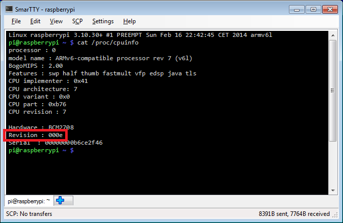
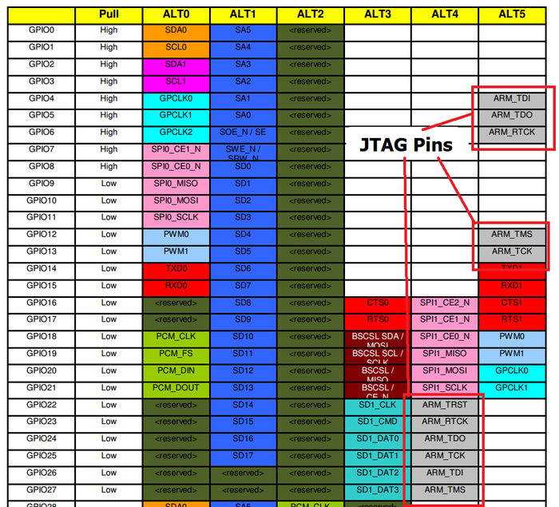
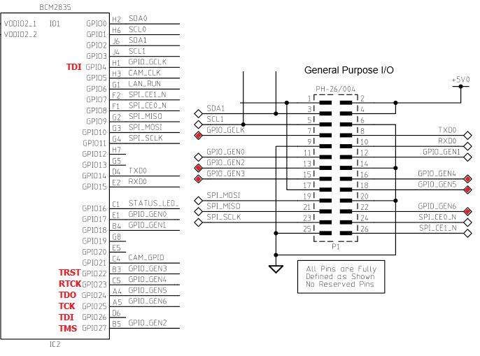
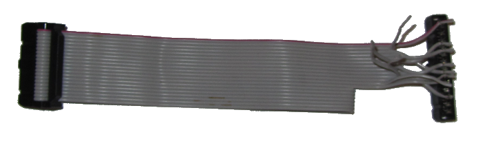
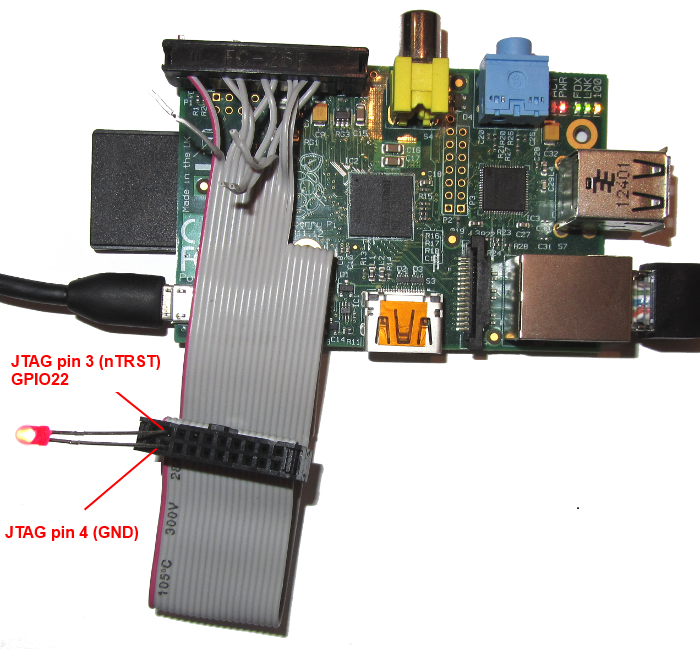
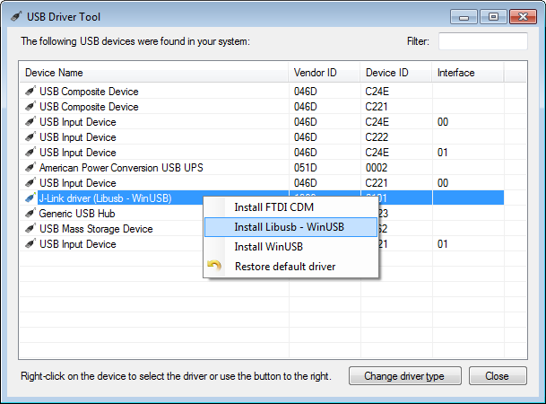
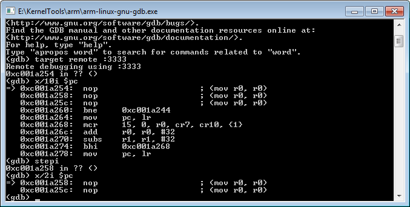

# Preparing Raspberry PI for JTAG Debugging


This tutorial shows how to prepare your Raspberry PI board for debugging with JTAG. Using JTAG will allow debugging the Linux kernel using hardware like Segger J-Link. As Raspberry PI board does not have a connector with a normal JTAG layout, preparing the board for JTAG debugging involves finding the correct pins and wiring them in the correct order. Follow the steps below for a complete walkthrough:


- Determine the revision of your Raspberry PI board. Connect to it using SSH and run the following command:

```c
cat /proc/cpuinfo

```





- Use the revision table to look up the board revision. In this tutorial we will use Model B v2.0 (revision 0xe).

- In order to find which pins on the board are JTAG pins we need to first find the GPIO numbers that correspond to them. JTAG requires 4 pins: TDI, TDO, TMS and TCK plus TRST and RTCK pins. Get the peripheral datasheet for BCM2835, the microcontroller used by the Raspberry PI board. Search for "_TCK" to find the GPIO number table:




- Here are the GPIO numbers for the current revision:

<table class="neat_table">
						<tbody><tr>
							<td>JTAG pin</td>
							<td>"ALT4" mode</td>
							<td>"ALT5" mode</td>
						</tr>
						<tr>
							<td>TDI</td>
							<td>GPIO26</td>
							<td>GPIO4</td>
						</tr>
						<tr>
							<td>TDO</td>
							<td>GPIO24</td>
							<td>GPIO5</td>
						</tr>
						<tr>
							<td>TMS</td>
							<td>GPIO27</td>
							<td>GPIO12</td>
						</tr>
						<tr>
							<td>TCK</td>
							<td>GPIO25</td>
							<td>GPIO13</td>
						</tr>
						<tr>
							<td>RTCK</td>
							<td>GPIO23</td>
							<td>GPIO6</td>
						</tr>
						<tr>
							<td>TRST</td>
							<td>GPIO22</td>
							<td>N/A</td>
						</tr>
					</tbody></table>
					
					
- Download Raspberry PI schematics PDF for the board revision you found out in step 2. Each JTAG pin (except TRST) can be routed to one of 2 GPIO pins. Use the schematics to find GPIO pins that are connected to the GPIO connector:





- We will now need to wire the selected pins from the P1 connector to a 20-pin JTAG connector. Use the JTAG-20 pinout to map the P1 pins to the JTAG-20 pins:

<table class="neat_table">
						<tbody><tr>
							<td>JTAG-20 pin</td>
							<td>JTAG signal</td>
							<td>GPIO pin</td>
							<td>ALT mode</td>
							<td>P1 pin</td>
						</tr>
						<tr>
							<td>1</td>
							<td>VREF</td>
							<td>N/A</td>
							<td>N/A</td>
							<td>1</td>
						</tr>
						<tr>
							<td>3</td>
							<td>nTRST</td>
							<td>GPIO22</td>
							<td>ALT4</td>
							<td>15</td>
						</tr>
						<tr>
							<td>4</td>
							<td>GND</td>
							<td>N/A</td>
							<td>N/A</td>
							<td>9</td>
						</tr>
						<tr>
							<td>5</td>
							<td>TDI</td>
							<td>GPIO4</td>
							<td>ALT5</td>
							<td>7</td>
						</tr>
						<tr>
							<td>7</td>
							<td>TMS</td>
							<td>GPIO27</td>
							<td>ALT4</td>
							<td>13</td>
						</tr>
						<tr>
							<td>9</td>
							<td>TCK</td>
							<td>GPIO25</td>
							<td>ALT4</td>
							<td>22</td>
						</tr>
						<tr>
							<td>11</td>
							<td>RTCK</td>
							<td>GPIO23</td>
							<td>ALT4</td>
							<td>16</td>
						</tr>
						<tr>
							<td>13</td>
							<td>TDO</td>
							<td>GPIO24</td>
							<td>ALT4</td>
							<td>18</td>
						</tr>
						</tbody></table>
						
						


- Now we can make an adapter cable that will connect the pins from the 26-pin P1 connector on Raspberry PI to the 20-pin JTAG connector. This can be done by carefully opening and detaching the 26-pin connector from a 26-pin cable and attaching the wires from the 14-pin cable to it ordered according to the table above:




- Each wire can be carefully pushed into the correct position using a pincette:


- Double-triple check your wiring. Wrong wiring/cable orientation can permanently damage your Raspberry PI, your JTAG programmer and even your PC connected to it! Test the correctness of each pin. E.g. we can test JTAG pin 3 (nTRST = GPIO22) by connecting a LED between pins 3 and 4 (4 is GND) and running the following commands in your Raspberry PI terminal over SSH:


```c
cd /sys/class/gpio
echo 22 > export
cd gpio22
echo out > direction
echo 1 > value
```


This will turn on the LED until we run 'echo 0 > value':




- Now that we have verified that the GPIO pins are connected to correct JTAG pins we need to switch them from the GPIO mode to JTAG mode. The table above summarized the alternative function numbers that we need to select for each pin. This is done by accessing the GPFSELx registers of the BCM2835 chip. The easiest way to access them from a user-mode Linux program is by using the /dev/mem device (note that the 0x7E20xxxx addresses mentioned in the BCM2835 reference are the physical addresses. the corresponding virtual addresses are 0x2020xxxx). To do this, upload, the JtagEnabler.cpp file to your Raspberry PI, compile and run it:

```c
g++ -o JtagEnabler JtagEnabler.cpp
sudo ./JtagEnabler
```
Below is the code responsible for setting the alternative functions for all affected pins:

```c
GpioFunctionSelector selector;
selector.SetGPIOFunction(22, GPIO_ALT_FUNCTION_4);
selector.SetGPIOFunction(4,  GPIO_ALT_FUNCTION_5);
selector.SetGPIOFunction(27, GPIO_ALT_FUNCTION_4);
selector.SetGPIOFunction(25, GPIO_ALT_FUNCTION_4);
selector.SetGPIOFunction(23, GPIO_ALT_FUNCTION_4);
selector.SetGPIOFunction(24, GPIO_ALT_FUNCTION_4);
```


- Now we are ready to start debugging. In this tutorial we will use a Segger J-Link programmer with the OpenOCD tool, however you can use any other supported programmer instead. Download our OpenOCD package and the USBDriverTool. Connect the J-Link programmer, launch USBDriverTool, select the J-Link device and install the WinUSB drivers for it:




- We're almost ready. Before we can start debugging our Raspberry PI we need to create a target configuration file for OpenOCD. The target configuration file should specify the ARM11 core, the JTAG ID of the BCM2835 chip and should set basic JTAG parameters. Create a file called raspberry.cfg in the <OpenOCD directory>\share\openocd\scripts\target directory with the following contents:

```c
adapter_khz 1000
adapter_nsrst_delay 400
reset_config none

if { [info exists CHIPNAME] } {

set _CHIPNAME $CHIPNAME

} else {

set _CHIPNAME rspi

}

if { [info exists CPU_TAPID ] } {

set _CPU_TAPID $CPU_TAPID

} else {

set _CPU_TAPID 0x07b7617F

}

jtag newtap $_CHIPNAME arm -irlen 5 -expected-id 
$_CPU_TAPID

set _TARGETNAME $_CHIPNAME.arm

target create $_TARGETNAME arm11 -chain-position 
$_TARGETNAME

rspi.arm configure -event gdb-attach { halt }
```

- Now connect your JTAG programmer to Raspberry PI and run OpenOCD:

```c
cd <OpenOCD directory>\share\openocd\scripts

..\..\..\bin\openocd.exe -f interface/jlink.cfg -f target/raspberry.cfg
```


- `There is a bug in OpenOCD that will prevent Raspberry PI from continuing correctly after a stop unless the initialization is done twice. Close OpenOCD with Ctrl-C and re-run it again. Now the debugging will be usable.`

- By default OpenOCD opens port 3333 for GDB connections. Start GDB, connect to OpenOCD and test the connection by displaying disassembly and stepping over one instruction:

```c
target remote :3333
x/10i $pc
stepi
x/2i $pc
```



If stepping over an instruction actually puts you on the next instruction, the JTAG debugging is working. In order to have a meaningful debugging session you will need to rebuild the Raspberry PI kernel and use the symbols obtained during build to debug. Follow the kernel build tutorial to learn about it.

`
Remember, after you reboot your Raspberry PI you'll need to start OpenOCD, exit it with Ctrl-C and then start it again, otherwise the target won't be resumed correctly after a stop.
`


