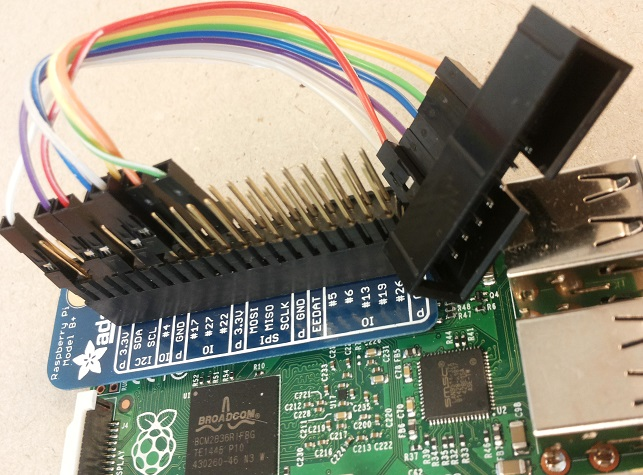
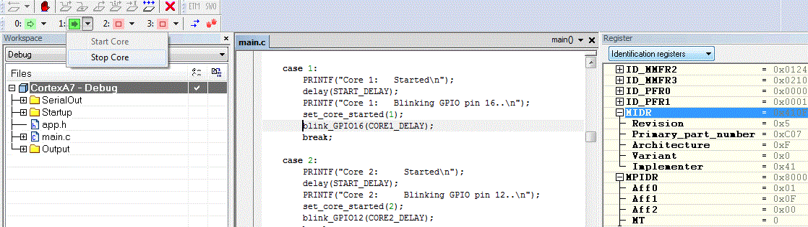

# Raspberry Pi 2 Bare Metal Multicore JTAG Debugging


To get going with multicore development and JTAG debugging,
these code snippets and pieces of information should be useful.

###1. JTAG debugging




To enable JTAG on Raspberry Pi 2, some of the GPIO pins
needs to be configured to their “alternate” function.
Create a small application that calls the function below.
Build the application, and place the `kernel.img` file
on the SD-card. Now, when the Raspberry Pi 2 boots, JTAG
pins will be enabled.


```c
/*--------------------------------------------------*/
static void jtag_enable(void)
{
    // http://sysprogs.com/VisualKernel/tutorials/raspberry/jtagsetup/
    /* -------- JTAG SETUP --------
    JTAG pin    JTAG sig    GPIO        Header pin
    1           VREF        N/A         1
    3           nTRST       GPIO22      15
    4           GND         N/A         9
    5           TDI         GPIO4       7
    7           TMS         GPIO27      13
    9           TCK         GPIO25      22
    11          RTCK        GPIO23      16
    13          TDO         GPIO24      18
    -------------------------------*/
     
    GPFSEL2_bit.FSEL22 = GPFSEL_ALT4;   // nTRST
    GPFSEL0_bit.FSEL4  = GPFSEL_ALT5;   // TDI
    GPFSEL2_bit.FSEL27 = GPFSEL_ALT4;   // TMS
    GPFSEL2_bit.FSEL25 = GPFSEL_ALT4;   // TCK
    GPFSEL2_bit.FSEL23 = GPFSEL_ALT4;   // RTCK
    GPFSEL2_bit.FSEL24 = GPFSEL_ALT4;   // TDO
}
```


### 2. Multicore JTAG debugging
 


To get in contact with all 4 CPU cores, write the following in a `bcm2836.ProbeConfig` file:


```c
"A7_0" "Cortex-A7:0@0x80010000"
+"A7_1" "Cortex-A7:0@0x80012000"
+"A7_2" "Cortex-A7:0@0x80014000"
+"A7_3" "Cortex-A7:0@0x80016000"
```

Specify the `ProbeConfig` file on:
Project > Options > I-jet > JTAG/SWD > Probe configuration file.

Enable Multicore with:
Project > Options > Debugger > Multicore > Number of cores : 4.

The Debug Log should say:

```c
Connecting on DAP APB-AP port 0 to core Cortex-A7 r0p5 at 0x80010000. 
Connecting on DAP APB-AP port 0 to core Cortex-A7 r0p5 at 0x80012000. 
Connecting on DAP APB-AP port 0 to core Cortex-A7 r0p5 at 0x80014000. 
Connecting on DAP APB-AP port 0 to core Cortex-A7 r0p5 at 0x80016000. 
```

### 3. Multicore coding

To enable a specific core, use the function below:

```c
#define CORE0_MBOX3_SET             0x4000008C
 
static void core_enable(uint32_t core, uint32_t addr)
{
    // http://www.raspberrypi.org/forums/viewtopic.php?f=72&t=98904&start=25
    volatile uint32_t *p;
    p = (uint32_t*)(CORE0_MBOX3_SET + 0x10 * core);
     
    *p = addr;
}
```

For example, to enable all CPU cores and make them start at address 0x8000:

```c
core_enable(1, 0x8000);
core_enable(2, 0x8000);
core_enable(3, 0x8000);
```

Another nice function to have is get_core_id:

```c
uint32_t get_core_id(void)
{
    uint32_t core_id;
    asm volatile ("mrc p15, 0, %0, c0, c0,  5" : "=r" (core_id));
    return core_id & 0x3;
}
```

With this function, the running code can detect on which CPU core it is executing. This is useful for a switch-case, like this for example:

```c
volatile uint32_t core_id = get_core_id();
 
switch (core_id) {
case 0:
    // Code for Core 0
    core_enable(1, 0x8000);
    core_enable(2, 0x8000);
    core_enable(3, 0x8000);
    break;
case 1:
    // Code for Core 1
    break;
case 2:
    // Code for Core 2
    break;
case 3:
    // Code for Core 3
    break;
default:
    while (1) {}
    break;
}
```


