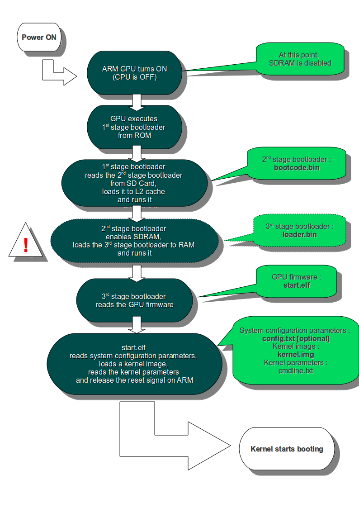

# Raspberry Pi的開始流程


##Raspberry Pi的開始流程

```
1:Raspberry Pi 啟動時是靠著GPU上的啟動程式去讀SD卡的boot程式，這階段的程式是在rom裡的，不能更改，SD卡  須要format成FAT32格式。

2:Bootcode.bin -> loader.bin ->start.elf，loader.bin讓bootloader能讀elf檔案.

3:kernel.img，kernel的image。
```
   

The boot sequence of the Raspberry Pi is basically this:

- Stage 1 boot is in the on-chip ROM. Loads Stage 2 in the L2 cache
- Stage 2 is bootcode.bin. Enables SDRAM and loads Stage 3
- Stage 3 is loader.bin. It knows about the .elf format and loads start.elf





figure source:http://raspberrypi.stackexchange.com/questions/10442/what-is-the-boot-sequence
   

看一下OSDev的範例:http://wiki.osdev.org/ARM_RaspberryPi_Tutorial_C

##Reference:

http://elinux.org/RPi_Software

http://kariddi.blogspot.tw/2012/08/raspberry-pi-bare-metal-part-1-boot.html