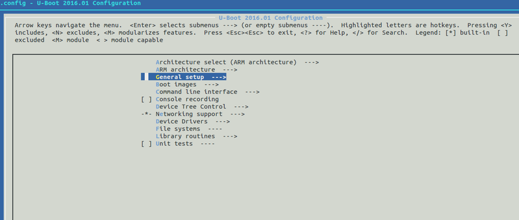

# u-boot 組態研究- raspberry pi 2


這份文件主要研究當uboot的組態設定成raspberry pi 2時，他的config file開了什麼compile options.

實際上可以用make menuconfig去看。但是記得要先裝ncurse套件。「這個套件主要在命令列底下提供滑鼠支援，建立視窗（UI），處理顏色等等http://tldp.org/HOWTO/NCURSES-Programming-HOWTO/intro.html」


```sh
$ sudo apt-get install libncurses5-dev
```




##1. ARM architecture
當然是Arm 架構 
- Target Select (Broadcom BCM283X family)
- Broadcom BCM283X board select (Raspberry Pi 2)

##3. General Setup
- Automatically append version information to the version string
- Optimize for size 「用-Os取代-O2，得到最小的Image」
- Enable malloc() pool before relocation 「因為有些driver再這個階段還是需要記憶體配置，所以打開這個選項會配置一個很小的記憶體區塊，讓驅動程式用」
- Size of malloc() pool before relocation [0x400] 「同上，就是這個區塊的大小」
- Configure standard U-Boot features (expert users)
    - Init with zeros the memory reserved for malloc (slow) 「將上面的記憶體區塊配置後，順便reset成0，有點像是kernel的zmalloc吧」
- 
##5. Command line interface
- Shell prompt (U-Boot>)
- Info commands
    - bdinfo「可列印出版子的資訊」
    - coninfo 「可列印出console 裝置的資訊」
- Boot commands
    - bootd 「執行已經儲存在環境"bootcmd"裡的命令」
    - bootm 「從記憶體裡啟動程式的印象檔」
    - bootelf, bootvx 「從記憶體裡啟動 ELF/vxWorks格式的印象檔」
    - go 「從所給予的記憶體位置裡啟動一個程式」
    - run 「在一個已經設定好的環境變數下，去執行這個命令」
    - iminfo 「印出這個程式印象檔的標頭資訊」
    - imxtract 「萃取出多重印象檔的某個部份」
- Environment commands
    - env export 「輸出環境變數」
    - envimport 「輸入環境變數」
    - editenv 「編輯環˙境變數」
    - saveenv 「儲存所有環境變數」
    - env exists 「檢查這個變數是否已經定義再這個環境下」
- Memory commands
    - md, mm, nm, mw, cp, cmp, base, loop ，「就是一些記憶體命令」
    - crc32 ，「計算CRC32」
- Device access commands
    - dm - Access to driver model information
    - loadb 「通過序列阜去讀取一個binary檔案」
    - loads 「經由序列阜讀取一個S-Record檔案」
    - gpio 「支援GPIO」
- Shell scripting commands
    - echo 「這不用說明吧？@@」
    - itest 「整數比較」
    - source 「從記憶體裡執行script」
    - setexpr 「Evaluate boolean and math expressions and store the result in an env variable.」
- Network commands
    - bootp, tftpboot 「使用BOOTP/TFTP協定去啟動印象檔」
    - nfs 「使用NFS協定去啟動印象檔」
- Misc commands
    - sleep
- Boot timing
    - Number of boot ID numbers available for user use [20] 「待研究...」
    - Address to stash boot timing information [0] 「提供一個位址，當bootloader轉交控制權給OS時，這個位址的數去不會被覆寫掉，所以可以傳資料給OS」
    - Size of boot timing stash region [4096]  「什麼是boot timing stash region??」

##8. Networking support
- Control TFTP timeout and count through environment
「TFTP是一種協定，通常是將Kernel放在網路裝置上，然後在經由TFTP下載kernel到記憶體開始執行，
所以這個選項是關於TFTP的timeout的」
##9. Device Drivers
- Serial drivers
    - Require a serial port for console 「很清楚，不需要說明」
    - Provide a serial driver 「也是很清楚」
    - Provide a serial driver in SPL 「再一個空間需要非常限制的裝置上，一個完全的UART驅動程式也是很佔空間的，所以這個選項被省略了，就不會有full uart driver，以節省空間」
- Custom physical to bus address mapping 「有些SOCs會對於CPU實體位址和DMA，使用一個不同位址的map，如果是的話，就選這個選項，並且記得再你的code裡面去實作相關的mapping funciton」

##11. Library routines
- Enable regular expression support 「就是正規表示法的函式庫...」