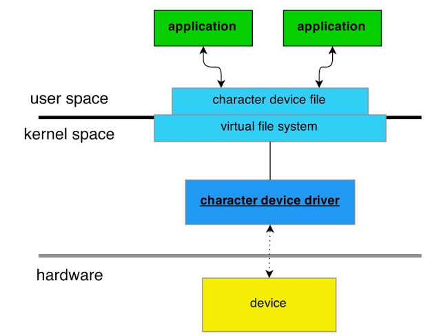

# 用 Raspberry pi 寫驅動程式 -- 基本觀念

當你要驅動一個硬體，無論是簡單的還是複雜的，必須要考慮：
- 使用者要如何去呼叫這個硬體，以便讓系統許可使用(system call, ioctl)
- 系統要怎麼初始硬體(module_init)
- 系統要怎麼脫離硬體(module_exit)
- 系統跟硬體的互動(interrupt, irq)
- 硬體跟使用者的互動(open, close, read, write, ioctl, copy_from_user, copy_to_user)
- 要如何解析硬體傳來的訊號(keyword : 傳輸協定，SPI, I2C, ...)
- 跟別的module的相依性
- 是否容許多人同時使用？如何分配資源？

以下是我自己考慮的部份：
- 盡可能用kernel已經有的支援以減少coding
- 盡可能考慮與不同系統搭配的可能性(如果你想把raspberry pi的驅動程式移植到BeagleBone Black上....)。

當使用者想要使用某個硬體時，必須要這樣做(以下為擬人化示範)：

使用者：喂！那個webcam可不可以給我用一下？就是在/dev/video0的那個！(以開啟/dev/video0的方式去呼叫系統，所謂system call是也)
系 統：我先看一下你夠不夠格用(使用者是否有權限)，然後我看有沒有別人在用(mutex)....嗯，應該可以讓你用，我先把設定開一開 (interrupt與irq等)，這樣我想應該沒問題了，拿去用吧(使用者以mutex lock(互斥鎖)佔住/dev/video0)，然後系統開始根據使用者的要求傳送畫面....
使用者：喂！我用完了，我把webcam放在那囉，你自己收一收吧(以關閉/dev/video0的方式通知系統)
系統：把設定(interrupt與irq等)關掉，互斥鎖也解掉，這樣別人就能用了。

下圖是補充擬人化敘述沒法說明的部份(圖片來源：參考資料2.)

當使用者要使用系統的一個裝置(device)，系統必須有一個相應的字符裝置驅動程式(character device driver，這也就是我們現在要學的)，而這個character device driver 會在虛擬檔案系統(virtual file system)創造一個字符裝置檔案(character device file)，例如本文的/dev/video0或我們下一篇會建立的/dev/LED_0，使用者就能透過開啟此虛擬檔案的方式，告訴系統他想要這裝製作什麼，系統再依照字符裝置驅動程式的設定決定要怎麼回應。

##參考資料：

Linux 驅動程式觀念解析, #1: 驅動程式的大架構

http://www.jollen.org/blog/2006/05/linux_1.html
Character device drivers

http://wr.informatik.uni-hamburg.de/_media/teaching/wintersemester_2014_2015/pk1415-char_drivers-oster-koenig-presentation.pdf
