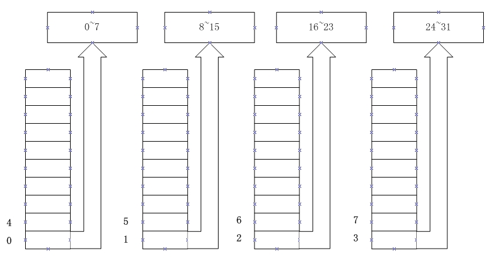

<a name="top"></a>

<h1 align="center">內存對齊
</h1>

## 為什麼要進行內存對齊

在計算機組成原理中我們學到：
一塊內存芯片一般只提供 8 位數據線，要進行 16 位數據的讀寫
可採用<a target="_blank" href="http://baike.baidu.com/view/1881700.htm">奇偶分體</a>來組織管理多個芯片，
32 位也類似：



　　這樣，連續的四個字節會分佈在不同的芯片上，
送入地址 0，我們可將第 0、1、2、3 四個字節一次性讀出組成
一個 32 位數，送入地址 4（每個芯片接收到的地址是1），
可一次性讀出 4、5、6、7 四個字節。

　　但是如果要讀 1、2、3、4 四個字節，就麻煩了，
有的 CPU 直接歇菜了：我處理不了！
但 Intel 的 CPU 走的是複雜指令集路線，
豈能就此認輸，它通過兩次內存讀，
然後進行拼接合成我們想要的那個 32 位數，
而這一切是在比機器碼更低級的微指令執行階段完成的，
所以 movl 1, %eax 會不出意外地讀出 1、2、3、4 四個字節
到 eax，證據如下（mem.c）：

```c
#include <stdio.h>

char a[]={0x11, 0x22, 0x33, 0x44, 0x55, 0x66, 0x77, 0x88};

int main()
{
	int *p = (int*)(a + 1);
	int ans = *p;

	printf("*p:\t%p\n", ans);
	printf("a:\t%p\n", a);
	printf("p:\t%p\n", p);
	return 0;
}
```
該程序的運行結果如下：

```c
[lqy@localhost temp]$ gcc -o mem mem.c
[lqy@localhost temp]$ ./mem
*p:	0x55443322
a:	0x80496a8
p:	0x80496a9
[lqy@localhost temp]$
```
可看出程序確實從一個未對齊到 4 字節的地址（0x80496a9）
後讀出了 4 個字節，從彙編可看出確實是 1 條 mov 指令讀出來的：

```c
movl	$a, %eax
addl	$1, %eax
movl	%eax, 28(%esp)	# 初始化指針 p
movl	28(%esp), %eax
movl	(%eax), %eax	# 這裡讀出了 0x55443322
movl	%eax, 24(%esp)	# 初始化 ans
```

雖然 Intel 的 CPU 能這樣處理，但還是要浪費點時間不是，
所以 C 程序還是要採取措施避免這種情況的發生，
那就是內存對齊。

## 內存對齊的結果

內存對齊的完整描述你還是去百度吧，
這裡我只是含糊地介紹一下：

1. 保證最大類型對齊到它的 size
2. 儘量不浪費空間

比如：

```c
struct A{
	char a;
	int c;
};
```
它的大小為 8，c 的內部偏移為 4，
這樣就可以一次性讀出 c 了。

再如：

```c
struct B{
	char a;
	char b;
	int c;
};
```
它的大小還是 8，第 2 條起作用了！

## 關閉內存對齊

講到內存對齊，估計大家最期待的一大快事就是怎麼關閉它
（默認是開啟的），畢竟 Intel CPU 如此強大，
關閉了也沒事。

關閉它也甚是簡單，添加預處理指令 #pragma pack(1)
就行，windows linux 都管用：

```c
#include <stdio.h>

#pragma pack(1)

struct _A{
    char c;
    int i;
};
//__attribute__((packed));

typedef struct _A A;

int main()
{
	printf("%d\n", sizeof(A));
	return 0;
}
```

linux gcc 中更常見的是使用 `__attribute__((packed))`，
這個屬性只解除對一個結構體的內存對齊，而 #pragma pack(1)
解除了整個 C源文件 的內存對齊，
所以有時候 `__attribute__((packed))` 顯得更為合理。

什麼時候可能需要注意或者關閉內存對齊呢？
我想大概是這兩種情況：

* 結構化文件的讀寫
* 網絡數據傳輸

## 另一個浪費內存的傢伙

　　說到內存對齊，我想起了另一個喜歡浪費內存的傢伙：
參數對齊（我瞎編的名字，C 標準中或許有明確規定）。
看下面這個程序：

```c
#include <stdio.h>

typedef unsigned char u_char;

u_char add(u_char a, u_char b)
{
	return (u_char)(a+b);
}

int main()
{
	u_char a=1, b=2;

	printf("ans:%d\n", add(a, b));
	return 0;
}
```
你說 add 函數的參數會佔幾個字節呢？2個？4個？
結果是 8 個……

“可恨”的是，這個傢伙浪費內存的行為卻被所有編譯器縱容，
我們無法追究它的責任。
（應該是為了方便計算參數位置而規定的）
