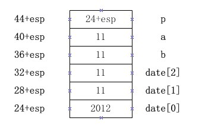
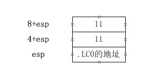
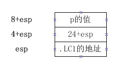

<a name="top"></a>

<h1 align="center">數組和指針
</h1>

指針和數組有什麼區別？

C程序（array.c）：
```c
#include <stdio.h>

int main()
{
	int date[3] = {2012,11,11};

	int *p = date;

	int a = date[1];
	int b = p[1];

	printf("a:%d b:%d\n", a, b);
	printf("date:%p\np   :%p\n", date, p);
	return 0;
}
```

彙編及註釋：

<table>
<tr><td>
<pre><code>    .file	"array.c"
	.section	.rodata
.LC0:
	.string	"a:%d b:%d\n"
.LC1:
	.string	"date:%p\np   :%p\n"
	.text
.globl main
	.type	main, @function
main:
	pushl	%ebp			#-幀指針切換
	movl	%esp, %ebp		#/
	andl	$-16, %esp		#-棧對齊到16字節
	subl	$48, %esp		#-開拓局部變量空間
	movl	$2012, 24(%esp)	#\
	movl	$11, 28(%esp)	#-date數組初始化
	movl	$11, 32(%esp)	#/
	leal	24(%esp), %eax	#\
	movl	%eax, 44(%esp)	#-初始化指針p
	movl	28(%esp), %eax	#\
	movl	%eax, 40(%esp)	#-初始化a
	movl	44(%esp), %eax	#\
	addl	$4, %eax		#-\
	movl	(%eax), %eax	#-初始化b
	movl	%eax, 36(%esp)	#/
</code></pre></td>
<td valign="bottom"></td>
</tr>

<tr><td>
<pre><code>    movl    $.LC0, %eax
	movl	36(%esp), %edx
	movl	%edx, 8(%esp)
	movl	40(%esp), %edx
	movl	%edx, 4(%esp)
	movl	%eax, (%esp)
	call	printf		#第一次調用 printf 函數
</code></pre></td>
<td valign="bottom"></td>
</tr>

<tr><td>
<pre><code>    movl    $.LC1, %eax
	movl	44(%esp), %edx
	movl	%edx, 8(%esp)
	leal	24(%esp), %edx
	movl	%edx, 4(%esp)
	movl	%eax, (%esp)
	call	printf		#第二次調用 printf 函數
</code></pre></td>
<td valign="bottom"></td>
</tr>

<tr><td colspan="2">
<pre><code>    movl    $0, %eax    #return 0
	leave
	ret
	.size	main, .-main
	.ident	"GCC: (GNU) 4.5.1 20100924 (Red Hat 4.5.1-4)"
	.section	.note.GNU-stack,"",@progbits
</code></pre></td>
</tr>
</table>

大家對 lea 指令可能比較陌生，它跟 mov 指令很像，
不過 lea 指令傳遞的是內存的地址，而 mov 指令傳遞的的是
內存的值，例如：

```c
leal 24(%esp), %eax		# 將 24+esp 的結果給 eax
movl 24(%esp), %eax		# 將 2012 給 eax
```
## 總結

首先，我們看到 main 也是一個函數，它編譯後的彙編代碼
跟<em>函數調用</em>中分析過的 Double 函數有一樣的結構。

　　其次，指針是有存儲空間的（32位機是4個字節的大小），
其中存儲的是一個內存地址；而數組只有數組中的元素有存儲空間，
而 C 代碼中經常用到的數組首地址（用數組名來代替）
可以說是沒有存儲空間的。假設將數組首地址賦值給一個指針，
數組首地址的存在形式是：

* 如果是全局數組，它將是 mov 指令中的一個立即數（常量）
* 如果是局部數組，它將是 lea 指令中由 esp 或 ebp +
常量計算的結果

<b>所以數組的首地址是一條機器指令的操作數，
不在局部變量空間中，也不在全局變量空間中，
而是被固化在代碼中</b>。
因此，數組首地址不能被更改。

printf 函數的調用跟別的函數一樣：先傳參數，
然後 call printf，打印指針都可以使用 %p 格式描述符。
程序的運行結果如下：
```c
[lqy@localhost temp]$ gcc -o array array.c
[lqy@localhost temp]$ ./array
a:11 b:11
date:0xbf9c3b68
p   :0xbf9c3b68
[lqy@localhost temp]$
```
date 和 p 的值都是 date 數組的首地址。
