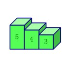
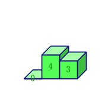
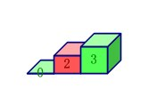
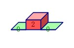
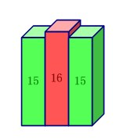
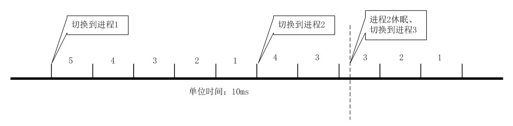

<h1 align="center">linux0.01進程時間片的消耗和再生
</h1>

　　這是《樸素linux》系列的第一篇，為什麼要從進程開始講呢？
因為操作系統裡邊最熱門、被解釋得最多的就是進程，
而對進程的管理最重要的部分就是對時間片的處理，
<b>這部分的算法會影響到進程切換的速度（
這是操作系統的一個最重要的性能指標）</b>，
同時還體現出<b>操作系統的智能性</b>，
但是《操作系統》裡邊少有提及。

---

首先，所有操作系統都應該有的特性：

1. 每個進程都會被分配若干個時間片，時間片被用完，
這個進程<b>暫時</b>就不能再投入運行
2. 每個進程都會有優先級，優先級高的進程分配較多的時間片
3. 時間片用完後，進程如果還沒有終結，應該再分配時間片
（總不能限制一個進程必須多少時間完成吧^_^）

linux0.01的<b>一個時間片代表10毫秒</b>（0.01秒），
進程的優先級從1~15，<b>優先級就是重新分配
時間片時進程獲得的時間片的數量</b>。

　　<b>那麼時間片是怎麼消耗的呢？</b>

　　這裡不得不提我們的大功臣——8253計數器，
沒錯，它就是微機原理課上講到的可編程定時/計數控制器！
就是它<b>每10ms觸發一次時鐘中斷，
中斷程序中把當前進程的時間片減1</b>，
時間片就是這樣被消耗的。

　　說到中斷，還有一哥們也是我們熟悉的，那就是8259中斷控制器，
這兩個芯片就不多說了，否則讀者就開始厭煩這篇文章了
O(∩_∩)O~。

---

　　噹噹前進程的時間片被<b>減到0</b>了之後就會調用schedule
函數切換到一個能運行的剩餘時間片最多的進程，
這裡需要遍歷所有進程，所以是個O(n)級時間複雜度的過程
（n代表進程的個數）。

*注意：一般情況下，當前進程只有在自己所有的時間片都用完之後才
調用schedule，如果是每用完一個時間片就調用一次schedule
，開銷就大了。*

下面模擬一下進程的調度情況：

1. 假設有3個進程，分別剩餘時間片5、4、3，優先級都是15，
這個時候調用了 schedule，
那麼進程1將會被選中做為接下來要執行的進程：

	

2. 執行第一個進程50ms，耗光進程1的所有時間片：

	

3. 這時候時鐘中斷程序中會調用schedule切換到進程2執行，
可是進程2執行了20ms後由於等待磁盤IO而休眠了：

	

4. 休眠的函數中會調用schedule切換到進程3執行，
一直到進程3的時間片也全用完：

	

5. 現在進程1和進程3沒有時間片了不能投入運行，
進程2休眠了不能投入運行，
所以schedule函數希望通過再生時間片來解除這種尷尬：

	每個進程新的時間片的計算公式是：

		新的時間片 = 舊的時間片 / 2 + 優先級

	這個式子看起來有點奇怪，舊的時間片不應該都是0嗎？
從上面的模擬中可以看出休眠的進程可能還有時間片，
所以休眠的進程就被特別關照了：

	

	　　休眠的進程被特別關照的原因是這類程序可能是IO頻繁的
程序（如文本編輯器），這類程序容易進入休眠狀態，
不特別關照的話很難被schedule選中：

	　　假設分配時間片時進程2保持原來的2個時間片不變，
時間片分配完後剛好被喚醒，這時進程1和進程3的時間片數量是15
比它多，那也就是說要等進程1和進程3相繼被調度運行之後，
進程2才能被投入運行。這還只有2個搶CPU的進程，
最多等300ms進程2就能運行了，但是如果這樣的進程有20個呢？
那就等3s？那打字的那位仁兄豈不要火冒三丈了？

如果上面的過程畫在一條時間線上，就是這樣的：

---

## 總結

`　　`linux0.01中切換進程(schedule)的開銷有：

1. 選出剩餘時間片最多的可運行的進程(O(n))，
如果有，切換到它
2. 如果沒有可投入運行的進程，重新分配時間片(O(n))，
再執行1

`　　`所以linux0.01的進程切換開銷是O(n)複雜度的，
排序有 O(nlog(n)) 變 O(n) 的奇蹟，那進程切換的開銷能從
O(n) 變 O(1) 嗎？

　　欲知後事如何，且聽下回分解。

