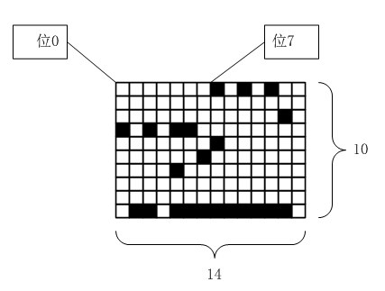
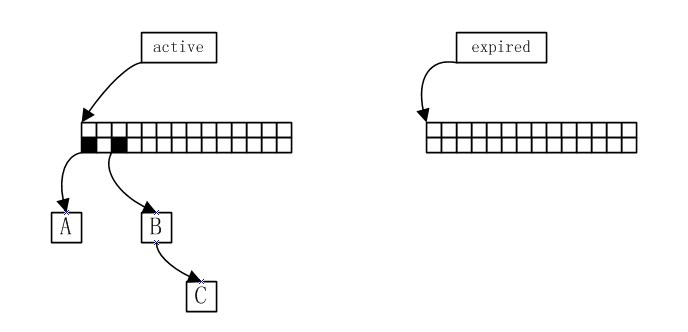
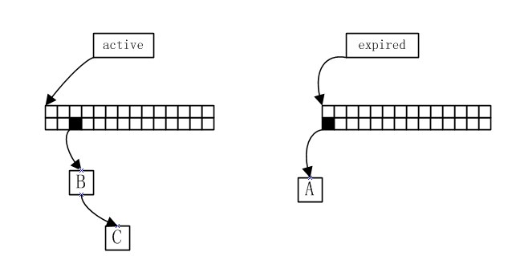
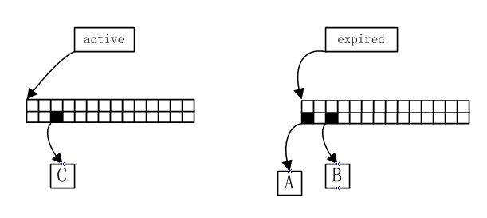
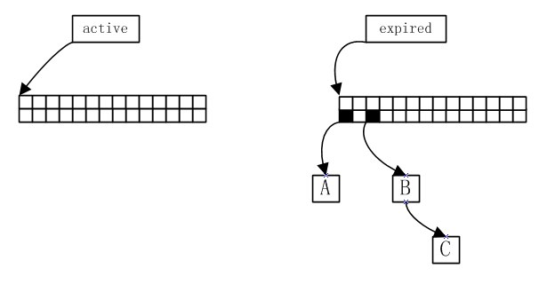
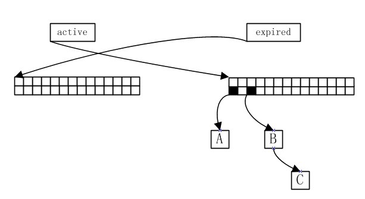

<h1 align="center">linux2.6.XX進程切換和時間片再生
</h1>

　　上一篇中介紹了linux0.01的進程切換的時間複雜度是O(n)級的，
這對linux0.01來說不會有什麼問題，
因為linux0.01最多隻能有64個進程。
可是現在的linux操作系統可能有幾百上千個進程併發執行，
而且為了更智能地調度進程，其分配時間片的算法也越來越複雜，
如果仍然採用O(n)的切換算法，那就有點危險了。

　　從上一篇中可以看出時間主要消耗在兩個地方：

1. 選擇合適的進程進行切換O(n)
2. 時間片再生O(n)

<b>linux2.6.XX中成功的把它們降到了O(1)</b>

---

# 選擇進程進行切換

　　linux2.6.XX 中有個封裝了進程信息的結構體：
優先級數組(struct prio_array)。這個結構體內有3個成員：

1. 進程個數
2. 優先級位圖
3. 優先級隊列的數組

<b>位圖中每一位對應一個優先級隊列，
如果隊列非空，那對應的那一位就是1</b>：

　　linux2.6.XX 的進程有140個優先級，
所以對應的位圖應該有140比特，而實際上它是5個unsigned long
構成，共160比特。與linux0.01不同的是2.6的優先級
值越小優先級越高。而且2.6不是優先執行剩餘時間片最多的進程，
而是優先執行優先級最高的進程。
<b>所以調度的時候只要找出第1個被設置為1的位，
然後從該位對應的隊列中出隊一個進程就可以了。</b>
尋找第一個被設置為1的位可以用bsfl指令，
它一次可以找4個字節，所以無論存在多少進程這條指令最多被執行5次，
這點開銷可以說微不足道。

　　如果當前位圖是上面這種情況，那麼現在可運行的進程
的最高優先級是7，只要第7個隊列出隊一個進程，切換到它就行了。

---

# 再生時間片

　　<b>噹噹前進程的時間片耗光了之後會立即重新分配時間片</b>，
時間片分配好後不能再放置到原來的優先級數組中
（否則低優先級的進程就得等高優先級的進程死掉了才能投入運行，
這就不是多任務了），
其實還有一個優先級數組（名為expired，
而之前談論的一直是active優先級數組），
這種再分配時間片的進程都放置到expired之中。

　　這樣一段時間後，
active中的進程一個個都被轉移到了expired之中，
這時schedule會交換一下active和expired
（簡單地交換一下指針就好了），
然後又可以從active中挑選進程了。

　　還是圖文並茂吧：

1. 假設原來有3個進程：A、B、C，它們的優先級分別是14、16、16

	

2. 按照優先級A會被挑出來執行，等A的時間片耗完了，
A會被重新分配時間片並放置到expired中：

	

3. 接著B和C都是優先級最高的，出隊B（假設靠近位圖的是隊頭，
隊列其實是雙向鏈表，這裡我就不關心了），B執行完後：

	

4. 接著又是C：

	

5. 現在active中已經沒有進程了，交換指針：

	

<b>每一步都是那麼的簡單，
進程的切換的時間開銷已經跟進程的數量沒有太大的關係了。</b>

---

　　其實時間片再分配變O(1)是個假象，
因為n個進程再分配時間片的總開銷還是O(n)的。
這裡其實是將分配時間片的工作分攤到每個進程了，
而每個進程都有幾十ms的時間去運行，
也不在乎花費幾個us的時間給自己補充一下時間片。
而linux0.01的設計就不合理了，
如果幾百個進程都憋到一個切換進程的間隔來領取時間片，
進程切換就有點遲鈍了。

　　而挑選進程來運行變O(1)就真是一個壯舉了，
而這跟我上一篇中提到的排序由O(nlog(n))變O(n)
的原理是一樣的：

* 排序
	* 歸併排序、快排(最好情況) -> 計數排序
	* O(nlog(n)) -> O(n)
	* 比較 -> 非比較
* 切換
	* 0.01 -> 2.6.XX
	* O(n) -> O(1)
	* 比較 -> 非比較

都是從n個進程中挑選一個進程：
0.01使用遍歷比較剩餘時間片的數量，找出最大的；
2.6.XX從自然有序的優先級位圖中找出第一個被設置為1的位
，沒有比較。
