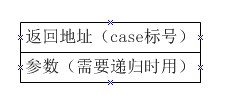
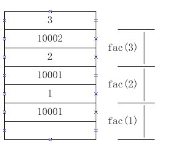

<a name="top"></a>

<h1 align="center">所有遞歸都可以變循環
</h1>

這是函數幀的應用之二。

還記得大一的C程序設計課上講到漢諾塔的時候老師說：
<b>所有遞歸都可以用循環實現</b>。這聽起來好像可行，
然後我就開始想怎麼用循環來解決漢諾塔問題，
我大概想了一個星期，最後終於選擇了……放棄……
當然，我不是來推翻標題的，
隨著學習的深入，以及"自覺修煉"，現在我可以肯定地告訴大家：
所有遞歸都可以用循環實現，更確切地說：
<b>所有遞歸都可以用循環+棧實現</b>
（就多個數據結構，還不算違規吧O(∩_∩)O~）。

<b>通過在我們自定義的棧中自建函數幀，
我們可以達到和函數調用一樣的效果</b>。
但是因為這樣做還是比較麻煩，所以就不轉換漢諾塔問題了，
而是轉換之前的那個遞歸求解階乘的程序（fac.c）：

```c
#include <stdio.h>

int fac(int n)
{
	if(n <= 1)
		return 1;
	return n * fac(n-1);
}

int main()
{
	int n = 3;
	int ans = fac(n);

	printf("%d! = %d\n", n, ans);
	return 0;
}
```

## 技術難點

我們可以在自建的函數幀中存儲局部變量、存儲參數，
<b>但是我們不能存返回地址，因為我們得不到機器指令的地址！</b>
不過，C語言有一個類似於指令地址的東西：switch case
中的 case子句，我們可以用一個case代表一個地址，
技術難點就此突破了。

## 源程序

雖然我簡化了很多步驟，但源程序還是比較長（fac2.c）：

```c
#include <stdio.h>

// 棧的設置
#define STACKDEEPTH	1024
int stack[STACKDEEPTH];
int *esp = &stack[STACKDEEPTH];
#define PUSH(a)	*(--esp) = a
#define POP(b)	b = *(esp++)

// 其它模擬寄存器
int eax;// 存返回值
int eip;// 用於分支選擇

int main()
{
	int n = 3;

	// 模仿 main 調用 fac(n)
	PUSH(n);
	PUSH(10002);// 模仿返回 main 的地址
	eip = 10000;

	do{
		switch(eip){
		case 10000:
			--esp;// 為幀分配空間
			if(esp[2] <= 1){// 模仿遞歸終止條件
				eax = 1;
				++esp;// 回收幀空間
				POP(eip);
			}else{// 模仿遞歸計算 fac(n-1)
				esp[0] = esp[2] - 1;
				PUSH(10001);
				eip = 10000;
			}
			break;

		case 10001:// 返回 n * (fac(n-1)的結果)
			eax = esp[2] * eax;
			++esp;// 回收幀空間
			POP(eip);
			break;
		}
	}while(eip != 10002);

	printf("%d! = %d\n", n, eax);
	return 0;
}
```

## 自建的函數幀

為了簡化程序，ebp我們就不用了，
完全用esp來操作棧，一個函數幀只佔用 8 個字節：



在計算到 fac(1) 的時候，棧中內容如下：



比起肆意揮霍棧空間的 gcc（fac幀用了32字節，
浪費了20字節，實際使用了12字節），
我們的程序真的是太節省了（一幀只用8字節）。

## 小結

當然，本文的方法只用於學術討論，
說明所有遞歸都可以變循環，編程的時候還是不要這麼用。
因為代碼複雜、容易出錯、難以理解，
唯一的優點是能省空間省到極限。

這種遞歸變循環的方式並沒有降低時間複雜度，
但卻是通用的（所有遞歸都可以這麼變循環）；
而有一部分遞歸可以基於巧妙的算法變成循環，
並且大大降低時間複雜度，如：動態規劃、貪心算法
（詳見《算法導論》）。
