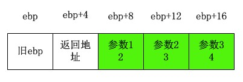

<a name="top"></a>

<h1 align="center">可變參數
</h1>

C語言的可變參數的實現非常巧妙：
大師只用了 3 個宏就解決了這個難題。

## 一、可變參數的應用

　　這裡實現一個簡單的可變參數函數 sum：
它將個數不定的多個整型參數求和後返回，
其第 1 個參數指明瞭要相加的數的個數（va.c）：

```c
#include <stdio.h>
#include <stdarg.h>

// 要相加的整數的個數為 n
int sum(int n, ...)
{
    va_list ap;
    va_start(ap, n);

    int ans = 0;
    while(n--)
        ans += va_arg(ap, int);

    va_end(ap);
    return ans;
}

int main()
{
    int ans = sum(2, 3, 4);
    printf("%d\n", ans);

    return 0;
}
```
sum 函數的第一個參數是 int n，
逗號後面是連續的 3 個英文句點，
表示參數 n 之後可以跟 0、1、2…… 個任意類型的參數。
sum 可以這麼用：

```c
sum(0);
sum(1, 2);
sum(3, 1, 1, 1);
```
## 二、可變參數的實現
可以看到在 sum 函數中用到了 3 個函數一樣的東西：
va\_start、va\_arg、va\_end，
它們是標準庫（意味著各種平臺都有）頭文件 stdarg.h 中
定義的宏，這 3 個宏經過清理後是下面這個樣子：
```c
typedef char* va_list;
#define va_start(ap,v)  ( ap = (va_list)(&v) + sizeof(v) )
#define va_arg(ap,t)    ( *(t *)((ap += sizeof(t)) - sizeof(t)) )
#define va_end(ap)      ( ap = NULL )
```
* va\_start 將 ap 定位到可變參數列表的起始地址
* va\_arg 每次返回一個參數，並後移 ap 指針
* va\_end 將 ap 置 NULL（避免非法使用）

這 3 個宏的實現就是基於 C語言默認調用慣例是從右至左
將參數壓棧的事實，比如說 va.c 中調用 sum 函數，
參數壓棧的順序為：4->3->2，
又因為 x86 CPU 的棧是向低地址增長的，
所以參數的排列順序如下：



　　va\_start(n, ap)
就是 ( ap = (char*)(&n) + 4 )
因此 ap 被賦值為 ebp+12 也就是變參列表的起始地址。

之後 va\_arg  取出每一個參數：
```c
( *(int *)((ap += 4) - 4) )
```
它首先將變參指針 ap 右移到下一個參數的起始地址，
再將加賦操作的返回值減到之前的位置取出一個參數。
這樣，<b>用一條語句既取出了當前參數，又後移了指針 ap</b>，
真是神了！

sum 中循環使用 va\_arg 就取出了 n 個要相加的整數。

## 三、變參函數的可行性

一個變參函數能接受個數、類型可變的參數，
需要滿足以下兩個條件：

1. 能定位到可變參數列表的起始地址
2. 能獲知可變參數的個數、每個參數的大小（類型）

條件 1 只要有個前置參數就能滿足，
而對於這樣的變參函數：void func(...);
編譯能通過，但是不能用 va_start 取到變參列表的起始地址，
所以基本不可行。

<hr width="50%">

　　sum 函數中參數 n 被用來定位可變參數列表的起始地址
（滿足條件1）；n 的值是可變參數的個數，
類型默認全部是 int 型（滿足條件2），
因此 sum 能正常工作。

<hr width="50%">

　　再看看 printf 函數是如何滿足以上兩個條件的，
printf 函數的原型是：

```c
int printf(const char *fmt, ...);
```

printf 的第1個參數 fmt（格式串）被用來定位其後
的可變參數的起始地址（滿足條件1）；
fmt 指向的字符串中的各個格式描述符如：%d、%lf、%s 等
告訴了 printf fmt 之後參數的個數、各個參數的類型
（滿足條件2），因此 printf 能正常工作。

<hr width="50%">

　　當然，sum、printf 能正常工作是設計者一廂情願的期望，
如果使用者不按規矩傳入參數、格式串，函數能正常工作才怪！
比如：

```c
sum(2, "111", "222");
printf("%s", 0);
```
編譯器可不會進行可變參數的類型檢查、格式串-參數匹配，
後果將會在運行的時候出現……

