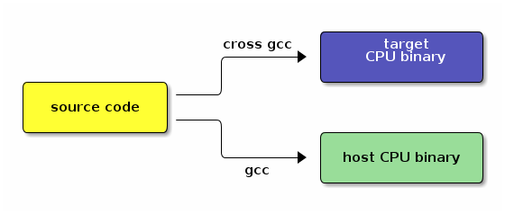

# arm交叉編譯器gnueabi、none-eabi、arm-eabi、gnueabihf、gnueabi區別

###命名規則

交叉編譯工具鏈的命名規則為：`arch` [`-vendor`] [`-os`] [`-(gnu)eabi`]

- arch – 體系架構，如ARM，MIPS
- vendor – 工具鏈提供商
- os – 目標操作系統
- eabi – 嵌入式應用二進制接口（Embedded Application Binary Interface）
根據對操作系統的支持與否，ARM GCC可分為支持和不支持操作系統，如

- arm-none-eabi：這個是沒有操作系統的，自然不可能支持那些跟操作系統關係密切的函數，比如fork(2)。他使用的是newlib這個專用於嵌入式系統的C庫。
- arm-none-linux-eabi：用於Linux的，使用Glibc

## 實例

###1、arm-none-eabi-gcc

（ARM architecture，no vendor，not target an operating system，complies with the ARM EABI）
用於編譯 ARM 架構的裸機系統（包括 ARM Linux 的 boot、kernel，不適用編譯 Linux 應用 Application），一般適合 ARM7、Cortex-M 和 Cortex-R 內核的芯片使用，所以不支持那些跟操作系統關係密切的函數，比如fork(2)，他使用的是 newlib 這個專用於嵌入式系統的C庫。

###2、arm-none-linux-gnueabi-gcc

(ARM architecture, no vendor, creates binaries that run on the Linux operating system, and uses the GNU EABI)

主要用於基於ARM架構的Linux系統，可用於編譯 ARM 架構的 u-boot、Linux內核、linux應用等。arm-none-linux-gnueabi基於GCC，使用Glibc庫，經過 Codesourcery 公司優化過推出的編譯器。arm-none-linux-gnueabi-xxx 交叉編譯工具的浮點運算非常優秀。一般ARM9、ARM11、Cortex-A 內核，帶有 Linux 操作系統的會用到。

###3、arm-eabi-gcc

Android ARM 編譯器。

###4、armcc

ARM 公司推出的編譯工具，功能和 arm-none-eabi 類似，可以編譯裸機程序（u-boot、kernel），但是不能編譯 Linux 應用程序。armcc一般和ARM開發工具一起，Keil MDK、ADS、RVDS和DS-5中的編譯器都是armcc，所以 armcc 編譯器都是收費的（愛國版除外，呵呵~~）。

###5、arm-none-uclinuxeabi-gcc 和 arm-none-symbianelf-gcc

arm-none-uclinuxeabi 用於uCLinux，使用Glibc。

arm-none-symbianelf 用於symbian，沒用過，不知道C庫是什麼 。


###Codesourcery

`Codesourcery`推出的產品叫Sourcery G++ Lite Edition，其中基於command-line的編譯器是免費的，在官網上可以下載，而其中包含的IDE和debug 工具是收費的，當然也有30天試用版本的。

目前CodeSourcery已經由明導國際(Mentor Graphics)收購，所以原本的網站風格已經全部變為 Mentor 樣式，但是 Sourcery G++ Lite Edition 同樣可以註冊後免費下載。

Codesourcery一直是在做ARM目標 GCC 的開發和優化，它的ARM GCC在目前在市場上非常優秀，很多 patch 可能還沒被gcc接受，所以還是應該直接用它的（而且他提供Windows下[mingw交叉編譯的]和Linux下的二進製版本，比較方便；如果不是很有時間和興趣，不建議下載 src 源碼包自己編譯，很麻煩，Codesourcery給的shell腳本很多時候根本沒辦法直接用，得自行提取關鍵的部分手工執行，又費精力又費時間，如果想知道細節，其實不用自己編譯一遍，看看他是用什麼步驟構建的即可，如果你對交叉編譯器感興趣的話。

###ABI 和 EABI

`ABI`：二進制應用程序接口(Application Binary Interface (ABI) for the ARM Architecture)。在計算機中，應用二進制接口描述了應用程序（或者其他類型）和操作系統之間或其他應用程序的低級接口。

`EABI`：嵌入式ABI。嵌入式應用二進制接口指定了文件格式、數據類型、寄存器使用、堆積組織優化和在一個嵌入式軟件中的參數的標準約定。開發者使用自己的彙編語言也可以使用 EABI 作為與兼容的編譯器生成的彙編語言的接口。

兩者主要區別是，ABI是計算機上的，EABI是嵌入式平臺上（如ARM，MIPS等）。


`arm-linux-gnueabi-gcc 和 arm-linux-gnueabihf-gcc`

兩個交叉編譯器分別適用於 armel 和 armhf 兩個不同的架構，armel 和 armhf 這兩種架構在對待浮點運算採取了不同的策略（有 fpu 的 arm 才能支持這兩種浮點運算策略）。

其實這兩個交叉編譯器只不過是 gcc 的選項 -mfloat-abi 的默認值不同。gcc 的選項 -mfloat-abi 有三種值 soft、softfp、hard（其中後兩者都要求 arm 裡有 fpu 浮點運算單元，soft 與後兩者是兼容的，但 softfp 和 hard 兩種模式互不兼容）：

- soft： 不用fpu進行浮點計算，即使有fpu浮點運算單元也不用，而是使用軟件模式。

- softfp： armel架構（對應的編譯器為 arm-linux-gnueabi-gcc ）採用的默認值，用fpu計算，但是傳參數用普通寄存器傳，這樣中斷的時候，只需要保存普通寄存器，中斷負荷小，但是參數需要轉換成浮點的再計算。

- hard： armhf架構（對應的編譯器 arm-linux-gnueabihf-gcc ）採用的默認值，用fpu計算，傳參數也用fpu中的浮點寄存器傳，省去了轉換，性能最好，但是中斷負荷高。

把以下測試使用的C文件內容保存成 mfloat.c：
```c
#include <stdio.h>
int main(void)
{
    double a, b, c;
    a = 23.543;
    b = 323.234;
    c = b / a;
    printf(“the 13 / 2 = % f\n”, c);
    printf(“hello world !\n”);
    return 0;
}
```

- 1、使用 arm-linux-gnueabihf-gcc 編譯，使用“-v”選項以獲取更詳細的信息：
```sh
# arm-linux-gnueabihf-gcc -v mfloat.c
COLLECT_GCC_OPTIONS=’-v’ ‘-march=armv7-a’ ‘-mfloat-abi=hard’ ‘-mfpu=vfpv3-d16′ ‘-mthumb’
-mfloat-abi=hard```

可看出使用hard硬件浮點模式。

- 2、使用 arm-linux-gnueabi-gcc 編譯：
```sh
# arm-linux-gnueabi-gcc -v mfloat.c
COLLECT_GCC_OPTIONS=’-v’ ‘-march=armv7-a’ ‘-mfloat-abi=softfp’ ‘-mfpu=vfpv3-d16′ ‘-mthumb’
-mfloat-abi=softfp
```

可看出使用softfp模式。



### 參考資料

交叉編譯器 arm-linux-gnueabi 和 arm-linux-gnueabihf 的區別：http://www.cnblogs.com/xiaotlili/p/3306100.html
arm-none-linux-gnueabi，arm-none-eabi 與arm-eabi 區別：http://blog.csdn.net/mantis_1984/article/details/21049273
What’s the difference between arm-linux- / arm-none-linux-gnueabi- / arm-fsl-linux-gnueabi- in LTIB?https://community.freescale.com/thread/313490
